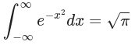
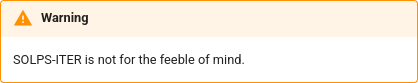
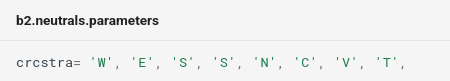
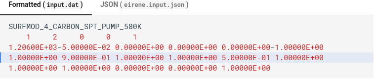

# SOLPS wiki

Read SOLPS-ITER documentation for beginners here: https://solps.pages.tok.ipp.cas.cz/solps-doc/

---

Welcome to the SOLPS wiki, web-based documentation of the [SOLPS-ITER](https://github.com/iterorganization/SOLPS-ITER) tokamak transport code, focused on starting steps for newcomers. As its main author, Kateřina Hromasová, says:
> "I want tutorials that are so easy to understand that I'll be able to use them out of the box after I come back from a three-year maternity leave."

To learn about SOLPS-ITER, visit the [SOLPS wiki webpage](https://solps.pages.tok.ipp.cas.cz/solps-doc/). This README contains instructions **how to contribute to the SOLPS wiki**.

## Wiki innards

Most of the SOLPS wiki is written in [Markdown](https://www.markdownguide.org/cheat-sheet/) and automatically rendered with [MkDocs](https://www.mkdocs.org/). Its [website](https://solps.pages.tok.ipp.cas.cz/solps-doc/) is hosted on IPP Prague GitLab Pages. The **repository structure** is as follows:

- `docs`:
    - `feature_blog`: tutorials introducing advanced SOLPS features
    - `files`: non-image files, mostly PDFs
    - `img`: pictures used to illustrate the tutorials
    - `installing`: tutorials on installing SOLPS
    - `my_first_simulation`: tutorials taking a beginner through their first SOLPS simulation
    - `supplementary`: tutorials covering everything around SOLPS
    - `css`, `javascript` (technical stuff)
- `extras`: additional content generated without MkDocs, most importantly the B2.5 switches documentation
- `mkdocs.yml`: controls of the navigation bar on the left
- `README.md`: how to contribute to the SOLPS wiki
- `.gitignore`, `.gitlab-ci.yml`, `requirements.txt` (technical stuff)


## Become a contributor

Although the [SOLPS wiki webpage](https://solps.pages.tok.ipp.cas.cz/solps-doc/) is public for anyone to see, its source is currently private and can only be accessed holders of an IPP Prague account. If you'd like to contribute, hold on for a few months. The wiki should be moved under the auspices of the ITER Organisation GitHub account, and then it should be open to contributions from anyone with a GitHub account.

Once you have access to the [SOLPS wiki GitLab repository](https://repo.tok.ipp.cas.cz/solps/solps-doc), download or clone it to your local machine.

    cd /new/home/for/solps-doc
    git clone https://repo.tok.ipp.cas.cz/solps/solps-doc.git

> Basic Git knowledge is required. Learn more in [Git workflow for dummies](https://docs.google.com/presentation/d/1wFOoQAADQA7c4HcRa3vST2iAq2a4faZs461T9hgz9Ek/edit?slide=id.p#slide=id.p), [CodeRefinery Git intro](https://coderefinery.github.io/git-intro/) or [Contributing to Django](https://docs.djangoproject.com/en/dev/internals/contributing/).


## Contribution guidelines

- **Respect the existing wiki structure.** Before you write a tutorial, figure out if an equivalent is already present, and amend that if necessary.

- **Do not duplicate.** If something is explained elsewhere (SOLPS manual, ITER SharePoint...) and you find yourself paraphrasing it, link to it instead.

- **Kateřina's three postulates for writing the SOLPS wiki:**
    1. You will forget everything you don't write down.
    2. You can't keep any notes other than those in the wiki.
    3. Someone else will read the wiki.

- Use [admonitions](#markdown-extensions) (colour boxes) for information outside the main tutorial flow.

- Use [in-text icons](#icons) for external links, downloadable files, email addresses and "under construction" warnings.

- Keep lists short. (They turn up as long paragraphs in the search bar, clogging the output.)

- All the `.md` files have to be accessible from the navigation sidebar. Put new files into `mkdocs.yml`.

- Use the [mother tongue](https://serendipstudio.org/sci_cult/leguin/). Read the instructions aloud, and see if they flow off the tongue or make you choke. Write as if you were explaining it to a confused student. In this wiki, sounding unprofessional is better than sounding stiff.

- Make jokes and don't take yourself, or SOLPS-ITER, too seriously.


## How to publish your contribution

First, clean your local copy of the SOLPS wiki.

    cd solps-doc
    git fetch
    git status
    
If you see you're up-to-date with `master`, you're good to go. If you are on `master` but you're missing the last updates, download them to your local copy.

    git pull

Usually I find myself a different, long-forgotten branch, from the last time I was contributing commits and forgot to switch back to `master`. Usually there are modified files as well. In such a case, it's easiest to make a new local copy of the wiki and merge your changes into it. Rename your old local copy (I go with `solps-doc_definitely_not`) and clone another, fresh copy:

    cd ..
    git clone https://repo.tok.ipp.cas.cz/solps/solps-doc.git

Then proceed according to the instructions below. At the point where you're supposed to start writing your contributions, copy over the files from your old folder `solps-doc_definitely_not`. More on that below.
    
Once you are on the latest update of the `master` branch, your work table is clean. You can start on your latest contribution.
    
1. Visit the [list of SOLPS wiki branches](https://repo.tok.ipp.cas.cz/solps/solps-doc/-/branches) on its GitLab page. On the upper right, click `New branch`. Select `master` as the source. Name the branch using the [common conventions](https://medium.com/@abhay.pixolo/naming-conventions-for-git-branches-a-cheatsheet-8549feca2534), using branch prefixes such as `feature/`, `fix/` or `refactor/`.

2. Switch to the new branch on your local machine.

        git fetch  # this downloads the information that there is a new remote branch
        git checkout -b feature/my_new_branch origin/feature/my_new_branch
    
    The `-b` will create your own local branch which tracks the remote branch. It prevents the detached HEAD state.

3. If you have any accumulated past changes, integrate them. Simply copy all the contents of `solps-doc_definitely_not` and paste them into your new shiny `solps-doc`. **Immediately** after that, resolve conflicts/deletions. The `Source Control` tab in our editor of choice, [Visual Studio Code](#recommended-editors), works well. Compare your old files with the newest `master`, get familiar with what has been done while you were sleeping and modify your past contributions accordingly. Use the `Revert` button/option to undo your "deletions". You don't want to overwrite any work others have done in the meantime. I know you're impatient to get started on the actual work, but if you postpone dealing with the conflicts, they will become a major headache. You'll invest effort into rewriting documentation that's out-of-date. At the end of it, when you're making your commits and merging into `master`, you will have to deal with the conflicts anyway. And it will be harder, because you've *just* polished your contribution, you want to send it out there already, and now not only you are bogged down by Git conflicts, but you also have to rewrite your contribution to accommodate the work of others.

    - (Note: Kateřina is getting so deep into this because she's a lazy fuck. She hopes stern, detailed instructions will make Git conflicts more bearable in the long-term.)

4. Write your contribution. We recommend the [Visual Studio Code](#recommended-editors) as editor. Make generous use of Markdown extensions and icons where appropriate, see below.

5. When it's time to publish your contributions, go through the changes, stage them into logical units and commit them with informative commit messages. The `Source Control` tab in [Visual Studio Code](#recommended-editors) is more convenient than doing this in the command line.

    Basic commit guidelines:

    - It's preferable to make a large number of atomic commits ("Change recommended gas puff value", "Add section on lowering grid resolution") as opposed to one all-encompassing commit ("I'm done for today", "There were so many typos oh my God").
    - Commit messages should be so informative that you don't need to check the commit line by line to know what it did.
    - Individual commits should form logical wholes. If you aren't done yet (you're in the middle of rewriting an entire section), don't commit it yet.
    - For commit message wording, refer to [How to write better Git commit messages](https://www.freecodecamp.org/news/how-to-write-better-git-commit-messages/).

6. Once you have a series of commits, ideally acknowledging all the changes you've made to the wiki, upload them to the central GitLab repository.

        git push
    
    (You can also do this in Visual Studio Code `Source Control` tab.)

7. On the [SOLPS-doc Gitlab page](https://repo.tok.ipp.cas.cz/solps/solps-doc/-/merge_requests), create a new merge request which merges your new branch back into `master`. Add Katka as a reviewer so she can check the changes and give you a deserved pat on the back. If she does not respond within 3 days, merge your contribution into `master` yourself.

8. Switch to the `master` branch on your local machine. (I always forget about this step.)

        git checkout master
        git pull
    
    Thank you for contributing to the SOLPS wiki!


## Recommended editors

SOLPS wiki tutorials are written in [Markdown](https://www.markdownguide.org/), which is little more than plain text with a few basic formatting marks. Any text editor suffices to edit the tutorials. However, to edit **and display the rendered results** (like seeing actual bullet points instead of `-`), we recommend [Visual Studio Code](https://code.visualstudio.com/), which includes a Markdown preview out-of-the-box. To display the rendered results, click on the icon with the page and magnifying glass in the top right corner of the editor.

Note that some of the fancier extension features (such as "external link" icons) will not be displayed properly by VC Code. To preview how the rendered page will look on the SOLPS wiki web, [install MkDocs locally](#render-solps-wiki-locally-with-mkdocs).


## Markdown extensions

To make the SOLPS wiki easier to read, we use extensions of the Markdown syntax, such as boxes with useful tips. Consider using them to break up the text flow and mark up notes and details. They are implemented using [Python Markdown Extensions](https://facelessuser.github.io/pymdown-extensions/), which are are pre-installed in MkDocs as a Python package. Use

```bash
pip install --upgrade pymdown-extensions
```

to get the most recent version. Note that the extensions won't be displayed properly in a pure-Markdown preview in VS Code. You need to [build the MkDocs locally](#render-solps-wiki-locally-with-mkdocs) or let it be built in a CI pipeline to see the final result.

The setup of Markdown extensions is easy. Just make sure the specific extension is enabled in the `mkdocs.yml` config:

```yaml
markdown_extensions:
  - pymdownx.arithmatex:
      generic: true   # Options can be specified like this
  - pymdownx.blocks.tab
  - ... # Add more extensions here
```

Currently enabled extensions:

- [`pymdownx.arithmatex`](https://facelessuser.github.io/pymdown-extensions/extensions/arithmatex): LaTeX math equations in `$...$` and `$$...$$` blocks
- [`pymdownx.superfences`](https://facelessuser.github.io/pymdown-extensions/extensions/superfences): better fenced code blocks with syntax highlighting
    - Can add title, add line numbers, highlight lines
- [`pymdownx.inlinehilite`](https://facelessuser.github.io/pymdown-extensions/extensions/inlinehilite): same as superfences, but for inline code snippets
    - Add shebang `#!python` at the start, followed by a space and the code line
- `pymdownx.blocks.*` several block-based features that share a common syntax using `///` fences
    - [`pymdownx.blocks.admonition`](https://facelessuser.github.io/pymdown-extensions/extensions/blocks/plugins/admonition/): highlighted box with note, warning, etc.
        - Predefined types: `note`, `danger`, `tip`, `warning` (also `attention`, `hint`, `caution`, `error`, but they all seem to be styled like `note`)
    - [`pymdownx.blocks.definition`](https://facelessuser.github.io/pymdown-extensions/extensions/blocks/plugins/definition/): indented list of terms and their definitions
    - [`pymdownx.blocks.details`](https://facelessuser.github.io/pymdown-extensions/extensions/blocks/plugins/details/): similar to admonition, but collapsible
    - [`pymdownx.blocks.tab`](https://facelessuser.github.io/pymdown-extensions/extensions/blocks/plugins/tab/): tabbed content blocks
        - Fence the content with lines `/// tab | Tab 1 name` and `///`, repeat for each tab

### LaTEX math

Math written in LaTeX syntax, both inline expressions with `$P_{SOL}$` and equations:



````markdown
$$
\int_{-\infty}^{\infty} e^{-x^2} dx = \sqrt{\pi}
$$
````

### Admonitions

There are four admonition box styles available: `hint` (blue), `tip` (green), `warning` (yellow) and `danger` (red). The former three are self-explanatory; `danger` usually denotes a piece of information or an entire section focused on a particular machine or server.

Admonition box displaying a tip:


````markdown
/// tip | Hot tip
SOLPS-doc will help you learn SOLPS-ITER.
///
````

Admonition box with a warning:



````markdown
/// warning | Warning
SOLPS-ITER is not for the feeble of mind.
///
````

Admonition box with a hint or a note:


````markdown
/// hint | Helpful hint
Life will get better if you sleep a lot.
///
````

Admonition box with very specific information:


````markdown
/// danger | IPP Prague
COMPASS was a sheath-limited tokamak.
///
````

### Code blocks

Code block with syntax highlighting and a title (e.g. a filename):



````markdown
```{.fortran title="b2.neutrals.parameters"}
crcstra= 'W', 'E', 'S', 'S', 'N', 'C', 'V', 'T',
```
````

Fancy two-tab code block with highlighted lines showing the same parameter for both alternatives of Eirene input files.



````markdown
/// tab | Formatted (`input.dat`)
```{.python hl_lines="4"}
SURFMOD_4_CARBON_SPT_PUMP_580K
    1     2     0     0     1
1.20600E+03-5.00000E-02 0.00000E+00 0.00000E+00 0.00000E+00-1.00000E+00
1.00000E+00 9.00000E-01 1.00000E+00 1.00000E+00 5.00000E-01 1.00000E+00
1.00000E+00 1.00000E+00 0.00000E+00 0.00000E+00 1.00000E+00
```
///

/// tab | JSON (`eirene.input.json`)
```{.json hl_lines="10"}
{
  // ...
  "REFLECTION_MODELS": {
    "MANUAL": "http://www.eirene.de/eirene.pdf#subsection.2.6.1",
    // ...
    "SURFMODS": [
      {
        "NAME": "SURFMOD_4_CARBON_SPT_PUMP_580K",
        // ...
        "RECYCT": 9.0E-01,
        // ...
      }
    ]
  }
}
```
///
````


## Icons

To make the SOLPS wiki easier to read, we use icons from the *Material Symbols* set provided by Google. Everything is set up in the MkDocs config. To use the icons, simply search for them on the Google webpage https://fonts.google.com/icons. Click on an icon to open a sidebar, scroll to the *Inserting the icon* section and copy the `<span>` tag into your Markdown text.

Note that, like the Markdown extensions, the icons will not show up in Markdown editors such as Visual Studio Codem. They will only show on the final webpage or when you [generate a preview of the MkDocs yourself](#render-solps-wiki-locally-with-mkdocs).

External link (pointing outside the wiki):


```html
ITER Sharepoint
<span class="material-symbols-outlined">open_in_new</span>
```

Link to a (downloadable) file:


```html
Katka's PhD thesis
<span class="material-symbols-outlined">download</span>
```

Under construction or to do:


```html
### Section under construction
<span class="material-symbols-outlined">construction</span>
```

Email address:


```html
<span class="material-symbols-outlined">mail</span>
[hromasova@ipp.cas.cz](mailto:hromasova@ipp.cas.cz)
```


## Render SOLPS wiki locally with MkDocs

Quick edits of the SOLPS wiki are best done in a [Markdown editor](#recommended-editors), which will render the files for you in real time. However, most of the fancy [extensions](#markdown-extensions) will not be rendered in that way. There are two options to view the final result before it goes live with a Git merge into the `master` branch:

- A complete build of pages is generated after each push as a downloadable artifact in the automatic [Pipelines](https://repo.tok.ipp.cas.cz/solps/solps-doc/-/pipelines) (see download button on the right).

- Build the pages locally:

```bash
# Log in to your IPP Prague work station
# If you log into the Soroban front instead, add a tunneling request
ssh -X jirakova@soroban.tok.ipp.cas.cz -L 8000:127.0.0.1:8000
# 8000 is the port being tunneled
# Adjust the port according to where MkDocs creates the documentation in the last step (part of the displayed URL)

# On your IPP work station, go to the cloned repository
cd solps-doc

# Load Python 3.8 (when on COMPASS servers)
module load python/3.8-anaconda-2021.05

# Create virtual env and install libs
python -m venv venv
source venv/bin/activate
pip install -r requirements.txt

# Serve and automatically rebuild on any file modifications
mkdocs serve
```

`Ctrl + right click` on the link on the last line of the command line output, and a live preview of the SOLPS wiki will open in your web browser. Every time you save a file, its preview will be updated on the page.

> Sub-pages located in `./extras` may be handled differently. Refer to corresponding readmes in the `./extras` folder for build instructions and/or check the definition of automated pipeline in `.gitlab-ci.yml` file.
