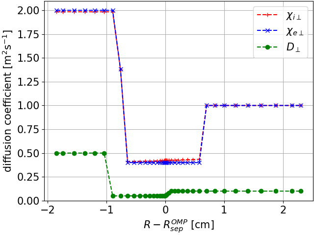

# Diffusion coefficients

/// warning | This feature blog entry introduces advanced concepts
The reader is assumed to know how to [create a simple SOLPS-ITER simulation](../my_first_simulation/Creating_a_new_SOLPS-ITER_simulation.md) and to possess some [user wisdom](../supplementary/SOLPS-ITER_user_wisdom.md).
///

Anomalous diffusion coefficients are the sacrifice SOLPS-ITER has made to achieve friendly runtimes. Favouring plasma-neutral and plasma-surface interaction to self-consistent radial transport, SOLPS assumes the edge plasma radial transport to be diffusive with user-defined diffusion coefficients. This tutorial covers how you should choose the values of those diffusion coefficients: $D_n$, $\chi_e$ and $\chi_i$.

This feature blog entry covers:

- A monologue on whether [to profile or not to profile](#to-profile-or-not-to-profile)
- [Implementing diffusivity profiles](#implementing-diffusivity-profiles)
- [Choosing diffusivity values](#choosing-diffusivity-values)
- [Coupling electron and ion heat transport](#coupling-electron-and-ion-heat-transport)
- [Better solutions](#better-solutions)


## To profile or not to profile

> *"Ahh, anomalous diffusion coefficients. Physically nonsensical, but centre of so much attention. You will be the death of me. And of SOLPS-ITER, if [fluid turbulence codes](https://iopscience.iop.org/article/10.1088/1361-6587/aaa373)<span class="material-symbols-outlined">open_in_new</span> get their runtime low enough to leverage their superior self-consistent treatment of radial transport..."*
><br>
> - Kateřina on diffusion coefficients

As described in Kateřina's [PhD thesis](../files/Hromasova_PhD_thesis.pdf)<span class="material-symbols-outlined">download</span> as well as about every resource on SOLPS-ITER ever, SOLPS-ITER does not describe radial transport in the edge plasma self-consistently. Tokamak edge radial transport is largely turbulent, intermittent, occasionally electromagnetic (ELMs) and varies substantially with edge conditions. SOLPS-ITER sidesteps all of these complicated physics and says: "The radial transport of particles and heat is diffusive." This is what's known as the *diffusive ansatz*, and it's why we list diffusion coefficients $D_n$ and $\chi_{e,i}$ among the [four principle inputs of SOLPS simulations](../my_first_simulation/Adjusting_SOLPS-ITER_input.md#four-principle-solps-iter-inputs).

/// tip | Relation between $D_n$ and $\chi_{e,i}$
You may have heard that much of the perpendicular transport is carried by turbulence, which carries particles and energy inside a single structure. Consequently, the values of $D_n$ and $\chi_{e,i}$ should be close to one another. Interpretative modelling and theoretical considerations lean more toward $\chi_{e,i} \sim 3-10 D_n$. [[Kateřina's PhD thesis]](../files/Hromasova_PhD_thesis.pdf)<span class="material-symbols-outlined">download</span>, [[Eich 2020]](https://iopscience.iop.org/article/10.1088/1741-4326/ab7a66/meta)<span class="material-symbols-outlined">open_in_new</span>, [[Shtyrkhunov 2026]](https://iopscience.iop.org/article/10.1088/1741-4326/ae53f9/meta)<span class="material-symbols-outlined">open_in_new</span>
///


In interpretative modelling, diffusion coefficients are not a problem. You will vary them along with all the other SOLPS input parameters until you match the profiles that were measured in experiment. In predictive modelling, however, diffusion coefficients are a major source of uncertainty. Even if the power fall-off length $\lambda_q$ is known from [some scaling](https://iopscience.iop.org/article/10.1088/0741-3335/58/7/074005/meta)<span class="material-symbols-outlined">open_in_new</span>, it is possible that multiple combinations of $D_n$ and $\chi_{e,i}$ will match it. All of this is complicated enough. But soon you'll hear the question raised: shouldn't your diffusion coefficients **vary radially**?



*Radial profile of diffusion coefficients in the shape of a transport barrier, COMPASS H-mode #16908.*

The rationale behind radial profiles of diffusion coefficients is that flat $D_n$ and $\chi_{e,i}$ profiles somehow correspond to "radially constant" transport (L-mode). In H-mode, however, no single diffusivity value will reproduce the profile steepening around the separatrix (pedestal). It is then said that there is a "transport barrier" in the edge plasma and that diffusivities should be lower around the separatrix. While one's at it, different diffusivities can also be chosen in the core and the SOL, the transport barrier extent can be varied... Before you know it, you're [specifying diffusion coefficients cell by cell](https://iopscience.iop.org/article/10.1088/1741-4326/adbe90/meta)<span class="material-symbols-outlined">open_in_new</span>.

This is the place to discuss **overfitting**. There are multiple sources of uncertainty in your SOLPS-ITER simulation: missing physics, experimental measurement uncertainties, errors in the magnetic equilibrium reconstruction, EIRENE Monte Carlo noise, incomplete convergence etc. Considering all that, should you really invest care and time into specifying the diffusion coefficients down to three decimal digits? If you set $D_n$ and $\chi_{e,i}$ individually for each cell, you may match the upstream $n_e$ and $T_e$ profile perfectly. But will this make the target profiles match as well? And what predictive power do such profiles have? Can you plug them into the ITER baseline H-mode and have a perfect, 100 % accurate $n_e$ profile prediction?

Kateřina's rules of thumbs, based on literature review and modelling many COMPASS tokamak plasmas, are:

1. **L-mode**: Use a single value of $D_n$ and $\chi_{e,i}$. At high densities (conduction-limited regime, density shoulder), you can use a step function with a lower $D_n$ in the confined plasma and a higher $D_n$ in the SOL. [Kateřina's [PhD thesis](../files/Hromasova_PhD_thesis.pdf)<span class="material-symbols-outlined">download</span>, Fig. 6.3] [[Dekeyser 2016](https://www.jspf.or.jp/PFR/PFR_articles/pfr2016/pfr2016_11-1403103.html)<span class="material-symbols-outlined">open_in_new</span>, Fig. 2]

2. **H-mode**: Use a radial profile in the shape of a transport barrier for both $D_n$ and $\chi_{e,i}$. In interpretative modelling, choose the transport barrier location and extent according to profile shapes, and allow different diffusivities in the confined region, inside the transport barrier, and in the SOL. Be prepared to spend a long time polishing this profile, and be ready that it will fall apart anytime something is changed (input power, impurity species, gas puff). In predictive modelling, God help you. Look at transport barriers from similar discharges in other machines and try to match $\lambda_q$ in the near SOL. Make parameter scans (vary diffusivities by a factor of 5) and convince your PFC designers that they have to be ready for a range of conditions, that it is not within your power to pinpoint one exact strike point $T_e$.


In interpretative modelling, you usually have enough information about $D_n$ for deuterium ions (from $n_e$ profile) and about $\chi_e$ (from $T_e$ profile). Once you include impurities, if other knowledge is lacking, use the same $D_n$ for all ion species. If no $T_i$ measurements are available, $P_{sep,e} = P_{sep,i}$ with $\chi_e=\chi_i$ yields okay results. (Okay = $T_i>T_e$ in the SOL.)


## Implementing diffusivity profiles

To use diffusion coefficient profiles in a SOLPS-ITER simulation, first set the following switch in `b2mn.dat`:
```
'b2tqna_inputfile'      '1'
```
This causes the code to look for diffusion coefficient profiles in `b2.transport.inputfile`, a text file we'll explain shortly. The switch `b2tqna_transport_namelist` doesn't clash with `b2tqna_inputfile`. If both are on (value `1`), diffusion coefficients will be preferentially drawn from `b2.transport.inputfile`. If no specifications are given there, SOLPS will fall back on `b2.transport.parameters`. If no value is found there either, SOLPS defaults to the values in `b2ah.dat`.

Constructing `b2.transport.inputfile` takes some mental gymnastics and a lot of attention. (Unless you've written a Python routine which translates human-readable numbers to SOLPS jargon - in which case, <span class="material-symbols-outlined">mail</span>[share](mailto:hromasova@ipp.cas.cz)!) Let's say you want to achieve an H-mode transport barrier:


The corresponding `b2.transport.inputfile` looks like this:

```{.fortran title="b2.transport.inputfile"}
&TRANSPORT

# Deuterium ions Dn
ndata(1, 1, 1)= 6,
tdata(1, 1, 1, 1)= -2.00E-02, tdata(2, 1, 1, 1)= 0.50,
tdata(1, 2, 1, 1)= -1.00E-02, tdata(2, 2, 1, 1)= 0.50,
tdata(1, 3, 1, 1)= -0.90E-02, tdata(2, 3, 1, 1)= 0.05,
tdata(1, 4, 1, 1)=  0.00E-02, tdata(2, 4, 1, 1)= 0.05,
tdata(1, 5, 1, 1)=  0.10E-02, tdata(2, 5, 1, 1)= 0.10,
tdata(1, 6, 1, 1)=  3.00E-02, tdata(2, 6, 1, 1)= 0.10,

# Electron heat chi_e
ndata(1, 3, 1)= 6,
tdata(1, 1, 3, 1)= -2.00E-02, tdata(2, 1, 3, 1)= 2.00,
tdata(1, 2, 3, 1)= -0.80E-02, tdata(2, 2, 3, 1)= 2.00,
tdata(1, 3, 3, 1)= -0.70E-02, tdata(2, 3, 3, 1)= 0.40,
tdata(1, 4, 3, 1)=  0.60E-02, tdata(2, 4, 3, 1)= 0.40,
tdata(1, 5, 3, 1)=  0.70E-02, tdata(2, 5, 3, 1)= 1.00,
tdata(1, 6, 3, 1)=  3.00E-02, tdata(2, 6, 3, 1)= 1.00,

# Ion heat chi_i
ndata(1, 4, 1)= 6,
tdata(1, 1, 4, 1)= -2.00E-02, tdata(2, 1, 4, 1)= 2.00,
tdata(1, 2, 4, 1)= -0.80E-02, tdata(2, 2, 4, 1)= 2.00,
tdata(1, 3, 4, 1)= -0.70E-02, tdata(2, 3, 4, 1)= 0.40,
tdata(1, 4, 4, 1)=  0.60E-02, tdata(2, 4, 4, 1)= 0.40,
tdata(1, 5, 4, 1)=  0.70E-02, tdata(2, 5, 4, 1)= 1.00,
tdata(1, 6, 4, 1)=  3.00E-02, tdata(2, 6, 4, 1)= 1.00,

/
```

I'd break it down for you, but this is the Feature blog. You're supposed to know your way around the [SOLPS manual](../supplementary/SOLPS-ITER_user_wisdom.md#rtfm) already, and section 3.5.5. *b2.transport.inputfile* describes exactly what the numbers mean. A few extra tips:

- When you add or delete features from the profile (change the number of lines), don't forget to change the corresponding `ndata` value.
- Also, make sure the second index of `tdata` again goes from 1 to X.
- Don't forget updating the second column of `tdata` either!
- Set the furthermost points of the profile sufficiently far from the separatrix. If the profile in `b2.transport.inputfile` doesn't cover the entire radial profile, fallback options from `b2.transport.parameters` and `b2ah.dat` are used.

Before you embark on a 10-hour run with your brand new transport coefficient profile, perform a test run. Save your current `b2fstate` aside, set the simulation time to 10 iterations in `b2mn.dat` and see if the simulation crashes complaining about `b2.transport.inputfile` in `run.log`.

After a successful test run, check the diffusion coefficient profile by running
```tcsh
2d_profiles
```
and inspecting the files this creates in the `run` folder, titled `*.last10`. They contain two columns: the radial position of each cell relative to the separatrix at the outer midplane, and the value of some quantity in this cell. You can look at the numbers, load them into your post-processing software of choice and plot them, or view them quickly using:
```tcsh
xyplot < ke3da.last10 #electron heat conductivity
xyplot < ki3da.last10 #ion heat conductivity
xyplot < dn3da.last10 #particle diffusion
```

If they look as you wanted them, you are good to go.


## Choosing diffusivity values

As detailed in the monologue on whether [to profile or not to profile](#to-profile-or-not-to-profile), the value of diffusion coefficients is shrouded with mystery. They are simple enough for interpretative simulations: just tune the profile until it gives you something matching the upstream measurements (and pray that it matches the target measurements as well). But for predictive simulations? That's where the hell of anomalous diffusion begins.

> <span class="material-symbols-outlined">construction</span> **TODO**: Describe scalings. Explain the difference between SOL width (general between tokamaks) and diffusion coefficient (possibly particular to a simulation). Sketch relationship between SOL width and diffusion coefficient. Give example for COMPASS Upgrade: scalings results, review of relevant papers, general features of H-mode diffusion coefficient profiles. Stress uncertainties.


## Coupling electron and ion heat transport

In experiment, electron temperature $T_e$ is typically easier to measure than ion temperature $T_i$. As a result, interpretative SOLPS-ITER modellers often have no data about $T_i$ but their common sense and the vague intuition that $T_i > T_e$ in most of the SOL. SOLPS-ITER handles electron and ion heat equation separately, though, and so it requires both $\chi_e$ and $\chi_i$ as input. Transport modellers have typically solved this by coupling electron and ion heat transport, posing that $\chi_e = \chi_i$ and $P_{sep,e} = P_{sep,i}$. Electron $\chi_e$ is set according to experimental data, and one hopes that the $T_i$ will come out okay.

Such practice is widespread because it doesn't yield bad results. Setting $\chi_e = \chi_i$ and $P_{sep,e} = P_{sep,i}$ typically results into $T_i = 2-3 T_e$ and $\lambda_{T_i} = 2-3 \lambda_{T_e}$. The steeper $T_e$ profile reflects faster electron parallel energy losses, which cause $T_e$ to drop faster than $T_i$.

However, when $T_i$ measurements are available, even as educated guesses, it may be worth decoupling $\chi_{e,i}$ and $P_{sep,e,i}$. In L-modes, the added freedom isn't paralysing and may result in more realistic solutions.


## Better solutions

> <span class="material-symbols-outlined">construction</span> **TODO** Add more information.

There is currently (summer 2026) a considerable hype surrounding turbulence codes such as [GRILLIX](https://iopscience.iop.org/article/10.1088/1361-6587/aaa373)<span class="material-symbols-outlined">open_in_new</span>, which should be able to solve radial transport self-consistently and based on first principles. If you'd rather remain with SOLPS-ITER, try the K-model (K = turbulent energy) in Wide Grids SOLPS-ITER.
[[Carli 2020](https://onlinelibrary.wiley.com/doi/abs/10.1002/ctpp.201900155)<span class="material-symbols-outlined">open_in_new</span>,
[Coosemans 2020](https://onlinelibrary.wiley.com/doi/abs/10.1002/ctpp.201900156)<span class="material-symbols-outlined">open_in_new</span>,
[Coosemans 2021](https://pubs.aip.org/aip/pop/article/28/1/012302/1032004)<span class="material-symbols-outlined">open_in_new</span>,
[Dekeyser 2022](https://onlinelibrary.wiley.com/doi/abs/10.1002/ctpp.202100190)<span class="material-symbols-outlined">open_in_new</span>]
It adds only four variables (and a couple of scalar free parameters) to SOLPS-ITER equations and promises to vanquish the dependence on anomalous diffusion coefficients.