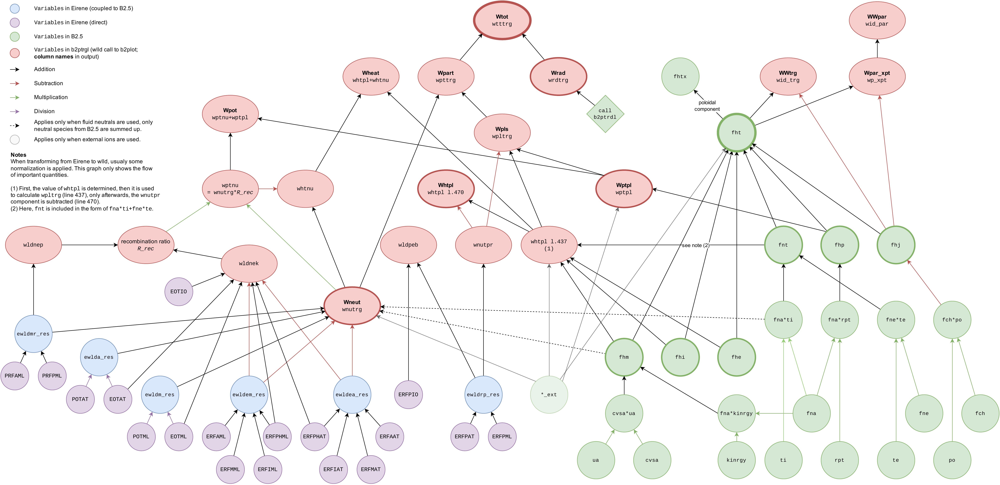
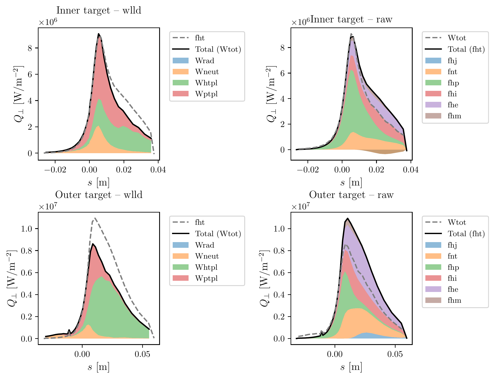
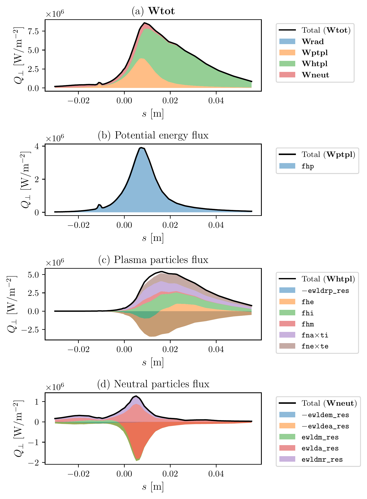
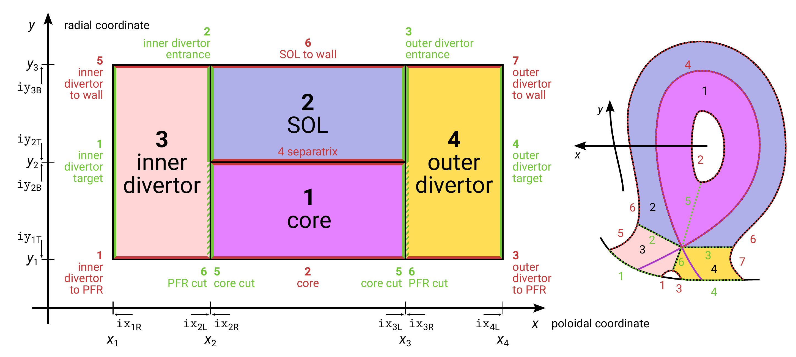
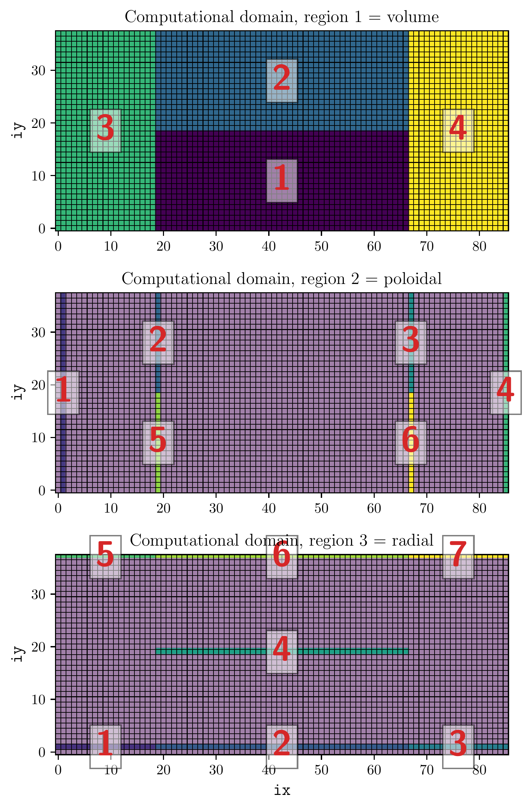

# Energy fluxes deep dive

/// warning | This feature blog entry introduces advanced concepts
The reader is assumed to know how to [create a simple SOLPS-ITER simulation](../my_first_simulation/Creating_a_new_SOLPS-ITER_simulation.md) and to possess some [user wisdom](../supplementary/SOLPS-ITER_user_wisdom.md).
///

This document presents a detailed breakdown of SOLPS-ITER energy flux variables, which followed from a simple question:

> "What is the total SOLPS target heat load and what are its components?"

The document was written by Aleš Podolník. Thank you Aleš!

Some of the figures used here were produced using Aleš's example Python notebooks stored in the IPP Prague GitLab repository [SOLPS-tutorials](https://repo.tok.ipp.cas.cz/solps/solps-tutorials/)<span class="material-symbols-outlined">open_in_new</span>: [Divertor heat flux calculation](https://repo.tok.ipp.cas.cz/solps/solps-tutorials/-/blob/main/data_processing/SOLPS%20divertor%20heat%20fluxes%20-%20showcase.ipynb?ref_type=heads) <span class="material-symbols-outlined">open_in_new</span> and [Regions in the SOLPS computational domain](https://repo.tok.ipp.cas.cz/solps/solps-tutorials/-/blob/main/code_analysis/SOLPS%20regions.ipynb?ref_type=heads)<span class="material-symbols-outlined">open_in_new</span>.

A note for better comprehension, variable names taken from SOLPS manual are written in *italics*. Variable names or code lines taken from the code are written in `code blocks`. Line numbers can slightly differ between builds, however, if you look around, you'll probably find the correct expression somewhere nearby.

**Tldr** (for impatient readers):

- For B2.5+Eirene runs, the total divertor heat flux is `Wtot` from `wlld`.
    - command: `echo 100 wlld | b2plot`
    - skip to [Divertor loads explained](#divertor-loads-explained) for a comparison of `fht` vs. `Wtot` and why `fht` is missing a bunch of both positive and negative contributions.
- For B2.5 standalone runs, `fht` can be good enough if you don't mind that the radiation is not included.

## Total poloidal energy flux in B2.5

This is the final expression for `fhtx` in `b2plot.f`, which is basically only extracting poloidal component (see the last index on the right-hand side) of two arrays, `fht` (*total energy flux*) and `fhi_ext` (*ion energy flux from external sources*):

```
b2plot.f:3573:  fhtx(:,:)=fht(:,:,0)+fhi_ext(:,:,0)
```

What does 'external' mean? Maybe this part of SOLPS manual (p. 470, B2plot commands) can be of use:

> A note about total energy fluxes. These are provided in two slightly different forms, denoted `fet[xy]` and `fht[xy]`. Both formulations contain the `fhe`, `fhi`, `fhm`, and `fhp` terms. If the code was solving internal energy equations (i.e. `b2news_BoRiS` set to 0.0 \[default\]), we add viscous correction terms and an extra factor of particle flux times temperature. For the `fht` formulation, we also add the electrostatic energy flux term `fhj`. This term is not included in `fet`, but, instead, `fet` will include any contributions from species provided by an additional external code (for example, IMPGYRO). These external species do not include the ones followed by Eirene, however.

Which, if I assume correctly, in our case means that we do not need to follow the `fhi_ext` variable, since we only use Eirene as external quantities provider and thus it is handled in some other manner.

### Poloidal total heat flux `fhtx`

First, we will follow the `fht` term. It is composed of several parts as defined in `b2xpen.f`.

The term is computed step-wise, first the total quantities are summed, then species contributions are added up. The process can be found in `b2xpen.f` on two lines:

```
b2xpen.f:98:    fht = fhe + fhi + fhj + fnt*(1.0_R8-BoRiS)
! for each species is
b2xpen.f:100:   fht = fht + fhp(:,:,:,is)
                          + fhm(:,:,:,is)*(1.0_R8-BoRiS)
```

The line 98 is directly related to the quote from the SOLPS manual - it includes *ion and electron thermal energy flux* (`fhe`, `fhi`), *electrostatic energy flux* (`fhj`) and a contribution of viscous corrections (`fnt`) (in `b2xpen.f:100 BoRiS == 0`, `1.0_R8` is just a precise Fortran way of writing number one). The next line (100) iterates over species (`is`) and adds the contribution of *potential energy flux* (`fhp`, also *ionisation energy flux* in other parts of the manual) and *kinetic energy flux* (`fhm`, again if `BoRiS == 0`) to the total flux `fht`.

<a name="BoRiS"></a>Who is `BoRiS`? As seen in above quote, it is a way to switch internal energy calculation on, which is done by default. There is also an interesting note in the SOLPS manual (p. 278)

> ’b2news_BoRiS’ ’0.0’ Physics
>
> The poloidal convective heat flux contains a prefactor of (3/2+BoRiS). The default gives us the internal energy equation. The value BoRiS = 1.0 gives us the total energy equation. Only for use to benchmark with codes using the total energy equation. When used, the meaning of `fhe` and `fhi` changes from internal energy fluxes to total energy fluxes.

Which means that this switch is always **off** (i.e. set to 0) and we should not touch it, as we are probably not doing any benchmarking. Thus both contributions of `fnt` and `fhm` are accounted for.

Now, we can look for variables from the line 98. I think there is no need to discuss `fhe` and `fhi`, these are just heat flux terms (one can see `b2tfhe.f` and `b2tfhi.f` for more information on implementation of the equations, just note that `fhi` contains all atom heat flux and the species are not separated here). First, there is the `fhj` (*electrostatic energy flux*) term:

```
b2xpen.f:54:    fhj(ix,iy,0)=-fch(ix,iy,0)
                             *(po(ix,iy)+po(leftix(ix,iy),leftiy(ix,iy)))/2.0_R8
```

First, note the last index on the LHS - 0 means poloidal. There is also radial term a few lines further in the code; however, only the direction of the gradient is changed (`left` turns to `bottom`). The *electrostatic energy flux* `fhj` is thus a product of *poloidal current* and *electric potential* (I guess there is some normalization to match the units). There is a transformation from cell centres to cell faces as well (linear interpolation - `(po(...)+po(...))/2`) - this will be seen also further in the text.

The viscous correction term `fnt` is calculated step-wise. First, at line 56 at `b2xpen.f`, the conductive (hopefully) electron heat flux (`fne_53*te`) is added to the variable.
```
b2xpen.f:56:    fnt(ix,iy,0)=fne_53(ix,iy,0)
                             *(te(ix,iy)+te(leftix(ix,iy),leftiy(ix,iy)))/2.0_R8
```
and then, in a loop per species, the conductive particle heat flux (`fna_53 * ti`) is added.
```
b2xpen.f:78:    fnt(ix,iy,0)=fnt(ix,iy,0)
                             +0.5_R8*fna_53(ix,iy,0,is)
                                    *(ti(leftix(ix,iy),leftiy(ix,iy))+ti(ix,iy))
```
Note that on the line 78, the cell centre/face is just written differently (`0.5*...` instead `.../2`; btw multiplication should be faster than division).

Furthermore, `fne_53` and `fna_53` in this context is just a parameter of the function which calculates `fnt`, the subroutine `b2xpen`, which has the following signature:

```
subroutine b2xpen (nx, ny, ns, fna, fna_53, fne_53, fch, fhe, fhi, kinrgy,
                   ua, cvsa, rpt, te, ti, po, BoRiS, fhm, fhp, fhj, fht)
```

You can see `_53` variables in the parentheses. We have to find, where and why the function is called. This is where the confusion starts, there are two types of the call:

1. `call b2xpen (nx, ny, ns, fna, fna,    fne,    fch, fhe, fhi, kinrgy, ua, cvsa, rpt, te, ti, po, BoRiS, fhm, fhp, fhj, fht)`
2. `call b2xpen (nx, ny, ns, fna, fna_53, fne_53, fch, fhe, fhi, kinrgy, ua, cvsa, rpt, te, ti, po, BoRiS, fhm, fhp, fhj, fht)`

See the difference? The first call is most prevalent (however, in `b2plot.f`, it is used only for backwards compatibility if fluxes are not present in the output), however the second one is in the `b2mndt.f`, which is the time step of the solver.

- `_53` variables are in use in this call only in main iteration step, but also only if the number of time steps is set to `0` (`ntim`).
- All other calls use `fnX_53 === fnX` including the equation solver itself.

This probably means two things (thanks Katka).

1. During the calculation itself, the call is used without `_53` suffix and the code is working with *internal energy only* (i.e. $3/2 \, kT_\mathrm{e}$).
2. During post-processing (`ntim = 0`), *total energy* (i.e. $(3/2 + 1) kT_\mathrm{e}$) is used for subsequent calculations.

The difference between (e.g.) `fna_53` and `fna` is discussed in the section *On origin of five thirds*.

Going back to untracked variables, only `fhp` and `fhm` remain (from `b2xpen.f:100`). As for the confusion in the nomenclature - `fhp` is called *potential energy* as well as *ionisation energy* flux - which, I guess, does not help in understanding its meaning. Regardless the name, the calculation is again performed in `b2xpen.f`:
```
b2xpen.f:76:    fhp(ix,iy,0,is)=0.5_R8*fna(ix,iy,0,is)
                                      *(rpt(leftix(ix,iy),leftiy(ix,iy),is)
                                        +rpt(ix,iy,is)
                                       )*ev
```
This is the product of atomic flux density `fna(...,is)` and cumulative ionisation potential `rpt` to the charged state which `is` represents (`is` = species index). Then there is some face/centre correction (0.5) and unit conversion.

Similarly, the `fhm` is derived a few lines apart.
```
b2xpen.f:76:    fhm(ix,iy,0,is)=0.5_R8*fna(ix,iy,0,is)
                                      *(kinrgy(leftix(ix,iy),leftiy(ix,iy),is)
                                        +kinrgy(ix,iy,is)
                                       )
                                -0.5_R8*cvsa(ix,iy,0,is)
                                       *(ua(ix,iy,is)
                                         +ua(leftix(ix,iy),leftiy(ix,iy),is)
                                        )
                                       *(ua(ix,iy,is)
                                         -ua(leftix(ix,iy),leftiy(ix,iy),is)
                                        )
```
Quite understandably, `kinrgy` is *total kinetic energy* of species `is`. Furthermore, `cvsa` is the *viscous conductance* of the species between cells and `ua` is *parallel velocity*.

And that's all. No radiation anywhere.

### External ion heat flux

Regarding `fhi_ext`, I think we don't have to be bothered with it. These are the definitions of the variable on several places in the code.

```
b2mod_external.f:326:   fhi_ext(ix,iy,0) = fhi_ext(ix,iy,0)
                                          + 1.5_R8*fa_ext(ix,iy,0,is)
                                                  *(ta_ext(ix,iy,is)
                                                    +ta_ext(leftix(ix,iy),
                                                            leftiy(ix,iy),
                                                            is)
                                                   )/2.0_R8
b2mod_impgyro.f:232:    fhi_ext(ix,iy,0) = fhi_ext(ix,iy,0)
                                          + 1.5_R8*fa_ext(ix,iy,0,is)
                                                  *(ta_ext(ix,iy,is)
                                                    +ta_ext(leftix(ix,iy),
                                                            leftiy(ix,iy),
                                                            is)
                                                   )/2.0_R8
b2stbm.f:346:           fhi_ext(ix,iy,0) = fhi_ext(ix,iy,0)
                                          + 1.5_R8*fa_ext(ix,iy,0,is)
                                                  *(ta_ext(ix,iy,is)
                                                    +ta_ext(leftix(ix,iy),
                                                            leftiy(ix,iy),
                                                            is)
                                                   )/2.0_R8
```

All of these are sums for all external species `is` with fluxes (`fa_ext`) and temperatures (`ta_ext`) and these are loaded from some external data or calculated using some other software. I guess it is probably to include more physics that SOLPS does not account for.


### On the origin of five thirds

In this section, we will go through the calculation of `fna_53` and `fne_53` as it is being performed using `b2mndt` subroutine. This can be skipped, if it is too tedious read.

In `b2mndt.f`, let's inspect the block from line 515 (non-related parts are omitted):

```
                ! code continues above with if clause
b2mndt.f:515:   else if (ntim.eq.0) then ! compute derived quantities
b2mndt.f:526:       do is=0,ns-1
                        ! compute particle fluxes
b2mndt.f:531:           call b2tfnb (..., fna_53(-1,-1,0,is), ...)
b2mndt.f:553:       end do
                    ! compute other fluxes
b2mndt.f:558:       call b2xpfe (..., fna_53, ..., fne_53)
b2mndt.f:560:       call b2xpen (..., fna_53, fne_53, ..., fhm, fhp, fhj, fht)
b2mndt.f:604:   endif
```

Line by line - first, `fna_53` is calculated using the function `b2tfnb` for each species, then, electron term `fne_53` is calculated using a call to `b2xpfe`. Let's review these two calls:

The subroutine `b2tfnb` is located (unsurprisingly) in `b2tfnb.f`. Note that the function considers only single atomic species, thus different naming is applied (`fnb_53` instead of `fna_53` etc.). Leaving out the places, where default values are set or normalization is applied, we can see that the `fnb_53` variable is set on several places:

```
b2tfnb.f:1129:  ! (same as 1228)
b2tfnb.f:1228:  fnb_53(ix,iy,0) = flo_53
                                  *(nb(leftix(ix,iy),
                                       leftiy(ix,iy)
                                      )
                                    +nb(ix,iy)
                                  )/2.0_R8
b2tfnb.f:1572:  fnb_53(ix,iy,1) = flo_53
                                  *(nb(bottomix(ix,iy),
                                       bottomiy(ix,iy)
                                      )
                                    +nb(ix,iy)
                                   )/2.0_R8
```

One can see that the poloidal and toroidal components are set (multiple occurrences are just due to different SOLPS numeric schemes (usually, we use the one from 1129, since the latter is in the SOLPS 4 compatibility block), however the content is the same). Nevertheless, *density of single species* (`nb`) and *flow velocity* (`flo_53`) are used to calculate the flux. Let's leave out density, since that is an independent quantity (and there is no hint of `_53` in the name) and look for the convective flow.

Variable `flo_53` is defined again at several places depending on several conditions:

```
b2tfnb.f:928:   if(drift_style.eq.0) then
b2tfnb.f:949:      flo_53 = pbs(ix,iy,0)*wrk0(ix,iy)
                            +term(ix,iy)
                            +(vbecrb(ix,iy,0)
                              +vbecrb(leftix(ix,iy),leftiy(ix,iy),0)
                            )/2.0_R8*0.5_R8
                            *(vol(ix,iy)/hx(ix,iy)
                                +vol(leftix(ix,iy),leftiy(ix,iy))
                                /hx(leftix(ix,iy),leftiy(ix,iy))
                             )
b2tfnb.f:963:   elseif (drift_style .eq. 1 .or. redef_gmtry .eq. 0) then
b2tfnb.f:982:       flo_53 = pbs(ix,iy,0)*wrk0(ix,iy)
                             +term(ix,iy)
                             +vbecrb(ix,iy,0)
                              *(vol(ix,iy)+vol(leftix(ix,iy),leftiy(ix,iy)))
                               /(hx(ix,iy)+hx(leftix(ix,iy),leftiy(ix,iy)))
b2tfnb.f:963:   elseif (drift_style .eq. 2 .and. redef_gmtry .eq. 1) then
b2tfnb.f:1005:      flo_53 = pbs(ix,iy,0)*wrk0(ix,iy)
                             +term(ix,iy)
                             +vbecrb(ix,iy,0)*gs(ix,iy,0)*qc(ix,iy)
```

This shows different handling of `flo_53` depending on drift calculation style (cell faces, centres, both...) and some other geometry settings. As the code goes, `flo_53` is just a local kind-of temporary variable. Its value is then passed to calculations of `fnb_53` on line 1129 or 1228 (depending on other conditions) to calculate the poloidal component.

For toroidal component (line 1572), the calculation is slightly different, and it is performed here:

```
b2tfnb.f:1447:  if(drift_style.eq.0)then
b2tfnb.f:1477:      flo_53 = 0.5_R8*(vbecrb(ix,iy,1)*vol(ix,iy)/hy1(ix,iy)
                                     +vbecrb(bottomix(ix,iy),bottomiy(ix,iy),1)
                                      *vol(bottomix(ix,iy),bottomiy(ix,iy))
                                      /hy1(bottomix(ix,iy),bottomiy(ix,iy))
                                    )
b2tfnb.f:1481:  elseif (drift_style.eq.1 .or. redef_gmtry.eq.0) then
b2tfnb.f:1504:      flo_53 = vbecrb(ix,iy,1)
                             *(vol(ix,iy)+vol(bottomix(ix,iy),bottomiy(ix,iy)))
                             /(hy1(ix,iy)+hy1(bottomix(ix,iy),bottomiy(ix,iy)))
b2tfnb.f:1507:  elseif (drift_style.eq.2 .and. redef_gmtry.eq.1) then
b2tfnb.f:1521:      flo_53 = vbecrb(ix,iy,1)*gs(ix,iy,1)
```


And again, different expressions for different drifts are included. I will not discuss these variants, just summarize the variables used.

- `pbs` - cell area projection to magnetic field components (`(bx/bb)*sx` and `(by/bb)*sy`, i.e. parallel contact area with the left and bottom cell.
- `wrk0` - *workspace variable* containing something called `leftface` (probably area between adjacent cells?), calculated in `intfaceh.f` by the subroutine of the same name.
- `term` - probably damping term (Rhie and Chow) for instability avoidance (non-physical)
- `vbecrb` - $\mathbf{E} \times \mathbf{B}$ drift velocity (see `vaecrb` in SOLPS manual)
- `vol` - volume of the cell
- `hx`, `hy` - cell diameters in poloidal and toroidal direction
- `gs` - area between a cell and its left neighbour
- `qc` - angular correction (see SOLPS manual for precise definition)

We could go further down, however, let's take look on the difference between calculation of `fna`, `fna_32` and `fna_53`, since the routine `b2tfnb` calculates both quantities. These lines are used when calculating poloidal component in SOLPS 5 (and above, I will not discuss SOLPS 4).

```
b2tfnb.f:1035:  fnb(ix,iy,0) =
                    flo*(nb(leftix(ix,iy),leftiy(ix,iy))+nb(ix,iy))/2.0_R8
                    -con(ix,iy)*(nb(ix,iy)-nb(leftix(ix,iy),leftiy(ix,iy)))
                    -cdpb(ix,iy,0)*(pb(ix,iy)-pb(leftix(ix,iy),leftiy(ix,iy)))
b2tfnb.f:1113:  fnb_32(ix,iy,0) =
                    flo*(nb(leftix(ix,iy),leftiy(ix,iy))+nb(ix,iy))/2.0_R8
                    -abs(flo/2.0_R8)*(nb(ix,iy)-nb(leftix(ix,iy),leftiy(ix,iy)))
b2tfnb.f:1129:  fnb_53(ix,iy,0) =
                    flo_53*(nb(leftix(ix,iy),leftiy(ix,iy))+nb(ix,iy))/2.0_R8
```

Variables `con` ad `cdpb` store particle diffusivity with respect to gradients of $n$ and $p$. Now, we can see that the situation is not clear at all... The flow velocity `flo` is calculated again with respect to different drift style. Comparing the simplest expression for `drift_style == 2` (probably the one we are using, the others are older), we can see:

```
b2tfnb.f:1005:      flo_53 = pbs(ix,iy,0)*wrk0(ix,iy)
                             +term(ix,iy)
                             +vbecrb(ix,iy,0)*gs(ix,iy,0)*qc(ix,iy)
b2tfnb.f:1005:      flo = cvlb(ix,iy,0)
                          +pbs(ix,iy,0)*wrk0(ix,iy)
                          +term(ix,iy)
                          +ubdia(ix,iy,0)*gs(ix,iy,0)*qc(ix,iy)
                          +scur
```

It is worth mentioning that we might be using completely different variable set, marked with `_nd` or `nodrift` in case of omitting drifts, but I think that the main variables are just the same and the drift velocity arrays are zero.

However, we can see that the core of both flow velocities is the same. Also, comparing the poloidal and toroidal component, we can see that the toroidal component is non-zero only if drift velocity is non-zero. What are the variables here?

- `pbs`, `wrk0`, `term`, `vbecrb`, `gs`, `qc` - see above
- `cvlb` - anomalous velocity (see `cvla` in SOLPS manual)
- `ubdia` - drift velocities in diamagnetic and radial directions (see `uadia` in SOLPS manual)
- `scur` - current contribution.

I would like to continue further, but I guess it is as complicated as SOLPS gets - e.g. why `flo_53` uses `vbecrb` while `flo` uses `ubdia`. One should do the arithmetic and find out whether the resulting quantities really differ in multiples of $kT_\mathrm{e}$, or not. **I just leave it here.**

## Divertor target loads from `wlld`

However, the data from `ld_tg_*.dat` are calculated completely in a different manner, since they also include neutral loads (either fluid or from Eirene). There is a lot of quantities in the file, copying from the file itself reads (column label, meaning, variable):

- **x** - coordinate along target \[m\]. <0 in PFR, variable `xtrg`
- **ne** - electron density \[1/m$^3$\], variable `netrg`
- **Te** - electron temperature \[eV\], variable `tetrg`
- **Ti** - ion temperature \[eV\], variable `titrg`
- **Wtot** - total power flux \[W/m$^2$\], variable `wtttrg`
- **Wpart** - power flux with particles \[W/m$^2$\], variable `wpttrg`
- **Wrad** - power flux with radiation \[W/m$^2$\], variable `wrdtrg`
- **Wpls** - power flux with charged particles \[W/m$^2$\], variable `wpltrg`
- **Wneut** - power flux with neutral particles \[W/m$^2$\], variable `wnutrg`
- **Wheat** - power flux due to particles impinging on wall \[W/m$^2$\], variable `whtnu+whtpl`
- **Wpot** - power flux due to recombination \[W/m$^2$\], variable `wptnu+wptpl`
- **Whtpl** - power flux due to plasma particles impinging on wall \[W/m$^2$\], variable `whtpl`
- **Wptpl** - power flux due to plasma recombination \[W/m$^2$\], variable `wptpl`
- **xMP** - radial coordinate in midplane for outer/inner target(s) \[m\], variable `xmp_hlp`
- **Rclfc** - radial coordinate on target \[m\], variable `rctrg`
- **Zclfc** - vertical coordinate on target \[m\], variable `zctrg`
- **Wpar_xpt** - parallel power flux around x-point \[W/m$^2$\], variable `wp_xpt`
- **WWpar** - would-be parallel power flux without dissipation in divertor \[W/m$^2$\], variable `wid_par`
- **WWtrg** - would-be target power flux without dissipation in divertor \[W/m$^2$\], variable `wid_trg`
- **Lcnnt** - connection length from midplane to target \[m\], variable `lcnnt`
- **Lcnnx** - connection length from x-point to target \[m\], variable `lcnnx`

And optional parameters
- `rad_XX` - radiation power flux from species XX \[W/m$^2$\], variable `wrdtrg`
- `rad_cr` - radiation power flux from core \[W/m$^2$\], variable `wrdtrg`

The variable `wrdtrg` is used in both as a source of data, not directly.

In following paragraphs, we will discuss the variables. There is a lot of indexing variables, for summary:

- `iy` - toroidal index (usually a loop in this index is carried out along the target)
- `is` - species index (again a loop, usually for summing up all species contributions)
- `k`, `l`, `kk` and their combination - poloidal indices or offsets (`l`) of adjacent cells for proper calculation of fluxes (one should draw his own diagram of computing domain to understand that)
- `BoRiS` - a switch mentioned above, probably always equal to 0.

There are also some normalization variables:

- `s` - face area of the cell
- `u` - usually the direction of the flux (-1)

### Column description

#### Total power flux

Data in the column **Wtot** are calculated here as a variable `wtttrg`:

```
b2ptrgl.f:595:   wtttrg(iy,itrg(j))=wpttrg(iy,itrg(j))+wrdtrg(iy,itrg(j),0)
```

Total power flux is the sum of particle power flux (`wpttrg`) and radiation power flux (`wrdtrg`). See further paragraphs for their definitions.

#### Power flux with particles

Data in the column **Wpart** are calculated here as a variable `wpttrg`:

```
b2ptrgl.f:594:   wpttrg(iy,itrg(j))=wnutrg(iy,itrg(j))+wpltrg(iy,itrg(j))
```

Particle power flux is the sum of neutral (`wnutrg`) and charged particle loads (`wpltrg`).

#### Power flux with radiation

Data in the column **Wrad** are calculated here as a variable `wrdtrg`:
```
b2ptrgl.f:243:   call b2ptrdl(wrdtrg)
```
Which translates to a series of calls from `b2ptrdl.f` that integrate all the radiation from the core and the plasma using line radiation (`rqrad`), Bremssthrahlung (`rqbrm`) and power losses from atoms (`eneutrad`), molecules (`emolrad`), test ions (`eionrad`) projected on the encompassing shadowing structure. I did not want to dig into this. However, this radiation comes from volume only!

#### Power flux with charged particles

Data in the column **Wpls** are calculated in two steps as a variable `wpltrg`:
```
b2ptrgl.f:438:   wpltrg(iy,itrg(j))=wptpl(iy,itrg(j))+whtpl(iy,itrg(j))
```
First, adding recombination power load `wptpl` and impinging particles power load `whtpl` (only charged particles) - both will be described further. Additionally, if Eirene is on (`ft44` switch), the calculation follows with
```
b2ptrgl.f:471:   wpltrg(iy,itrg(j))=wpltrg(iy,itrg(j))-wnutpr(iy,itrg(j))
```
Where the energy of kinetic and sputtered neutrals (`wnutpr`) is subtracted. This is obtained from Eirene variable `ewldrp_res=ERFPAT+ERFPML` (*kinetic energy of reflected atoms+molecules originated from ions*) meaning that this is the kinetic energy that particles carry *away* from the divertor. Furthermore, it might be useful to know that `wnutpr` is probably zero, if Eirene is not used.

**On Eirene data**

Energy of kinetic and sputtered neutrals (`wnutpr`) is obtained directly from Eirene data - there are some data fields that determine from which part of the respective array (`ewldrp_res`) the energy data is taken, the result is represented by the index `IAS` in the following line.
```
b2ptrgl.f:468:   wnutpr(iy,itrg(j))=ewldrp_res(iy+IAS)
```

Eirene data will be discussed separately.

#### Power flux with neutral particles

Data in the column **Wneut** are calculated here as a variable `wnutrg` as a sum of all internal (B2.5) and external particles (similar as `fhi_ext`):
```
b2ptrgl.f:411:   wnutrg(iy,itrg(j))=wnutrg(iy,itrg(j))
                                    +(1.0_R8-BoRiS)
                                    *(fhm(k+1-l,iy,0,is)
                                      +fna(k+1-l,iy,0,is)*ti(kk,iy)
                                     )
b2ptrgl.f:422:   wnutrg(iy,itrg(j))=wnutrg(iy,itrg(j))
                                    +fa_ext(k+1-l,iy,0,is)
                                    *(1.0_R8-BoRiS)
                                    *(0.5_R8*am_ext(is)*mp
                                            *ua_ext(kk,iy,is)**2
                                      +ta_ext(kk,iy,is)
                                     )
```
The catch is that only those `is` which belong to neutral species are summed up. Now we are getting to actual B2.5 variables, namely `fna` (species flux) and `ti`, ion temperature. In the case of external particles, the flux has to be calculated from underlying statistical variables.

If Eirene is not used, then a normalization is performed here:
```
b2ptrgl.f:439:   if(.not.ft44) wnutrg(iy,itrg(j))=wnutrg(iy,itrg(j))
                                                  *u/s(iy,itrg(j))
```
However, if there are Eirene neutrals, it gets complicated:
```
b2ptrgl.f:454:   wnutrg(iy,itrg(j))=wnutrg(iy,itrg(j))
                                    +(ewlda_res(is,iy+IAS)
                                      -ewldea_res(is,iy+IAS)
                                     )*sarea_res(iy+IAS)
b2ptrgl.f:461:   wnutrg(iy,itrg(j))=wnutrg(iy,itrg(j))
                                    +(ewldm_res(is,iy+IAS)
                                      -ewldem_res(is,iy+IAS)+ewldmr_res(is,iy+IAS)
                                     )*sarea_res(iy+IAS)
b2ptrgl.f:491:   wnutrg(iy,itrg(j))=wnutrg(iy,itrg(j))
                                    +s(iy,itrg(j))*dib2(k+l+1,iy+1,is,1)
                                                  *sqrt(max(t/mion,0.0_R8))
                                                  *0.25_R8*1.0e4_R8
                                                  *(2.0_R8*tib2(k+l+1,iy+1,is,1)
                                                    +EionH2*ev
                                                   )
```
First two lines add the atomic (454) and molecular (461) contributions. Variables `ewlda_res` and `ewldm_res` are *incident energy fluxes* of impinging atoms or molecules (as Eirene neutrals are kinetic, there is no division to thermal part and kinetic part), `elwdea_res` and `elwdem_res` are the emitted energy of atoms and molecules and finally, `elwdmr_res` is energy due to recombination. There is also a face-area-wise normalization `sarea_res`. The last line (491) is only added if there are any test ions in Eirene (hopefully, we do not use them and I guess that the long line is just some ionisation energy calculation).

Why are not fluxes normalized, if Eirene is used?

#### Power flux due to particles impinging on wall

I am not sure how to interpret 'impinging' otherwise just hitting? So this is a simple kinetic (convective?) energy transfer? Maybe the name of the  column **Wheat** could be of help. However, this is probably the most complicated calculation in this set. It is calculated as a sum of variables `whtnu` (neutral) and `whtpl` (charged particles). Charged part will be discussed further at it has its own column (**Whtpl**), let's discuss the neutral contribution only. It is calculated here:
```
b2ptrgl.f:585:   whtnu(iy,itrg(j))=wnutrg(iy,itrg(j))-wptnu(iy,itrg(j))
```
Which has contributions from `wnutrg` (see above) and `wptnu` (*neutral recombination*) is substracted (I understand it like that we want to distinguish between atomic and mechanical processes). The neutral recombination part is calculated in a bit strange way:
```
b2ptrgl.f:584:   wptnu(iy,itrg(j))=wnutrg(iy,itrg(j))*wldnep(js,0)/wo
```
Since it uses `wldnep` (*energy released by recombination into molecules*), which is the same quantity as `ewldmr_res` seen above, I guess it is some strange result of backwards compatibility. The other quantity, the temporary variable `wo`, is a sum for all surfaces in Eirene `js` defined at
```
b2ptrgl.f:559:  wo=wo+wldnek(js,0)+wldnep(js,0)
```
And `wldnek` is *heat transferred with neutrals*. Basically, we are subtracting the recombination fraction from `wnutrg`, however, several people were editing the code, so hence the mess.

A short detour of educated guesses...

- `wldnek = ewlda_res + ewldmr_res - ewldea_res - ewldem_res` (*heat transferred by neutrals*)
- `wldnep = ewldmr_res` (*energy released by recombination into molecules*)

It appears the same, but there might be some photonic processes neglected.

#### Power flux due to recombination

The column **Wpot** is a contribution of recombination from plasma `wptpl` (discussed below) and neutrals `wptnu` (discussed above).

#### Power flux due to plasma particles impinging on wall

The column **Whtpl** (`whtpl`) and the charged part of the column **Wheat** is calculated from B2.5 variables at lines 404 and 414 (loop on species `is`):
```
b2ptrgl.f:404:   whtpl(iy,itrg(j))=fhe(k+1-l,iy,0)
                                   +fhi(k+1-l,iy,0)+fhi_ext(k+1-l,iy,0)
b2ptrgl.f:414:   whtpl(iy,itrg(j))=whtpl(iy,itrg(j))
                                   +(1.0_R8-BoRiS)*(fhm(k+1-l,iy,0,is)
                                                    +fna(k+1-l,iy,0,is)
                                                    *ti(kk,iy)
                                                   )
b2ptrgl.f:427:   whtpl(iy,itrg(j))=whtpl(iy,itrg(j))
                                   +fa_ext(k+1-l,iy,0,is)
                                   *(1.0_R8-BoRiS)
                                   *(ta_ext(kk,iy,is)
                                     +0.5_R8*am_ext(is)
                                            *mp*ua_ext(kk,iy,is)**2
                                    )
```
After the species loop, electron enefgy flux contribution is added and the whole value is normalized.
```
b2ptrgl.f:432:   whtpl(iy,itrg(j))=whtpl(iy,itrg(j))
                                   +fne(k+1-l,iy,0)*(1.0_R8-BoRiS)*te(kk,iy)
b2ptrgl.f:437:   whtpl(iy,itrg(j))=whtpl(iy,itrg(j))/s(iy,itrg(j))*u
```

Additionally, if Eirene is on (`ft44` switch), the calculation follows with
```
b2ptrgl.f:470:   whtpl(iy,itrg(j))=whtpl(iy,itrg(j))-wnutpr(iy,itrg(j))
```
probably not to account for fluid neutral particles (`wnutpr`) multiple times. Note that this happens only after `whtpl` is used for calculation of `wpltrg` (**Wpls** respectively).

This is similar to `wnutrg`, however, all species from B2.5 are added (in loop in l. 414) - this is slightly confusing, since I am not sure what does it mean for fluid neutrals. Then, the external contribution is added (427). Last line is a normalization to proper units (`s` - cell area, `u` - 'direction', l. 437).


#### Power flux due to plasma recombination

The column **Wptpl** is the contribution of plasma to recombination (`wptpl`) flux, it is defined here:
```
b2ptrgl.f:436:   wptpl(iy,itrg(j))=wo/s(iy,itrg(j))*u
```
Here, `s` and `u` are normalization factors (see above), `wo` is a temporary variable, which is defined in such way that
```
b2ptrgl.f:408:   wo=wo+fhp(k+1-l,iy,0,is)
b2ptrgl.f:418:   wo=wo+fa_ext(k+1-l,iy,0,is)*pt_ext(kk,iy,is)*ev
```
...is a sum of ionization energy fluxes for all non-neutral particle species including internal (408, `fhp`) and external (418, `fa_ext` is external particle flux and `pt_ext` is (?) external particle ionization potential, normalized).

#### Parallel power flux around x-point and would-be fluxes

In this context, the "flux around X-point" probably means the "divertor entrance". Columns **Wpar_xpt** (`wp_xpt`), **WWpar** (`wid_par`) and **WWtrg** (`wid_trg`) are closely tied together and they are defined in following lines of code:
```
b2ptrgl.f:359:  wp_xpt(iy,itrg(j))=wo*u/abs(pbs(k,iy,0))
b2ptrgl.f:360:  wid_par(iy,itrg(j))=wp_xpt(iy,itrg(j))*cr(k,iy)/cr(m,iy)
b2ptrgl.f:361:  wid_trg(iy,itrg(j))=wo*u/s(iy,itrg(j))
```

This calculation is rather complicated.

First, the temporary variable `wo` is created:
```
b2ptrgl.f:354:  wo=fht(k,iy,0)-fhj(k,iy,0)
```
Index `k` is the index of "particle source" - probably somewhere around X-point or divertor entrance, but in fact, the value of `k` is calculated as the first poloidal index where the total poloidal flux (without contribution of currents) reaches the first local maximum in the direction towards the other connected target (complicated in DN geometries).

One can expand those lines as (`_DE` suffix indicated values at the divertor entrance)

```
wp_xpt  = (fht_DE - fhj_DE) * u / abs(pbs_DE)
wid_par = (fht_DE - fhj_DE) * u * (cr_DE / cr) / abs(pbs_DE)
wid_trg = (fht_DE - fhj_DE) * u / s
```

The helper variables in this case are:

- `pbs` - parallel contact area, _the quantity one needs to get parallel flux_.
- `cr` - cell midpoint radius
- `s` - cell face area.
- `u` - normalization factor to get positive values

This means that after identifying divertor entrance, the `wp_xpt` is taken from that location, `wid_par` is re-scaled using flux expansion (there is already division by `s` inside the `pbs_DE`, however, one has to somehow account for a different radial position) from the divertor entrance to the target and `wid_trg` is calculated assuming that only the continuity equation is fulfilled (just simply taking the flux at the divertor entrance and dividing it by the target cell area).

There is one important remark resulting from the divertor entrance calculation. I

### Structure of wall loads file

The file produced by the command `echo 100 wlld | b2plot` has the following structure.

| Column       | Variable                            |
|--------------|-------------------------------------|
| **x**        | `xtrg(i,itrg(j))`                   |
| **ne**       | `netrg(i,itrg(j))`                  |
| **Te**       | `tetrg(i,itrg(j))`                  |
| **Ti**       | `titrg(i,itrg(j))`                  |
| **Wtot**     | `wtttrg(i,itrg(j))`                 |
| **Wpart**    | `wpttrg(i,itrg(j))`                 |
| **Wrad**     | `wrdtrg(i,itrg(j),0)`               |
| **Wpls**     | `wpltrg(i,itrg(j))`                 |
| **Wneut**    | `wnutrg(i,itrg(j))`                 |
| **Wheat**    | `whtnu(i,itrg(j))+whtpl(i,itrg(j))` |
| **Wpot**     | `wptnu(i,itrg(j))+wptpl(i,itrg(j))` |
| **Whtpl**    | `whtpl(i,itrg(j))`                  |
| **Wptpl**    | `wptpl(i,itrg(j))`                  |
| **xMP**      | `xmp_hlp(i,k)`                      |
| **Rclfc**    | `rctrg(i,itrg(j))`                  |
| **Zclfc**    | `zctrg(i,itrg(j))`                  |
| **Wpar_xpt** | `wp_xpt(i,itrg(j))`                 |
| **WWpar**    | `wid_par(i,itrg(j))`                |
| **WWtrg**    | `wid_trg(i,itrg(j))`                |
| **Lcnnt**    | `lcnnt(i,itrg(j))`                  |
| **Lcnnx**    | `lcnnx(i,itrg(j))`                  |

### Eirene source/sink tallies naming

> See also Chapter 6 in the Eirene manual for more detailed description and a list of all tally names.

The neutral contributions to the wall loads are calculated from various Eirene tallies (statistical records). We will follow all the contributions to `wnutrg` (**Wneut**) in the following text. The coupling to B2.5 is always done through the relevant species - thus, if a summation is indicated, one should bear in mind that it means *species-wise*.

The majority of the tallies follow a particular set of volumetric or surface reactions and use the naming convention of `[type][consumed][observed]` (see below). In addition to those, there are surface averaged tallies for incident fluxes that use the naming convention `[type][observed]` (see below).

* `[type]` - type of the tally
    * Volume averaged tallies for reactions
        * `P` - particle source rate
        * `E` - energy source rate
        * `M` - momentum source rate
    * Surface averaged tallies for reactions or incident fluxes
        * `PRF`, `ERF` - particle, energy - reflection reaction fluxes
        * `POT`, `EOT` - particle, energy - incident sink fluxes
        * `SPT` - sputtered particle fluxes
* `[consumed]` - type of reaction input particles
    * `A` - atoms (neutrals)
    * `M` - molecules (neutrals)
    * `I` - test ions
    * `PH` - photons
    * `P` - bulk plasma particles, from B2.5 solution (not sure if electrons are accounted for here)
* `[observed]` - type of produced (reactions) or incident (surface incident fluxes) particles
    * `AT` - atoms (neutrals)
    * `ML` - molecules (neutrals)
    * `IO` - test ions
    * `PHT` - photons
    * `EL` - electrons
    * `PL` - bulk plasma particles, from B2.5 solution

In B2.5, *test ions* are probably not in use (?). `*RF` and `*OT` are closely coupled, since reflected particles originate from incident ones.
Some time in the future, I would like to write something about coupling.

## Cheat sheet

*Tip: Use right click to open the image in a new tab and zoom in as needed.*




- Black arrow: addition (or summation through species)
- Red arrow: subtraction
- Green arrow: multiplication (leading to combination bubbles)
- Dashed arrow: only if fluid neutrals are being used
- Semitransparent arrow/bubble: external particles contribution (usually not present)
- Red bubble: columns in `ld_tg_*.dat` or underlying variables
- Green bubble: variables from B2.5
- Blue bubble: variables in B2.5 loaded from Eirene
- Bold: column name
- Monospace: variable name

Note that 'recombination ratio' *R_rec* is not a variable, just a placeholder.

## Divertor loads explained

First, it is necessary to distinguish between the situation when Eirene is on, or when the fluid neutrals are used. If the fluid neutrals are in use, everything is handled by B2.5 and the situation is more clear, as there is no coupling. What is interesting, is to discuss the case when Eirene handles neutrals (i.e. `ft44` switch is on). Also, we expect that `BoRiS` is off, thus internal energy ballance is calculated within B2.5 run.

Short summary: **Use `wlld` output for any postprocessing**.



There are many ways to extract flux data from SOLPS, most common are raw data from`b2plasmf` and `b2statf` files, or post-processing using `b2plot`. Both flux data are compared in the figure 2, left part being the output from `echo 100 wlld | b2plot` as discussed in the previous section (see the data description there + note that in this particular simulation, there may have been incorrect definition of shadowing structure, thus **Wrad** is not accounted for, but it is not important for further discussion). On right-hand side is the total poloidal flux `fhtx` at the target, expanded to its components. However, closer inspection - see the grey dashed lines - indicates that the values obtained do not match.

Following the data paths in the cheat sheet, it is now more clear, what happens. As plasma hits the target, following processes are included in the calculation of the total divertor heat flux **Wtot** (or `wtttrg`).



Energy coming to divertor is composed from (see figure 2):

- Radiation (**Wrad**). Both from the core (defined by user) and the edge (calculated in post-processing from the plasma solution). In the figure, the core radiation is set to 0 and the edge radiation post-processing results are either negligible or 0 due to unintended mis-configuration.
- Plasma ionization potential energy (**Wptpl** = `fhp`). This energy is released from the full recombination of ions into neutral atoms, which happens on collision with the cold surface. The quantity is taken one-to-one from B2.5 data, thus, molecular ions are not included.
- Plasma kinetic energy (**Whtpl**). This is the kinetic energy of the charged particles that is deposited onto the surface. It consists of
    - `fhe` and `fhi` - electron and ion (also molecular ions) thermal energy (the energy of the random motion).
    - `fhm` - kinetic energy of the collective parallel momentum (the energy of the mean motion).
    - negative contribution of `ewldrp_res` - energy carried away by neutrals, which are emitted from the surface due to **r**ecycling of plasma particles, as calculated from the Eirene recycling particle sources
- Neutral particles energy (**Wneut**). There are processes that either heat or cool the surface.
    - `ewlda_res`, `ewldm_res` - kinetic energy deposited on the surface by neutral **a**toms and **m**olecules.
    - `ewldmr_res` - energy released into the surface through chemical **r**ecombination of plasma or atoms into **m**olecules. Ionization-based recombination is already included in **Wptpl**.
    - negative contribution of `ewldea_res` and `ewldem_res` - energy carried away by **e**mitted **a**toms and **m**olecules due to various processes, excluding plasma recycling.

What is not contained in the `fht` (and is in **Wtot**)

- Radiation data (**Wrad**) - Tokamak plasma is optically thin, radiation is not (does not need to be) part of the B2.5 simulation. It is produced only in post-processing (in `wlld`), when analyzing the effects on material surfaces surrounding the plasma. According to Sven, some estimate could be produced using `strahl`. Otherwise, `cherab` can be used for more complex post-processing.
- Various contributions of neutral particles. Together, they are the main difference between **Wtot** and `fht` observed in the figure 1.
  - **Wneut** - Incoming kinetic neutrals bring energy, some of them recombine into molecules (releasing energy into the surface) and some of them are being emitted back to the plasma (removing energy from the surface).
  - `ewldrp_res` - Incoming plasma flow is recycled into neutrals, which are being emitted back to the plasma (removing energy from the surface). In a coupled B2.5+Eirene simulation, plasma recycling is handled in Eirene and the energy released from the surface is not (and cannot be) accounted for in any of the B2.5 variables.

What is not contained in the **Wtot** (and is in `fht`)

- `fhj` - Energy carried by the electric current. It is assumed that the divertor resistivity is very small, allowing the current to flow freely to the wall instead of dissipating into Joule heat in the divertor.
  - As seen in the figure 1, it's contribution can be rather small.

What is unclear to the authors at the moment

- Sputtering - Sputtering happens when an impacting particle releases particle of the surface material. It is not explicitly included anywhere in the `wlld` calculations (see the cheat sheet diagram, no `SPT*` tallies are used). It is unclear to the authors whether sputtering is already somehow included in one of the terms or neglected or what.

Complete relation between **Wtot** and `fht` for B2.5+Eirene simulation:

```
Wtot = (Whtpl + Wptpl         ) + Wneut + Wrad
     = (fht - fhj - ewldrp_res) + Wneut + Wrad
```

## SOLPS domains and wall loads



The figure 4 summarizes the commonly known physical and computational domains. To gain better insight into what happens inside the code, one has to familiarize oneself with some peculiarities of the computational domain. In this example, we discuss the case with two targets on the lower single-null plasma. Transition to the upper single-null is straightforward, everything is just turned upside down and inner target becomes the outer one. For more targets (like double null etc.), I will mostly include only remarks that I have found interesting.

Both physical and computational domain is 2D, each cell represents a single loop around the tokamak. Its coordinates are $x$ - the poloidal coordinate around the magnetic axis (core is on right in clockwise direction); and $y$ - radial coordinate, perpendicular to poloidal, originating on the magnetic axis. Transitioning from continuous values of $x$ and $y$, symbols for discrete cell indices `ix` and `iy` are usually used.

In the computational domain, there three kinds of _regions_.

1.  volume - black labels in the fig. 4
2.  $x$-directed - green labels in the fig. 4
3.  $y$-directed - red labels in the fig. 4

Note that $x$-directed regions 5 and 6 are in the physical domain facing each other forming a particle transfer boundary condition. Due to this fact, it is not possible to use simple addition when transforming cell indices to traverse the domain in for loops, thus helper arrays `leftix`, `rightix`, `topix`, `bottomix` and analogical equivalents for `iy` are used. An example of a computational domain is shown in the figure 5.

The whole structure is stored in the `region` variable, which is stored in the `b2fgmtry` file. It has dimensions `[-1:nx,-1:ny,0:2]` meaning that it has two ghost cells in each dimension. Last index defines the kind of region (from 0 to 2 included). The values of region indices are set in the file `b2agfs.f`.



To save boundary indices for important volume regions, following structures are used.

-   `ltrgpos` - list of target positions ($x$-directed)
-   `lseppos` - list of separatrix positions ($y$-directed)
-   `lpfrpos` - list of private flux region positions ($x$-directed)

These lists have dimensions corresponding to number of targets and they are defined in the file `b2pwlprp.f`. To calculate those, lists of topological cuts (the indices defining boundaries in $x$ or $y$ directions; shown as `iy`$_{4}$,
`ix`$_{2}$ and `ix`$_{3}$ in the fig. 4) are used. They are either automatically calculated in `b2run b2ag` call, or can be forced using `b2agfs_*` parameters. I would not recommend that. There are four `*cut` variables:

-   `leftcut` - poloidal index of the left branch of the vertical cut (cell on the right of the cut), meaning `ix`$_{2\mathsf{R}}$ in the fig. 4.
-   `rightcut` - poloidal index of the right branch of the vertical cut (cell on the right of the cut), meaning `ix`$_{3\mathsf{R}}$ in the fig. 4.
-   `bottomcut` - poloidal index just below the horizontal cut (i.e. last cell in the SOL before separatrix, index `iy`$_{2\mathsf{T}}$).
-   `topcut` - poloidal index just below the horizontal cut (i.e. first cell in the core after separatrix, index `iy`$_{2\mathsf{B}}$).

This is however valid only if there are two targets. If there are more, it gets complicated and `*cut` variables contain more than one value (there are four cuts instead of 2). And the regions are even more complicated, when it gets to disconnected double null (DDN) case. See the SOLPS manual from page 450 on.

In SOLPS convention ($-1$ is the lowest index), then the target, separatrix and PFR positions are in the case of single null defined as:

```
ltrgpos = [-1, nx-1]
lseppos = [topcut-1, topcut-1]
lpfrpos = [leftcut-1, rightcut]
```

This might seem strange, but one has to think of the values as "last index before the intended region", then it makes sense. These variables are then usually used for orientation within regions, when SOLPS authors felt like it. On other places, like in the geometry definition in `b2agfs.f`, `*cut` variables are used instead.
