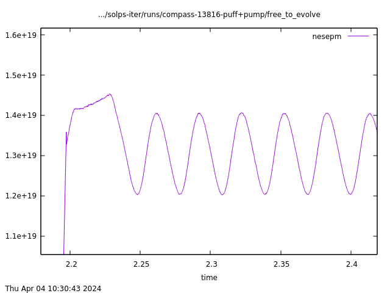
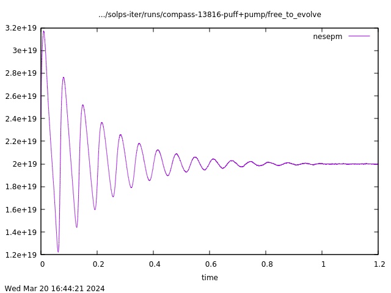
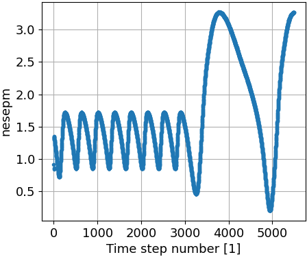
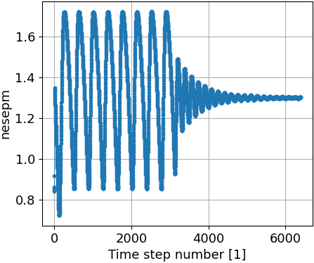
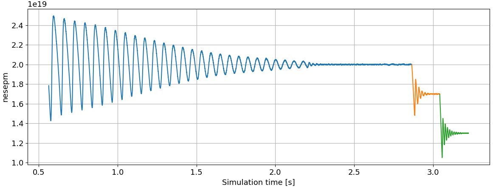

# Gas puffing and pumping

/// warning | This feature blog entry introduces advanced concepts
The reader is assumed to know how to [create a simple SOLPS-ITER simulation](../my_first_simulation/Creating_a_new_SOLPS-ITER_simulation.md) and to possess some [user wisdom](../supplementary/SOLPS-ITER_user_wisdom.md).
///

## Motivation

Explicit pumps (particle sinks) and fuelling puff valves (particle sources) are necessary for **self-consistent simulation of plasma and neutral density**. While there may be some implicit sinks and sources provided by some of the fluid boundary conditions that help to keep your particle balance, it is often not enough for a realistic simulation.

This feature blog entry covers:

- [Particle sources and sinks](#particle-sources-and-sinks)
- [Particle balance](#particle-balance)
- [Gas pumping](#gas-pumping)
- [Deuterium gas puff](#deuterium-gas-puff)
- [Impurity seeding](#impurity-seeding)
- [Density feedback schemes](#density-feedback-schemes), with special attention given to [oscillatory solutions](#feedback-oscillations)

/// admonition | This tutorial is EIRENE-centric
Puffing and pumping is best realized in a coupled **B2.5 + EIRENE** run, since it mainly involves the neutral particles. Unless stated otherwise, this tutorial focuses on the EIRENE-based features, which should be preferred whenever possible. The alternatives for **B2.5 standalone** runs are discussed more briefly in notes at the end of each section.
///

## Particle sources and sinks

In the tokamak edge plasma, there are five main particle sources and sinks: recycling, gas puff, vacuum pumps, neutral beam/pellet/etc injection and plasma-neutral interaction. We shall discuss each in turn.

**Recycling**. Plasma ions impinge on a solid surface (usually a divertor target), grab a free electron and become neutral particles. For an indefinite period, they chill at the surface and enjoy chemical reactions, until they randomly desorb due to thermal motion or they are struck free by another impinging particle. The desorbed neutral can be an atom (D<sup>0</sup>) or a molecule (D<sub>2</sub>, CH<sub>4</sub>). The neutral collides with a plasma electron, the molecule is broken up and the atoms are ionised. Depending on the plasma temperature and density, the ionisation can take place just above the target, in the divertor volume, or even in the confined plasma (especially with an open divertor). This entire process from a plasma ion to a freshly ionised ion is called recycling.

In SOLPS-ITER simulation, recycling may and may not preserve the total number of ions. The *recycling coefficient* $R$ is defined as a ratio between the incoming and outgoing particle fluxes:

$$R = \frac{\Gamma_{\text{neutrals from solid surface}}}{\Gamma_{\text{ions to solid surface}}} \approx \text{0.8-1}$$

If the recycling coefficient is unity ($R=1$), every neutralised particle is released from the surface again. This is what happens in steady state. There is a constant inventory of neutrals sticking to the solid surface, and the stream of incoming ions and outgoing neutrals balance each other out. If the recycling coefficient is below unity, usually $R=0.8-0.99$, some percentage of neutralised particles are "absorbed" into the surface. This is what happens on the first wall of tokamaks with short pulses and efficient wall conditioning. The wall was pumped clean of particles prior to the discharge, and the plasma doesn't last long enough to saturate the first wall with neutrals. Hence, the first wall acts similarly to a vacuum pump during the discharge. More on this below.

**Gas puff**. Besides the initial neutral gas pressure, plasma density in a tokamak is controlled by a real-time neutral gas injection, called gas puff. Gas puff is typically implemented as a small tube ending inside a tokamak port, with a piezovalve at the end. The piezovalve reacts to electric field by opening and letting gas flow out. The electric field is created with the piezovalve voltage. The number of atoms/molecules released per second $\Gamma_{\text{puff}}$ [s<sup>-1</sup>] at a certain valve voltage can be estimated by calibrating the piezovalve.

/// danger | IPP Prague
In the COMPASS database, the gas puff piezovalve voltage is stored as `MARTE_NODE.FeedbackDataCollection.GasPuffAnalogueOutput`.
///

**Vacuum pumps**. Vacuum pumps are, in essence, surfaces with sub-unity recycling coefficient $R<1$. (They are usually designed to pump neutrals, not ions, but the logic stands. If a neutral particle impinges on the pump surface, it has the chance $1-R$ that it will not desorb again.) The number of particles (atoms or molecules, depending on the pumped gas) absorbed per second $\Gamma_{\text{pump}}$ [s<sup>-1</sup>] depends on the recycling coefficient $R$, the pump surface $A_{pump}$, its surface temperature $T$ [K] and the particle mass $m$:

$\Gamma_{pump} = 3.638 A_{pump} (1-R) \sqrt{k_BT/m}$

Sourced from the [EIRENE manual](https://eirene.de/Documentation/eirene.pdf)<span class="material-symbols-outlined">open_in_new</span>, section *2.6.2 Effective pumping speed*. Pumping surfaces don't necessarily have to be vacuum pumps; they can also be an entrance to neutral beam injectors or other adjoint vacuum spaces which are not modelled by EIRENE and where neutrals may be lost or wander forever.

**Neutral beam injection, pellet injection etc**. These are important methods of fuelling in larger tokamaks, where gas puff cannot penetrate the edge plasma. They constitute a particle source like gas puff.

**Plasma-neutral interaction**. Though recycling usually overshadows every other process of ion-neutral conversion, volumetric plasma-neutral interaction is important for the conversion of energy. The dominant process is usually charge exchange, with volumetric recombination playing a smaller role.


## Particle balance

After one properly considers all particle sources and sinks, one should arrive at a particle balance in steady state:

$$\Gamma_{sources} \, [\text{s}^{-1}] = \Gamma_{sinks} \, [\text{s}^{-1}]$$

SOLPS-ITER is inherently a steady-state code, so achieving particle balance is the main hallmark of a converged simulation:

$$\frac{\Gamma_{sources} - \Gamma_{sinks}}{\Gamma_{sources}} \lesssim 0.01$$

It should be noted, however, that **experimental plasma is not necessarily in steady state** regarding particle balance. The primary actor is the *tokamak chamber*, which can fuel the plasma both with main ions and impurities.

The status of the **tokamak chamber** is a major uncertainty in tokamak operation and SOLPS modelling. The wall status depends on chamber conditioning (baking, glow discharge, ECR cleaning, boronisation...) and on the recent plasma discharges. Glow discharges in helium, which are meant to strike adsorbed gasses off the walls, can be a major source of helium impurities. Boronisation, coating the plasma-facing components with a thin layer of boron oxide, mitigates especially oxygen impurities, and wears off over a few weeks or months. It introduces intrinsic boron impurities and affects overall impurity mix.

The tokamak chamber also impacts deuterium fuelling and density control. In tokamaks with short discharges (like COMPASS), the first wall is typically under-saturated with deuterium with regard to neutral pressures during discharges. Therefore, the first wall acts as an efficient pump ($R < 1$). In terms of particles removed per second, it can be even more efficient than a cryopump, owing to its large surface and proximity to the plasma. In tokamaks with long discharges (like WEST), in contrast, the first wall saturates with neutrals during the discharge and its recycling coefficient approaches unity ($R = 1$). That means the plasma is, in a large part, self-fuelled by the wall and it can be difficult to control the density with mere gas puff.

> <span class="material-symbols-outlined">construction</span> **TODO**: How to calculate the time scales of particle balance and assess the relative importance of the first wall pumping?

When setting up gas puffing and pumping in a SOLPS-ITER simulation, consider these time scales. If the discharge is short, chances are that you don't need to implement the vacuum pumps at all, and should rather choose $R<1$ for the main chamber. If the discharge is long, main chamber $R=1$ may be more appropriate and a separate vacuum pump may be required to close the particle balance.

/// hint | Further reading
- A. Zito, [Gas particle balance issues at low throughput in coupled B2.5-Eirene runs](https://sharepoint.iter.org/departments/POP/CM/IMAS/SOLPS-ITER/SOLPS-ITER%202024%20Prague%20Code%20Camp/Tuesday%20-%20Eirene%20issues/Zito_slides_1.pdf)<span class="material-symbols-outlined">open_in_new</span>
- D. Moulton 2019,  [Balance routines in SOLPS-ITER](https://iterorganization.sharepoint.com/:b:/r/sites/SOLPS-ITER/Shared%20Documents/General/SOLPS-ITER/EU_Training_session/Balance_routines_in_SOLPS-ITER.pdf?csf=1&web=1&e=Usrsc4)<span class="material-symbols-outlined">open_in_new</span>

<span class="material-symbols-outlined">construction</span> **TODO**: Update the link to Antonello's presentation.
///

## Gas pumping

### Gas pumping set-up

To set up a case with EIRENE pumping surfaces, you'll need a simulation (ideally converged) without any pumps.

/// tip | The Goal
We want to configure one or more surfaces, either existing or new ones, with non-zero absorption ($1-R$) near the location of the actual pump or its inlet. In case the wall pumping is the dominating effect, select the whole wall instead. Consider if the targets should have different absorption. (Target recycling is quite intensive, so $R=1$ is usually appropriate there even for short discharges.)

Terminology: DivGeo recognizes *elements*, which are used to define corresponding EIRENE *surfaces* (namely the "additional surfaces").
///

Inside the SOLPS work environment, create a new case directory and its `baserun` and `run` subdirectories. Copy the `.dg` file from your pump-less simulation over to the new `baserun`. Open it with DivGeo.

In DivGeo, open `Variables>General Surface Data`. Mark every wall element which you would like to designate as pump. If you prefer, you may also define your pump as a new [free-floating surface](#deuterium-gas-puff). More advanced configuration of the `General Surface Data` may be needed, refer to the corresponding surface properties in the EIRENE manual.

Set `Absorption` ($1-R$) to something small, like 0.01. This corresponds to the recycling coefficient $R=0.99$, which should not impact the simulation much. Don't forget to hit `Set`.

`Commands>Check variables`, `Commands>Rebuild Carre objects`, `File>Save`, `File>Output`. Close DivGeo and re-run the standard `carre -` & `triang` workflow.
Only the EIRENE input file should get modified.

If the simulation runs smoothly, congrats, you have added a pump into the simulation.

### Changing the recycling coefficient

Assuming a run with coupled B2.5 and EIRENE, you can change the recycling coefficient in the `input.dat` (or `eirene.input.json`) file. Find the block *6a. General data for reflection model* and the corresponding surface model (`SURFMOD`) with `PUMP` in its name. There should be at least one for each group of surfaces with different absorption value configured in DivGeo, e.g.:

/// tab | Formatted (`input.dat`)
```{.python hl_lines="4"}
SURFMOD_4_CARBON_SPT_PUMP_580K
    1     2     0     0     1
1.20600E+03-5.00000E-02 0.00000E+00 0.00000E+00 0.00000E+00-1.00000E+00
1.00000E+00 9.00000E-01 1.00000E+00 1.00000E+00 5.00000E-01 1.00000E+00
1.00000E+00 1.00000E+00 0.00000E+00 0.00000E+00 1.00000E+00
```
///

/// tab | JSON (`eirene.input.json`)
```{.json hl_lines="10"}
{
  // ...
  "REFLECTION_MODELS": {
    "MANUAL": "http://www.eirene.de/eirene.pdf#subsection.2.6.1",
    // ...
    "SURFMODS": [
      {
        "NAME": "SURFMOD_4_CARBON_SPT_PUMP_580K",
        // ...
        "RECYCT": 9.0E-01,
        // ...
      }
    ]
  }
}
```
///

Here, the recycling coefficient is `9.00000E-01` (2nd number in the row for `input.dat`) and specifies recycling value $R=0.9$. In the EIRENE manual, the recycling coefficient is named `RECYCT` (chapter 2.6.1).

/// hint | B2.5 standalone
(Untested) Authors have not attempted to implement pumping in B2.5 standalone runs. The key might be either in configuring boundary conditions for continuity equation (`BCCON`) in the `b2.boundary.parameters` file or in configuring recycling for fluid neutrals in `b2.neutrals.parameters`. Please refer to other sources for more information.
///


## Deuterium gas puff

/// hint | This section applies to any main ion species
Deuterium is just the most common main ion species in SOLPS-ITER simulations.
///

If one has [implemented a pump](#gas-pumping), the lost particles must be compensated for. Under default boundary conditions, where the plasma density is controlled by the D<sup>1+</sup> density at the core boundary $n_{i,core}$ (`BCCON = 1`), this refuelling is done mainly through the particle flux from the core. The flux is automatically adjusted to such a value that matches the density required in `CONPAR`. To get a proper particle balance, however, one needs to control the plasma density is through the *gas puff throughput* $\Gamma_{\text{puff}}$.

/// tip | When gas puff is off in experiment
In short, low-density tokamak discharges, experimental density feedback system can find that it does not need to puff gas into the plasma to maintain the desired plasma density. Recycling is sustained by the pre-filled particles and pumping only removes them slowly (due to low neutral pressure). In the corresponding interpretative SOLPS-ITER simulation, gas puff throughput should still be non-zero. Even though your experimental plasma was not entirely steady-state, your simulation is. If you turn the gas puff off and introduce no additional fuelling, the particle content in your simulation will go down over time and you won't achieve convergence. 
///


/// danger | IPP Prague
The COMPASS tokamak had three piezovalves for gas injection: one on the LFS just under the outer midplane, which was the most active one in deuterium density control, one on the HFS which was used for deuterium density control only rarely, and one at the divertor target (near LFS strikepoint), which was used for nitrogen, neon and other impurity puffing. If you are making an interpretative simulation of the COMPASS tokamak, chances are, the LFS gas puff was active. Check this with your favourite vacuum technician and the operator who performed the discharge, as the [COMPASS experimental database](https://webcdb.tok.ipp.cas.cz/)<span class="material-symbols-outlined">open_in_new</span> does not hold records of the gas puff location. For calibration of the gas puff (conversion from piezovalve voltage to puffed particles per second), contact Jordan Cavalier. The puffed particle fluxes were of the order $\Gamma_{puff} \sim 10^{20}-10^{21}$ D<sub>2</sub> molecules/s.
///

### Gas puff set-up

To set up main ion species gas puff in a SOLPS-ITER simulation, you will require a puff-less simulation, ideally converged and with a semi-realistic pump already implemented.

/// tip | The Goal
For a single gas puff, we want to create or select one surface and create a new **gas puffing EIRENE stratum** (= particle source). The surface is only used as a location reference for the stratum. It's possible to use one of the existing wall surfaces, but not the target surfaces. Otherwise, a new free-floating surface must be created and configured as invisible to the particles.

Terminology: DivGeo recognizes *elements*, which are used to define corresponding EIRENE *surfaces* (namely the "additional surfaces").
///

Inside the SOLPS work environment, create a new case directory and its `baserun` and `run` subdirectories. Copy the `.dg` file from your gas-puff-less simulation over to the new `baserun`. Open it with DivGeo.

In DivGeo, create or choose one surface at or near the pump's location.

- The easy way is to choose one of the existing wall surfaces. **But it must not be one of the target surfaces** (i.e. in contact with B2 mesh), otherwise an obscure error will occur later when starting the simulation.

- <a name="virtual-surfaces"></a> The honest way is to create a new free-floating surface just inside the vessel wall (`Edit>Create>Point`, then `Add element`). Its normal vector must point outside, like the wall surfaces. Finally, make it invisible to the particles by specifying `Variables>General Surface Data>Surface Type = 0` and `...>Surface Side = 0`. Additionally, it is best to set to 0 all parameters related to sputtering. Don't forget to hit `Set`.

In DivGeo, select `Variables>Add>Gas puff`. `Ctrl+U` to unselect all elements, then mark the element where you wish the gas puff to be located and click `Puffing slot > Set`.

Make sure that the `Gas species` shows the species which you want. Usually `D2` for a deuterium fueling gas puff in a coupled simulation with `D` plasma species.

Set `Puffed flux` to something small, like `1.0e19`, and hit `Set`. This is a fairly small gas puff which should not impact your simulation significantly.

`Commands>Check variables`, `Commands>Rebuild Carre objects`, `File>Save`, `File>Output`. Close DivGeo and re-run the standard `carre -` & `triang` workflow. The EIRENE input file and `b2.neutrals.parameters` should get modified.

If the simulation runs smoothly, congrats, you have added a gas puff into the simulation. This, however, is not the end of the story! Continue to the next section.


### Boundary conditions compatible with gas puff

To truly control the plasma density with the gas puff throughput, you must adjust the core boundary conditions and find the ideal gas puff throughput $\Gamma_{\text{puff}}$ [particles/s].

Open `b2.boundary.parameters` and set the core (`S`) continuity equation boundary condition (`BCCON`) to `8`, meaning "prescribe the total particle flux over this boundary". Set the corresponding `CONPAR` (where you were likely to keep the desired $n_{i,core}$ until now) to `0.0`. This will **turn off any deuterium ion flux from the core**.

To **change the gas puff intensity**, open `b2.neutrals.parameters`. One of the first lines contains the list of strata types:

```{.fortran title="b2.neutrals.parameters"}
crcstra= 'W', 'E', 'S', 'S', 'N', 'C', 'V', 'T',
```

This is the list of strata (see Q&A: [What is a "stratum"?](../supplementary/Questions_and_answers.md#stratum)). The stratum `C` corresponds to your gas puff. A bit lower in the file, you will find the `userfluxparm` variable:

```{.fortran title="b2.neutrals.parameters"}
userfluxparm(1,1)=  0.00    ,  0.00    ,  0.00    ,  0.00    ,  0.00    , 1.000E+19,  0.00    ,
```

The nonzero value `1.000E+19` near the end, corresponding to the stratum `C` in the list of strata types, is the amount of particles puffed per second. If you have multiple gas puffs, you may have several `C` strata. Edit the particle flux value to something semi-realistic. `1.000E+20` may suffice for starters.

Finally, add this switch to your `b2mn.dat`:

```{.fortran title="b2mn.dat"}
'eirene_ionising_core'       '1'
```

This will cause the EIRENE neutrals which reach the core boundary to come back as ions. Their flux is added to the South boundary condition flux (which we set as zero).

Run the simulation for a short time (a couple dozen iterations) and check the density time evolution.

```
2dt nesepm
```

If $n_{e,sep}$ starts falling steeply, increase the gas puff throughput by an order of magnitude and run again. If $n_{e,sep}$ starts rising steeply, decrease the gas puff throughput by an order of magnitude and run again. Settle on a gas puff value which approximately yields your desired separatrix density and run the simulation until converged. Fine-tuning the $\Gamma_{\text{puff}}$ value can be left to a [density feedback scheme](#density-feedback-schemes).


/// hint | B2.5 standalone
Gas puff for a standalone case can be implemented using boundary conditions for the continuity equation (`BCCON`) in the `b2.boundary.parameters` file. Use `BCCON = 8` to prescribe a total particle flux with constant flux density in the `CONPAR` value, particles/s - that is your gas puff intensity. Apply this BC to your chosen neutral fluid at an outer radial boundary (type `N` or `S` in SOL or PFR regions). There are two options for choosing the boundary:

- Implement a simplified "global" puff using the existing far SOL boundary (type `N`), spanning most of the wall outline. This is the easy way, where you only need to change `BCCON` and `CONPAR` for an already existing boundary. Depending on the order of fluid species (here index `0`) and boundaries (here index `6`), the end result could look like this:

    ```{.fortran title="b2.boundary.parameters"}
    BCCON(0,6)= 8,  9,
    ! ...
    CONPAR(0,6)= 1.000E+19,  0.0,
    ```

- (Untested) Implement a localized puff by adding a new boundary definition. This requires some work and you should know what you are doing. Increment `NBC`, specify `BCCHAR`, and use e.g. the `BC_LIST_SIZE`, `BC_LIST_X`, `BC_LIST_Y` to select your gas puff cell. Append values to the `BCCON` and `CONPAR` arrays as needed. Leave the BCs for other equations without modifications, which will result in the "no condition" default behaviour.
///

## Impurity seeding

Once you've managed one gas puff, nothing is stopping you from adding another one. The procedure is the same as for the deuterium gas puff, there is only a few things to consider:

- In DivGeo, add another puffing stratum via `Variables>Add>Gas puff`.
- Assuming you have already added your new `Plasma species` into the simulation, you should be able to configure `Gas species` for the gas puff as your new impurity species. Note that while `D2` molecule is always automatically available, it is not necessarily the case for other species. You may need to use the atomic species instead.
- Set `Puffed flux` to something 1-2 orders of magnitude smaller than the main ion species.
- The new stratum will appear in `b2.neutrals.parameters` in the order that corresponds to its numbering in DivGeo. Look for the second `C`-type stratum.

The hardest part of setting up impurity seeding is to provide a sensible value for the impurity gas puff throughput $\Gamma_{\text{puff}}$. In contrast to the main species, there is no easy reference in terms of the total plasma density, since the impurity should only represent a small fraction of the plasma and it should be localized in the divertor region (assuming standard seeding experiment setup). More specialized diagnostics data are often needed, including neutral pressure in divertor, spectroscopy, etc. Furthermore, the second gas puff represents another degree of freedom in the model and typically makes it even more difficult to optimize against the experimental data. A good idea is to employing a feedback control scheme for one or both of the gas puffs, as described in the following section.

> <span class="material-symbols-outlined">construction</span> **TODO**: The new ion species are automatically added? Is it okay to start from `b2fstati` which doesn't have them?

/// hint | B2.5 standalone
Follow the same procedure as for the deuterium gas puff in standalone case, but modify the boundary condition `BCCON(is, ib)` and parameter `CONPAR(is, ib)` for the impurity species neutral fluid (index `is`).
///


## Density feedback schemes

Controlling plasma density with gas puff throughput $\Gamma_{\text{puff}}$ is more complicated than controling it with $n_{i,core}$. If you change the radial diffusion coefficient $D_n$, recycling coefficient $R$ or input power $P_{sep}$, your separatrix density may change drastically. To avoid finding the right value of $\Gamma_{\text{puff}}$ over and over again, SOLPS-ITER offers controlling the plasma density using *feedback schemes*.

A feedback scheme, in general, is a mechanism where an active actuator (e.g. gas puff) is being adjusted in time to achieve a desired requirement (e.g. a value of separatrix density). In SOLPS-ITER, you construct your feedback scheme by independently configuring three things:

- the requirement (`NA_FEEDBACK_CHOICE`)
- the actuator (`NA_FEEDBACK_ACTUATOR`)
- the feedback formula (`NA_FEEDBACK_OPTION`), which takes the distance between the requirement and the current value, and calculates the next actuator value

Currently, all of the implemented actuators are focused on density changes in one way or the other (mainly gas puff and pumping). The implemented requirements cover a wider range, including total density of species at different locations, particle flux, relative concentration, radiated power, and more. In this case, we will focus solely on the gas puff actuator and the separatrix density requirement.

Examples of gas puff feedback schemes among the SOLPS examples include:

- `ITER_2588_D+He+N`: feedback on the deuterium gas puff intensity to preserve "the total particle content for that species" (not clear whether deuterium ions or neutrals) summed over a given rectangle of B2.5 cells
- `ITER_2308_Honly_20MW`: feedback on the core boundary hydrogen particle (not clear whether neutrals or ions) flux to preserve the neutral hydrogen particle flux through the core boundary

All available feedback schemes are documented primarily in the description of switches specified in the `b2.feedback_control.parameters` file (refer to the [B2.5 switch database](/solps-doc/extras/b2input)<span class="material-symbols-outlined">open_in_new</span>).

/// warning | The NEW and OLD feedback scheme switches
Historically, there are two ways how to set up feedback schemes. You might run into a number of switches in `b2mn.dat`, which are documented as "feedback switches", e.g. `b2stbc_isfeedback` - those are the old-style switches and they are redundant in SOLPS-ITER 3.0.8+. The new-style configuration of feedback is done almost entirely in the `b2.feedback_control.parameters` file.
///

### Feedback scheme set-up

We set up a feedback scheme acting on the gas puff throughput $\Gamma_{\text{puff}}$ to reach a desired outer midplane separatrix density $n_{e,sep} = 2 \times 10^{19}$ m<sup>-3</sup>. The gas puff valve is located on the LFS midplane, near the control location.

First, procure a run with manual gas puff and make a copy of it. You needn't touch DivGeo this time.

In the `run` folder, create the main feedback configuration file `b2.feedback_control.parameters` with the following contents:

```{.fortran title="b2.feedback_control.parameters"}
&FEEDBACK_CONTROL
NA_FEEDBACK_CHOICE=     3,  ! the feedback aims for a specific OMP separatrix electron density
NA_FEEDBACK_TARGET=     2.0E+19,  ! requested OMP separatrix electron density

NA_FEEDBACK_ACTUATOR=   1,  ! the feedback controls the gas puff intensity
NA_FEEDBACK_IB=        -6,  ! actuating gas puff Eirene stratum 6 ('C'-type in b2.neutrals.parameters)
NA_FEEDBACK_ACTUATOR_MIN=   1.000E+19,  ! minimum gas puff intensity in particles/s
NA_FEEDBACK_ACTUATOR_MAX=   5.000E+21,  ! maximum gas puff intensity in particles/s

NA_FEEDBACK_OPTION=     1,  ! choose a particular formula for calculating next time step's gas puff intensity
NA_FEEDBACK_ALPHA=      0.5,  ! choose a mid-range speed for the gas puff intensity changes
/
```

The feedback scheme is enabled by adding the following line to `b2mn.dat`:

```{.fortran title="b2mn.dat"}
'b2stbc_feedback'	    '1'  ! turn on the feedback scheme
```

The `userfluxparm` value in `b2.neutrals.parameters` now specifies the initial gas puff intensity, until a `b2.feedback_save.parameters` file is written on the next simulation run.

Set the requested elapsed time in `b2mn.dat` to 60 s and run the simulation, starting from the previous manual gas puff solution.

```tcsh
rm b2mn.prt ; cp b2fstate b2fstati ; correct_b2yt_timestamps
b2run b2mn >& run.log &
```

If the simulation runs alright with no errors, you are halfway done.

/// hint | B2.5 standalone
Assuming a gas puff for the standalone case is implemented (see the previous sections), the procedure is almost identical to setting up a feedback scheme in a coupled case. Follow the same steps, then make two extra adjustments before running the simulation:

1. Change the gas puff BC to `BCCON = 11` (feedback-enabled boundary condition). `CONPAR` now defines the initial gas puff intensity, until a `b2.feedback_save.parameters` file is written on the next simulation run. For example:

    ```{.fortran title="b2.boundary.parameters"}
    BCCON(0,6)= 11,  9,
    ! ...
    CONPAR(0,6)= 1.000E+19,  0.0,
    ```

2. Change the actuator target index `NA_FEEDBACK_IB` to a positive value that corresponds to the BC index of the gas puff in `b2.boundary.parameters`. For example:

    ```{.fortran title="b2.feedback_control.parameters"}
    NA_FEEDBACK_IB= 6,  ! actuating gas puff boundary condition 6 (BCCON=11 in b2.boundary.parameters)
    ```
///


### Feedback oscillations

At low plasma densities, enabling density control using gas puff feedback can lead to oscillations in the plasma solution:


<p align="center"><i>Sustained oscillations of the separatrix electron density, centered around the desired value.</i></p>

This section discusses how such oscillations come to be and how to control them.

**Feedback formula example**: Using `NA_FEEDBACK_OPTION = 1` in `b2.feedback_control.parameters` (see the [switch description](/solps-doc/extras/b2input/b2.parameters.html#b2.feedback_control.parameters)) translates into the following formula:

$$\Gamma_{\text{puff,new}} = \Gamma_{\text{puff,old}} \cdot \frac{1 + \alpha \cdot \frac{\text{target } n_{e,sep}}{\text{current } n_{e,sep}}}{1 + \alpha}$$

The $\alpha$ parameter is set using `NA_FEEDBACK_ALPHA` in `b2.feedback_control.parameters`, and it controls the speed of the feedback control changes. The smaller it is, the more the rescaling factor approaches unity, and the slower $\Gamma_{\text{puff}}$ reacts to the ratio between the target and current $n_{e,sep}$. Its default value is $\alpha=0.001$, which is ridiculously tiny. For COMPASS L-modes, Kateřina has reached good results with $\alpha = 1.0$. In a complicated simulation where you can afford long run times, however, lower $\alpha$ presumably brings in more stability. In an oscillatory feedback solution, see below, $\alpha$ controls the period and magnitude of the oscillations.

**Theory of oscillatory plasma solutions**: As the article [Bifurcations and oscillations in divertor plasma](https://iopscience.iop.org/article/10.1088/1361-6587/ab1bba/meta)<span class="material-symbols-outlined">open_in_new</span> by Kukushkin & Krasheninnikov describes, a tokamak flux tube can act weird if you inject enough power into it. SOL physics is quite non-linear, especially around the target when $T_e$ drops to several eV. Small changes in the input parameters (or upstream parameters) can result in large changes in the solution (or target parameters). Such non-linearities can result in systems, such as the aforementioned flux tube with a high input power, which can sustain two particular solutions but nothing in-between.

In the simplified 1D case presented in the article, the crucial quantity is the *neutral pressure above the target* $p_n$. Say, you are trying to reach a certain $p_n$ by gas puff feedback, which increases or decreases the number of particles $N_D$ in the flux tube, and that the desired $p_n$ is in the "forbidden zone" where no converged solution exists. You start from a low-density, low-$p_n$ solution and increase the gas puff. Before the simulation reaches the desired $p_n$, the system non-linearity will cause a sudden plasma cool-down. $p_n$ will jump up way higher than you wanted it to. So you decrease the gas puff (or number of particles in the flux tube $N_D$), and $p_n$ obediently starts falling. But then, before you get close to the $p_n$ you want, the non-linearity kicks in again in the opposite direction. The target plasma heats up and $p_n$ drops below your desired value. So you increase the gas puff... Rinse, repeat. You now have sustained oscillations in the plasma solution.

The exact mechanism of the non-linearity which causes this behaviour is not explained by Kukushkin and Krasheninnikov. I assume it has to do with power and pressure loss processes in the divertor plasma, which kick in when target $T_e$ drops below 10 eV or so, and then leave just as abruptly when the target plasma heats up. However, I have seen sustained oscillatory solutions in SOLPS feedback cases where the target remained safely attached all the way through. K&K explain that in a 2D plasma, self-sustained oscillations can appear even without feedback, just by the virtue of neighbouring flux tubes sharing neutrals based on their $p_n$. Such solutions would oscillate all on their own, even without gas puff feedback. K&K claim that such oscillations, on the time scale of neutral diffusion, have indeed been observed at JET. So maybe it's that. Or maybe it's Maybelinne. The important thing is that K&K's explanation matches the feedback oscillations I have observed in COMPASS:

- Solutions with low $n_{e,sep} \sim 2 \times 10^{18}$ m<sup>-3</sup> are stable and gas puff feedback converges correctly.
- Solutions with high $n_{e,sep} \sim 2 \times 10^{19}$ m<sup>-3</sup> are likewise stable  and gas puff feedback converges correctly.
- Solutions with intermediate $n_{e,sep}$, even when started from a converged solution with the correct plasma parameters, begin oscillating.

**How oscillatory plasma solutions look and behave**: After running a case with density control via gas puff intensity feedback, this is what you want to see (requested $n_{e,sep}=2 \times 10^{19}$ m<sup>-3</sup>):


<p align="center"><i>Nice and damped oscillations, converging toward the desired value .</i></p>

The sustained oscillations shown in the beginning of this section are what you do not want to see (requested $n_{e,sep}=1.3 \times 10^{19}$ m<sup>-3</sup>).

The value of the $\alpha$ parameter affects the **oscillation period and magnitude**.

Changing $\alpha = 0.1 \rightarrow 0.01$ | Changing $\alpha = 0.1 \rightarrow 0.5$
--- | ---
 | 

Lower $\alpha$ increases the oscillations magnitude and decreases the period. At $\alpha=2.0$ in the COMPASS case, the oscillations were comparable to the simulation noise, but they were still present. I'm not entirely sure if this sort of solution is as good as a converged one.

**How to force an oscillating solution to converge?** Start from a high-density plasma solution. Simple as that. Props to Haosheng Wu, who mentioned this solution at the SOLPS Slack (channel `q_and_a`, April 2024). Set the desired $n_{e,sep}$ to a high value, let the simulation converge, then decrease $n_{e,sep}$ step-wise.


*Three consequent simulations, gradually decreasing requested separatrix electron density. At 2.2 ms, $\alpha$ was increased from 0.1 to 1.0 to prompt faster convergence.*

I am not sure how (or if) this trick gets around the non-linearity described by Kukushkin and Krasheninnikov. On occasion, relaunching a converged low-density simulation with different parameters renews the oscillations. In the worst case, always start from a high-density case.