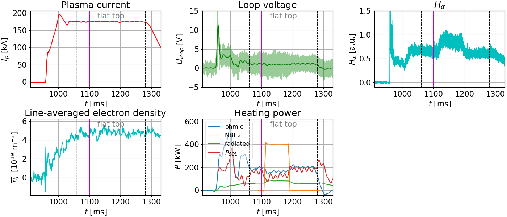
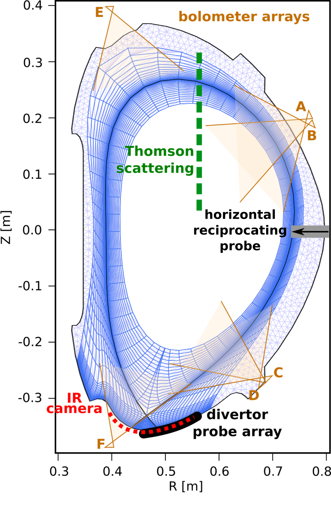
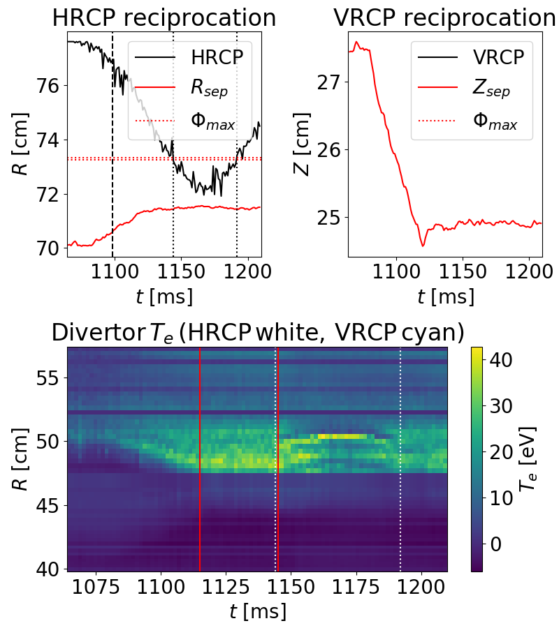
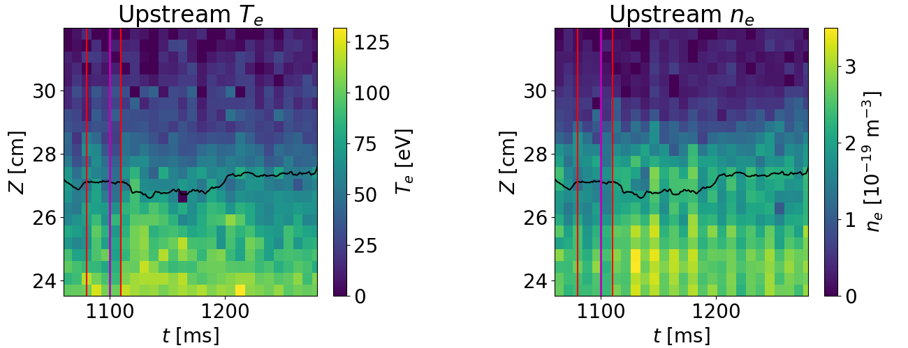
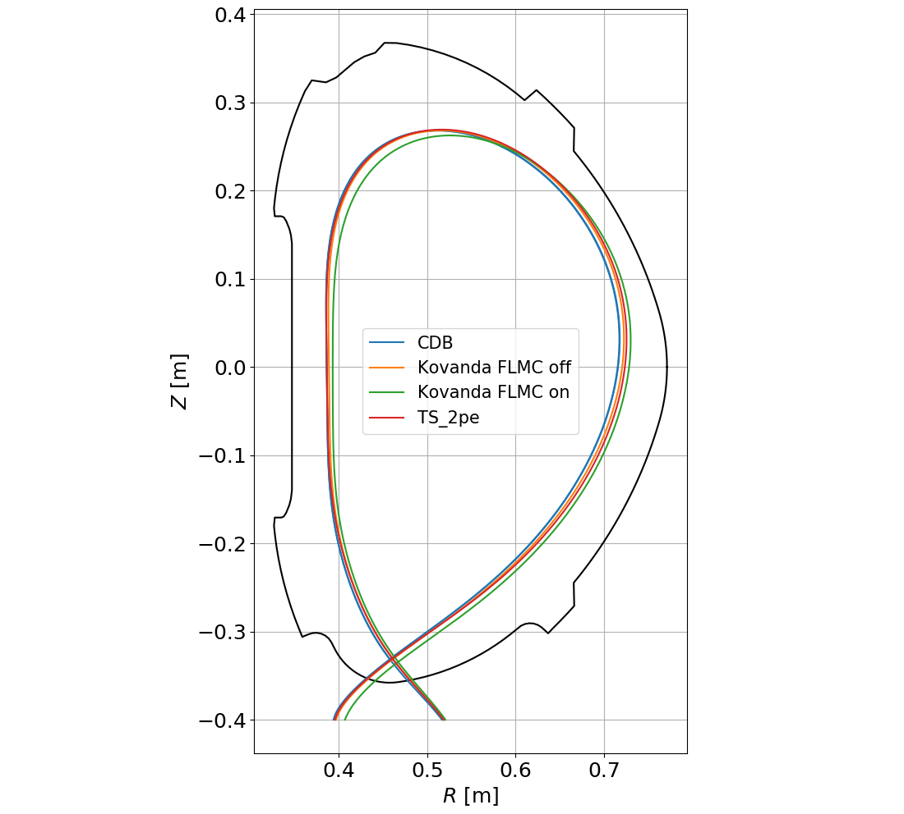
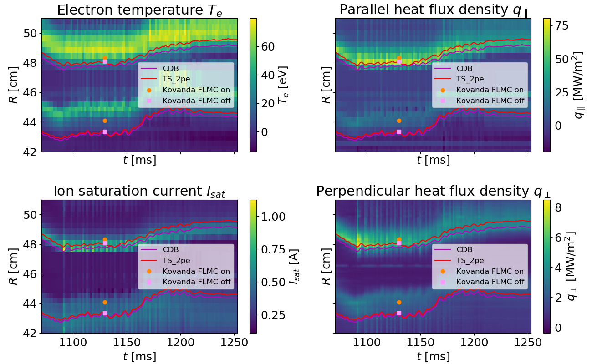
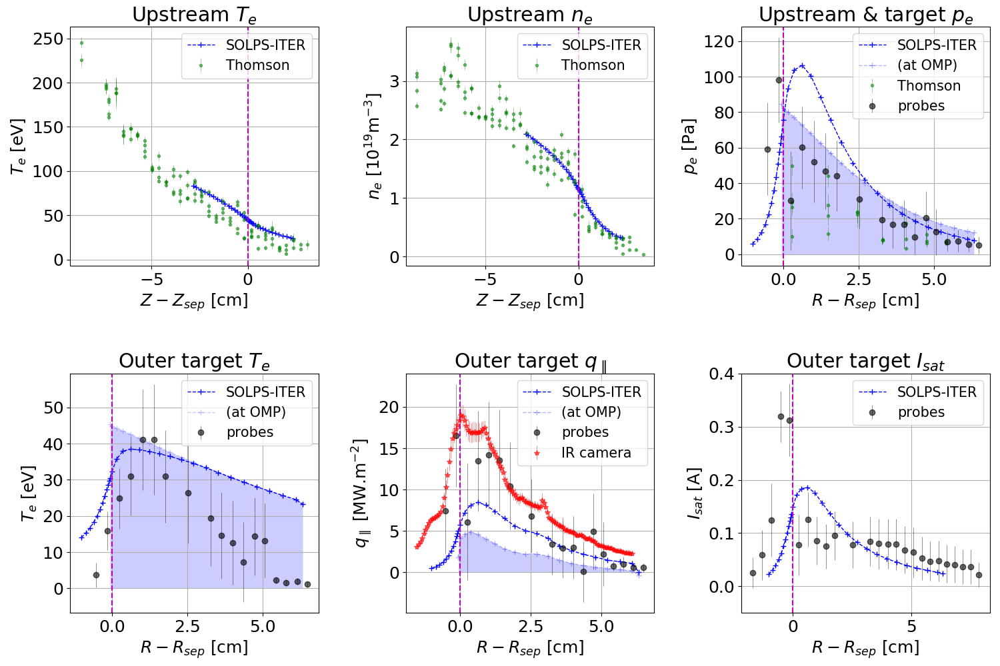
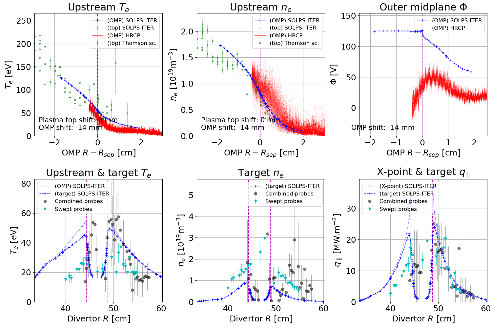
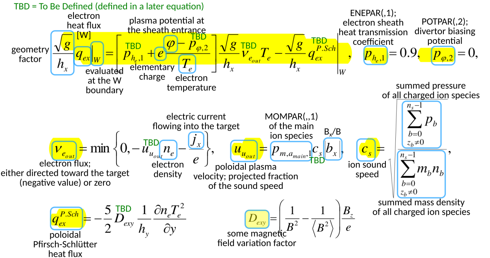
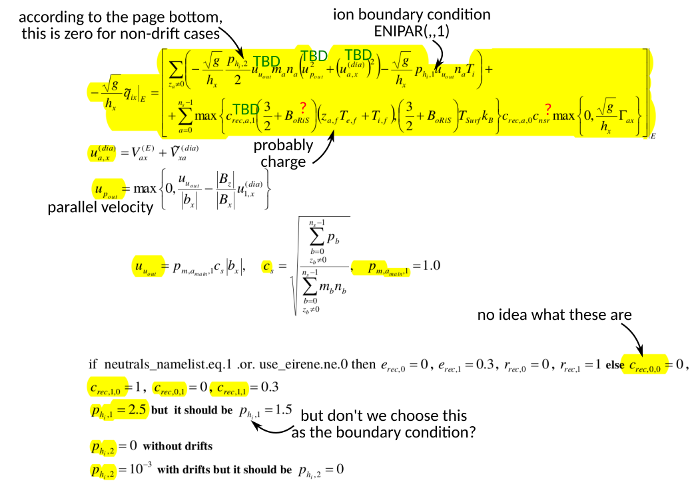

# Interpretative simulations of COMPASS

/// warning | This feature blog entry introduces advanced concepts
The reader is assumed to know how to [create a simple SOLPS-ITER simulation](../my_first_simulation/Creating_a_new_SOLPS-ITER_simulation.md) and to possess some [user wisdom](../supplementary/SOLPS-ITER_user_wisdom.md).
///

/// danger | IPP Prague
This tutorial is specific to modelling the COMPASS tokamak. It may, however, be helpful to interpretative simulations in general.
///

In her [PhD thesis](../files/Hromasova_PhD_thesis.pdf)<span class="material-symbols-outlined">download</span>, Kateřina validated SOLPS-ITER simulations against data from the [COMPASS tokamak](https://iopscience.iop.org/article/10.1088/1741-4326/ac301f/meta)<span class="material-symbols-outlined">open_in_new</span>. (Long story short: As long as it's sheath-limited, it works well.) This feature blog entry covers the resulting knowledge about interpretative simulations of COMPASS.

The trick to interpretative modelling is to spend a lot of time picking the right experiment and the right way to process diagnostic data. All of this is done **before** you ever start building a simulation. This tutorial covers:

- Finding a discharge with the right physics
- Finding all the available diagnostics
- Checking if diagnostic data are good
- Procuring a good magnetic equilibrium reconstruction
- Matching experiment and simulation results

/// hint | Resources on SOLPS simulations of COMPASS
- [Kateřina's PhD thesis](../files/Hromasova_PhD_thesis.pdf)<span class="material-symbols-outlined">download</span> (2025)
- M. Komm, [Modelling of plasma interaction with castellated surfaces in fusion devices](../files/Komm_MSc_thesis.pdf)<span class="material-symbols-outlined">download</span>, chapter 5 *Fluid modeling* (2009)
- [Interchange-turbulence-based radial transport model for SOLPS-ITER: A COMPASS case study](https://onlinelibrary.wiley.com/doi/abs/10.1002/ctpp.201900155)<span class="material-symbols-outlined">open_in_new</span>, Contributions to Plasma Physics (2020)
- [Kateřina's PhD thesis study](../files/Katkas_PhD_thesis_study.pdf)<span class="material-symbols-outlined">download</span>, chapter 3 *Interpretative modelling results* (2021)
- K. Hromasová, [SOLPS-ITER simulations of the COMPASS tokamak](https://info.fusion.ciemat.es/OCS/EPS2021PAP/pdf/P5.1028.pdf)<span class="material-symbols-outlined">open_in_new</span>, Proceedings of the 47th EPS conference on plasma physics (2021)
- S. Carli, [Bayesian maximum a posteriori-estimation of κ turbulence model parameters using algorithmic differentiation in SOLPS-ITER](https://onlinelibrary.wiley.com/doi/abs/10.1002/ctpp.202100184)<span class="material-symbols-outlined">open_in_new</span>, Contributions to Plasma Physics (2021)
- K. Hromasová, [Sensitivity of COMPASS tokamak SOLPS-ITER simulations to electron and ion heat flux limiters](https://lac913.epfl.ch/epsppd3/2023/html/Tu/Tu_MCF36_Hromasova.pdf)<span class="material-symbols-outlined">open_in_new</span>, Proceedings of the 49th EPS conference on plasma physics (2023)
- D. Švorc, [Validation of tokamak magnetic equilibrium reconstructions using the SOLPS-ITER edge plasma transport code simulations](https://lac913.epfl.ch/epsppd3/2024/html/PDF/P2-084.pdf)<span class="material-symbols-outlined">open_in_new</span>, Proceedings of the 50th EPS conference on plasma physics (2024)
- [Daniel's Master's thesis](../files/Svorc_MSc_thesis.pdf)<span class="material-symbols-outlined">download</span> (2024)
///


## Find a discharge with the right physics

The first step of interpretative modelling is to decide **what physics you wish to model** (detachment, X-point radiator, density shoulder...) and to find the discharges where this phenomenon is explored. This may involve answering questions like:

- What is the confinement mode (L-mode, H-mode, QCE...)?

- Is there impurity seeding and from where?

- How long has it been since the last chamber conditioning (baking, glow discharge, boronisation...)?

- Is there a part of the discharge where plasma parameters are reasonably stable?

- Is there additional heating? How accurately do we know the power balance?

- Does the discharge feature a special diagnostic which is usually offline?

- Has somebody modelled this discharge before?

Most SOLPS modelling is steady-state, so you want to model a discharge phase which is reasonably static. To get a first impression of the **discharge time evolution**, consult the [COMPASS logbook](https://logbook.tok.ipp.cas.cz/index.php?show=shot&shot_no=17588)<span class="material-symbols-outlined">open_in_new</span>. The following parameters should be stable:

- Plasma current, loop voltage
- Electron density: line-averaged as given by the interferometer, peak electron density as given by the Thomson scattering diagnostic, gas puff
- Plasma shape (a video from the standard EFIT reconstruction is linked in the logbook entry), strike point position, outer midplane separatrix position, plasma top separatrix position
- $H_\alpha$ line emission intensity (especially crucial for investigating inter-ELM H-mode)
- Heating power: NBI power, Ohmic power, energy content in the plasma
- Plasma composition: impurity seeding presence/magnitude

To determine the **power crossing the separatrix** $P_{sep}$, on COMPASS one may use the signals `P_sep_norm` (power crossing the separatrix calculated using a more sophisticated algorithm than $P_{ohm}-P_{rad}$, normalised to the separatrix surface) and `A_sep` (separatrix surface). The NBI contribution is more tricky as the absorbed power is smaller than the nominal power; ask Klára Bogár (<span class="material-symbols-outlined">mail</span> [klara.bogar@ipp.cas.cz](mailto:klara.bogar@ipp.cas.cz)) for a more nuanced estimate.




<p align="center"><i>Main plasma parameter time traces in COMPASS L-mode #17588. I chose to model time 1100 ms, just before NBI 2 comes online (magenta line).</i></p>

**Picking the time instance to model** follows the same logic as picking a discharge.

- You may choose a moment of **opportune diagnostic measurement**, such as a Thomson scattering diagnostic laser firing in a nice inter-ELM period.
- Prefer **steady-state** plasmas. Don't model a time instance where NBI has just been turned on, the plasma is going through MHD instabilities, RMP is being used or an ELM is underway. Pick a quiescent discharge phase (flat top), a long inter-ELM period, or a spot on the density ramp where the plasma parameters evolve slowly and calmly.
- Make sure the **plasma is not disturbed** by diagnostic measurements. This applies particularly to reciprocating probes, which can cool the edge plasma if inserted close to the separatrix. Keep track of the probe movement, plot the upstream and target temperature evolution in time and model time instances when the probe is still far from the separatrix. (Ironically, if you're going to use the reciprocating probe data for experiment-model comparison, you will take probe data from the disturbed part of the discharge. This is an unavoidable, intrinsic feature of the probe measurements. If you are certain the probe cools the edge plasma substantially, don't use this experimental data. In the worst case, pick a different discharge to model.)

/// tip | SOLPS-COMPASS
Kateřina has compiled a database of good COMPASS measurements, covering hundreds of discharges and featuring primarily the horizontal reciprocating probe. The database is available as part of [SOLPS-COMPASS](https://repo.tok.ipp.cas.cz/hromasova/solps-compass)<span class="material-symbols-outlined">open_in_new</span>, a Python package for accessing COMPASS experimental data specifically for the purpose of comparing them to SOLPS-ITER interpretative simulations. The package is only available to those with an IPP Prague account.
///


## Compile all available diagnostics

A list of COMPASS diagnostics relevant to SOLPS-ITER modelling is compiled in the [COMPASS diagnostics table](../files/COMPASS_diagnostics_table.ods)<span class="material-symbols-outlined">download</span>. The most important ones are:

- **Thomson scattering** diagnostic (electron temperature $T_e$, electron density $n_e$) - `Te`, `ne` and their stray-light-corrected variants
- Combined ("new") **divertor probe array** (plasma potential $\Phi$, ion saturation current $I_{sat}$ and electron temperature $T_e$) - `DIVBPP01`-`DIVBPP55`, `DIVLPA01`-`DIVLPA54` and `DIVLPB01`-`DIVLPB54`
- **Infrared camera** (divertor heat flux $q_\parallel$) - `FIRCAM_heat_flux`
- AXUV diode (bolometer) array (line-averaged radiated power $P_{rad}$) - `Prad` and many signals starting `AXUV`
- Horizontal **reciprocating probe** (plasma potential $\Phi$, ion saturation current $I_{sat}$ and electron temperature $T_e$) - `rcp_position_horizontal` and an array of signals depending on the probe head, such as `BPP1_floating` or `LP2_Isat_current`


<!---->

<p align="center"><i>Essential COMPASS diagnostics in the poloidal cross-section. Example SOLPS-ITER grids included.</i></p>

To **find whether these diagnostics measure**, search the [CDB](https://webcdb.tok.ipp.cas.cz/)<span class="material-symbols-outlined">open_in_new</span> (COMPASS DataBase) for the corresponding test signals:

- Thomson scattering diagnostic - `Te`
- Combined divertor probe array - `DIVBPP01`
- Infrared camera - `FIRCAM_RAW`
- AXUV diode (bolometer) array - `Prad`
- Horizontal reciprocating probe - `rcp_position_horizontal`

If these signals are present, the diagnostic was most likely collecting data. If they aren't present, the diagnostic was offline. The necessary minimum for a SOLPS simulation are at least some upstream data (Thomson scattering, reciprocating probe) and some target data (divertor probe arrays, infrared camera). The more diagnostics, the better. They won't agree, but at least you'll get an idea of the uncertainty of experimental measurements.

/// hint | Resources on COMPASS diagnostics
- [COMPASS wiki](https://wiki.tok.ipp.cas.cz/index.php/Main_Page#Diagnostics)<span class="material-symbols-outlined">open_in_new</span>
- V. Weinzettl, [Overview of the COMPASS diagnostics](https://www.sciencedirect.com/science/article/pii/S0920379610005594?via%3Dihub)<span class="material-symbols-outlined">open_in_new</span>, Fusion Engineering and Design **86** (2011)
- V. Weinzettl, [Progress in diagnostics of the COMPASS tokamak](https://iopscience.iop.org/article/10.1088/1748-0221/12/12/C12015)<span class="material-symbols-outlined">open_in_new</span>, Journal of Instrumentation **12** (2017)
///


## Assess experimental data quality

If a diagnostic signal is present, that doesn't automatically mean it contains good data. When gauging data quality, the safe bet is to contact the person responsible for the diagnostic, listed in the [COMPASS diagnostics table](../files/COMPASS_diagnostics_table.ods)<span class="material-symbols-outlined">download</span>. However, most people who were running COMPASS are busy working on COMPASS Upgrade now. To foster self-sufficiency, here are some tips how to recognise good data for interpretative SOLPS-ITER simulations.


### Horizontal reciprocating probe

Located on the outer midplane, the horizontal reciprocating probe (HRCP) provides some of the best target measurements. Its measurements of the plasma potential (ball-pen probes) are unique. Its uncertainties/drawbacks/issues involve:

- The probe has a pronounced effect on the plasma. Sometimes you can see both on the Thomson scattering profile and on the divertor that as the probe is inserted, the whole edge plasma cools down. It is an open question whether this means the measurement of the probe tips are untrustworthy, as the majority of the cooling is probably done by the probe *head* and the tips are deeper in the plasma.
- HRCP measurements aren't routinely available.
- When HRCP does measure, it might not penetrate deep enough to hit the separatrix.
- Over the years, multiple probe heads were installed on the horizontal reciprocating manipulator. You must find out which probe head was installed in your shot and what the signals from individual pins were called.
- The probe position might be given inaccurately in the database because of an undetected systematic shift of the probe drive.

The primary quantities measured by the horizontal reciprocating probe are:

- Plasma potential $\Phi$ - signal `BPP1_floating` or similar
- Ion saturation current $I_{sat}$ - `LP2_Isat_current` or similar
- Floating potential $V_{fl}$ - `LP1_floating` or similar


### Combined divertor probe array

Located on the divertor, the combined ("new") divertor probe array provides useful target measurements. One of its biggest selling points is measuring with high temporal resolution, which is sadly not pertinent to SOLPS-ITER simulations since those tend to describe the steady-state and the measurements are averaged over a time period anyway. What *is* fortunate is that it measures almost in every shot, so its measurements are routinely available (in D-shaped discharges, obviously). Its uncertainties/drawbacks/issues involve:

- The profile often shows "teeth", where one probe measures a systematically and strangely lower/higher signal than its neighbour. Be careful about them. Some say they're the effect of drift and drift-enabled SOLPS-ITER modelling would reproduce them, but they might also be bad probes.
- The divertor can be shadowed by one of the reciprocating probes. It isn't entirely clear whether it then gives bonkers values (the profile can exhibit strange spikes which are there only when the probe's deep enough) or correct measurements.
- All the HFS (inner target), probe measurements are untrusted because they yield negative $T_e$. It is not known why, but it is known that reversing the fields (and thus the direction of the $E \times B$ drift) alleviates this problems. Thus it is thought to be a magnetic shadowing problem.

The primary quantities measured by the combined divertor probe array are:

- Plasma potential $\Phi$ - signals `DIVBPP01` to `DIVBPP55`
- Ion saturation current $I_{sat}$ - `DIVLPB01` to `DIVLPB24` and `DIVLPA25` to `DIVLPA54`
- Floating potential $V_{fl}$ - `DIVLPA01` to `DIVLPA24` and `DIVLPB25` to `DIVLPB54`

To check the data quality, plot the $T_e = (V_{BPP} - V_{LP}/1.4)$ time trace for the whole array, compare it to the whole shot time traces and look for badly measuring probes. Decide where you'll want to average the divertor quantity values (red lines in the picture).



*Reciprocating probes movement vs divertor $T_e$ measurements in COMPASS discharge \#19418. Only the horizontal reciprocating probe is on. Note how the divertor profiles change after it passes the velocity shear layer ($\Phi_{max}$, denoted by dotted lines). Also note how the strike point moves around $t=1100$ ms.*

/// note | Two divertor probe arrays
COMPASS had two divertor probe arrays:

- The ["old" divertor probe array](https://wiki.tok.ipp.cas.cz/index.php/Divertor_probes)<span class="material-symbols-outlined">open_in_new</span>:  consisted of 39 Langmuir probes and was usually swept to measure the I-V characteristic (swept probe array)
- The ["new" divertor probe array](https://iopscience.iop.org/article/10.1088/1741-4326/aa7e09)<span class="material-symbols-outlined">open_in_new</span>: consisted of three rows of ball-pen probes, floating Langmuir probes and Langmuir probes in the $I_{sat}$ regime (combined probe array)

The swept array yielded $T_e$ consistently lower than the combined array, and it was a long-standing point of contention which one was actually right. [[Komm 2019]](https://iopscience.iop.org/article/10.1088/1741-4326/ac8011/meta)<span class="material-symbols-outlined">open_in_new</span> concludes the sweeping voltage extent was insufficient and that the combined array correlates better with upstream temperatures. In her [PhD thesis](../files/Hromasova_PhD_thesis.pdf)<span class="material-symbols-outlined">open_in_new</span>, Kateřina used both arrays to get a better idea of the uncertainty. Most COMPASS experimentalists agree that the combined probe array is more trustworthy, but its responsible person is more obnoxious.
///


### Infrared camera

Viewing a special divertor tile, the infrared (IR) camera provides target measurements of the target heat flux $q_\parallel$. It's our most trusted measurement of the target heat flux (and it works across the *whole* target to boot, unlike the combined divertor array). Its uncertainties/drawbacks/issues involve:

- Calculating the electron temperature from the raw camera data is a long process which involves a simulation using the THEODOR suite. As a result, there might be raw data available but no processed data available. In that situation, if you're sure you really want to model this discharge and you need the IR camera data, ask Petr Vondráček (<span class="material-symbols-outlined">mail</span> [vondracek@ipp.cas.cz](mailto:vondracek@ipp.cas.cz)) nicely to process the data for you.
- Background target heat flux must be subtracted from the data. In the zeroth approximation, you can just estimate its value as constant.

The primary quantity measured by the IR camera is the perpendicular target energy flux density $q_\perp$ - `FIRCAM_heat_flux_profile`. Note that you'll have to [convert this to the parallel energy flux density](../my_first_simulation/Processing_SOLPS-ITER_output.md#flux-conversion) using the sine of the divertor tile tilt angle (3 degrees) and the magnetic line impact angle (depends on the equilibrium and may be calculated using PLEQUE).


### Thomson scattering diagnostic

Measuring along a vertical chord on the plasma top, the Thomson scattering (TS) diagnostic provides invaluable upstream measurements. Unlike the horizontal reciprocating probe, it doesn't disturb the plasma and it is more or less a routine measurement. Its uncertainties/drawbacks/issues involve:

- The data needs to be corrected for stray light (light which wasn't scattered from the plasma but is reflecting off of walls). The corrected signal is stored under the name `Te/THOMSON:shot_number:stray_corrected` (and similar for the density and the errorbars). The correction is especially important in the SOL, so always strive to use the corrected data. If they aren't available and you are certain you want to model this discharge and you need the Thomson data, ask Miroslav Šos (<span class="material-symbols-outlined">mail</span> [sos@ipp.cas.cz](mailto:sos@ipp.cas.cz)) nicely.
- The edge plasma can be cooled by one of the reciprocating probes. Check for this and don't model the times when the TS signals drop because of the probe.
- It is recommended to disregard the datapoints which have more than a 50% errorbar. Sadly, the physical meaning of the errorbars is not known (95% confidence interval? standard deviation?), though they do carry qualitative information.

The primary quantities measured by the Thomson scattering diagnostic are:

- Electron temperature $T_e$ - `Te` or `Te/THOMSON:shot_number:stray_corrected`
- Electron temperature errorbars - `Te_err` or `Te_err/THOMSON:shot_number:stray_corrected`
- Electron density $n_e$ - `ne` or `ne/THOMSON:shot_number:stray_corrected`
- Electron density errorbars - `ne_err` or `ne_err/THOMSON:shot_number:stray_corrected`

To check the data quality, plot the $T_e$ and $n_e$ time trace together with the separatrix position at the plasma top and compare it to the whole shots time traces. Decide where you'll want to collect the profiles (red lines in the picture).




### The AXUV diode (bolometer) array

Consult Martin Imríšek (<span class="material-symbols-outlined">mail</span> [imrisek@ipp.cas.cz](mailto:imrisek@ipp.cas.cz)). The total radiated power is available in the `Prad` signal, while the individual diode signals are named `AXUV_A_1` to `AXUV_F_20`.


## Procure a good equilibrium reconstruction

As discussed at length in the [Magnetic equilibrium reconstructions](../feature_blog/Magnetic_equilibrium_reconstructions.md) tutorial, the magnetic equilibrium reconstructions performed by EFIT++ at COMPASS were inaccurate by 1-2 cm when it came to the separatrix position. Unfortunately, accurate separatrix position is absolutely crucial for interpretative SOLPS-ITER modelling. If EFIT misplaces the upstream separatrix by 2 cm, you won't match the Thomson scattering profiles with realistic boundary conditions and diffusion coefficients for the love of God. There are two solutions:

- **Ad hoc separatrix corrections**. As argued in Kateřina's [PhD thesis](../files/Hromasova_PhD_thesis.pdf)<span class="material-symbols-outlined">download</span> and in [[Švorc 2026 preprint](../files/Svorc_2026_preprint.pdf)<span class="material-symbols-outlined">download</span>], one can get away with mutually shifting upstream experimental and simulated profiles until a match is achieved. The main argument is that there is a trade-off between separatrix $n_{e,sep}$ and $T_{e,sep}$ (at fixed input power), and getting it wrong means matching target profiles is hopeless. The target acts as a canary in the mine: if target plasma parameters are matched, the entire simulation is working.
- **A better equilibrium reconstruction**. This is, obviously, the superior solution. Equilibrium reconstructions [can be improved](../feature_blog/Magnetic_equilibrium_reconstructions.md#improved-equilibrium-reconstructions) in a number of ways: better magnetics input, realistic pressure profile, a different reconstruction algorithm... You can even use a simple SOLPS simulation to pinpoint the separatrix, feed it as constraint to the equilibrium reconstruction, and do your proper simulation on top of a new and better reconstruction.

If you must choose the first way, be upfront about it. Do what you can, make your best guesses and then disclose everything including the uncertainties.

There are a few ways to **assess equilibrium reconstruction quality** before committing to making a SOLPS simulation on top of it. These include:

- Make several variants of equilibrium reconstructions and compare their separatrix positions to gauge the uncertainty.



<p align="center"><i>Separatrix outlines in 4 variants of equilibrium reconstruction, COMPASS H-mode #16908. Notice how every variant other than the standard CDB variant (blue) places the separatrix more outward.</i></p>

- Check time traces of the strike point positions `R_strike_points`, OMP separatrix position `R_mid_out` and plasma top separatrix position `Z_TOP_TS`. Their temporal variation will inform you of the reconstruction convergence and uncertainty. Do this for all the EFIT variants you can get your hands on; some converge worse than others.
- The velocity shear layer (VSL), in COMPASS diverted plasmas, forms about 0.5 cm outside the separatrix on the outer midplane. [Kateřina's [PhD thesis](../files/Hromasova_PhD_thesis.pdf)<span class="material-symbols-outlined">download</span>, section 4.3 *Velocity shear layer position*] [[Švorc 2026 preprint](../files/Svorc_2026_preprint.pdf)<span class="material-symbols-outlined">download</span>] [Petr Mácha's GBS and GRILLIX turbulence simulations, to be published]
- If visible cameras show the upper outer limiter lighting up like a Christmas tree, the separatrix is probably grazing it.
- Compare the strike point position to the peaks in divertor $T_e$, $I_{sat}$ and $q_\parallel$.



<p align="center"><i>Strike point positions against experimental data in 4 variants of equilibrium reconstruction, COMPASS H-mode #16908.</i></p>

Lastly, if you decide to address the root cause and make our equilibrium reconstructions better, you can pick up where Ondřej Kovanda left off. Refer to his description of the [EFIT interface](https://wiki.tok.ipp.cas.cz/index.php/EFIT_interface)<span class="material-symbols-outlined">open_in_new</span>, [EPS 2019 proceedings](https://info.fusion.ciemat.es/OCS/EPS2019PAP/pdf/P4.1032.pdf)<span class="material-symbols-outlined">open_in_new</span> and search [TOSEP](https://www.tok.ipp.cas.cz/doc/)<span class="material-symbols-outlined">open_in_new</span> for his presentations.


## Match experiment and simulation results

There are two approaches to comparing experimental measurements and SOLPS-ITER output:

- **Basic plasma parameters**. These include temperatures, densities, target heat flux densities, 2D radiation patterns etc. SOLPS-ITER output is used as is, and experimental data are processed.
- **Synthetic diagnostics**. These recreate tokamak-specific diagnostic measurements, such as "light intensity collected by individual detectors of the Thomson scattering diagnostic" or "ion saturated current impinging on dome-shaped divertor probes". Diagnostic data is used as is, and SOLPS-ITER output is processed.

In practice, you will use both depending on the diagnostic and the application. If you're trying to understand what's going on in the plasma, you will benefit from target $n_e$ more than $I_{sat}$. On the other hand, if you're using Bayesian inference to find the optimal SOLPS input parameters, synthetic diagnostics introduce fewer uncertainties into the process. A classical example of controversial choice is plasma radiation. Should you compare a 2D radiation pattern from SOLPS-ITER to a tomographic reconstruction (infamously ill-posed), which can be done in the blink of an eye? Or should you compare line-integrated signals of individual bolometers, which is more robust but also humanly unrewarding?



<p align="center"><i>Comparison of experimental data to simulation, COMPASS L-mode #17588.</i></p>

Keep in mind that every diagnostic is different. For example:

- Probe data are collected with high time resolution, which you don't need because SOLPS-ITER averages over turbulence. Consequently, you can average them over a duration of almost any choice, as long as you process the errorbars in a sensible manner.
- The Thomson scattering diagnostic might make a measurement directly at the time you model, but even though it has usable errorbars, you will be better informed of its uncertainty if you use several consecutive measurements during a steady-state part of the discharge.
- A reciprocating probe may be measuring in a slightly different plasma than the time instance you're modelling and the plasma state may change as it travels; take this into account when gauging its measurement uncertainty.
- Discard outliers only after you have a sound justification for it.
- Consider spatial uncertainties as well as uncertainties in the measured values. The reciprocating probe position may be badly calibrated, the bolometer lines of sight might be slightly misplaced, the trustworthiness of *anything* is reduced if it uses a flawed equilibrium reconstruction as input.

/// hint | Formulas for calculating plasma parameters from probe measurements
Expressions how to convert signals of the HRCP and divertor probes to plasma parameters are given in Kateřina's [PhD thesis](../files/Hromasova_PhD_thesis.pdf)<span class="material-symbols-outlined">download</span>, chapter 3.1 *COMPASS*.
///


### Upstream electron temperature and density

- Thomson scattering diagnostic (plasma top): The raw measurement is scattered light intensity in several wavelength channels. This spectrum is fitted to obtain $T_e$ and $n_e$ with errorbars. Direct $T_e$ and $n_e$ comparison is easy, but a synthetic diagnostic is also being implemented (consult <span class="material-symbols-outlined">mail</span> [Matěj Tomeš](mailto:tomes@ipp.cas.cz)).
- Horizontal reciprocating probe (outer midplane): The raw measurements are ball-pen probe floating potential $V_{BPP}$, Langmuir probe floating potential $V_{fl}$ and ion saturated current $I_{sat}$. Convert these to $T_e$ and $n_e$ using formulas in Kateřina's [PhD thesis](../files/Hromasova_PhD_thesis.pdf)<span class="material-symbols-outlined">download</span>, chapter 3.1.2 *The horizontal reciprocating probe*.

/// warning | Upstream parallel heat flux density
The horizontal reciprocating probe can also be used to measure the parallel heat flux density $q_\parallel = \gamma\frac{1}{A_{\text{probe}}}I_{\text{sat}}T_{e}$. This doesn't, however, compare directly to parallel energy fluxes modelled with SOLPS-ITER. The SOLPS parallel energy fluxes are zero at the stagnation point, which is usually between the outer midplane and the plasma top. If you insert the probe there, you won't measure zero $q_\parallel$. The probe measures the energy flux *through the sheath* it creates around its measuring tip, which reflects local $T_e$ and $n_e$, not the balance between fluid energy flux to the outer and inner target.
///

### Target ion saturation current vs electron density

At the target, collisionless sheath theory provides the following relation between the ion saturated current and the electron density:

$I_{sat}  = feA_{probe}c_{s}n_{e}$

where $f = 0.5$ is a factor due to density fall inside the sheath, $e = 1.6 \times 10^{- 19}C$ is the elementary charge, $A_{\text{probe}}$ is the effective probe collecting area, $c_{s}$ is the sound speed at the sheath entrance and $n_{e}$ is the density at the sheath entrance.

The **factor** $f = 0.5$ effectively says that because ions are accelerated to the sound speed within the sheath, the density of the plasma at the probe surface is only half of the density at the sheath entrance.

The **effective collecting area** used in the roof-shaped divertor probes of the combined probe array is their parallel geometric projection along the field lines, $A_{probe} = 2.8$ mm<sup>2</sup>. This means that the Larmor radius is considered infinitely small (thus particles cannot arrive “from the side” but only parallel to the magnetic field) and sheath expansion is considered non-existent.

The **sound speed** <a name="sound_speed"></a> in single-ion plasma is

$c_s = \sqrt{\frac{\gamma_e e T_e+\gamma_i Z e T_i}{m_e+m_i}}$

where $\gamma$ is the polytropic coefficient for each species, $m_{i} = 3.34 \times 10^{- 27}$ kg is the deuteron mass and the temperatures are given in electronvolts. Since $m_{e} \ll m_{i}$, the electron mass in the denominator can be safely neglected. According to David Tskhakaya, $\gamma_{e} = \gamma_{i} = 1$ (isothermal process) is an adequate approximation. Experiments and modelling suggest that $T_{e} < T_{i}$ in the SOL as electrons cool down faster, but one will often still assume $T_{e} = T_{i}$ (thermal equilibrium). Employing all of the above assumptions, we write $c_{s} = \sqrt{2eT_e/m_i}$.

For some reason, COMPASS measurements of electron density with the combined divertor array weren't great. I suspect the culprit were **ExB drifts**, which resulted from the currents running from the plasma into the grounded divertor tiles. Such drifts can cause local $n_e$ build-up and $T_e$ suppression at specific locations along the target. [[Silva 1999]](https://www.sciencedirect.com/science/article/pii/S002231159800600X)<span class="material-symbols-outlined">open_in_new</span> In forward field, it may be that at the strike point, $n_e$ was suppressed and $T_e$ peaked as high as it could (at $T_{e,sep}$). Meanwhile, in the far SOL, $n_e$ was heightened and $T_e$ fell sharply due to pressure preservation. SOLPS had no trouble reproducing the target $q_\parallel$ profile shape, which was probably because $q_\parallel \propto n_e \sqrt{T_e}$, so the drift effects compensated for one another. [Kateřina's [PhD thesis](../files/Hromasova_PhD_thesis.pdf)<span class="material-symbols-outlined">download</span>, Figure 6.2]



<p align="center"><i>Comparison of experimental data to simulation, COMPASS low-density L-mode #13812. Notice that the target electron temperature measured by the combined probe array doesn't even have a shape.</i></p>

In such a case, one may prefer comparing ion saturation current density $j_{sat} = I_{sat}/A_{probe}$. This can be extracted from SOLPS-ITER as the parallel particle flux of all ions into the target guard cell, $j_{sat} = e \sum_a Z_a \Gamma_{\parallel a}$.


### Target parallel energy flux density

Target heat loads are a key quantity, perhaps *the* key quantity, which SOLPS-ITER is supposed to model. So naturally, there is much pomp and circumstance about their calculation, both on the experimental and modelling side.

/// tip | Nomenclature reminder
Before you continue, familiarise yourself with the tutorial [Converting between poloidal, parallel and perpendicular fluxes and flux densities](../my_first_simulation/Processing_SOLPS-ITER_output.md#flux-conversion).
///

**COMPASS diagnostics measuring target heat loads**:

- Infrared camera: The raw measurements are absolute intensities of infrared radiation from a special carbon divertor tile. These are converted into perpendicular energy flux density $q_\perp$ by a model of dynamic target tile heating. I'm not aware of anyone emulating this with a synthetic diagnostic, so account for the magnetic field line impact angle and compare $q_\parallel$ directly. More in Kateřina's [PhD thesis](../files/Hromasova_PhD_thesis.pdf)<span class="material-symbols-outlined">download</span>, chapter 3.1.5 *The divertor infrared camera*.
- Combined divertor probe array: The raw measurements are ball-pen probe floating potential $V_{BPP}$, Langmuir probe floating potential $V_{fl}$ and ion saturated current $I_{sat}$. Convert these to $q_\parallel$ using formulas in Kateřina's [PhD thesis](../files/Hromasova_PhD_thesis.pdf)<span class="material-symbols-outlined">download</span>, chapter 3.1.3 *The combined divertor array*.
- Swept divertor probe array: The raw measurements are time traces of the sweeping voltage $V_{bias}$ and the resulting collected current $I$ (I-V characteristics). Ask the responsible person, Miglena Dimitrova (<span class="material-symbols-outlined">mail</span> [dimitrova@ipp.cas.cz](mailto:dimitrova@ipp.cas.cz)) to fit them for you. Between the 3-parameter fit, 4-parameter fit and the bi-Maxwellian fit, ask for the 3-parameter fit. [[Komm 2019]](https://iopscience.iop.org/article/10.1088/1741-4326/ac8011/meta)<span class="material-symbols-outlined">open_in_new</span>

The energy heating the divertor target is carried by three distinct components: neutral particles, radiation and charged particles ("plasma").

**Neutrals**, fast and slow, hit the target and get thermalised there.

- SOLPS: Use `wlld`.
- Experiment: Probes do not and cannot detect heat loads due to neutrals. Neutral heat loads are part of the IR camera signal.

**Radiation**, mostly produced by impurities in the divertor region, shines on the target and heats it.

- SOLPS: Use `wlld`.
- Experiment: Probes do not and cannot detect heat loads due to radiation. Radiation heat loads are part of the IR camera signal.

The electric sheath surrounding the target surface lets through some of the energy contained in the **plasma**. The resulting energy heat flux consists of several contributions, most importantly thermal energy fluxes (ion+electron conduction+convection) and potential/recombination energy fluxes. These are explained in the [Energy fluxes deep dive](Energy_fluxes_deep_dive.md).

- SOLPS: Either use `wlld`, or take `fht` (total energy flux) and subtract `fhj` (electrostatic energy flux, does not heat the target).
- Experiment: Probes measure the energy flux deposited through the sheath as $q_\parallel = \gamma T_e \frac{I_{sat}}{eA_{probe}} + E_{ion}\frac{I_{sat}}{eA_{probe}}$, which is a sum of the electron and ion thermal energy passing through the sheath and the recombination/potential energy which is released into the target when an electron-ion pair recombines. Plasma heat loads are part of the IR camera signal.

In COMPASS, neutrals and radiation heat loads were usually small, so it was assumed the IR camera and the divertor probes measure the same thing. Additionally, the recombination/potential energy flux was sometimes neglected because target plasma was typically much hotter than $E_{ion} = 13.6$ eV (for deuterium). Any uncertainty was mopped up to the sheath heat transmission coefficient $\gamma$, which is uncertain as hell to begin with.

The electric sheath surrounding the divertor target regulates energy deposition from the plasma on the solid surface. I like to think of the sheath as a conductor who says which particle can go where and how fast. The sheath reflects electrons that don't have enough energy to surmount its potential drop of $\approx 3T_e$, effectively killing electron convection. On the other hand, it attracts ions and accelerates them to the sound speed $c_s$, forcing a flat $T_i$ profile in its vicinity and moving all the ion conductive energy into ion convection. Plasma physicists have decided to roll all that physics into one number: **the sheath heat transmission coefficient $\gamma$**.

$q_\parallel = \gamma eT_{e}\Gamma_{e\parallel}$

In this definition, the energy flux heating the target through the sheath $q_\parallel$ is proportional to the *electron* temperature $T_e$ [eV] (even when $T_i \neq T_e$), the parallel electron particle flux density $\Gamma_{e\parallel}$ and a Hungarian constant $\gamma$. The constant is obviously not constant and depends on plasma parameters, but sheath theory assures us it shouldn't vary *that* much. Read P. C. Stangeby, *The plasma boundary of magnetic fusion devices*, sections 2.8, 14.1 and 25.1 to get yourself properly confused on the matter. Collisionless sheath theory claims $\gamma = 7-8$ [Stangeby, Eq. (2.95)]. Comparisons between the COMPASS divertor probes and the IR camera have yielded $\gamma = 7$ [[Adámek 2017]](https://iopscience.iop.org/article/10.1088/1741-4326/aa7e09)<span class="material-symbols-outlined">open_in_new</span> but also $\gamma = 11$ [[Vondráček 2019](https://dspace.cuni.cz/handle/20.500.11956/105878)<span class="material-symbols-outlined">open_in_new</span>, Sec. 8.2.1]. Non-ambipolar flows into the grounded divertor have been evoked. [[Hečko 2023]](https://iopscience.iop.org/article/10.1088/1361-6587/ad08f0)<span class="material-symbols-outlined">open_in_new</span> In the end, we recommend a rather complicated formula which bypasses $\gamma$ entirely. It is given in Kateřina's [PhD thesis](../files/Hromasova_PhD_thesis.pdf)<span class="material-symbols-outlined">download</span>, chapter 3.1.3 *The combined divertor array*.

To estimate $\gamma$ from a SOLPS simulation, default to the original formula and calculate:

$\gamma = \dfrac{q_\parallel}{e T_e \Gamma_{\parallel}}$

/// warning | Overthinking ahead
Trying to break down SOLPS-ITER boundary conditions into recognisable physics turned out to be more than Kateřina could handle. We leave the resulting despair here for illustrative purposes.
///

**Target energy fluxes in SOLPS-ITER** are complicated. According to Eq. (14) in [[Kotov & Reiter, 2009]](https://iopscience.iop.org/article/10.1088/0741-3335/51/11/115002)<span class="material-symbols-outlined">open_in_new</span>, total target energy flux density is

$q_\parallel = {\gamma_{e}T_{e}\Gamma_{e} + \frac{5}{2} T_i \sum_\alpha n_{\alpha}u_{\alpha}\  + \frac{1}{2} \sum_\alpha m_{\alpha}n_{\alpha}u_{\alpha}u_{\alpha}^{\parallel 2}}$

where $\gamma_{e}$ is the electron sheath heat transmission coefficient. This isn't too bad. The first term is electron energy convection, the second is ion energy convection, and the third is kinetic energy convection. Now compare this to the B2.5 boundary condition for the electron energy flux `BCENE=3`:



There are two terms, out of which the first *looks like* the electron convective energy flux. It's proportional to $T_e$, electron particle flux $\nu_{e_{out}}$ and the `BCENE` boundary condition ENEPAR(,1) $p_{h_{e},1}$. The manual says that "ENEPAR(,1) specifies an additional contribution to the energy transmission coefficient in addition to that of the potential difference", so it *kind of* corresponds to $\gamma_e$. The second term is probably zero if you're running without drifts. I suppose you can recognise the theoretical formula with both eyes closed and wishing upon a star?

The situation is even more complicated with ions, where the prescription for `BCENI=3` is:



Why is the kinetic energy flux (the only term with masses and squared velocities) zero unless drifts are on? Why are there two recommended values for $p_{h_{i},1}$? Who is Boris? Why is there $T_e$ in that term and what does that term even mean? At this point in the investigation, Kateřina gave up and convinced herself she didn't *really* need to know what the exact target energy flux in SOLPS is. As stated in the [Energy fluxes deep dive](Energy_fluxes_deep_dive.md), to calculate the target heat loads, use `wlld`.

/// hint | Who is Boris?
[BoRiS](https://www.sciencedirect.com/science/article/pii/S0022311502013739)<span class="material-symbols-outlined">open_in_new</span> is a 3D transport code for modelling stellarators. As described in the [Energy fluxes deep dive](Energy_fluxes_deep_dive.md#BoRiS), during benchmarking of SOLPS against BoRiS, an inconsistency was found that SOLPS solved the *internal* energy equations, while BoRiS solved the *total* energy equations. To get the same results from both codes, the switch `b2news_BoRiS` was implemented in B2. Its value is normally 0, so the prefactor of convective energy fluxes is $\frac{3}{2}$ and the internal energy equation is solved. If its value is changed to 1, the prefactor of convective energy fluxes is changed to $\frac{5}{2}$ and the total energy equation is solved.

The fun part is, to get the total energy flux heating the target, you need the prefactor $\frac{5}{2}$, but SOLPS thermal energy fluxes `fhe` and `fhi` (conduction+convection) only include convection with prefactor $\frac{3}{2}$. This is why the total energy flux `fht` includes `fnt` = $T_e\Gamma_e + \sum_a T_a \Gamma_a$, which brings up the total to $\frac{5}{2}$ and gives you the entire energy flux deposited on the target.
///


### Bolometry

`b2plot` contains routines for integrating plasma radiation along a given line of sight.

**Relevant manual sections:**

- **I.5.3**-**I.5.8**: general description of chord files and examples of chord files shipped with SOLPS-ITER (great for reverse engineering)
- **I.7.3**: example commands to visualise your chords (good for reverse engineering) and plotting the radiation intensity collected among many chords (the x axis in figure I.9(b) is chord number)

Bolometers measure the sum of radiation intensity over a broad spectral range (see the [COMPASS wiki page on bolometry](https://wiki.tok.ipp.cas.cz/index.php/Bolometers)<span class="material-symbols-outlined">open_in_new</span>) integrated along the bolometer line of sight (so-called *chord*). COMPASS had six AXUV bolometer arrays: A, B, C, D, E and F, each consisting of 20 bolometers. Their position and chord numbering are on the wiki. Lines of sight of each bolometer are recorded in one of the Excel sheets on the wiki; they are given as the detector $[R, Z]$ position and its poloidal viewing angle in degrees (viewing outward is 0, viewing upward is 90 etc.).

The b2plot input files, however, require a different format of chords: the Cartesian coordinates of the start and end of each chord. To convert $[R_{detector}, Z_{detector}$, viewing angle] to $[R_{start}, Z_{start}, R_{end}, Z_{end}]$, one may use the following Python code:
```python
angle = np.radians(angle)
chord_length = 1 #m
R_end = R_start + chord_length*np.cos(angle)
Z_end = Z_start + chord_length*np.sin(angle)
```
The chords are supplied to `b2plot` in the format specified in the manual:
```
‘Name of the array’ number_of_points_sampled_along_the_chord

X1_start Y1_start Z1_start X2_end Y2_end Z2_end chord_number
...
```
What is the relation between the Cartesian and the normal cylindrical $[R, Z, \phi]$ coordinates? In the notation used by the chord files, the two $Z$ axes are identical, $X$ goes in the same direction as $R$ and $Y$ is binormal to $X$ and $Z$ in the left-handed sense. In other words, if you draw the Cartesian coordinates in the poloidal cross-section view, $X=R$, $Z=Z$ and $Y$ points away from you into the table.

All COMPASS bolometers look straight toward the centre of the tokamak (toward the $Z$ axis). So if you’re using a single line of sight for each bolometer, using $Y=0$ for all chords suffices. However, when you wish to take into account that the detector actually collects radiation from a cone by averaging over a number of chords spanning its entire view cone, you will have to dip into the $Y$ direction as well.

Note that most of the bolometer signal comes from the core plasma. This means that if a chord crosses the core, you can’t use this chord for code-experiment comparison. Instead one must use the chords which travel exclusively through the area simulated by SOLPS-ITER. To check which chords fulfil this requirement, use the example given in the I.7.3 section of the manual. Based on my analysis, the bolometer array most relevant to SOLPS modelling is the C array since it overlooks the divertor area, where most of the edge radiation can be expected to occur, with a grand total of 11 chords.

