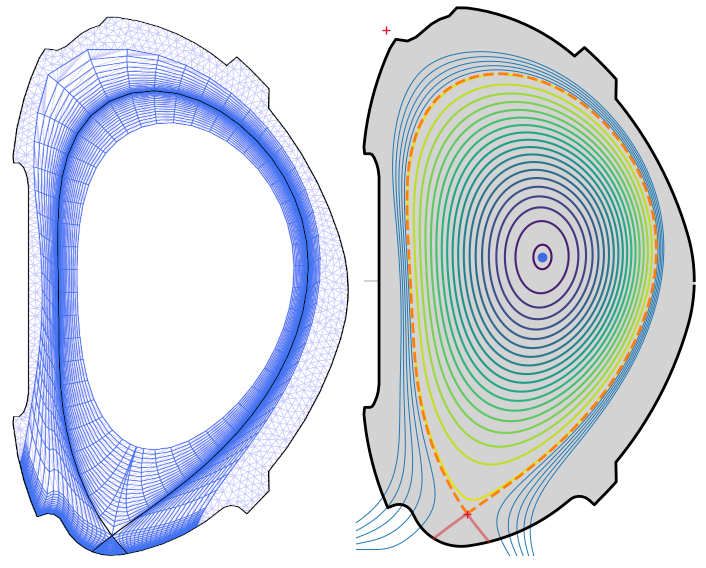
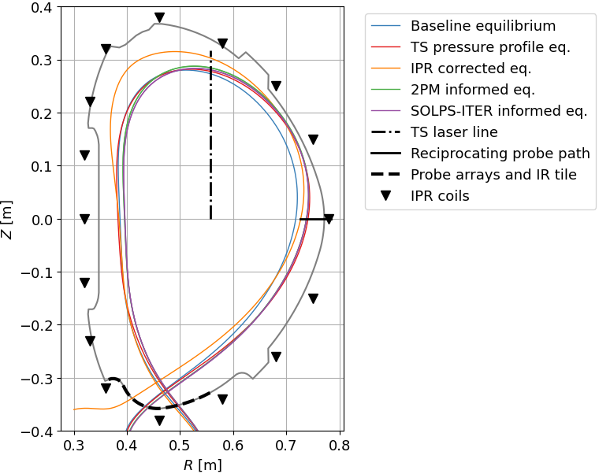

# Magnetic equilibrium reconstructions

/// warning | This feature blog entry introduces advanced concepts
The reader is assumed to know how to [create a simple SOLPS-ITER simulation](../my_first_simulation/Creating_a_new_SOLPS-ITER_simulation.md) and to possess some [user wisdom](../supplementary/SOLPS-ITER_user_wisdom.md).
///

Transport in the tokamak edge plasma happens on two different scales:

- Parallel transport (parallel to magnetic field lines) - fast, on the scale of metres, dominated by diffusion and kinetic effects
- Radial transport (normal both to the toroidal direction and to the magnetic field lines) - slow, on the scale of centimetres, dominated by turbulence

SOLPS-ITER takes advantage of this qualitative distinction and solves the two transports independently. Consequently, B2.5 has separate equations for radial and poloidal fluxes. (In SOLPS jargon, "poloidal" is a projection of parallel physics on the poloidal plane.) However, this computational trick comes with a cost: the grid which separates the radial and poloidal direction must be field-aligned. This is why SOLPS-ITER grids follow magnetic surfaces and why you need a magnetic equilibrium reconstruction to create a SOLPS simulation.



<p align="center"><i>B2.5 and EIRENE grids, aligned to the flux surfaces, and the underlying equilibrium reconstruction visualised with PLEQUE.</i></p>

If you've ever done interpretative modelling (simulations reproducing experimental data), you already know the catch. **Magnetic equilibrium reconstructions are inaccurate.** Their errors can be random or systematic, and they impact SOLPS-ITER modelling mainly because they introduce an uncertainty into the separatrix location. Separatrix density and temperature are two of the most important parameters of the edge plasma. If you don't know them, you can't make a simulation. If you have to guess them, you end up with a simulation that may be wrong. A common practice then is to make small corrections for the faulty equilibrium and try to compensate for its errors in the direction that seems reasonable. But everyone would prefer a good reconstruction in the first place, right?

This feature blog shows how you can explore equilibrium reconstructions. It compares several variants of COMPASS reconstructions and discusses which one is the best. Check out [Further reading](#further_reading) at the bottom if you want to learn more.

Many thanks to Lukáš Kripner (<span class="material-symbols-outlined">mail</span> [kripner@ipp.cas.cz](mailto:kripner@ipp.cas.cz)), who created the [PLEQUE](https://pleque.readthedocs.io/)<span class="material-symbols-outlined">open_in_new</span> Python package for EFIT equilibrium reconstruction manipulation and visualisation. Without it, this feature blog entry wouldn't exist.


## Working with magnetic equilibrium reconstructions

We will showcase the [PLEQUE](https://github.com/kripnerl/pleque/)<span class="material-symbols-outlined">open_in_new</span> Python package. Its installation is described in its [documentation](https://pleque.readthedocs.io/en/latest/first_steps.html)<span class="material-symbols-outlined">open_in_new</span>.

/// danger | IPP Prague
PLEQUE is available as a module on the Soroban server.
```bash
module load compass/2021 pleque/master
```
///

To give an example of PLEQUE's capabilities, we load and visualise an equilibrium reconstruction in the EQDSK format (read equidisk, standard output of the [EFIT++](https://iopscience.iop.org/article/10.1088/0029-5515/41/2/303)<span class="material-symbols-outlined">open_in_new</span> equilibrium reconstruction code) and access some equilibrium data.

```python
# Import the equilibrium-reading function from PLEQUE
from pleque.io.readers import read_geqdsk

# Load the equilibrium
eq = read_geqdsk('/path/to/equilibrium/eqdsk/file')

# Plot an overview of the equilibrium
eq.plot_overview()

# Plot the separatrix, LCFS (last closed flux surface) and the first wall
eq.separatrix.plot()
eq.lcfs.plot()
eq.first_wall.plot()

# Obtain the strike point and magnetic axis position
R_strike_points = eq.strike_points.R
Z_magnetic_axis = eq.magnetic_axis.Z

# Save the equilibrium in the EQDSK format with a higher resolution
# The .eqdsk is cosmetic, it's just a plain text file
eq.to_geqdsk('eq_high_resolution.eqdsk', nx=640, ny=1280)
```

More [examples](https://pleque.readthedocs.io/en/latest/examples.html)<span class="material-symbols-outlined">open_in_new</span> can be found in the PLEQUE documentation.

/// danger | IPP Prague
Equilibria from the COMPASS/COMPASS-U database can be loaded directly with PLEQUE.

```python
# Load a COMPASS equilibrium reconstruction
from pleque.io.compass import cdb
eq = cdb(17588, 1100, variant='EFIT_HRTS')  # shot, time in ms, reconstruction variant

# Load a COMPASS Upgrade equilibrium
from pleque.io.compass import cudb
eq = cudb(24300, 1.5, revision=20)  # scenario number, time in s, scenario version
```
///


## Choosing the best magnetic equilibrium reconstruction

/// danger | IPP Prague
This section is about magnetic reconstruction problems of the COMPASS tokamak. Reconstruction problems are, however, omnipresent, and their solutions are transferrable to other machines.
///

Significant effort has gone into improving tokamak equilibrium reconstructions across the globe. As a SOLPS user, you are probably not an expert on reconstructing magnetic equilibria, but you may find yourself frustrated by the reconstructions you receive and looking for a better solution. This section describes, in brief, the equilibrium reconstruction situation for the now dead COMPASS tokamak.

### Baseline equilibrium reconstruction

It was 2019, seven years since the first H-mode of the COMPASS tokamak, when Ondřej Kovanda put a finger on what we'd long suspected: that our equilibrium reconstructions weren't great. In  his [EPS 2019 proceedings](http://ocs.ciemat.es/EPS2019PAP/pdf/P4.1032.pdf)<span class="material-symbols-outlined">open_in_new</span>, he showed the principal constraints of our [EFIT++](https://iopscience.iop.org/article/10.1088/0029-5515/41/2/303)<span class="material-symbols-outlined">open_in_new</span> reconstructions, magnetic field measurements by Inner Partial Rogowski (IPR) coils, were erroneous. Several of the coils weren't where we thought they were; they were tilted by several degrees. This was enough to introduce about 1 cm of systematic error into our reconstructions, shifting the separatrix consistently inward from where it was supposed to be on the outer midplane (OMP).

There had been signs of this systematic error. The most telling were:

- The upper outboard limiter, which was in view of one of the COMPASS visible light cameras, would light up like a Christmas tree if the plasma was moved to the LFS, even though the reconstruction said there was still a 1.5 cm clearance between the limiter and the separatrix.
- In H-mode, the separatrix doesn't lie *on top of the pedestal*.

Other, subtler signs included:

- Some diagnosticians distrusted OMP separatrix position so heavily that they used the velocity shear layer as a reference point instead. (Velocity shear layer, VSL = edge plasma region where the poloidal velocity changes direction, tearing turbulent structures apart.)
- There were factor-of-two parallel $T_e$ gradients between the OMP separatrix and the outer strike point, even though the plasma was clearly attached, sheath-limited and with little radiation losses.
- SOLPS simulations of the COMPASS edge plasma could not match divertor measurements unless the separatrix was shifted outward.

Kateřina has studied the COMPASS OMP separatrix position extensively. Her main quantity of interest has been the relative distance between the EFIT separatrix and the VSL. In her [first article](https://iopscience.iop.org/article/10.1088/1748-0221/14/11/C11020)<span class="material-symbols-outlined">open_in_new</span>, she showed that this distance depended strongly on plasma shaping, especially on the lower triangularity (R<sup>2</sup> = 0.77). When the tilts of the IPR coils were accounted for and the reconstructions were rerun, this dependence was significantly reduced.

Having confirmed that baseline reconstructions of COMPASS tokamak equilibria could be better, we began looking for alternatives.


### Improved equilibrium reconstructions

There are many ingenious ways to improve equilibrium reconstructions, be it with [different Grad-Shafranov solvers](https://www.sciencedirect.com/science/article/pii/S0920379614005973)<span class="material-symbols-outlined">open_in_new</span> or [machine learning](https://iopscience.iop.org/article/10.1088/1741-4326/acbfcc/meta)<span class="material-symbols-outlined">open_in_new</span>. We settled for the minimum variant: providing better constraining input to EFIT reconstructions.

/// danger | IPP Prague
Instructions how to perform these improved reconstructions are given in the [EFIT interface](https://wiki.tok.ipp.cas.cz/index.php/EFIT_interface)<span class="material-symbols-outlined">open_in_new</span> tutorial on the COMPASS wiki. Available reconstruction variants for a given COMPASS shot can be viewed in the [WebCDB](https://webcdb.tok.ipp.cas.cz/data_signals/2800/17588)<span class="material-symbols-outlined">open_in_new</span>.
///

**Correct IPR coil positions**. As explained above, fixing the IPR coil positions in EFIT input reduces the systematic, geometry-dependent error in the OMP separatrix position.

**Use flux loop and divertor Mirnov coils**. COMPASS had additional magnetic measurements which were not used in the baseline reconstruction: flux loops and divertor Mirnov coils. Sadly, the flux loops didn't impact the reconstruction very much and the Mirnov coils were noisy. (Fun fact: The range of their analogue-digital converter had been set very wide for many years, to avoid very large signals during disruptions and damage to the electronics. As a result, normal operation signals were comparable to the difference between individual digital levels. Finding that these signals were useless and had always been useless was a great disappointment.)

**Realistic pressure profile**. EFIT normally assumes a parabolic profile of the total plasma pressure which falls to zero at the separatrix. This can be replaced by a multiple of the electron pressure measured by the Thomson scattering diagnostic at the plasma top, for example $p=2 p_e$.

**Constrain the separatrix with the two-point model**. This technique is favoured at ASDEX Upgrade. The two-point model relates the target and upstream $T_e$. If you measure the outer strike point $T_e$, calculate the parallel $T_e$ gradient from $P_{sep}$, field line length $L$ and the heat flux fall-off length $\lambda_q$, you can calculate the upstream separatrix $T_{e,sep}$. Find this $T_{e,sep}$ on the upstream profile of Thomson scattering measurements and voila, you have the upstream separatrix location. Feed this to EFIT as constraint and, hopefully, you have a better reconstruction overall.

**Constrain the separatrix with prior knowledge**. If you know where the separatrix is (an angel told you, or you made a SOLPS-ITER simulation and found only one value of $T_{sep}$ and $n_{sep}$ that makes sense), you can use its position as an additional EFIT constraint.

How do these reconstruction variants compare?


<p align="center"><i>Five reconstruction variants and relevant diagnostics, COMPASS discharge #17692, L-mode. [Švorc 2026, preprint]</i></p>

Happily,  any improvement upon the baseline equilibrium reconstruction (blue) pushes the separatrix outward on the outer midplane. The best road seems to be the realistic pressure profile, as it requires only the routinely made Thomson scattering diagnostic data. More magnetic measurements and better pressure profile have also been found helpful [previously](https://info.fusion.ciemat.es/OCS/EPS2021PAP/pdf/P3.1037.pdf)<span class="material-symbols-outlined">open_in_new</span>. So if you want to pester your local equilibrium reconstruction experts for better reconstructions, these two might be the most rewarding avenues to pursue.

/// hint | Further reading
<a name="further_reading"></a>

We believe that SOLPS-ITER can be used to pinpoint the separatrix position, which can be in turn fed to an equilibrium reconstruction code to improve the entire reconstruction. The following theses and papers revolve around this idea.

- Hromasová 2025 - [Interpretative SOLPS-ITER transport simulations of the COMPASS tokamak edge plasma](../files/Hromasova_PhD_thesis.pdf)<span class="material-symbols-outlined">download</span> (Kateřina's PhD thesis), Chapter 4, *Magnetic equilibrium reconstruction inaccuracy*

- Švorc 2024 - [Validation of tokamak equilibrium reconstructions using the SOLPS-ITER edge plasma transport code simulations](../files/Svorc_MSc_thesis.pdf)<span class="material-symbols-outlined">download</span> (Daniel's Master's thesis)

- Švorc 2025 - [Validation of tokamak equilibrium reconstructions using the SOLPS-ITER edge plasma transport code simulations](https://lac913.epfl.ch/epsppd3/2024/html/PDF/P2-084.pdf)<span class="material-symbols-outlined">open_in_new</span> (EPS 2025 proceedings)

- Švorc 2026 - [Separatrix position correction in SOLPS-ITER edge transport simulations of the tokamak COMPASS](../files/Svorc_2026_preprint.pdf)<span class="material-symbols-outlined">download</span> (preprint)
///


