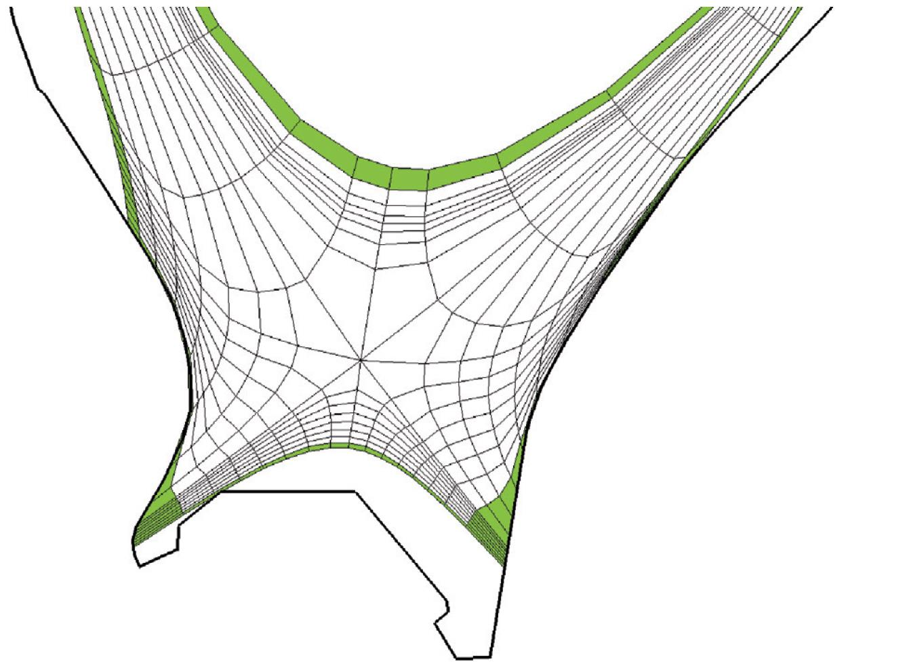
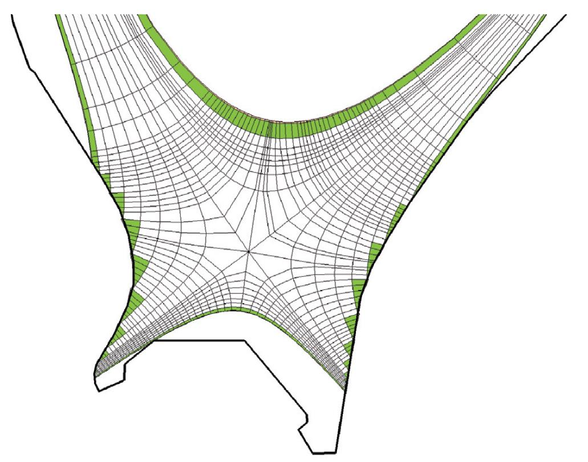
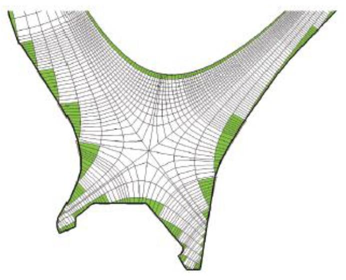

# Wide grids

/// warning | This feature blog entry introduces advanced concepts
The reader is assumed to know how to [create a simple SOLPS-ITER simulation](../my_first_simulation/Creating_a_new_SOLPS-ITER_simulation.md) and to possess some [user wisdom](../supplementary/SOLPS-ITER_user_wisdom.md).
///

/// hint | Emphatic reading recommendation
Before you start on this tutorial, read [[Dekeyser 2021]](https://www.sciencedirect.com/science/article/pii/S2352179121000788)<span class="material-symbols-outlined">open_in_new</span>.
///

## Motivation

Historically, the B2.5 fluid code has worked with so-called **structured** computational grids. Cells within a structured grid form a regular rectangular pattern with fixed number of cells (per region) in poloidal and radial directions. This allows for more human-friendly cell indexing and looping in the code, relying on rows and columns. Unfortunately, it also requires the radial boundary of the SOL plasma fluid (AKA the [North boundary](../my_first_simulation/Adjusting_SOLPS-ITER_input.md#boundary-conditions-101)) to follow a magnetic surface rather than the shape of the wall. This leaves gaps (often rather large) between the grid boundary and the wall and creates several problems:

- SOLPS-ITER assumes there is no plasma outside of the B2.5 grid. If you want to model plasma fluxes onto the divertor baffles, you may not be able to do so because you can't build a structured B2.5 grid which covers the baffles.
- In-vessel components (limiters, divertor entrance) can limit the structured grid to a very narrow radial extent. Ideally, the grid should be wide enough to contain a few density fall-off lengths [[Wiesen 2018]](https://www.sciencedirect.com/science/article/pii/S2352179118301248?via%3Dihub)<span class="material-symbols-outlined">open_in_new</span> ($\lambda_n$ being typically the longest of SOL widths). If the grid is so narrow it can't even contain a few $\lambda_q$, a significant amount of power is lost to the North (far SOL) boundary and the simulation loses physical meaning.
- The computational domain of fluid neutrals (with B2.5) and kinetic neutrals (with EIRENE) has significantly different extent. Consequently, when you switch to fluid neutrals to save run time, you'd better prepare that the solution will be significantly different from a fully coupled (B2.5+EIRENE) solution, even when neutral collisionality is high enough to apply fluid equations.

Fortunately, the new **3.2.0 SOLPS-ITER branch**, also known as the **Wide Grids (WG) branch**, has been developed by the KU Leuven SOLPS group. This version of the SOLPS-ITER code allows the use of **unstructured grids**, where the cells can be arbitrarily added/removed to/from any row or column. The cell rows are still aligned to magnetic surfaces, but they can end on the main wall instead of just a divertor target. In practice, the grid is cut out from a large structured grid spanning the whole vessel outline.



<center><i>Normal, structured B2.5 grid.</i> [[KU Leuven 2023]](https://iterorganization.sharepoint.com/:b:/r/sites/SOLPS-ITER/Shared%20Documents/General/SOLPS-ITER/SOLPS-ITER%20Extended%20Grids%20Workshops/20230815_carre2_presentation.pdf?csf=1&web=1&e=crfTNv)<span class="material-symbols-outlined">open_in_new</span></center>



<center><i>Unstructured (wide) B2.5 grid, <b>target mode</b>. The grid extent is unchanged, but target cells are no longer aligned to the target, improving orthogonality.</i> [[KU Leuven 2023]](https://iterorganization.sharepoint.com/:b:/r/sites/SOLPS-ITER/Shared%20Documents/General/SOLPS-ITER/SOLPS-ITER%20Extended%20Grids%20Workshops/20230815_carre2_presentation.pdf?csf=1&web=1&e=crfTNv)<span class="material-symbols-outlined">open_in_new</span></center>



<center><i>Unstructured (wide) B2.5 grid, <b>vessel mode</b>. The grid now extends up to the wall.</i> [[KU Leuven 2023]](https://iterorganization.sharepoint.com/:b:/r/sites/SOLPS-ITER/Shared%20Documents/General/SOLPS-ITER/SOLPS-ITER%20Extended%20Grids%20Workshops/20230815_carre2_presentation.pdf?csf=1&web=1&e=crfTNv)<span class="material-symbols-outlined">open_in_new</span></center>

Building an unstructured (wide) grid can be done in two modes: target mode and vessel mode.

**Target mode**: If extension of the grid to the vessel wall is not possible (e.g. bad equilibrium data) or not desired (e.g. adds too many cells, slows down computation), it is possible to create a smaller unstructured grid to only refine problematic divertor target geometry. The goal is to avoid strong cell deformation and improve orthogonality near the targets. Normal structured SOLPS-ITER/Carre will build a grid that gradually switches: at upstream, radial cell rows are aligned perpendicular to the poloidal rows, and at target, radial cell rows are aligned parallel to the target. The poloidal distance at which the alignment changes is controlled by the guard length parameter in DivGeo. If the divertor targets are strongly obligue to the magnetic field (as desired in a fusion reactor), the target alignment forces cells to be deformed. The unstructured grid in target mode doesn't require that radial cell rows are aligned to the target (see picture above) and should provide improved numerical stability and accuracy.

**Vessel mode**: This is what you think of when they say "wide grids" (see picture above). The B2.5 grid is extended up to the vessel wall. Typical applications include:

- Closed divertors and baffles (plasma around the baffles is typically not negligible)
- Complex divertor designs such as the Super-X divertor on MAST-U
- Strong radial plasma fluxes, large SOL widths


/// tip | More info
The Wide Grids version includes several other interesting additions from the KU Leuven group that are not discussed here, namely:

- K-model (K = turbulent energy) for self-consistent estimation of anomalous transport coefficients within the simulation, where the dominating turbulent transport is assumed to be the interchange instability
- Algorithmic differentiation (AD) optimization method for input parameters
- Hybrid neutrals model, i.e. applying kinetic neutrals only where needed
- Advanced fluid neutrals (AFN) model, i.e. more accurate standalone runs

You can read more about these features below, in the [Literature](#literature) section.
///


## Literature

**Scientific publications on Wide Grids SOLPS-ITER:**

- Klingshirn et al, [Advanced spatial discretizations in the B2.5 plasma fluid code](https://www.sciencedirect.com/science/article/pii/S0022311513001931)<span class="material-symbols-outlined">open_in_new</span>, Journal of Nuclear Materials 438 (2013)
- Dekeyser et al, [Implementation of a 9-point stencil in SOLPS-ITER and implications for Alcator C-Mod divertor plasma simulations](https://www.sciencedirect.com/science/article/pii/S2352179118302011)<span class="material-symbols-outlined">open_in_new</span>, Nuclear Materials and Energy (2019)
- Dekeyser et al, [Plasma edge simulations including realistic wall geometry with SOLPS-ITER](https://www.sciencedirect.com/science/article/pii/S2352179121000788)<span class="material-symbols-outlined">open_in_new</span>, Nuclear Materials and Energy 27 (2021)
    - This is **the** Wide Grids SOLPS-ITER article. You must read it. And cite it. (Don't forget to [cite EIRENE](https://eirene.de/cgi-bin/eirene/write_temp.cgi?temp_dat=Licence/licence)<span class="material-symbols-outlined">open_in_new</span>, too.)


**Scientific publications on other features of Wide Grids SOLPS-ITER:**

- K-model (K = turbulent energy) for improved anomalous transport models:
[[Carli 2020]](https://onlinelibrary.wiley.com/doi/abs/10.1002/ctpp.201900155)<span class="material-symbols-outlined">open_in_new</span>,
[[Coosemans 2020]](https://onlinelibrary.wiley.com/doi/abs/10.1002/ctpp.201900156)<span class="material-symbols-outlined">open_in_new</span>,
[[Coosemans 2021]](https://pubs.aip.org/aip/pop/article/28/1/012302/1032004)<span class="material-symbols-outlined">open_in_new</span>,
[[Dekeyser 2022]](https://onlinelibrary.wiley.com/doi/abs/10.1002/ctpp.202100190)<span class="material-symbols-outlined">open_in_new</span>

- Algorithmic differentiation (AD) optimization method for input parameters:
[[Baelmans 2017]](https://iopscience.iop.org/article/10.1088/1741-4326/57/3/036022/meta)<span class="material-symbols-outlined">open_in_new</span>,
[[Carli 2019]](https://www.sciencedirect.com/science/article/pii/S2352179118302321)<span class="material-symbols-outlined">open_in_new</span>,
[[Carli 2022]](https://onlinelibrary.wiley.com/doi/abs/10.1002/ctpp.202100184)<span class="material-symbols-outlined">open_in_new</span>,
[[Carli 2023]](https://www.sciencedirect.com/science/article/pii/S0021999123004989?pes=vor&getft_integrator=scopus)<span class="material-symbols-outlined">open_in_new</span>,
[[Horsten 2024]](https://onlinelibrary.wiley.com/doi/10.1002/ctpp.202300138)<span class="material-symbols-outlined">open_in_new</span>

- Hybrid fluid-kinetic neutral models:
[[Blommaert 2019]](https://www.sciencedirect.com/science/article/pii/S235217911830228X)<span class="material-symbols-outlined">open_in_new</span>,
[[Horsten 2021]](https://www.sciencedirect.com/science/article/pii/S2352179121000545)<span class="material-symbols-outlined">open_in_new</span>,
[[Horsten 2022 CPP]](https://onlinelibrary.wiley.com/doi/full/10.1002/ctpp.202100188)<span class="material-symbols-outlined">open_in_new</span>,
[[Horsten 2022 NME]](https://www.sciencedirect.com/science/article/pii/S2352179122001284?pes=vor&getft_integrator=scopus)<span class="material-symbols-outlined">open_in_new</span>,
[[Van Uytven 2022 CPP]](https://onlinelibrary.wiley.com/doi/abs/10.1002/ctpp.202100191?getft_integrator=scopus)<span class="material-symbols-outlined">open_in_new</span>,
[[Van Uytven 2024]](https://onlinelibrary.wiley.com/doi/10.1002/ctpp.202300125)<span class="material-symbols-outlined">open_in_new</span>

- Advanced Fluid Neutral (AFN) models:
[[Horsten 2017]](https://iopscience.iop.org/article/10.1088/1741-4326/aa8009/meta)<span class="material-symbols-outlined">open_in_new</span>,
[[Blommaert 2018]](https://onlinelibrary.wiley.com/doi/abs/10.1002/ctpp.201700175)<span class="material-symbols-outlined">open_in_new</span>,
[[Van Uytven 2020]](https://onlinelibrary.wiley.com/doi/abs/10.1002/ctpp.201900147)<span class="material-symbols-outlined">open_in_new</span>,
[[Van Uytven 2022 NF]](https://www.scopus.com/pages/publications/85132935783?origin=resultslist)<span class="material-symbols-outlined">open_in_new</span>,
[[Van Uytven 2022 NME]](https://www.sciencedirect.com/science/article/pii/S2352179122001363?via%3Dihub)<span class="material-symbols-outlined">open_in_new</span>

**Technical sources on using Wide Grids SOLPS-ITER:**

- [WG version of the SOLPS-ITER manual](https://iterorganization.sharepoint.com/:b:/r/sites/SOLPS-ITER/Shared%20Documents/General/SOLPS-ITER_User_Manual_for_WG.pdf?csf=1&web=1&e=s4BQML)<span class="material-symbols-outlined">open_in_new</span>, Chapter 11: *Unstructured / Wide Grids format of B2.5*
- [Advanced model options in extended grids version of SOLPS-ITER](https://iterorganization.sharepoint.com/:b:/r/sites/SOLPS-ITER/Shared%20Documents/General/SOLPS-ITER/Manuals%20and%20Documentation/Documentation_wg_code_models.pdf?csf=1&web=1&e=YxhzET)<span class="material-symbols-outlined">open_in_new</span>
- [Building extended grids cases with DivGeo-Carre2-Triang](https://iterorganization.sharepoint.com/:b:/r/sites/SOLPS-ITER/Shared%20Documents/General/SOLPS-ITER/SOLPS-ITER%20Extended%20Grids%20Workshops/Workflow_divgeo_carre2_uinp.pdf?csf=1&web=1&e=xq6zLD)<span class="material-symbols-outlined">open_in_new</span>
- W. Van Uytven 2024, [Advanced Fluid Neutral boundary conditions: theory and implementation in SOLPS-ITER](https://iterorganization.sharepoint.com/:b:/r/sites/SOLPS-ITER/Shared%20Documents/General/SOLPS-ITER/Manuals%20and%20Documentation/AFN_BCs_documentation.pdf?csf=1&web=1&e=wanGuh)<span class="material-symbols-outlined">open_in_new</span>
- [ITER Sharepoint materials](https://iterorganization.sharepoint.com/:f:/r/sites/SOLPS-ITER/Shared%20Documents/General/SOLPS-ITER/SOLPS-ITER%20Extended%20Grids%20Workshops?csf=1&web=1&e=gEgwIu)<span class="material-symbols-outlined">open_in_new</span> from Wide Grids Workshops, in particular:
    - [Extended grids in SOLPS-ITER: general code introduction](https://iterorganization.sharepoint.com/:b:/r/sites/SOLPS-ITER/Shared%20Documents/General/SOLPS-ITER/SOLPS-ITER%20Extended%20Grids%20Workshops/20230814_extended_grids_presentation.pdf?csf=1&web=1&e=QLrjOB)<span class="material-symbols-outlined">open_in_new</span>
    - [Extended grids in SOLPS-ITER: Carre2 workflow](https://iterorganization.sharepoint.com/:b:/r/sites/SOLPS-ITER/Shared%20Documents/General/SOLPS-ITER/SOLPS-ITER%20Extended%20Grids%20Workshops/20230815_carre2_presentation.pdf?csf=1&web=1&e=clltlt)<span class="material-symbols-outlined">open_in_new</span>
    - [Extended grids in SOLPS-ITER: workflow for case build-up](https://iterorganization.sharepoint.com/:b:/r/sites/SOLPS-ITER/Shared%20Documents/General/SOLPS-ITER/SOLPS-ITER%202024%20Prague%20Code%20Camp/Thursday%20-%20Wide%20Grids%20%26%20Core-edge%20coupling/20241031_wg_workflow_updates.pdf?csf=1&web=1&e=Ynhus1)<span class="material-symbols-outlined">open_in_new</span>
    - [GOAT: a Grid Optimization and Adaptation Toolbox for plasma edge simulations](https://iterorganization.sharepoint.com/:b:/r/sites/SOLPS-ITER/Shared%20Documents/General/SOLPS-ITER/SOLPS-ITER%20Extended%20Grids%20Workshops/20221104_GOAT_workshop.pdf?csf=1&web=1&e=07yIoO)<span class="material-symbols-outlined">open_in_new</span>
    - [Modelling TCV with the Wide Grids code](https://iterorganization.sharepoint.com/:b:/r/sites/SOLPS-ITER/Shared%20Documents/General/SOLPS-ITER/SOLPS-ITER%202024%20Prague%20Code%20Camp/Thursday%20-%20Wide%20Grids%20%26%20Core-edge%20coupling/ETonello_SOLPS-ITERCodeCamp_WideGridTCV.pdf?csf=1&web=1&e=VNP76b)<span class="material-symbols-outlined">open_in_new</span>
    - [Current status of ITER Wide Grids simulations](https://iterorganization.sharepoint.com/:b:/r/sites/SOLPS-ITER/Shared%20Documents/General/SOLPS-ITER/SOLPS-ITER%202024%20Prague%20Code%20Camp/Thursday%20-%20Wide%20Grids%20%26%20Core-edge%20coupling/Current%20status%20of%20ITER%20Wide%20Grids%20simulations.pdf?csf=1&web=1&e=YId1JP)<span class="material-symbols-outlined">open_in_new</span>


## Wide Grids branch of SOLPS-ITER

At the moment (June 2026), the wide grid version of the code `3.2.1` has been released as the `release/3.2.1-alpha` branch. Check it out and recompile the code as described in the [How to update SOLPS-ITER](../installing/solps-iter-codebase.md#how-to-update-solps-iter) instructions.

/// warning | Branch names may change
As development progresses, names of the active branch evolve. Check the current branches in the [SOLPS-ITER repository](https://github.com/iterorganization/SOLPS-ITER/)<span class="material-symbols-outlined">open_in_new</span>. Wide Grid versions of SOLPS are called 3.2.x, where 3.0.x are the structured versions with the 5-point stencil solver, and 3.1.x are the structured versions with the 9-point stencil solver.
///

Keep in mind that the wide grids code diverged quite a long time ago (approx. version `3.0.6`), so some of the more recent features are not yet present, although there is a continuous effort to converge all features together. Furthermore, the unstructured grid format makes most of the output files completely incompatible with any external postprocessing tools & libraries that work with the standard SOLPS-ITER versions. For Matlab users, there are updated Matlab tools readily available in the `solps-iter/scripts/MatlabPostProcessing` directory.


## How to create a Wide Grids SOLPS-ITER simulation

**Prerequisites:**

- You have [installed and compiled](../installing/solps-iter-codebase.md) an up-to-date Wide Grids version of SOLPS-ITER.
- Your [equilibrium data](../feature_blog/Magnetic_equilibrium_reconstructions.md) extends well beyond the vessel wall, e.g. 25%-50% of vessel dimension. The more the better; it can always be cropped back.
- You possess a [vessel outline](../my_first_simulation/Creating_a_new_SOLPS-ITER_simulation.md#get-the-ogr-and-equ-files) in the `.ogr` format.
- You have other data required for a SOLPS-ITER simulation, namely estimates of the SOL input power $P_{SOL}$, separatrix density $n_{e,sep}$, and anomalous diffusion coefficients $D_n$ and $\chi_{i,e}$.

The workflow is very similar to the original one:

1. [Set up the case](#step-1-divgeo) in DivGeo.
2. [Build the B2.5 grid](#step-2-carre2) with Carre2.
3. [Build the EIRENE grid](#step-3-triang) with Triang.
4. [Perform a test SOLPS-ITER run](#step-4-test-run) to check that the grid works technically.
5. [Guide the simulation to convergence](#step-5-convergence) to check that the grid works physically and to obtain a starting point for fine-tuning the simulation.

Rinse and repeat as necessary.


### Step 1: DivGeo

**Set the device name and open DivGeo.**
```bash
cd baserun
setenv DEVICE COMPASS-Upgrade
dg &
```

/// tip | Tip
You can learn more about DivGeo variables by clicking the `Help` button next to them.
///

**Create a lot of elements.** These include the vessel outline, virtual targets, helper triangles and the inner and outer midplane. In the vessel mode, a big mesh reminiscent of the old structured mesh is built by creating virtual targets positioned outside the vessel wall, far enough to ensure that the big mesh covers the whole vessel. Then, the real mesh is cut out of the big mesh by the vessel outline (the cut-cell approach). It's like making gingerbread!

1. Import wall outline in the `.ogr` format as a template. Convert it to elements (`Commands > Convert > Template to elements`). Reduce its complexity by `Commands > Simplify > Merge/Split elements`. Make sure the normals of the vessel outline point outward (away from the plasma).

2. Import the equilibrium file in the `.equ` format. Its size must exceed the vessel dimensions by 25-50 %; if it's too small, you'll know later. Increase its spatial resolution if needed with `d2d`. Import the relevant topology. Even if the plasma is single null (SN), you may need to choose the disconnected double null (DDN) topology so the inactive secondary X-point is recognised.

3. Create virtual targets outside of the vessel, four for the case of DDN topology. They need to be big enough to support the full extent of SOL, everywhere in the vessel.
    - Make them out of ~10 elements; this will give you freedom to adjust the shaping later down the line without adding new elements (and losing their definitions from `Structure`, `fcLbl` etc.).
    - There must be at least 2 elements where field lines land (labelled later using `Structure > Inner/outer target` and `Extra targets for DN`).
    - The target surface should be locally perpendicular to flux surfaces. Check the local flux surface shape by assigning `Add flux surface` to one of your mouse buttons, clicking and dragging.
    - Align the normals so they point into the virtual targets.

4. Create helper triangles between each target to control the grid extent. Four targets = four helper triangles. Their normals should also point inward.

5. Create two elements to denote the inner and outer midplane. Use `Edit > Create > Points` to align them exactly to $Z=0$ and then assign mouse button to `Connect points`. Their normals don't matter.

    - In the structured SOLPS version, inner and outer midplane used to be defined using the `b2mwti_jxi` and `b2mwti_jxa` switches in `b2mn.dat`, respectively. Now, they are defined by two user-specified virtual elements, which intersect the cells along the full radial width of the grid.

6. Renumber the elements so you have an easier time finding them while debugging later (`Commands > Renumber elements`).

/// tip | Tip for building the vessel outline
Don't be afraid to significantly simplify the vessel outline. Yes, changing the divertor geometry for ease of modelling can significantly affect the results [[Tamain 2021]](https://www.sciencedirect.com/science/article/pii/S2352179121000703?)<span class="material-symbols-outlined">open_in_new</span>, but right now you're trying to get a first simulation that works. `Commands > Simplify > Merge/Split elements`, then move the points by hand. Having fewer wall elements additionally helps with marking `Structure` and face labels, because you won't miss the elements as easily.

**Additional tip:** Make sure you have at least one element in the PFR between the targets. This will come in handy when specifying face labels `fcLbl` later.
///


**Assign elements to `Structure`**. `Shift + Mark` to select all elements in continuous a line, so you don't miss small elements where the wall outline is curved.

1. Assign the virtual targets and helper triangles to `Structure > Structure`. These are the elements that limit the Carre2 grid before it's cut with the outline of the vacuum vessel. Compared to structured SOLPS, the `Structure.Structure` variable still holds a set of closed polygons that limit the B2.5 mesh. However, in case of target mode or vessel mode, it actually only includes the virtual targets and helper triangles and none of the real structure.


2. Assign the plasma-facing surface of the inner lower target to `Structure > Inner target`.
    - The marked elements must be continuous, they must form an "open polygon", and there must be at least two of them. This applies to all targets.

3. In the same way, assign the outer lower target to `Structure > Outer target`.

4. If you have four targets (DDN topology), `Variables > Add > Extra targets for DN`. In the same way, assign inner upper target to `IU target` and outer upper target to `OU target`.

5. Assign the vacuum vessel (`Shift + Mark`) to `Structure > Vessel`. This is what will cut out the final mesh out of the original extra-wide mesh, both in target and vessel mode.

/// warning | Beware!
Every time you change the number of elements (e.g. split one element in two), you lose earlier assignment to `Structure`. Take preventive steps to avoid it. `Ctrl+U` (unmark all) is your friend.
///

**Set elements not for EIRENE**. `Variables > Add > Elements not for Eirene`. These include virtual targets, helper triangles and inner/outer midplane.

**Assign face labels.** These are the `fcLbl` parameters in `Variables > Carre2 setup`. Face labels are positive integers of values between 1 and X (= number of distinct face labels) that are used to group future B2 mesh faces with same BCs and material properties. Value 0 is the default and it means that the `fcLbl` is unset. There is some freedom in how you number your elements, but keep in mind the following rules:

- Each value between 1 and X must be used at least once, you cannot skip numbers.
- Every element in the vessel outline must have a non-zero `fcLbl`.
- By convention, targets are numbered 1-2 (SN), 1-4 (DN) clockwise, i.e. in the direction of the x-coordinate. Post-processing tools like `b2plot` might rely on this convention. See below for a complete example.
- All elements grouped under one non-zero `fcLbl` value must form a continuous line. Thus the wall sections between targets typically need to be grouped separately.

/// hint | What face labels are for
The purpose of face labels is to categorize vessel boundary conditions and EIRENE strata so that the `b2.boundary.parameters` and `b2.neutrals.parameters` stencil files can be properly generated. EIRENE uses face labels to identify vessel surfaces with different properties (material, temperature, puffing/pumping surface, recycling coefficient, area of special interest for plotting etc.). This is why each element of the vessel outline must have `fcLbl` set. Those values are then transferred accordingly onto the created B2 mesh faces. The `fcLbl` parameter links individual boundaries to `Target specifications` (targets) or `Vessel specifications` (first wall) in DivGeo, and it is later used in the boundary files to identify the individual boundaries.
///

Recommended `fcLbl` setting:

1. Inner lower target including the baffle (when you're plotting divertor heat loads, you'll probably be interested in plotting the baffle along with the target)
2. Outer lower target including the baffle
3. Outer upper target (even when the X-point is inactive and there is technically no divertor, just limiter tiles)
4. Outer inner target
5. Space between IL and OL target (bottom)
6. Space between OL and OU target (right)
7. Space between OU and IU target (top)
8. Space between IU and IL target (left)

The remaining elements (virtual targets, helper triangles, inner and outer midplane, virtual gas puff elements if you eventually add some) should have the `fcLbl` unset, i.e. using the default value 0.

/// hint | Tip
When you're done setting face labels, in the `Carre2 setup` dialogue box, right-click on the number box of `fcLbl`, hold and select `Display values`. Go around the vacuum vessel outline and check all the face labels. Once you change a `fcLbl`, select `Display values` again to refresh the values.
///

**Create the basis of the grid.**

1. Create flux surfaces with `Edit > Create > Surface(s)`. Add the innermost flux surface in the confined region by assigning `Add surface` to your mouse button. Space the flux surfaces evenly, so neighbouring cells have approximately the same size. Number of flux surfaces is arbitrary for each group (core, PFR...), unlike in the structured SOLPS version.
2. Create poloidal grid points with `Edit > Create > Grid point(s)`. Choose the number of points as a compromise between square cells and not too many cells.


/// hint | Tip
If the flux surfaces on the edge do not behave nicely, try cropping the equilibrium data in different ways.
///


**Configure Carre2.** In `Variables > Carre2 setup`, you specify general configuration for Carre2 that ends up in `carre.dat` (see help text in DivGeo). Set `carreMode` to 3 and `gridExtensionMode` to 2.

**Fill out target specifications.** If you have more targets than the default two, `Variables > Add > Target specifications`. The X in `Target specifications #X` is equal to the face label value recommended above.

1. Choose `SOL edge` and `PFR edge` as the first and last element of the target with the corresponding `fcLbl`. This is currently not critical, as these elements are not used in the vessel mode. However, they have to be set so the `Commands > Check variables` doesn't fail.
2. Set target material. Even if it isn't sputtered, the material affects neutral particle reflections.
3. Set absorption = 1 - recycling coefficient. Targets at the active X-point are assumed to be saturated with particles quickly, so absorption is zero.
4. Set target temperature in eV. Conversion: $T$ [eV] = ($T$ [°C] + 273)/11600.
5. Set the `CARRE guard length` (sometimes referred to as `tgarde`) to 0.
5. Set the appropriate `fcLbl`, equal to the `Target specification` number.

**Fill out vessel specifications** for each `fcLbl` which isn't a target. `Variables > Add > Vessel specifications` four times to get four wall segments between four targets. Fill the values in the same as `Target specifications`. Just set the absorption coefficient to non-zero, for example 0.01 for recycling coefficient $R=0.99$.


**Finishing touches:**

0. Assign the elements of the outer midplane (`OMP`) and inner midplane (`IMP`) to `Variables > Add > Midplane definition`.
1. Assign the entire vessel outline to `Variables > Add > Shadowing structure`.
2. Add some core radiation sources with mouse button `Add source` and fill in the power radiated in the core in `Variables > Add > Radiation sources`.
3. Don't touch `TRIA-EIRENE parameters`. In the vessel mode, there are no void regions where there are EIRENE neutrals but not B2.5 plasma.
4. To use the toroial approximation in EIRENE, set `Variables > Global EIRENE data > Major radius` to -1.
5. Assign the entire vessel outline to `Variables > Input for b2plot`.
6. `Commands > Check variables`. `File > Save`. `File > Output`.

/// tip | Double-checking recommended
Before you export DivGeo files for Carre2 grid construction, double-check all DivGeo variables. I know you've just gone through everything. Double-check it anyway. I always find mistakes in my DivGeo file. Invariably.
///

**Export DivGeo files.**

```bash
# Link the DivGeo output to the "standard place"
lns compass-upgrade_24300  # without the .dg extension!
```


### Step 2: Carre2

The Carre code, which builds the B2.5 grid, has been renamed to Carre2.

```bash
carre2 -
```

Press `Enter` to proceed through the steps. In the best case scenario, no error messages will be printed.

**If Carre2 fails:** The error messages are often informative.

    Warning: possibly inconsistent fcLbl definition in DG model
    Element           77  has fcLbl 0.
    Element           81  has fcLbl 0.
    Element           80  has fcLbl 0.
    Carre input was not produced. Check the DG model

/// hint | Tip
If the Carre2 command `g` reports "orthogonality not reached", try increasing the guard length in DivGeo `Target specifications`.
///

Go back to DivGeo and fix the problem. Then:

1. `Commands > Check variable values`
2. `Commands > Rebuild Carre objects`
3. `File > Save`
4. `File > Output`
5. `carre2 -`

Import the mesh into DivGeo with `Import > Mesh` to check it.


### Step 3: Triang

```bash
# Reminder to do this if you've run triang previously
rm -rf b2*
rm fort.*

triang
```

Press `Enter` to carry out the first step `Uinp (u)`. Then **halt** the process by pressing `q + Enter`. Open the `b2ag.dat` file, which has just been created, and paste the following lines inside:

```
'b2us_prep_Qalfmin'    '1e-8'
'b2us_prep_Qalfmax'    '5e-3'
'b2us_prep_mod_hc'     '1'
'b2us_prep_set_beta_0' '1'
```

These are several of the switches recommended in Nikita Shtyrkhunov's [SOLPS Code Camp 2025 presentation](https://indico.iter.org/event/621/contributions/3873/attachments/2447/4709/Experience%20with%20Wide%20Grids%20code%20and%20new%20features.pdf)<span class="material-symbols-outlined">open_in_new</span>. `Qalf` are parameters related to the angle of magnetic field lines impinging on the vessel outline where the boundary condition is no longer considered poloidal but radial.

**TODO** <span class="material-symbols-outlined">construction</span>: The link to Nikita's presentation currently points to the Code Camp Indico site, which is not generally accessible. (Try punching in the password `SOLPS-2025`.) When the presentations are uploaded to the ITER Sharepoint, update the link.

Relaunch `triang` and continue from the next, `b2ag (b)` step.

```
triang
# press b + Enter to skip the Uinp step
# otherwise your b2ag.dat will be overwritten
```

Continue pressing `Enter` to proceed through the steps. In the best case scenario, no error messages will be printed.

**If Triang fails:** Oh no. Where Carre is Neutral Good, Triang is Chaotic Evil. Tips:

- Get an idea for where the problem is happening. If you've found usable real-space coordinates, go to DivGeo and `Edit > Create > Point` with these coordinates in milimetres. If you've only found cell indices (e.g. `150 33`), you can find their real-space coordinates in the latest `.geo` text file. (If you're running SOLPS from a Docker container, the `.geo` files in your `baserun` are only symlinks. You will find the originals in `~/.solps_container/Carre2/meshes/COMPASS-Upgrade`.) If you've only found cell face labels, Daniel (<span class="material-symbols-outlined">mail</span> [svorc@ipp.cas.cz](mailto:svorc@ipp.cas.cz)) knows what to do.
- The most common problem is connectivity, i.e. finding which cell has which neighbour. Possible culprits of bad connectivity are:

    - Vessel pieces protruding into the plasma, such as small baffles. Look for places where the Carre2 grid intersects the vessel wall and judge how well the cut cells follow the wall. To fix it, try simplifying the vessel outline or mess around with flux surface spacing and grid point placement. If you change elements, don't forget to reassign variables such as `Structure`, `Input for b2plot` or face labels, and to rerun `carre2 -`.
    - If your error output contains dozens of bad cells, try installing SOLPS-ITER version `aaa82b00fcd` and run Carre2 and Triang there.

- If `triang` fails at the `b2us` step and you're planning to run without EIRENE (B2.5 standalone run), you don't need to complete the rest of `triang`. End `triang` with `q + Enter` and proceed as if no error messages had been printed.

**Before you run `triang` again**, delete all files beginning with `b2` and `fort.`.

```bash
rm -rf b2*
rm fort.*
triang
```


/// tip | Hot tip
You can use foreign curses to relieve frustration.

Finnish: "Perkele!" (Evil spirit!)

Hungarian: "Bassz meg!" (Fuck me!)

Czech: "Do prdele!" (In the ass!)
///


### Step 4: Test run

In the case directory, correct baserun timestamps.

```bash
cd ..
correct_baserun_timestamps
```

In the run directory, setup baserun EIRENE links and copy over boundary condition files.

```bash
cd run
setup_baserun_eirene_links
cp ../baserun/b2.boundary.parameters.stencil b2.boundary.parameters
cp ../baserun/b2.neutrals.parameters.stencil b2.neutrals.parameters
cp ../baserun/b2mn.dat.stencil b2mn.dat
cp ../baserun/input.dat input.dat
```

You don't need to punch in realistic input power and density yet; we're just checking if it works. If something went wrong during case build-up, you're going to be overwriting boundary condition files with the new stencils anyway.

In `b2mn.dat`, set the number of iterations to 1.

```
'b2mndr_ntim'       '1'
```

Finally, try to run SOLPS.

```bash
b2run b2mn >& run.log &
```

If everything works (no error messages at the end of `run.log`, `b2fstate` of several MB is produced...), good job! You're good to proceed to the first converged state.

Possible errors:

- **Errors during reading boundary conditions.** Usually `run.log` complains about face labels. If the naughty face label is small and positive, check your `fcLbl` setting in DivGeo. If it's negative, it concerns boundary elements numbered automatically by `b2us`. They usually span the core interface. You may want to check, for example, that the grid covers the entire vessel.
- **SOLPS runs but diverges/crashes.** In `run.log`, some tallies are printed and finally an error message (supra-luminal velocities, faulty residuals etc.). `b2fstate` is present but incomplete. Continue to the next section.


### Step 5: Convergence

Congratulations, you have a working grid! Unfortunately, that doesn't mean you have a working simulation. Experience shows that getting a first converged solution is a matter of massaging the simulation with bribes and tricks. Try whatever works from the list below.

While coaxing SOLPS to converge, refer also to Common pitfalls: [Divergence](../supplementary/Common_pitfalls.md#divergence).

/// tip | The tip you did not want to hear
After nearly two years of using Wide Grids SOLPS-ITER to model the COMPASS Upgrade tokamak, Daniel Švorc has this to say (paraphrased).

*"I have no idea what's happening in the simulations that diverge. I have no idea how to fix it. I just build a different grid, ten different grids, using a very specific commit of WG SOLPS-ITER, and hope one of them works."*
///

**General tips against divergence**:

- If you were planning to make a coupled (B2.5+EIRENE) run, temporarily switch to standalone B2.5. This will rid you of Monte Carlo noise and speed up convergence/divergence considerably. Ultimately, you can use the end state as a starting point for a coupled run.
- Don't start from the flat profiles solution. Interpolate initial state from another case (even a non-extended case). Matlab tools available to interpolate from one `b2fgmtry` to another:

    ```
    stati = interpolate_b2fstati(gmtry0,stati0,gmtry);
    # (unstructured format; same machine assumed)
    ```

- Standalone B2.5: try initially solving only the neutral atom continuity equation according to section *Tips to resolve convergence issues* of [Hands-on session AFN for AUG case](https://iterorganization.sharepoint.com/:b:/r/sites/SOLPS-ITER/Shared%20Documents/General/SOLPS-ITER/SOLPS-ITER%20Extended%20Grids%20Workshops/AFN%20handson%20session.pdf?csf=1&web=1&e=q0Sf1Y)<span class="material-symbols-outlined">open_in_new</span>.
- A common divergence cause is that some fluid species (usually one with locally low density, such as impurities or in the far SOL) gets accelerated to high velocity and subsequently produces major viscous heating due to friction. This can drive high ion temperatures in the SOL or blow up the calculation straight away (supra-luminal velocities, faulty aresco). Remedies include:
    - Increasing initial ion density in the flat profiles solution (`naini` in `b2ai.dat`)
    - Increasing minimum allowed ion density (`b2mndr_na_min` in `b2mn.dat`)
    - Limiting maximum allowed velocities (`b2npmo_ion_vlct_restrict` and `b2npmo_ion_vlct_restrict_M` in `b2mn.dat`)
    - Decreasing or turning off viscous heating (`b2sihs_phm0`-`b2sihs_phm8` in `b2mn.dat`)

**Switches in `b2mn.dat` relevant to divergence** (find their meaning in our [B2.5 switch documentation](https://solps.pages.tok.ipp.cas.cz/solps-doc/extras/b2input/)):

- Decrease time step.

    ```
    'b2mndr_dtim'       '1.0E-08'
    ```

- Turn on under-relaxation.

    ```
    'b2npco_rxg'    '0.1'
    'b2npmo_rxg'    '0.1'
    'b2npht_rxg'    '0.1'
    ```

- Turn off solving the potential equation.

    ```
    'b2news_poteq'               '0'
    'b2tfhe_no_current'          '1'
    'b2sigp_style'               '1'
    ```

- Restrict allowed ranges of plasma parameters.

    ```
    # Allow fluid atom and ion density from 1e12 to 1e21 m-3
    'b2mndr_na_min'                 '1.0e12'
    'b2mndr_na_max'                 '1.0e21'

    # Allow ion, fluid atom and electron temperature from 0.5 to 500 eV
    'b2upht_ti_min'                 '0.5'
    'b2upht_ti_max'                 '500'
    'b2upht_tn_min'                 '0.5'
    'b2upht_tn_max'                 '500'
    'b2upht_te_min'                 '0.5'
    'b2upht_te_max'                 '500'

    # Allow plasma parallel velocities only up to 2x the global sound speed
    'b2npmo_ion_vlct_restrict'      '1'
    'b2npmo_ion_vlct_restrict_M'    '2.0'
    ```

- Turn off viscous heating.

    ```
    'b2sihs_phm2'    '0.0'
    'b2sihs_phm8'    '0.0'
    ```

**Example `b2mn.dat`** (COMPASS Upgrade H-mode, standalone B2.5 with Advanced Fluid Neutrals):

```
*label          (lblmn, character*60; free format)
'COMPASS Upgrade, pure D, standalone, no currents'
*b2cmpa         basic parameters
*b2cmpb         boundary conditions
*b2cmpt         transport coefficients
*endphy

************** SIMULATION CONTROL ***************

# How long the simulation should run
'b2mndr_elapsed'     '3600'
'b2mndr_ntim'        '200000'
'b2mndr_dtim'        '5.00E-05'

# Input files
'b2stbc_boundary_namelist'     '1'
'b2stbr_neutrals_namelist'     '1'
'b2tqna_transport_namelist'    '1'
'b2tqna_inputfile'             '1'
'b2srdt_numerics_namelist'     '1'

# Output files
'b2mndr_b2time'        '1'
'tallies_netcdf'       '1'
'b2mndr_tally'         '50'
'b2mndr_b2time'        '50'
'b2stbr_b2wall_netcdf' '1'
'b2mndr_stim'          '-1'

# Turn on the advanced fluid neutral (AFN) model
'b2mn_afn'                       '1'
'b2stbr_recycle_afn'             '1'
'b2tqna_transport_afn'           '1'
'b2tlv0_style'                   '1'
'b2tlv0_alpha'                   '1.0'
'b2trno_flux_limit_to_vsa'       '1'
'b2tlv0_gamma'                   '2.0'
'b2tlh0_style'                   '1'
'b2tlh0_alpha'                   '1.0'
'b2tlh0_gamma'                   '2.0'
'b2tlc0_style'                   '1'
'b2tlc0_alpha'                   '1.0'
'b2trno_flux_limit_to_dpa'       '1'
'b2tlc0_gamma'                   '2.0'

# Recommended switches for vessel mode WG SOLPS
'b2sigp_style'                  '1'
'b2tral_mode'                   '2'
'b2sihs_style_visc'             '1'


************** CONVERGENCE SWITCHES ***************

# Allow maximum temperature 1800 eV
'b2upht_ti_max' '1800'
'b2upht_tn_max' '1800'
'b2upht_te_max' '1800'

# Allow maximum velocities of 3*sound speed
'b2npmo_ion_vlct_restrict'   '1'
'b2npmo_ion_vlct_restrict_M' '3.0'

# Turn off all electric currents in the simulation
'b2tfhe_no_current'          '1'

# Use SPb new form of calculating heat and particle fluxes
'b2tfhe_mdf'         '1'
'b2tfhi_mdf'         '1'
'b2tfnb_mdf'         '1'

# Limit ion heat fluxes based on number of collisions in the flux tube
'b2trcl_min_collisions'        '1.0'

# Increase parallel transport coefficients in shaved cells at the grid edge
'b2txcx_increase_transp_coefs' '10000.0'

# Allow maximum potential 50*T_e
'b2nppo_restr_po'               '50'

# Allow minimum electron temperature 0.001*T_i
'b2upht_rte_min'                '0.001'
```

As the simulations passes its birth pains and starts converging, gradually relax these switches.


### Alternative grid modes

The tutorial above is relevant to the vessel mode (extending the B2.5 mesh to cover the entire vessel). You can also use the Wide Grids SOLPS to build a structured grid (the old way) or in the target mode (unstructured grid which doesn't span the entire vessel). Usually you would build the latter grids to investigate the impact of improved grid orthogonality in the target mode, or because you can't extend the B2.5 grid up to the wall for some reason.

**Structured grid:**
To build a structured grid just like in the old version, use the default configuration of `Variables > Carre2 setup`:

- `carreMode=0`
- `gridExtensionMode=0`
- `equExtensionMode=0`

Make sure to still properly specify `Midplane definition` and assign `fcLbl` indexes to all structure elements. Other than that, follow the standard steps from the old DivGeo tutorial.

**Target mode:** Target mode is not described here at this moment. Refer to [Building extended grids cases with DivGeo-Carre2-Triang](https://iterorganization.sharepoint.com/:b:/r/sites/SOLPS-ITER/Shared%20Documents/General/SOLPS-ITER/SOLPS-ITER%20Extended%20Grids%20Workshops/Workflow_divgeo_carre2_uinp.pdf?csf=1&web=1&e=Tf5aVX)<span class="material-symbols-outlined">open_in_new</span>. In general, the approach is similar to the vessel mode. Configuration of `Variables > Carre2 setup`:

- `carreMode=3` (or `carreMode=2`, but that yields worse results))
- `gridExtensionMode=1` (target mode)
- `equExtensionMode=0`

/// note | Note about `equExtensionMode`
The `equExtensionMode` parameter is used to adjust and extrapolate equilibrium data to enable the grid extension in problematic cases. It can help when the equilibrium data are not available at a large-enough distance past the vessel wall or when the poloidal coils are too close to the vessel wall and strongly deform the magnetic field. As the DivGeo help text suggests, this feature is for *"expert use only"* and it is not discussed here.
///

