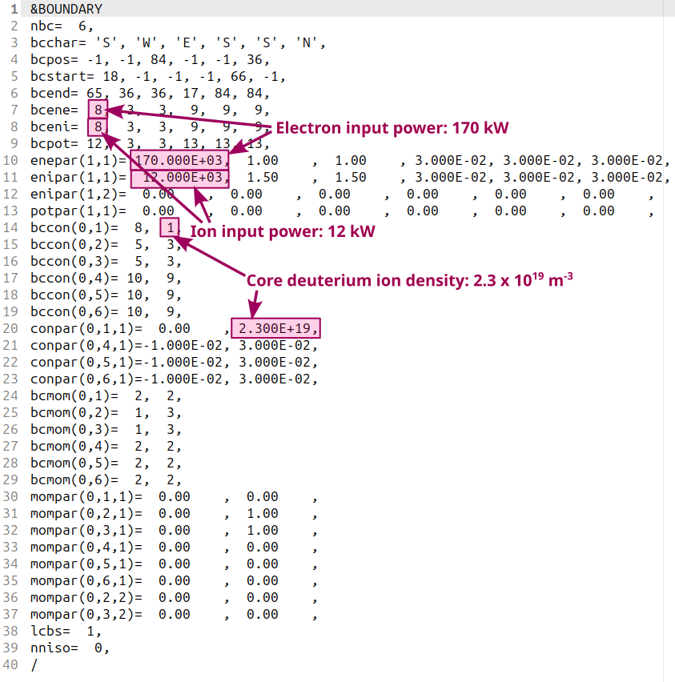
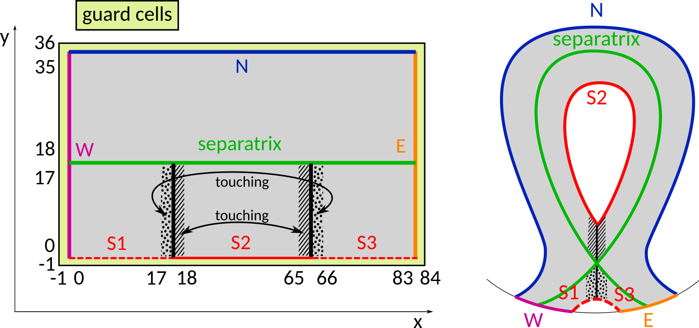

# Adjusting SOLPS-ITER input

You have [created a SOLPS simulation](Creating_a_new_SOLPS-ITER_simulation.md), [run it until it converged](Running_SOLPS-ITER.md) and learned [accessing and plotting its results](Processing_SOLPS-ITER_output.md). Now it's time to coax it into **giving you the results you want**. In interpretative modelling, you have experimental diagnostic measurements you wish to match. In predictive modelling, you have scalings, core code predictions and similar plasmas in other tokamaks. To match the desired results as closely as possible, you need to adjust your SOLPS-ITER simulation by tweaking its input parameters, run it until converged again, tweak its inputs, run, rinse and repeat.

This tutorial covers:

- [What are SOLPS-ITER inputs?](#what-are-solps-iter-inputs)
- [Boundary conditions 101](#boundary-conditions-101)
- [Four principle SOLPS-ITER inputs](#four-principle-solps-iter-inputs)
- [Other input parameters of note](#other-input-parameters-of-note): heat flux limiters, divertor target grounding, and sheath heat transmission coefficients
- [Expected fidelity](#expected-fidelity)

Once you have mastered these, you can move on to features described in the Feature blog:

- Overfitting [diffusion coefficients](../feature_blog/Diffusion_coefficients.md)
- Implementing [drifts](../feature_blog/Drifts.md)
- Playing with [gas puffing and pumping](../feature_blog/Gas_puffing_and_pumping.md)
- Adding [impurities](../feature_blog/Impurities.md)
- Switching to [wide grids](../feature_blog/Wide_grids.md)

/// tip | Input parameter overview
To look up information on boundary conditions and SOLPS-ITER input parameters, use our [B2.5 switch database](/extras/b2input/). It has colours and a search function.
///


## What are SOLPS-ITER inputs?

In general, a SOLPS-ITER "input" is any information you feed to SOLPS-ITER. The magnetic equilibrium is one such input, or the wall outline, or the fact that recycled plasma particles recycle as deuterium molecules D<sub>2</sub>. Within this tutorial, however, SOLPS inputs are **numbers you change in the text input files** as you run a SOLPS-ITER simulation. Eventually, you'll become familiar a lot of input files, but for now you only need to worry about three: `b2.boundary.parameters`, `b2.transport.parameters` and `b2mn.dat`.

The simplest way to change a SOLPS input is to open the corresponding text file, find the position where the parameter is given and change the parameter value.



*Example boundary condition file `b2.boundary.parameters` with marked locations of boundary condition type (BCCON, BCENE, BCENI) and value (CONPAR, ENEPAR, ENIPAR).*

There have been efforts to automatise this through a more user-friendly interface, such as the [SOLPS-inputs](https://repo.tok.ipp.cas.cz/solps/solps-inputs)<span class="material-symbols-outlined">open_in_new</span> Python package written by Jan Hečko. A great progress has been made in converting the EIRENE master input file `input.dat` into the JSON format `eirene.input.json`, where a superfluous white space (such as one newline too many at the end of the file) will no longer crash your SOLPS. To start with, however, it is useful to learn working with the text files, even if they seem completely incomprehensible at first.

Most SOLPS inputs fall into two categories:

1. **Switches**, found in `b2mn.dat` for B2.5 (and `input.dat` for EIRENE). They typically control behaviour of the code, such as "don't solve the potential equation" or "multiply the anomalous conductivity by a bajillion". If the simulation behaves, you will typically adjust them only to set the simulation runtime.

2. **Boundary conditions and transport parameters**, found in `b2.boundary.parameters` and `b2.transport.parameters`, respectively. These control the plasma parameters: plasma density, how much power enters the SOL, how the sheath works etc. While adjusting a simulation to get the result you want, you will spend most of your time editing these.


## Boundary conditions 101

> "I've opened `b2.boundary.parameters`. It's just numbers and letters. How do I work with this?"

B2.5, the plasma solver of SOLPS-ITER, is a [finite volume](https://en.wikipedia.org/wiki/Finite_volume_method)<span class="material-symbols-outlined">open_in_new</span> solver of the [Braginskii equations](https://ui.adsabs.harvard.edu/abs/1965RvPP....1..205B/abstract)<span class="material-symbols-outlined">open_in_new</span>. The Braginskii equations inform it about what's going on in the middle of its computational region, but it needs to be told what happens at its **boundaries**. For example, the Braginskii equations have no idea what's happening inside the electric sheath enveloping the divertor targets. Consequently, B2.5 has to be told that the sheath accelerates ions up to the sound speed (boundary condition for the momentum equation), eats up plasma energy via the sheath heat transmission coefficient (boundary condition for the electron and ion energy equations) and absorbs every plasma particle to release it as a recycled neutral (boundary condition for the continuity equation). Boundaries envelop the B2.5 computational domain from all sides, and in the structured SOLPS-ITER version (which this tutorial works with, as opposed to the [Wide Grids SOLPS](../feature_blog/Wide_grids.md)), the boundaries all have colloquial names: North, South, West and East.



<center><i>Scheme of B2.5 computational grid with its named boundaries: South, North, East, West. Cell numbers correspond to the <a href="../../files/DivGeo_tutorial.pdf">DivGeo tutorial</a><span class="material-symbols-outlined">download</span> and are numbered from -1, as in SOLPS-ITER.</i></center>

Study this scheme carefully. Keep it printed somewhere until you memorise it. It will come up often when working with structured grids.

/// hint | B2.5 boundary naming conventions for other magnetic topologies
Different magnetic topologies (upper single null, double null) have different names for the B2.5 boundaries. Find them in the [SOLPS manual](../supplementary/SOLPS-ITER_user_wisdom.md#rtfm).
///

The boundaries of the B2.5 computational region (in the lower single null configuration) are:

- **South (S2, S1, S3)**: "Core boundary" (innermost flux surface) and two PFR boundaries. The core boundary controls the plasma density and input power, the PFR boundaries control the particle and power fluxes to the PFR wall.
- **North (N)**: Far SOL boundary (outermost flux surface). Controls particle and power fluxes to the first wall.
- **West (W)**: Inner target boundary. Controls the inner target sheath.
- **East (E)**: Outer target boundary. Controls the outer target sheath.

It's important to know the colloquial names for B2.5 boundaries because they are used to **index B2.5 boundary condition files**. In the `b2.boundary.parameters` shown above, there are the lines:

```
 bcchar= 'S', 'W', 'E', 'S', 'S', 'N',
 bcpos= -1, -1, 84, -1, -1, 36,
 bcstart= 18, -1, -1, -1, 66, -1,
 bcend= 65, 36, 36, 17, 84, 84,
```

These lines mean that wherever boundary conditions are listed for all B2.5 boundaries, there will be **6 numbers** and they will correspond, respectively, to boundaries S2 (core), W (outer target), E (inner target), S1 and S3 (PFR) and N (far SOL). You can tell the difference between the three South boundaries using the indices. Perusing the [B2.5 switch documentation](/extras/b2input)<span class="material-symbols-outlined">open_in_new</span> for the meaning of `BCPOS`, `BCSTART` and `BCEND`, you can learn that the S2 (core) boundary has the $y$ (radial) index -1 and poloidally (in $x$) spans from cell 18 to 65, that is, from inner X-point to outer X-point.

Knowing the number of boundaries is useful for orientation in SOLPS input files. Wherever indices run from 1 to 6, you can be pretty sure they're listing the individual B2.5 boundaries in the order given by `BCCHAR`. Besides the 6 B2.5 boundaries, another recurring list that you'll encounter in the example `b2.boundary.parameters` file runs from 1 to 2. This is the **list of all ion species**. Its index is usually denoted `is` (Index of Species) and in this example file, it includes two "ion" species only: deuterium atom neutrals and deuterium (singly charged) ions. (Molecules are not covered by B2.5, only by EIRENE.) The boundary conditions of the continuity and momentum equation are given separately for every ion species. That's why you have:

```
 bcmom(0,1)=  2,  2,
 bcmom(0,2)=  1,  3,
 bcmom(0,3)=  1,  3,
 bcmom(0,4)=  2,  2,
 bcmom(0,5)=  2,  2,
 bcmom(0,6)=  2,  2,
 mompar(0,1,1)=  0.00    ,  0.00    ,
 mompar(0,2,1)=  0.00    ,  1.00    ,
 mompar(0,3,1)=  0.00    ,  1.00    ,
 mompar(0,4,1)=  0.00    ,  0.00    ,
 mompar(0,5,1)=  0.00    ,  0.00    ,
 mompar(0,6,1)=  0.00    ,  0.00    ,
 mompar(0,2,2)=  0.00    ,  0.00    ,
 mompar(0,3,2)=  0.00    ,  0.00    ,
```

`BCMOM` is given on 6 lines (corresponding to each of the 6 B2.5 boundaries) and each line has 2 values (corresponding to D<sup>0</sup> and D<sup>+</sup>). Perusing the description of `BCMOM = 2` in the [B2.5 switch documentation](/extras/b2input)<span class="material-symbols-outlined">open_in_new</span>, you will find this boundary condition only has one free parameter: `MOMPAR(,,1)`. However, boundary condition `BCMOM = 3` has two free parameters: `MOMPAR(,,1)` and `MOMPAR(,,2)`. That is why there are 8 lines for `MOMPAR`: 6 of them list `MOMPAR(,,1)` and 2 of them list `MOMPAR(,,2)`. Reading the indices in the brackets, you can find the exact place where you need to edit a number to change a SOLPS input.

/// tip | There are many available boundary conditions
As of February 2026, there are 28 available boundary conditions for the ion energy equation `BCENI` in the "structured grids" SOLPS-ITER 3.0.9, and the list is growing. You can prescribe the sheath (`BCENI=3`), you can prescribe the sheath but different (`BCENI=11,12`), you can prescribe the sheath but compatible with drifts (`BCENI=15`)... At this point, as you read this introductory tutorial, don't worry about all of these options and stick to the default ones, which were pre-generated in the `stencil` files. But later, once you've mastered the basics and you move on to the Feature blog, you will study this list of boundary conditions and choose the best one for your simulation.
///


## Four principle SOLPS-ITER inputs

The boundary condition (BC) files SOLPS has [pre-generated](Creating_a_new_SOLPS-ITER_simulation.md#get-boundary-condition-files) for you contain a simple set of boundary conditions. When you first tweak a SOLPS simulation, you'll use the parameters of these boundary conditions. For example, the boundary condition for the core (South, S2) boundary of the deuterium ion continuity equation is `BCCON = 1` ("fix a certain density at this boundary") and its parameter `CONPAR` is the density to be fixed.

There are **four principle SOLPS simulation inputs** which you will, one way or another, set in every simulation. These are the core main ion density $n_{i,core}$, the input power $P_{sep}$, the particle diffusion coefficient $D_n$ and the electron and ion thermal diffusion coefficient $\chi_{e,i}$.

The **core density** $n_{i,core}$ is used with the continuity equation boundary condition `BCCON = 1` ("prescribe the value of the density") at the core (S2) boundary, species index `IS = 1` (deuterium ions). In `b2.boundary.parameters`, its value is on the line `CONPAR(0,1,1)`. Put in the required density in part/m<sup>3</sup>. Increasing the core density will make the entire plasma density rise.

The **input power** $P_{sep}$ is often called the power crossing the separatrix. This is not entirely accurate as the input power actually crosses the innermost flux surface of the SOLPS simulation region (the S2 boundary). The total input power has to be split between electrons and ions; it is usually split in half. It is used with the electron and ion energy boundary condition `BCENE = BCENI = 8` ("prescribe the total electron/ion heat flux with constant flux density"). In `b2.boundary.parameters`, it is on the line `ENEPAR(1,1)` or `ENIPAR(1,1)`. Put in half of total the power crossing the separatrix in W. Increasing the input power will make the plasma a little hotter and deposit more power on the divertor targets.

The **particle diffusion coefficient** $D_n$ is used with the transport flag `FLAG_DNA=1` ("transport model flag for electron/ion heat diffusivity - constant diffusivity"). In `b2.transport.parameters`, its value is given at `PARM_DNA`. Put in the required particle diffusion coefficient in m<sup>2</sup>s<sup>-1</sup>. Increasing $D_n$ will flatten the density profile. Since the core density is fixed, this will make the density in the whole edge plasma rise.

The electron and ion **thermal diffusion coefficient** $\chi_{e,i}$ is used with the transport flags `FLAG_HCE=1` and `FLAG_HCI=1` ("transport model flag for density-driven diffusion - constant diffusivity"). In `b2.transport.parameters`, its value is given at `PARM_HCE` and `PARM_HCI`. Put in the required thermal diffusion coefficient in m<sup>2</sup>s<sup>-1</sup>, usually the same for electrons and ions. Increasing $\chi_{e,i}$ will flatten the respective temperature profile. Since the input power is fixed, this leaves the separatrix $T_{e,i,sep}$ approximately the same, increases core temperatures and decreases SOL temperatures.

/// hint | Why are *these* the principle SOLPS inputs?
Input power and plasma density (controlled by gas puff throughput) are two principle discharge controls in a real tokamak experiment. Diffusion coefficients cover an important deficiency at the heart of SOLPS: its inability to self-consistently describe radial transport. (If you thought SOLPS was much better at describing parallel transport, wait until you hear about heat flux limiters.) Together, these four parameters determine the separatrix density $n_{e,sep}$ and temperature $T_{e,sep}$, which are the strongest drivers of edge plasma transport.
///

///tip | Learn more about diffusion coefficients
While core density $n_{i,core}$ and input power $P_{sep}$ have straightforward values and effects, diffusion coefficients are more opaque, especially in predictive simulations. Read more about them in the feature blog entry [Diffusion coefficients](../feature_blog/Diffusion_coefficients.md).
///


## Other input parameters of note


### Heat flux limiters

Electron and ion heat flux limiters $\alpha_e$ and $\alpha_i$ (attempt to) emulate kinetic effects in SOL parallel transport of heat. They are set in the `b2.transport.parameters` file, using the switches `cflme` and `cflmi`. The lower heat flux limiters are, the higher the corresponding parallel temperature gradient $\nabla_\parallel T$. Under fixed input power $P_{sep}$, lowering $\alpha$ will make upstream $T$ increase and target $T$ decrease. The effect is much stronger for ions than for electrons.

How to set heat flux limiters [Kateřina's article in the making]:

- **I don't care, just give me a value.** Use $\alpha_e = \alpha_i = 1.5$. [[Fundamenski 2005](https://iopscience.iop.org/article/10.1088/0741-3335/47/11/R01/meta)<span class="material-symbols-outlined">open_in_new</span>]
- **I want to do this properly.** Make a four-point parameter scan: $[\alpha_e, \alpha_i] = [1000, 1000], [1000, 0.1], [0.1, 1000], [0.1, 0.1]$. Assess the sensitivity; it will be higher for ions and it will depend on the SOL transport regime. If the simulation is not sensitive to $\alpha$, it doesn't matter which value you choose. If it is sensitive, choose $\alpha$ in conjunction with input power split $P_{sep,i} / P_{sep,e}$ to achieve the desired upstream and target temperatures at the separatrix. In all, treat electron and ion heat flux limiters independently.

/// tip | More reading
- W. Fundamenski, [Parallel heat flux limits in the tokamak scrape-off layer](https://iopscience.iop.org/article/10.1088/0741-3335/47/11/R01/meta)<span class="material-symbols-outlined">open_in_new</span>, Plasma Physics and Controlled Fusion **47** (2005) - the best review of heat flux limiting to date
- Kateřina's [PhD thesis](../files/Hromasova_PhD_thesis.pdf)<span class="material-symbols-outlined">download</span>, chapter 5 *Heat flux limiting*
///


### Divertor target grounding

Currents in the edge plasma can be significantly affected depending on whether the divertor target tiles are grounded or floating. Control the target biasing in the potential equation boundary condition, `BCPOT = 3` (sheath) or `BCPOT = 11` (sheath, but better), using the parameter `POTPAR(,2)`.


### Sheath heat transmission coefficients

The electron and ion sheath heat transmission coefficient $\gamma_e$ and $\gamma_i$ affect the amount of energy the divertor target sheath drains from the plasma. They can be partially controlled in the electron and ion energy equation boundary condition, `BCENE/I = 3, 11, 12, 15` (all variants of the sheath), using the parameter `ENE/IPAR(,1)`. Beware, the `ENE/IPAR` parameter has different meaning for each boundary condition number.

/// tip | More reading
- Interpretative simulations of COMPASS, section [Target parallel energy flux density](../feature_blog/Interpretative_simulations_of_COMPASS.md#target-parallel-energy-flux-density)
///


## Expected fidelity

An important part of adjusting SOLPS-ITER simulations is knowing when to stop. You can tweak your simulation until it gives you exactly what you wanted, or you can stop at "good enough" and go for a walk in the woods.

What level of fidelity you can expect from SOLPS varies greatly between upstream and target. Upstream can be easily matched to within **20 % accuracy**. The separatrix $n_{e,sep}$ and $T_{e,sep}$ directly respond to the core density $n_{i,core}$ and input power $P_{sep}$, while the shape of their profiles can be [fine-tuned](../feature_blog/Diffusion_coefficients.md) using diffusion coefficients. On the other hand, if you get the target plasma parameters within a **factor of two**, you've done a great job. Broadly speaking, if you match the qualitative measures of the SOL transport regime (pressure and power losses, parallel $T_e$ gradient, plasma radiation patterns, peak target $T_e$ and $q_\parallel$), you can pat yourself on the shoulder and say "my job here is done".

I always remember [that one interpretative simulation](https://www.sciencedirect.com/science/article/pii/S002231151400960X)<span class="material-symbols-outlined">open_in_new</span> of ASDEX Upgrade detachment where the outer target $T_e$ was 10x lower and the inner target was qualitatively wrong, but which was called a success because if you multiplied target $T_e$ and $n_e$, the errors compensated and you got a reasonable profile of $p_e$. On the outer target.

The bar is not that high.

/// tip | Bayesian inference
A promising approach toward tweaking SOLPS-ITER input and gauging their uncertainties is Bayesian inference. At IPP Prague, it is currently being investigated by Jan Hečko (<span class="material-symbols-outlined">mail</span> [hecko@ipp.cas.cz](mailto:hecko@ipp.cas.cz)) and Šimon Soldát. It promises to adjust SOLPS input parameters for you automatically and to give you uncertainties of these inputs. Stay tuned for Honza's article in the making!
///


