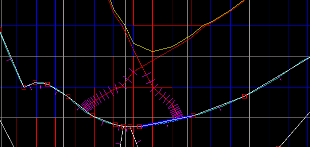
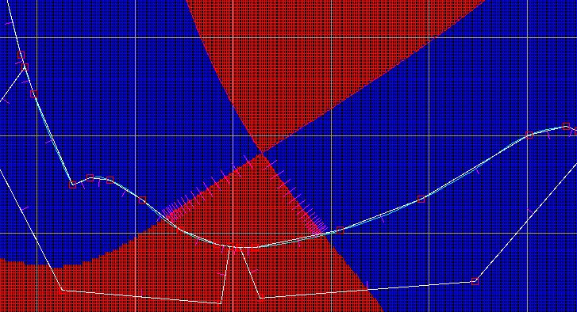
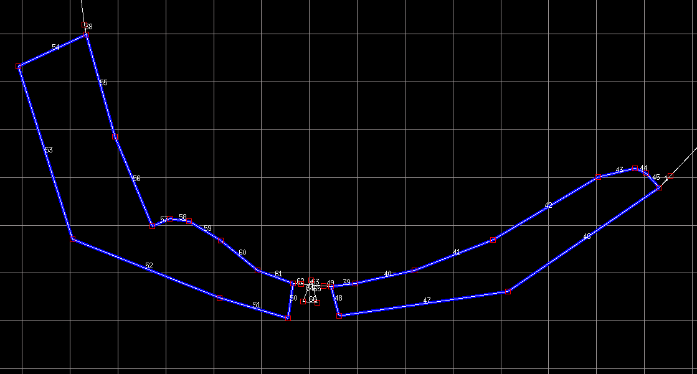
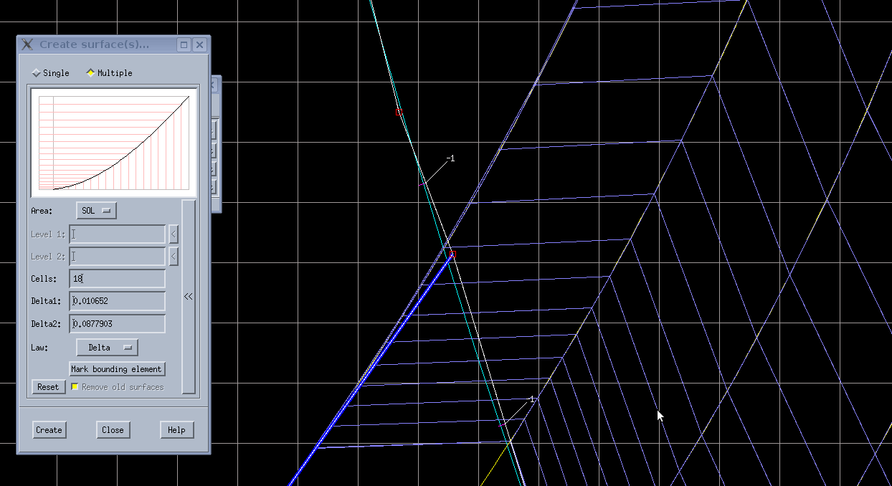
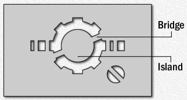

# Creating a new SOLPS-ITER simulation

/// hint | This is a narrow grids tutorial (SOLPS-ITER 3.0.x or 3.1.x)
The [wide grids tutorial](../feature_blog/Wide_grids.md) assumes you're already familiar with this tutorial.
///

This tutorial will take you through creating a new SOLPS-ITER simulation. The simulation will be as simple as possible: pure deuterium, simple boundary conditions, coupled B2.5+EIRENE. The tutorial will take you through the following steps (see the table of contents on the right):

0. Decide what to model, for example by [scouting a tokamak discharge](../feature_blog/Interpretative_simulations_of_COMPASS.md#find-a-discharge-with-the-right-physics)
1. [Connect to the server](../supplementary/Remote_access.md) where your SOLPS-ITER is installed and [initiate the SOLPS-ITER work environment](../installing/solps-iter-codebase.md#how-to-initiate-the-solps-iter-work-environment)
2. Create a folder for the new simulation with the usual structure
3. Get the input files: an `.ogr` file containing the wall shape and an `.equ` file containing the equilibrium
4. Create a "simulation geometry” `.dg` file using the DivGeo programme
5. Create the rectangular grid for B2.5 using `carre` and import it into DivGeo for check
6. Create the triangular grid for EIRENE using `triang` and import it into DivGeo for check
7. Procure and edit SOLPS-ITER input files
8. [Run SOLPS-ITER](Running_SOLPS-ITER.md)

/// hint | Alternative resources
This tutorial borrows heavily from the [DivGeo tutorial](../files/DivGeo_tutorial.pdf)<span class="material-symbols-outlined">download</span>.

<span class="material-symbols-outlined">construction</span> **TODO:** Eventually, we would like to merge this tutorial with the DivGeo tutorial.
///


## Create a folder for the new simulation

/// tip | SOLPS work environment setup
There are two main options of working with SOLPS-ITER on a remote server: [SSH](../supplementary/Remote_access.md#ssh-secure-shell) command line (supplemented by [SSHFS](../supplementary/Remote_access.md#sshfs-ssh-filesystem)) and a [remote desktop](../supplementary/Remote_access.md#remote-desktop). You may use either one according to preference.

After you connect to the server command line, [initiate the SOLPS-ITER work environment](../installing/solps-iter-codebase.md#how-to-initiate-the-solps-iter-work-environment). **Don't forget to specify the `DEVICE` name!**
///

In the folder `solps-iter/runs/`, create a folder naming your simulation, say, `my_first_simulation`. Inside that, create two subfolders: `baserun` and `run.`

- `baserun` is the "basic state”, on top of which you can create a multitude of similar SOLPS-ITER runs, all sharing the same geometry and other parameters specified in DivGeo (e.g. a density scan stored in folders `run_1.0/`, `run_1.5/` etc.).
- Geometry files and meshes are stored in `baserun`. If you put your `.ogr` and `.equ` files here, too, you'll find them easier later.
- Boundary condition files can be stored in `baserun` or in `run`. If they are specified in `run`, they will override whatever is in `baserun`.
- `run` contains inputs and outputs of individual simulation runs.


/// note | The `baserun` is special
The `baserun` folder must be called `baserun` and nothing else. There may be only one `baserun` folder per simulation, but there may be multiple `run` folders per simulation, which can be called whatever you like (`run1`, `n_3.0_PSOL_200`, `the_best_run` etc.). Since `baserun` is what holds the simulation geometry (including grids, meshes, pumping and puffing positions etc.), all the runs in one simulation share the same grid. If you wish to create a run with a different grid, you must create a whole new simulation folder.
///


## Get the `.ogr` and `.equ` files

To set up the geometry of a SOLPS-ITER simulation, you must provide it with two files: an outline of the first wall `.ogr` and a magnetic equilibrium `.equ`. Both can be gleaned from an equilibrium reconstruction file in the EQDSK format, standard output of equilibrium reconstruction codes such as EFIT. We recommend using the [PLEQUE](https://pleque.readthedocs.io/)<span class="material-symbols-outlined">open_in_new</span> Python package for EQDSK file manipulations. Beware that experimental equilibrium reconstructions can often be inaccurate, and these errors will propagate into your SOLPS-ITER simulations. The feature blog entry [Magnetic equilibrium reconstructions](../feature_blog/Magnetic_equilibrium_reconstructions.md) deals with the question of equilibrium quality.

The **wall shape** file (extension `.ogr`) is a simple text file with two columns - one are the $R$ coordinates of the first wall, and the other are the corresponding $Z$ coordinates. Both the coordinates are in millimeters. Example of extracting the coordinates from an equilibrium reconstruction file using Python and PLEQUE:

```python
# Import the equilibrium-reading function from PLEQUE
from pleque.io.readers import read_geqdsk

# Load the equilibrium
eq = read_geqdsk('/path/to/equilibirum/eqdsk/file')

# Extract the first wall coordinates [m] and convert them to [mm]
R = eq.first_wall.R * 1000
Z = eq.first_wall.Z * 1000

# Save the coordinates as a text file with the extension .ogr:
np.savetxt('/path/to/first_wall.ogr', np.transpose((R, Z)))
```

Should you need to modify the wall outline, you will be able to do so later in DivGeo.

/// warning | Toroidal symmetry
SOLPS-ITER assumes the chamber (and plasma) to be toroidally symmetric. If you expect 3D effects (protruding limiters, toroidally localised liquid metal divertor tiles) to play a large role in your simulation, 3D transport codes such as [EMC3-EIRENE](https://iopscience.iop.org/article/10.1088/1741-4326/aad42f/meta)<span class="material-symbols-outlined">open_in_new</span> may be more suited to the task than SOLPS-ITER.
///


The **equilibrium** file `.equ` can be obtained by converting an equilibrium reconstruction in the EQDSK format. Copy the EQDSK file to your `baserun` folder and, in the SOLPS-ITER work environment, run the following command:
```bash
e2d my_equilibrium.eqdsk my_equilibrium.equ
```

Check the equilibrium by opening DivGeo
```
dg &
```
and `File > Import > Equilibrium`. `Ctrl+P` to zoom in, `File > Import > Topology > SN` (or your respective topology) to display the separatrix. You might find that the equilibrium is too coarse, especially around the X-point.



In such a case, interpolate the grid to twice the grid density:

```bash
d2d my_equilibrium.equ my_equilibrium.x2.equ
```

Rinse and repeat this command about a few times (3-4x) to yield something like the following:



/// warning | Equilibrium resolution cap
It is recommended to increase the resolution no more than 32x, otherwise you can get the error "The grid you have specified seems to be too fine".
///

Experiment until you have a suitable `.equ` file to build grids upon.

Finally, copy both the `.ogr` and the `.equ` file into the `baserun` folder. Name them something descriptive (wall outline version, what shot and time the equilibrium comes from) so your future self can figure out which geometry you used.


## Create the geometry file `.dg` with DivGeo

DivGeo is a graphical programme which sets up the simulation geometry. With it, you will specify the SOLPS grid extent, its resolution (number of cells), how the cells should be spaced, where the gas puff is and what it puffs, what the walls are made of and how many particles they recycle, and much more.

/// tip | Resources
**This part of the tutorial rests entirely on the [DivGeo tutorial](../files/DivGeo_tutorial.pdf)<span class="material-symbols-outlined">download</span>**. While going through its steps, refer to our tips below and in the other resources:

- The [SOLPS manual](../supplementary/SOLPS-ITER_user_wisdom.md#rtfm) appendix L, *DG manual: Version 2.10*
- X. Bonnin, S. Lisgo: [DG input: important points](https://user.iter.org/?uid=R657FE)<span class="material-symbols-outlined">open_in_new</span>
///


### DivGeo tips and tricks

**Useful keyboard shortcuts**

- `Ctrl+P` to zoom in as much as feasible
- `Ctrl+O` to zoom out
- `Ctrl+U` to unmark all (This is very useful when specifying element lists, like which elements comprise the targets. By pressing `Ctrl+U` before marking the target elements, you can avoid unintentionally leaving previously marked elements in the selection. This can give you trouble later, so abuse that `Ctrl+U`.)

**Mouse button controls**

- All three mouse buttons (left, middle, right) can and should be utilised while working with DivGeo. You can set them in the upper left corner: `L` for left, `M` for middle and `R` for right. I recommend setting the left mouse button to `Mark`, the right mouse button to `Zoom/Pan` and the middle mouse button to whichever special action you want to carry out (`Reverse normals` etc.).
- Hold `Shift` and button drag `Add elements` to make a new element from start to end (don't join to an existing element). This is useful when creating ghost triangles.
- `Zoom/Pan` control: button click = "move to this place”, button drag = "zoom in to this area”
- There is a button assignment to create sources and points. Don't make them using coordinates like the DivGeo tutorial says.
- Holding down `Shift` while clicking will probably do the thing for a lot of instances

**What is this?**

- Removed lines/points will appear in blue, and stay in blue. Don't mind them, they are ghosts.
- The little purple lines, perpendicular to white lines, are normals. Their directions are precisely set so that SOLPS-ITER knows what's inside and what's outside. See the DivGeo tutorial for information on where exactly they should point.

**Other**

- From time to time, **save** the file. When saving for the first time, you have to specify the file name in the `Selection` box of the Save dialogue. (Not the `Filter` box, which is higher up and begs to be used instead.) When saving next, you still have to click on the desired file name in the `Selection` box. Why couldn't they just use `Ctrl+S`? I don't know...
- Since you'll need to turn on and off displaying various parts of the simulation domain (equilibrium, mesh, element numbers etc.), float the `Display` menu. Click `View > Display` and click on the dashed line on top of the menu. This will make it float.


### Simplifying the wall outline

As you may later refer to individual wall elements by their number (e.g. to see where the mesh building failed), it's a good idea to make as few of them as possible while preserving the simulation geometry.

The `.ogr` file will probably have a much higher element resolution than necessary. Reduce the number of wall elements by` Commands > Simplify > Merge/Split elements`. Set the maximum deviation to 0.5 mm and press OK. Keep in mind that some of the edges may have an important impact on the physics (neutral reflection etc.). Then, renumber the elements using `Commands > Renumber elements`, otherwise EIRENE will complain about having too many wall elements (the maximum default value is 300).


### Nice and wide SOL grid

The "narrow grids" SOLPS version we are working with in this tutorial can have one particular drawback: insufficient SOL grid extent. As detailed in [[Wiesen 2018]](https://www.sciencedirect.com/science/article/pii/S2352179118301248?via%3Dihub)<span class="material-symbols-outlined">open_in_new</span>, in transport modelling the SOL grid has to wide enough to contain several fall-off lengths, of which the widest tends to be the density fall-off length $\lambda_n$. If the SOL is too thin compared to $\lambda_n$, the far SOL (North) boundary condition is too close to the separatrix, parallel transport doesn't have enough time/space to do its thing and the simulation results will be wrong.

/// danger | IPP Prague
Insufficient SOL grid extent was an insurmountable problem for simulations of COMPASS Upgrade with "narrow grids" SOLPS-ITER. The COMPASS-U divertor is closed and its outer baffle protrudes far into the SOL in standard scenarios. Only a narrow grid can fit inside its opening. As a result, 25-75 % of the input power escaped the simulation domain through the far SOL (North) boundary and never made it to the divertor. The simulations were completely detached, even though there were little power and pressure losses in the divertor volume. This problem had no solution, save for moving the baffle out of the way, which we didn't want to do. In the end, we had to switch to [wide grids](../feature_blog/Wide_grids.md).
///

**Predict the SOL extent before building it:** Switch your middle button to `Add surface`, click and drag and observe the flux surface. What limits it? A wall? Another X-point? Knowing this in advance can save you a lot of redoing.

**Explain the generated SOL extent:** If the SOL created in DivGeo seems too narrow to you (like it only spans 1 cm at the outer midplane), go to `Edit > Create > Surfaces` and press `Bounding element`. This will show you what's stopping your SOL from being thicker.

**Expand the target to carry a wider SOL:** The inner divertor of the COMPASS tokamak is really small, so it can only "support” a narrow SOL grid. To allow for a wider SOL grid, we include a part of the first wall in the inner target, like so:



**Separatrix-limiter clearance:** As mentioned in the [Magnetic equilibrium reconstruction](../feature_blog/Magnetic_equilibrium_reconstructions.md) feature blog entry, in the COMPASS tokamak, the clearance between the separatrix and the upper outboard limiter could be really small. In experiment, this caused the limiter to light up like a Christmas tree and the inner divertor to go dim. In SOLPS-ITER simulations, this limited the SOL grid extent. There are essentially two solutions:

1. If the plasma-limiter interaction is not the focus of your work and doesn't have major impact on the edge plasma, you can move the offending limiter out of the way in DivGeo (mouse button `Move points`).

2. If you want to see e.g. the influx of impurities from the limiter due to plasma fluxes, you can't describe this using the "narrow grids" SOLPS version. You have to switch to [wide grids](../feature_blog/Wide_grids.md).

### Incorrect separatrix outline

If the separatrix is not displayed correctly after you import a topology, DivGeo had problems recognizing the magnetic configuration of the equilibrium. In general, crop the equilibrium or try importing another topology (e.g. DDN, disconnected double null).

Example problem: After importing the SN (single null) topology, the separatrix doesn't show up, only its divertor legs. Example cause: There is a secondary X-point in the equilibrium, so technically the correct topology is DDN. Solution: Crop the equilibrium.

**Cropping the equilibrium**:

    cropequ path_to_input_file.equ path_to_output_file.equ

- Press `Enter` and then input the number of cells in the $R$ direction which are to be preserved, the corresponding $R_{min}$ and $R_{max}$, and the same for the $Z$ direction. For instance:

        126 0.3 0.8
        201 -0.36 0.4

- Import the new equilibrium into DivGeo and check it. If your secondary X-point is in an area which you can't crop away in this simple manner, or there is another problem, consider importing one of the double-null topologies.


### SOL and PFR edge

After you define the flux surfaces, check that they intersect the targets on the elements that you labeled as the SOL and PFR end. Small misalignments can lead to huge problems in the future, like in the following example where I only found a problem while triangulating.


(It's the inner target edge - some of the purple-coloured cells intersect the chamber outside the "SOL” edge of the inner target.)


### TRIA-EIRENE values

Setting correct TRIA-EIRENE values is crucial for triangulation to succeed. To recap what TRIA-EIRENE value each segment should have:

- **-1**: the main wall (above targets) including the "SOL edge” element of the targets
- **-2**: the private flux region (between targets) including the "PFR edge” element of the targets
- **0**: the targets themselves, between the -1 and -2 elements; helper triangles; target "back tiles"

While setting and debugging TRIA-EIRENE values, keep in mind:

- Have your elements renumbered (`Commands > Renumber elements`) and their numbers displayed (`View > Display > Numbers`).
- Have the TRIA-EIRENE parameter values displayed (`Variables > TRIA-EIRENE parameters` > right click on the `Index` box, hold and drag to the `Display values` option). They don't get updated automatically, so always right-click `Display values` again.
- Make sure your mesh, TRIA-EIRENE parameters, and the target specifications agree! Check where the last flux surface intersects the wall, check that it's properly tagged (-1 or -2) and check that this is indeed the "SOL edge” or "PFR edge”. Sometimes flux surfaces aren't where you first thought they would be.
- Study the `Uinp` error output closely. The numbers will help you pinpoint where the problem is.


### Other

- When you make changes to your wall (like add a segment here and there), this messes up all your variable assignments (`Structure` for instance). When making changes like these, always check and re-define all the variables.
- If you use the same amount of flux surface, grid point etc. as in the DivGeo tutorial, over and over again, all your simulations will be mesh-compatible. That will mean you'll be able to adopt already converged solutions from other geometries without using `b2yt` to interpolate the results to the new grid. In practice, just copy the `b2fstate` file into the new simulation.
- When running the `lns` command, don't include the `.dg` extension.
- Choose the general triangle size according to your machine. For example, 10 is too big for COMPASS. Check the triangular mesh by importing it to DivGeo, and if you don't like its resolution, change the general triangle size in DivGeo, rerun `triang` and import the mesh again.


## Create B2.5 grid with Carre

Keep following the [DivGeo tutorial](../files/DivGeo_tutorial.pdf)<span class="material-symbols-outlined">download</span>.

/// tip | Resources
- Marchand 1995: [CARRE: a quasi-orthogonal mesh generator for 2D edge plasma modelling](https://www.sciencedirect.com/science/article/pii/0010465596000525)<span class="material-symbols-outlined">open_in_new</span> - explanation of Carre parameters such as `pasmin` and `rlcept`
- ITER Organisation: [Carre User Notes](https://iterorganization.sharepoint.com/:b:/r/sites/SOLPS-ITER/Shared%20Documents/General/Tutorials/2015_ITER_Organization_-_CARRE_User_Notes.pdf)<span class="material-symbols-outlined">open_in_new</span>
- [SOLPS-ITER Confluence page](https://confluence.iter.org/display/IMP/SOLPS-ITER)<span class="material-symbols-outlined">open_in_new</span> - several documented and explained errors
///

### Setting Carre parameters

- Example problem: When I try to input a refined `pasmin` during `carre -`, it sets the `pasmin` to some strange value, like 10<sup>-20</sup>.
- Cause: You may be using a bad form of input and Carre can't read the number.
- Solution: Write `pasmin=1.0e-4`, not `pasmin=1e-4`.

To correct an already written value, don't press Backspace but `Ctrl+H` to delete one character or `Ctrl+U` to clear the entire line.


## Create EIRENE grid with Triang

Keep following the [DivGeo tutorial](../files/DivGeo_tutorial.pdf)<span class="material-symbols-outlined">download</span>.

/// tip | Resources
- [SOLPS-ITER Confluence page](https://confluence.iter.org/display/IMP/SOLPS-ITER)<span class="material-symbols-outlined">open_in_new</span> - several documented triangulation errors
///

### Too many elements

Triang has a defined maximum number of elements (wall segments) it can handle, by default 300. If this number is exceeded, it will complain of "too many elements".

**Solution 1** ("I don't have *that* many elements!"): **Renumber elements**

- When you perform `Commands > Simplify > Merge/Split Elements` to reduce the amount of wall elements, the numbers which label the elements aren't updated automatically. Check `Window > Statistics` to display the now unused numbers. Triang refers to the higher present element number to gauge if the amount of elements is acceptable, so the remnant high element numbers will trigger it.
- Renumber the elements from 1 onward using `Commands > Renumber Elements`.

**Solution 2** ("I need all those elements!"): **Raise the tolerance limit**

1. Go to `$SOLPSTOP/modules/B2.5/src`.
2. Create a subfolder `include.local`.
3. From the folder `include`, copy the text file `DIMENSIONS.F` into `include.local`.
4. In this copy of `DIMENSIONS.F`, seek the line defining `DEF_NLIM` (maximum number of elements) and change the number.

        #define DEF_NLIM 500

    In most cases, Uinp will tell you how many walls your model is requiring. DivGeo can also tell you the numbers of wall elements it has with `Window > Statistics`.

5. [Recompile SOLPS](../installing/solps-iter-codebase.md#how-to-update-solps-iter).


### The targets must be numbered according to the B2 convention

This is another problem with element numbering, encountered in the `Uinp` step.

1. Renumber the elements in DivGeo (`Commands > Renumber Elements`) so that they follow some sane structure.
2. `Save` and `Output`, then run `Uinp` again.
3. Read the command line output carefully. `Uinp` lists all the elements by their number. For instance, `attribute -1 0 -2` means that the elements have `TRIA-EIRENE parameters > Index` set to either -1, 0 or 2.

One time, I managed to miss a tiny wall element while marking the -1 structure points.


### Other

- After importing the triangulation template, it contains only triangles outside the B2.5 mesh.
    - There are actually two similar-looking files in the triangulation output: say, `template.a008.tria.ogr` and `template.g008.tria.ogr`. You want the "g" one.
- Running `t` in `triang` says "self-intersecting structure" and then refuses to produce output. See the [Confluence page](https://confluence.iter.org/display/IMP/SOLPS-ITER)<span class="material-symbols-outlined">open_in_new</span>.
- Running `t` in `triang` return an error, while the `*.ps` file shows a weird, long "crossing line" in the chamber outline. See the [Confluence page](https://confluence.iter.org/display/IMP/SOLPS-ITER)<span class="material-symbols-outlined">open_in_new</span>.

## Procure input files

Congratulations, you have finished the DivGeo tutorial! We resume step-by-step instructions.

SOLPS-ITER input files are the text files you will edit while running your simulation, setting things like how long the simulation should run and what the power crossing the separatrix is. There are two groups of input files: master control files which contain code switches (`b2mn.dat` for B2.5 and `input.dat` for EIRENE), and boundary conditions (BC) files (`b2.boundary.parameters`, `b2.neutrals.parameters` and `b2.transport.parameters`). SOLPS has many other input files, but you needn't worry about those at this stage. The BC files are mostly for B2.5 (the plasma part of SOLPS-ITER) and there are two ways to specify them: the "standard" formulation (`b2ah.dat` etc.) and the "physics" formulation (`b2.boundary.parameters` etc.). Don't let the names confuse you; always use the "physics" formulation.

/// tip | Resources
**`b2mn.dat`**

- `$SOLPSTOP/modules/B2.5/src/documentation/b2input.xml` - mother source of B2.5 switch descriptions
- [B2.5 switches](/extras/b2input) - our pretty, searchable viewport of the `b2input.xml` file, also great for browsing boundary conditions

**`input.dat`** - [EIRENE manual](https://eirene.de/Documentation/eirene.pdf)<span class="material-symbols-outlined">open_in_new</span>

**Boundary conditions**

- [SOLPS manual](../supplementary/SOLPS-ITER_user_wisdom.md#rtfm) - section 3.5.2 *b2.boundary.parameters*, section 3.5.3 *b2.transport.parameters*, appendix D *Boundary conditions in B2.5*
- Q&A, section [Input files and boundary conditions](../supplementary/Questions_and_answers.md#input-files-and-boundary-conditions)
///

///warning | Copy using the `cp` command, not `Ctrl+C`
In all of the below, copy the files using the `cp` command inside the SOLPS-ITER work environment! Failing to do so (especially with `input.dat`) may instigate later symlink and [timestamp problems](../supplementary/Common_pitfalls.md#the-danger-of-timestamps).
///

### Prepare initial plasma state

In your `baserun` folder, find the files `b2ah.dat.stencil`, `b2ai.dat.stencil` and `b2ar.dat.stencil`. If they aren't present, look for them without the `.stencil` part and use those.



<p align="center"><i>Stencil in its original meaning. You spray paint onto the stencil and produce a picture underneath. It's a method often used in street art.</i></p>

Make a copy of each of them and remove the `.stencil` part from its name (producing `b2ah.dat`, `b2ai.dat` and `b2ar.dat`):
```bash
cp b2ah.dat.stencil b2ah.dat
cp b2ai.dat.stencil b2ai.dat
cp b2ar.dat.stencil b2ar.dat
```

Then run (still inside `baserun`):

```bash
b2run b2ah
b2run b2ai
b2run b2ar
```

This will set up the initial simulation state: the "standard" boundary conditions, the initial plasma state `b2fstati` ("flat profiles"), and the reaction rates, respectively. Check the `baserun` folder for the new files this step has created.

### Get boundary condition files

In the `baserun` folder, find the files `b2.boundary.parameters.stencil`, `b2.neutrals.parameters.stencil` and `input.dat`. Copy them into the `run` folder (created all the way back in [step 1](#create-a-folder-for-the-new-simulation)) and remove the `.stencil` part from their names.
```bash
cp b2.boundary.parameters.stencil ../run/b2.boundary.parameters
cp b2.neutrals.parameters.stencil ../run/b2.neutrals.parameters
cp input.dat ../run/input.dat
```
The `b2.xxx.parameters` files contain the "physics" BCs, how the mesh edge behaves and how the B2.5 neutrals behave (or how B2.5 should communicate with EIRENE), while `input.dat` is automatically generated EIRENE input. The last file of the "physics" boundary conditions, `b2.transport.parameters`, does not have a stencil automatically generated. You can use the example file from the [SOLPS manual](../supplementary/SOLPS-ITER_user_wisdom.md#rtfm), section 5.1.8. Refer also to Q&A: [I copied the `b2.transport.parameters` file from the manual. What do all the 12s stand for?](../supplementary/Questions_and_answers.md#transport-parameters-12s)

/// note | SOLPS input priority
1. Boundary conditions defined in `b2ah.dat` will be overriden by `b2.boundary.parameters`, which will be overriden by `b2mn.dat`.
2. Anything in `baserun` will be overriden by that same thing in `run`.

Usually, you'll have `b2ah.dat` in the `baserun` and `b2mn.dat`, `b2.boundary.parameters` and its brothers in individual runs. That way, you can tweak individual inputs for each run while falling back on common `baserun` settings for things you leave at default values.
///

### Get `b2mn.dat`

`b2mn.dat` is the B2.5 master control file and it has no pre-generated stencil.

/// hint | Funny story from Kateřina
`b2mn.dat.stencil` is not generated so that users are forced to build their master control file from scratch, rather than blindly use the default file. This underestimates my laziness. I built my first SOLPS-ITER simulation at the 2018 SOLPS training, using the `b2mn.dat` which my mentor gave me. For the next five years, I used that file without knowing what switches were inside it. As the saying goes, if it works, it ain't broke.
///

We recommend starting from our [annotated basic `b2mn.dat`](../files/annotated_basic_b2mn.dat)<span class="material-symbols-outlined">download</span>. The annotations explain what the switches mean and what their default values are. Note that this was made for SOLPS version 3.0.6. You may be running a newer version, where some of the listed switches are obsolete.

To learn more about B2.5 switches, peruse our [B2 switches documentation](/extras/b2input). Kateřina has compiled the [switches she found interesting](../files/annotated_interesting_switches_in_b2mn.dat)<span class="material-symbols-outlined">download</span> on her October 2023 read-through.

An important part of `b2mn.dat` is switching between the "standard” and "physics” boundary conditions. To use `b2.boundary.parameters` instead of `b2ah.dat` etc., paste these line into `b2mn.dat`:
```
'b2stbc_boundary_namelist'  '1'
'b2tqna_transport_namelist' '1'
'b2stbr_neutrals_namelist'  '1'
```

### SOLPS-ITER dry run

You are nearly done! To make sure everything is ready, run in the simulation folder (`$SOLPSTOP/runs/my_first_simulation`):
```
correct_baserun_timestamps
```
This makes sure the [timestamps](../supplementary/Common_pitfalls.md#the-danger-of-timestamps) of your files make sense. Then switch to the `run` folder and set up symlinks for EIRENE.
```
cd run
setup_baserun_eirene_links
```
Finally, perform a dry run of SOLPS-ITER.
```
b2run -n b2mn
```
This checks if all the required files are present. If it calls `b2mn.exe` among the first lines, all is good. If it calls, say, `b2ag`, you may have a problem.

Congratulations! You have created your first SOLPS-ITER simulation. To be continued in [Running SOLPS-ITER](Running_SOLPS-ITER.md).


