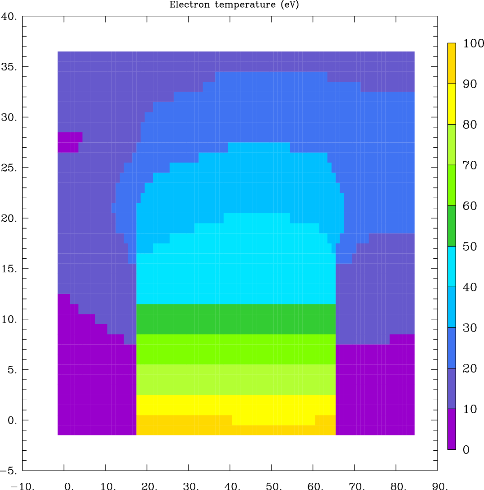
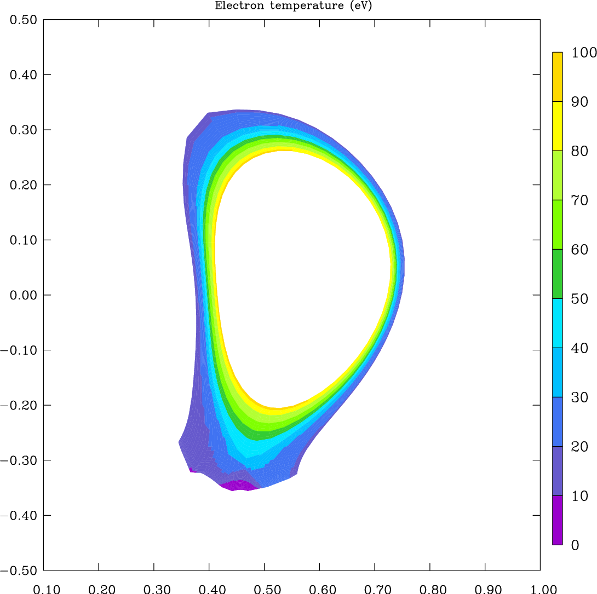
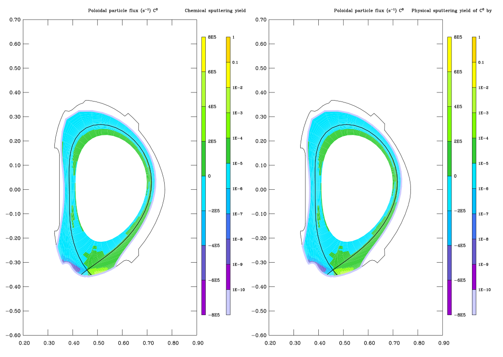
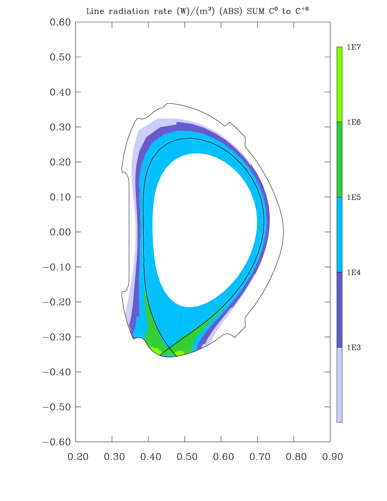
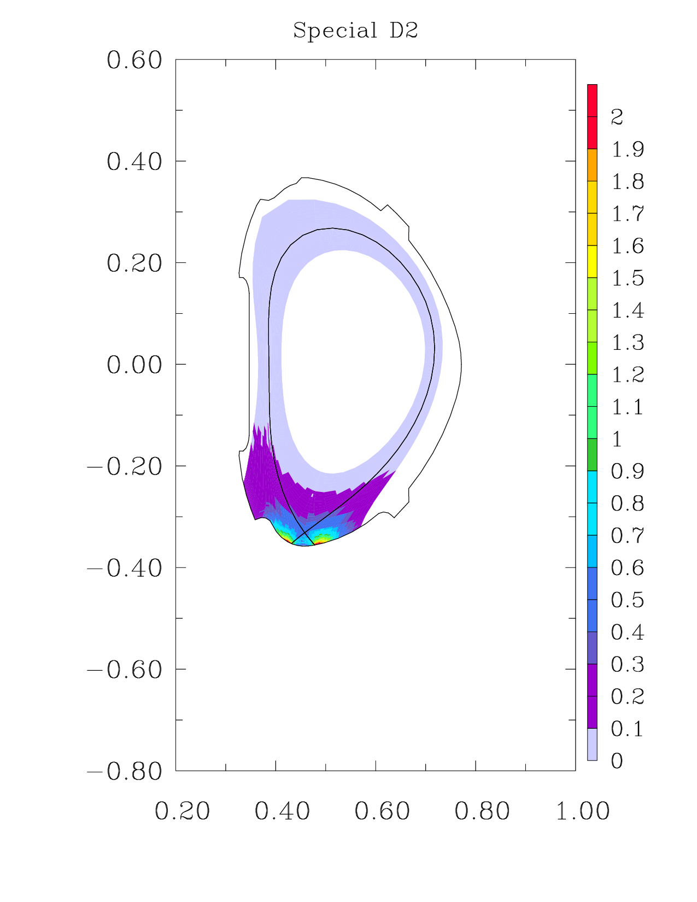
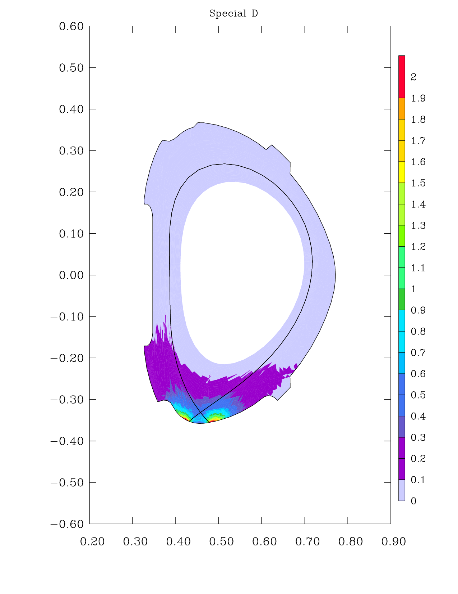
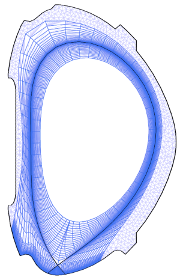

# Processing SOLPS-ITER output

Once you have a finished, hopefully converged SOLPS-ITER simulation, it is time to post-process its output and look at what you've got.

**Built-in post-processing tools** (the list is not exhaustive):

- Visualisation tool [B2plot](#b2plot)
- Wall loading script [`wlld`](#wlld)
- Radial profile script [`2d_profiles`](#2d_profiles)
- Extracting the [EIRENE neutral energy spectrum](#eirene-neutral-spectrum)
- [SOLPS GUI](https://static.iter.org/imas/assets/solps-iter/html/index.html)<span class="material-symbols-outlined">open_in_new</span> (Graphical User Interface)

Documentation of built-in post-processing tools is fragmented, so I suspect all SOLPS users end up writing their own packages. Most of these are private and stuck at the stage "it works on one server, for one person, with one type of simulations". There are, however, shining beacons of hope.

**User post-processing tools** (that we know of):

- <a name="quixote"></a>[Quixote](https://ipar.gitlab.io/quixote/)<span class="material-symbols-outlined">open_in_new</span> - loading and plotting both structured and wide grids SOLPS data, successor to [SOLPSpy](https://gitlab.aug.ipp.mpg.de/ipar/solpspy)<span class="material-symbols-outlined">open_in_new</span>
- [Aurora](https://aurora-fusion.readthedocs.io/en/latest/tutorial.html#interfacing-with-solps-iter)<span class="material-symbols-outlined">open_in_new</span> - package focused on plasma radiation with side capability of loading SOLPS simulations
- [Cherab](https://cherab.github.io/documentation/welcome.html)<span class="material-symbols-outlined">open_in_new</span> - package focused on tokamak spectrometry with side capability of loading SOLPS simulations
- [ERO2.0](https://onlinelibrary.wiley.com/doi/pdf/10.1002/ctpp.201900149)<span class="material-symbols-outlined">open_in_new</span> - kinetic plasma impurity simulation code with side capability of loading SOLPS simulations
- [EireneX](https://iterorganization.sharepoint.com/:b:/r/sites/SOLPS-ITER/Shared%20Documents/General/SOLPS-ITER/Manuals%20and%20Documentation/EireneX.pdf?csf=1&web=1&e=xL8Bgo)<span class="material-symbols-outlined">open_in_new</span> - package for loading and processing EIRENE outputs, sadly unavailable on the author's [GitHub](https://github.com/nbb2)<span class="material-symbols-outlined">open_in_new</span>
 


/// danger | IPP Prague
The private, in-house post-processing tools of IPP Prague include:

- [SOLPS-postproc](https://repo.tok.ipp.cas.cz/dms/solps-postproc)<span class="material-symbols-outlined">open_in_new</span> (Python) - loading and plotting "structured grids" SOLPS data
- [SOLPS-analysis](https://repo.tok.ipp.cas.cz/solps/solps-analysis)<span class="material-symbols-outlined">open_in_new</span> (Python) - analysing and verifying "structured grids" SOLPS simulations, built on SOLPS-postproc
- [SOLPS-wide-grids](https://repo.tok.ipp.cas.cz/solps/solps-wide-grids)<span class="material-symbols-outlined">open_in_new</span> (Python) - loading and plotting Wide Grids SOLPS simulations

For the bargain price of being mentioned in the acknowledgements in your resulting article, we may be convinced to send you the current `master`. Write to Kateřina (<span class="material-symbols-outlined">mail</span> [hromasova@ipp.cas.cz](mailto:hromasova@ipp.cas.cz)).
///

Other tutorials in this document include:

- [Converting between poloidal, parallel and perpendicular fluxes and flux densities](#flux-conversion)
- A brief [Cherab tutorial](#cherab)
- A letter regarding [Matlab post-processing scripts](#matlab)


## Workflow fragmentation and remote access

Ideally, you have everything in one place: your SOLPS-ITER installation, experimental data and post-processing routines. Unfortunately, this is often not the case. At some point in her career, Kateřina was running SOLPS-ITER at Marconi Gateway, processing the output at IPP Garching and comparing it to experimental data at IPP Prague.

If you run SOLPS-ITER on a remote server, the best way to access the code output is to [mount](../supplementary/Remote_access.md#sshfs-ssh-filesystem) the location of your SOLPS-ITER files. If you for some reason can't mount (like on AUG workstations where [mounting requires root privileges](https://docs.oracle.com/cd/E23824_01/html/821-1454/rfsadmin-61.html)<span class="material-symbols-outlined">open_in_new</span>), the next option is to [copy over](../supplementary/Remote_access.md#scp-secure-copy-protocol) key files of the simulation. See more in the [Remote access](../supplementary/Remote_access.md) tutorial.


/// tip | Core SOLPS-ITER files
If file size is a concern, you don't always need to copy over the entire SOLPS simulation. Cherab, for instance, only requires the files `b2fstate`, `b2fplasmf` (has to be up-to-date with the `b2uf` command), `b2fgmtry` (copied from `baserun`), `input.dat` and `b2mn.dat`. See also Q&A: [What are all the files which define a finished run?](../supplementary/Questions_and_answers.md#key_files)
///


## B2plot

B2plot is the go-to built-in tool for visualising SOLPS-ITER results. Over decades of refinement, it has become as buff as Arnold Schwarzenegger. It can do some really amazing things, provided you can figure out how. This sections gives a couple of tips.

/// hint | More resources on `b2plot`
- Questions and answers: [B2plot](../supplementary/Questions_and_answers.md#b2plot)
- [SOLPS manual](../supplementary/SOLPS-ITER_user_wisdom.md#rtfm), appendix I *b2plot manual*.
///

### The basics

To use `b2plot`, first get inside your selected `run` folder and, in the [SOLPS-ITER work environment](../installing/solps-iter-codebase.md#how-to-initiate-the-solps-iter-work-environment), type:
```bash
echo "te surf" | b2plot
```
This will plot the electron temperature (`te`) by filling the appropriate cell with colour (`surf`), like so:

<!--  -->


It looks so weird because this is the "computation domain" - the grid rectangles resting one next to the other. To see the "physical domain", you have to add the keyword `phys` to your command chain:
```bash
echo "phys te surf" | b2plot
```
<!--  -->


Voilà. Instead of the electron temperature, you may plot any other B2.5 quantity in the same manner: the electron density (`ne`), all of the ion densities (`na`), ion temperature (`ti`) and many more listed in the manual, section I.3 *Commands*.

/// tip | Saving B2plot figures in high resolution
Every call of `b2plot` creates a file called `b2plot.ps` in your `run` folder. You can open it with PDF viewers, graphics editors, or with the command
```
gv b2plot.ps
```
The file is in the PostScript format, which is vector graphics.
///

/// warning | Caution: `b2plot.ps` gets overwritten
Another call of `b2plot` overwrites the `b2plot.ps` file. If you want to keep the picture, you have to rename it or move it somewhere else. Also note that the `b2plot.ps` picture will only be produced after you close the preview window generated by the `b2plot` command (for instance by clicking on it).
///


### Data stacks

As the [manual](../supplementary/SOLPS-ITER_user_wisdom.md#rtfm) appendix I: *b2plot manual* explains, the data which `b2plot` can display come in seven different *stacks*:

stack name | stack content
--- | ---
matrix stack | B2.5 results
integer stack | integer arguments for `b2plot` commands
real stack | real arguments for `b2plot` commands
string stack | string arguments for `b2plot` commands
EIRENE stack | EIRENE results
wall stack | SOLPS-ITER results which are defined along the wall (such as sputtering yields)
target stack | SOLPS-ITER results which are defined along the divertor targets (such as heat loads)

Data stacks are important because `b2plot` is very peculiar about its stacks and many of its error messages mention them. For example, if you run

```tcsh
echo "phys te 40 fmax surf" | b2plot
```

...`b2plot` will complain about `Insufficient data on real stack` and ignore the `fmax` function (setting the colour bar maximum). This is because `fmax` takes a real number argument (`40.0`), not an integer (`40`).

Another situation where you need to know about stacks is when plotting EIRENE output or making wall/target plots. Adapting the minimum example above, you may attempt to run

```tcsh
echo "phys edena surf" | b2plot
```

...to plot the EIRENE atom energy density `edena`. However, this will result in the error message `Insufficient data on matrix stack` and no picture being drawn. The reason is that the `surf` command only plots data from the matrix stack (B2.5 results, defined on the rectangular B2.5 grid). To plot data from the EIRENE stack, defined on the triangular EIRENE grid, you need the `esurf` command instead.

In a similar vein, `logf` turns on the logarithmic scale for matrix data, while `logw` turns it on for wall data. `zsel` selects the species index for matrix data, while `wzsel` selects it for wall data. Thus the need for the beginner to know about the `b2plot` data stacks.

### Passing arguments to `b2plot` commands

Keep three things in mind:

**Argument value precedes the command**. For instance, `b2plot` will not understand `zmin -0.3` but only `-0.3 zmin` or `-3e-1 zmin`.

**Number type varies depending on the command**. Some commands take integer arguments (`3`) and others float/real arguments (`3.0`). For instance, `b2plot` will not understand `-1 zmin` but only `-1.0 zmin`. Which format is appropriate for which command is given in the [manual](../supplementary/SOLPS-ITER_user_wisdom.md#rtfm), section I.4 *Available Functions and Operators in `b2plot`*. For instance:

- **`<number,I> font`** means the `font` command takes one integer argument, such as `-25 font`.
- **`<label,S> glbl`** means the `glbl` command takes a string argument, such as `'Ugly carbon case' glbl`.
- **`<factor,R> lbsz`** means the `lbsz` command takes real number argument, such as `2.0 lbsz`.

**Indices begin from 1.** Other post-processing tools, such as Python scripts, typically begin indexing at 0.


### Composing `b2plot` commands and writing scripts
<a name="b2plot_scripts"></a>


The longer a `b2plot` command is, the worse it is contained in the command line. Eventually, you may want to write a script, such as the following:

```{.tcsh title="sputtering.cmd"}
# Global plot necessities
phys a4l 2 1 page vesl sep

# Figure 1 wall plot: chemical sputtering
wall logw sputchem 2 wzsel 5.0 wwid

# Figure 1 surf plot: C0 poloidal flux
fnax 2 zsel surf

# Figure 2 wall plot: physical sputtering
wall logw sput 2 wzsel 5.0 wwid

# Figure 2 surf plot: C0 poloidal flux
fnax 2 zsel surf
```



To run this script, located in the `run` directory and called `sputtering.cmd`:

```tcsh
echo '"sputtering.cmd" cmd' | b2plot
```

Let's break the script down. The first line, `phys a4l 2 1 page vesl sep`, defines the overall figure composition and common elements of its subfigures.

- `phys`: the individual subfigures will be plotted in the "physical domain" - that is, the axes are $R$ and $Z$ [m], and not $x$ and $y$ [cell number]
- `a4l`: the figure is A4 in format, in the landscape orientation
- `2 1 page`: there are two subfigures in the figure, next to each other (2 columns, 1 row)
- `vesl`: in all the subfigures, the vacuum vessel will be plotted
- `sep`: in all the subfigures, the separatrix will be plotted

The second line, `wall logw sputchem 2 wzsel 5.0 wwid`, contains a wall plot (the lavender line around the B2.5 computational domain in the left subfigure):

- `wall`: a wall plot shall be drawn on top of a regular (here matrix) plot
- `logw`: set the colour bar scale to logarithmic
- `sputchem`: plot the chemical sputtering of all ion species (refer to [Reactions of the Hexaaqua Ions with Carbonate Ions](https://chem.libretexts.org/Bookshelves/Inorganic_Chemistry/Supplemental_Modules_and_Websites_(Inorganic_Chemistry)/Coordination_Chemistry/Complex_Ion_Chemistry/Reactions_of_the_Hexaaqua_Ions_with_Carbonate_Ions)<span class="material-symbols-outlined">open_in_new</span>, [The Hydronium Ion](https://chem.libretexts.org/Bookshelves/Physical_and_Theoretical_Chemistry_Textbook_Maps/Supplemental_Modules_(Physical_and_Theoretical_Chemistry)/Acids_and_Bases/Acids_and_Bases_in_Aqueous_Solutions/The_Hydronium_Ion)<span class="material-symbols-outlined">open_in_new</span> and [[Ballauf 2020]](https://www.sciencedirect.com/science/article/pii/S2352179119300675)<span class="material-symbols-outlined">open_in_new</span> for ion chemical sputtering)
- `2 wzsel`: plot only ion species with index 2 (here C<sup>0</sup>)
- `5.0 wwid`: set the line thickness to 5.0

The third line, `fnax 2 zsel surf`, contains a matrix plot underlying the wall plot:

- `fnax`: plot the poloidal particle flux of all ion species
- `2 zsel`: plot only ion species with index 2 (here C<sup>0</sup>)
- `surf`: conclude drawing the subfigure by taking all the matrix stack data you have and make a surface plot out of them on the B2.5 grid

The fourth and fifth line are analogous to the second and third, only they concern the physical sputtering.

Notice that each subfigure has two colour bars: one for the wall plot (sputtering) and one for the matrix plot (C<sup>0</sup> poloidal flux). Also notice that the wall plot shows "less than 10<sup>-10</sup>" across the entire "wall" zone. This is a problem of the simulation set up (or a bug, depending on how smart you'd like `b2plot` to be). The `sputchem` and `sput` commands return the sputtering fluxes calculated by B2.5, while this is a coupled run where the sputtering is handled by EIRENE, so the B2.5 sputtering fluxes are zero.

From trial and error, it seems like `b2plot` favours a certain structure of its commands. To create more complicated scripts, try following the structure described above:

- global figure settings (size, orientation, axes labels, font size, plot area...)
- plotted quantity/variable (electron temperature, EIRENE molecules density...)
- commands pertaining to this particular variable/plot (axes extent, colour bar extent, colour palette, linear/logarithmic scale...)
- plot command (typically `surf`)

Note that some `b2plot` commands, such as `mesh`, have a built-in plot command and you needn't follow them up with `surf`.

```tcsh
echo "phys mesh" | b2plot
```


### A few `b2plot` scripts

**2D map of total carbon line radiation**

```
a4p lbof logf phys vesl sep
b2ra pvol abs 2 8 sumz 1.0e3 fmin 1.0e7 fmax surf
```




**2D map of all carbon species densities**

```
phys a4l 4 2 page logf aspc vesl 1.5 lbsz
0.3 rmin 0.8 rmax -0.4 zmin 0.4 zmax
na 2 zsel 9e3 fmin 1.1e4 fmax surf
na 3 zsel 1e3 fmin 1e17 fmax surf
na 4 zsel 1e3 fmin 1e17 fmax surf
na 5 zsel 1e3 fmin 1e17 fmax surf
na 6 zsel 1e3 fmin 1e17 fmax surf
na 7 zsel 1e3 fmin 1e17 fmax surf
na 8 zsel 1e3 fmin 1e17 fmax surf
```


**2D map of total neutral pressure (with B2.5 stacks)**

Notice that since B2.5 stacks are used (`rm*`, `surf` etc.), the pressure is only given on the B2.5 grid.

```tcsh
# Global plot necessities
phys a4p vesl sep

# Multiply D atomic density and D atomic temperature to get atomic pressure
dab2 0 zsel tab2 0 zsel m*

# Multiply molecular density and molecular temperature to get molecular pressure
dmb2 tmb2 m*

# Add the pressures to get total neutral pressure
m+

# Multiply by the electron charge to convert the units to Pa
1.6e-19 rm*

# Set a larger label size
1.5 lbsz

# Set colorbar extent
0. 2. 21 clvn

# Finish the plot
surf
```



**2D map of total neutral pressure (with EIRENE stacks)**

Notice that since EIRENE stacks are used (`rem*`, `esurf` etc.), the pressure is given on the entire EIRENE grid.

```tcsh
# Global plot necessities
phys a4p vesl sep

# Add EIRENE neutral atom and molecule energy density to get the total neutral energy density in eV/m^3
edena edenm em+

# Multiply by the electron charge to get the total neutral energy density in J/m^3
1.602e-19 rem*

# Multiply by 2/3 to get the total neutral pressure in Pa
0.66 rem*

# Set colorbar extent
0. 2. 21 eclvn

# Finish the plot
esurf
```



**B2.5 and EIRENE computational grids**

This one's tricky because `b2plot` is stupid about choosing mesh colours. As far as I can tell, the `mcol` command changes the colour of *both* the EIRENE grid (plotted by `trig` or `trigmesh`) and the B2.5 grid (plotted with `mesh`), so you can't plot them into one picture with different colours. My workaround is to plot the two grids into separate figures and overlay them in an external editor. (Or, you know... use [Quixote](https://ipar.gitlab.io/quixote/)<span class="material-symbols-outlined">open_in_new</span>.) The picture will look much better if you use the `b2plot.ps` file and a vector graphics editor (such as [Inkscape](https://inkscape.org/)<span class="material-symbols-outlined">open_in_new</span>) than if you convert the `b2plot.ps` file to a [bitmap](#saving-the-plot-results) and use a raster graphics editor (such as [GIMP](https://www.gimp.org/downloads/)<span class="material-symbols-outlined">open_in_new</span>).

```tcsh
# Global plot necessities: first picture
phys a4p vesl sep

# Plot the B2.5 + EIRENE grid in lavender
2 mcol trigmesh

# Global plot necessities: second picture
phys a4p

# Plot the B2.5 grid in blue
5 mcol mesh
```



### Useful `b2plot` commands and functions

By adding words to the command chain, you can tweak the plot in many ways.

Adjust the **font size** for all text (default size is 1.0):

```tcsh
echo "phys 2.0 lbsz te surf" | b2plot
```

**Crop** the plotted area (`zmin` and `zmax` in the $Z$ direction, `rmin` and `rmax` in the $R$ direction):

```tcsh
echo "phys -0.3 zmin 0.3 zmax te surf" | b2plot
```

/// hint | Cropping figures with unity aspect ratio
In an effort to produce a pretty picture, `b2plot` engages in heavy optimisation calculating the exact axis bounds when the aspect is set to 1 (meaning 1 m on the X axis has the same length as 1 m on the Y axis). It tries to make the axis labels pretty, fill out the figure as best it can and preserve the aspect ratio. As a result, it can be very stubborn about the axis extent it has chosen. If careful optimisation fails, I'd recommend using the toggle `aspc`, which toggles off the unity aspect ratio, and setting the figure size and axes extents so that the aspect ratio is approximately unity. No one's going to put a ruler to the picture anyway.
///

Plot the **separatrix**:
```tcsh
echo "phys sep te surf" | b2plot
```

Plot the **vacuum vessel** outline:
```tcsh
echo "phys vesl te surf" | b2plot
```

Set the **axis labels**:
```tcsh
echo "phys te 'R [m]' xlab 'Z [m]' ylab surf" | b2plot
```

Set the plot **title**:
```tcsh
echo "phys te 'Electron temperature' glbl surf" | b2plot
```

Change the **colourmap scale** to logarithmic (useful for seeing more detail, but take care that your data doesn't take on negative values):
```tcsh
echo "phys na logf surf" | b2plot
```

Set the **colour bar** limits and number of levels:
```tcsh
echo "phys pdena 0.0 1e19 32 eclvn esurf" | b2plot
```

Set the colour bar **pallete**:
```tcsh
echo "phys pdena 'blue_to_red_64.pal' cltb esurf" | b2plot
```

Plot something against the **parallel coordinate**:
```tcsh
echo "sx xpar 18 f.x" | b2plot
```


### Plotting EIRENE output

EIRENE data uses a whole different set of plot commands, usually with "e" prepended. To plot, for instance, the total atom density:
```tcsh
echo "phys pdena esurf" | b2plot
```
Note that the command `surf` was replaced by `esurf`, that is, `b2plot` now uses the EIRENE grid.

A more complicated command to plot the **total neutral pressure**:
```tcsh
echo "phys sep vesl logf edena edenm em+ 0.66 rem* esurf" | b2plot
```
The calculation takes advantage of the relation between energy density $E/V$ and pressure $p = \frac{N}{V}k_BT$ of ideal gases,

$E = \frac{\text{number of degrees of freedom}}{2} Nk_BT$ [[Kinetic Theory of Gases](https://ocw.mit.edu/courses/8-01sc-classical-mechanics-fall-2016/mit8_01scs22_chapter29.pdf), Eq. (29.3.1)]

which translates to

$p = \frac{2}{3} \frac{E}{V}$

for monoatomic gases with only 3 degrees of freedom. (Please ignore that D<sub>2</sub> molecules contain two atoms.) [[Wikipedia]](https://en.wikipedia.org/wiki/Ideal_gas_law)<span class="material-symbols-outlined">open_in_new</span>. The command only works for D-only cases; with impurities you'd also have to consider neutral species numbers. Beside the plot commands specified above (`phys`, `sep`, `vesl`, `logf` and `esurf`), notice the operation on EIRENE stacks:

- **Sum** two EIRENE arrays: `edena edenm em+`. Notice the order: first the two arrays, then the EIRENE plus operation.
- **Multiply** an EIRENE array with a real number: `edena edemn em+ 0.66 rem*`. Again, notice the order "argument argument operation", and also that the number includes the decimal point. If the arrays were multiplied by 10, `10.0` would work while `10` would prompt the error message `Insufficient data on real stack`, since the code expected a real number and got an integer.


### `wlld`

`wlld` is a very useful command, which extracts profiles of various quantities (most notoriously, heat fluxes broken down into individual components) along the divertor targets and the outer midplane. To create the text files containing these profiles, write:
```tcsh
echo "1100 wlld" | b2plot
```
This creates the files `ld_tg_out.dat` and others in the folder `run/b2pl.exe.dir`. Their content is labeled inside the file. Use your post-processing tool of choice to load the table and plot its contents.

/// hint | Additional resources on `wlld`
- [SOLPS manual](../supplementary/SOLPS-ITER_user_wisdom.md#rtfm), appendix I.3 *Commands*
- [Energy fluxes deep dive](../feature_blog/Energy_fluxes_deep_dive.md)
///

### Saving the plot results

B2plot output is automatically saved under the name `b2plot.ps` (`ps` = PostScript, a vector graphic format). It's located either directly in the `run` folder or in its subfolder `b2pl.exe.dir`. Every time you call `b2plot` again, the files are overwritten, so if you want to keep something, you have to make a copy under a different name.

**Convert the vector image to a bitmap**: While the `.ps` format is compatible with many devices, you may find raster formats (`.png` etc.) more convenient. In Linux distributions, the conversion may be done using the [ImageMagick](https://imagemagick.org/#gsc.tab=0)<span class="material-symbols-outlined">open_in_new</span> programme:
```bash
convert -density 150 b2plot.ps b2plot.png
```
The `-density` option increases the bitmap resolution. If you encounter the error "not authorized", find the file `/etc/ImageMagick-6/policy.xml` and change the line
```
<policy domain="coder" rights="none" pattern="PS" />
```
to
```
<policy domain="coder" rights="read|write" pattern="PS" />
```

**Save `b2plot` output as text**: Simple 1D plots can be converted to values using the `write` command, for example:
```tcsh
echo "phys sx xpar write 19 f.x" | b2plot
```
The numbers can be found in `b2pl.exe.dir/b2plot.write`.


## Other built-in post-processing routines


### `2d_profiles`

In the [SOLPS-ITER work environment](../installing/solps-iter-codebase.md#how-to-initiate-the-solps-iter-work-environment) and in the `run` folder, you can run:
```bash
2d_profiles
```
This creates a slew of text files called `*.last10`, among others profiles of [diffusion coefficients](../feature_blog/Diffusion_coefficients.md#implementing-diffusivity-profiles). They contain cell radial positions relative to the OMP separatrix and values of selected quantities there. You can load the files with Python or something similar. But also, you don't have to swarm your `run` directory. Go straight to the source of the `2d_profiles` command and load the `b2time.nc` file. Sample Python script:

```python
import xarray as xr
b2time = xr.open_dataset('run_path/b2time.nc')
Dn = b2time['dn3da'].data[-1]
pl.plot(Dn)   # use the radial cell number as the x axis
```

/// tip | Hiding `*.last10` files
`2d_profiles` produces a lot of files that clutter your `run` directory. Use the [`.hidden` file](Running_SOLPS-ITER.md#keeping-your-run-directory-clean) to hide them. This will only affect your file browser; Python will still see the files just fine.
///


### EIRENE neutral spectrum

Highly specific neutral-related data can be extracted from EIRENE during SOLPS-ITER or standalone runs using so-called *tallies*. Tallies are simply quantities calculated by adding up (tallying) individual Monte Carlo results of an EIRENE run. Their definitions are generally given in the `input.dat` file and their values are typically printed in the standard output of EIRENE, which is typically redirected into `run.log`. In this example, we will show how to extract the neutral spectrum impinging on several vacuum vessel segments. Much information can be found in the [EIRENE manual](https://eirene.de/Documentation/eirene.pdf)<span class="material-symbols-outlined">open_in_new</span>.

First, **define the surfaces** where you want the tallies to be computed. These can be real vessel wall segments, completely virtual surfaces (such as the separatrix surface) or anything inbetween. The SOLPS-ITER `input.dat` file contains, by default, a complete list of vaccum vessel segments in block `*** 3b. Data for additional surfaces`. You can use these or define your own additional surfaces. A surface block looks like this:

    *   1 :   1
     2.00000E+00 1.00000E+00 1.00000E+00 1.00000E-05
         1     1     0     0     0     1     0     0     0    -1
    6.65934E+01 2.44670E+01-1.00000E+20 6.66467E+01 2.70939E+01 1.00000E+20

Use the EIRENE manual and reverse engineering to figure out what the numbers mean. At the end, don't forget to edit the total number of additional surfaces, just under `*** 3b. Data for additional surfaces`.

Next, **define how your tallies are calculated**. In the example of neutral spectra, you need to edit block `*** 10. Data for additional tallies` and block `** 10f. Data for energy spectra`. Refer to section 2.10.6 of the EIRENE manual.

    *** 10. Data for additional tallies
    0     0     0     0     0     8

Here, `8` is number of spectrums that will be produced at the 8 (additional) surfaces which will be written out in block `10f`. For one such surface, the corresponding lines are:

    ** 10f. Data for energy spectra
    11     1     1     1  -100     0     0
     2.00000E+00 2.00000E+03 0.00000E+00 0.10000E+00 6.66000E+02 1.00000E+00

Here, `11` is the number of the surface where the tally is calculated, `-100` is the number of bins in the spectrum, and `2.00000E+00 2.00000E+03` is the region of the considered energies. Write such two lines for each surface where you want the tally to be computed.

Next, **tell EIRENE to print the tallies** in block `*** 11. Data for numerical and graphical output`.

    *** 11. Data for numerical and graphical output
    FFFFF FFFFF FFFFF FFFFF
    TFFFF FFFFF FFFFF
         0     1
         1
        15     0     0     0     0    75
    TTFTT FFTFF FTFFF F
         1    37     1     1    87     1     0     0     0     0
    F                          0
    F                          0
    F                          0
    F                          0
    F                          0
    F                          0
    F                          0
    F                          0
     6.58893E+01 6.58893E+01 9.14404E+01-4.75189E+00 0.00000E+00
     1.00000E+01 1.00000E+01 0.00000E+00 0.00000E+00 1.00000E+01 1.00000E+01
     1.00000E+01 1.00000E+01 0.00000E+00
         0     0     0     0     0     0     0     0     0     0     2
         0

The important number here is the `1` in line `     0     1`. This is the `NSPCPR` flag for printout of surface- or cell-based spectra, defined in block `10f`. If `NSPCPR > 0`, the spectra are printed.

Finally, **run the code** (coupled SOLPS-ITER or standalone EIRENE) and find the tally values in the EIRENE printout. This can be the standard shell output (what appears in the SOLPS work environment command line when you run `b2run b2mn`), `run.log` or `run.log.last10` depending on the way you ran the code. Look for the "spectrum" keyword.

        SPECTRUM CALCULATED FOR ADDITIONAL SURFACE     15

Visualise the spectrum using your favourite scientific software.

**Change the number of EIRENE particles.** To get sufficient statistical data (or quick results), you can define the number of EIRENE particles to be launched in block `7` (should be checked with the EIRENE manual). Also, in block `1`,

    2     1    20   100     1     1     0     1     0

the number `100` is the number of particles to be launched.

**Producing tallies with standalone EIRENE.** Sven Wiesen recommends to run only EIRENE on frozen plasma background. This can be done with the command `eirobj`.

1. Create a new folder `run_eirene` on the same level as your original SOLPS-ITER run.
2. Copy over the files `fort.30`, `fort.31`, `fort.32`, `fort.33`, `fort.34`, `fort.35`, `fort.10`, `fort.11`, `fort.13`, `fort.15` and `input.dat` from your `run` folder.
3. Inside the case directory (on the same level as `baserun`), run `correct_baserun_timestamps`.
4. Inside `run_eirene`, run `eirobj`.

We have produced our spectra by running coupled SOLPS-ITER for several iterations.

**Tallies of neutral fluxes.** If you only need neutral fluxes (without the spectral resolution), you only need to modify only block `11`. Refer to the EIRENE manual.

**Example of modified `input.dat`.** This will produce spectra at 8 vacuum vessel segments.

Block `1`: change the `NFILE` flag, controlling where data is read from and which output files will be saved.

        *** 1. Data for operating mode
        # previously:    -1     1    50   406     1     1     0     1     0
            -1     1    50   100     1     1     0     1     0

Block `10`: change the `NADVI` and `NADSPC` flags, controlling the number of tallies of each kind to compute.

        *** 10. Data for additional tallies
        # previously: 8     0     0     0     0     0
        0     0     0     0     0     6

Block `10f`: set how to calculate the spectra.

        ** 10f. Data for energy spectra
            15     1     1     1  -100     0     0
         2.00000E+00 2.00000E+03 0.00000E+00 0.10000E+00 6.66000E+02 1.00000E+00
            16     1     1     1  -100     0     0
         2.00000E+00 2.00000E+03 0.00000E+00 0.10000E+00 6.66000E+02 1.00000E+00
            17     1     1     1  -100     0     0
         2.00000E+00 2.00000E+03 0.00000E+00 0.10000E+00 6.66000E+02 1.00000E+00
            43     1     1     1  -100     0     0
         2.00000E+00 2.00000E+03 0.00000E+00 0.10000E+00 6.66000E+02 1.00000E+00
            58     1     1     1  -100     0     0
         2.00000E+00 2.00000E+03 0.00000E+00 0.10000E+00 6.66000E+02 1.00000E+00
            59     1     1     1  -100     0     0
         2.00000E+00 2.00000E+03 0.00000E+00 0.10000E+00 6.66000E+02 1.00000E+00

Block `11`: turn on the spectrum printout. Previously, the first half of block `11` read:

        *** 11. Data for numerical and graphical output
        FFFFF FFFFF FFFFF FFFFF FFFFF FFFFF FFFFF
        TFFFF FFF
             0
             0
        FFFFF FFFFF FFFFF F

Now, the first half of block `11` reads:

        *** 11. Data for numerical and graphical output
        FFFFF FFFFF FFFFF FFFFF
        TFFFF FFFFF FFFFF
             0     1
             6
            15     0     0     0     0    75
            16     0     0     0     0    75
            17     0     0     0     0    75
            43     0     0     0     0    75
            58     0     0     0     0    75
            59     0     0     0     0    75
        TTFTT FFTFF FTFFF F

The second half of block `11` remains unchanged:

             1    37     1     1    87     1     0     0     0     0
        F                          0
        F                          0
        F                          0
        F                          0
        F                          0
        F                          0
        F                          0
        F                          0
         6.58893E+01 6.58893E+01 9.08073E+01-4.75189E+00 0.00000E+00
         1.00000E+01 1.00000E+01 0.00000E+00 0.00000E+00 1.00000E+01 1.00000E+01
         1.00000E+01 1.00000E+01 0.00000E+00
             0     0     0     0     0     0     0     0     0     0     2
             0

If you think that's a lot of work to get the neutral energy spectrum, welcome to EIRENE. If the [alignment](https://www.dndbeyond.com/posts/1869-breaking-down-alignment-in-d-d)<span class="material-symbols-outlined">open_in_new</span> of SOLPS-ITER is chaotic neutral, EIRENE is chaotic evil.


<a name="flux-conversion"></a>

## Converting between poloidal, parallel and perpendicular fluxes and flux densities

Plasma transport in the B2.5 code happens in two independent directions: poloidal (`x`) and radial (`y`). The plasma solution is symmetric in the toroidal coordinate (`z`). The underlying transport physics is, however, defined mostly in terms of transport parallel to the magnetic field ($\parallel$) and transport perpendicular to it ($\perp$). As a result, users of SOLPS must learn to **convert fluxes between these coordinate systems**.

### Energy flux nomenclature

For the sake of proper understanding, we will devote three boring paragraphs to nomenclature. Proper names of fluxes can be a mouthful, so they are often shortened and interchanged. Usually you can tell what is what by the context and units, but brevity comes at the cost is clarity (and sounding uneducated). If you know the difference between a flux and a flux density, energy flux and heat flux, and poloidal, parallel and perpendicular fluxes, you can skip this section.

A **flux** is "amount of something passing through a given boundary per second". There particle fluxes (unit particles/s or s<sup>-1</sup>), momentum fluxes, or energy fluxes (symbol $Q$, unit J/s or W). Anyone calling energy flux "power flux" does not understand the beauty of analogy. Power does not flow; energy does. A **flux density** is "amount of something passing through a *unit area of boundary* per second". There are particle flux densities (symbol $\Gamma$, unit s<sup>-1</sup>m<sup>-2</sup>), momentum flux densities, or energy flux densities (symbol $q$, unit W/m<sup>2</sup>). A flux is always tied to a specific boundary, as in "the energy flux impinging on the outer target is 97 kW". A flux density, on the other hand, is a standalone physical quantity, as in "peak divertor target parallel energy flux densities can reach 200 MW/m<sup>2</sup> in fusion reactors". When discussing physics, you're usually speaking in terms of flux *densities*, not fluxes.

**Energy flux** refers to any type of energy (thermal, potential, electric...) flowing somewhere. It is the proper term for total divertor energy flux, convective energy flux, potential ionisation energy flux, electric energy flux et cetera. **Heat flux** refers only to the transport of energy in the form of chaotic thermal movement (heat) along asymmetries in the velocity distribution function (conduction). Heat flux is synonymous for conductive energy flux. "Conductive heat flux" is superfluous. "Convective heat flux" is wrong. "Total divertor heat flux" is also wrong, though it *can* be referred to as the total divertor heat load, assuming that the energy impinging on the target is immediately converted into heat and *this heat* is what you're describing. I use the symbol $q$ both for heat and energy flux densities, because I haven't found a better alternative.

**Poloidal fluxes** (e.g. poloidal energy flux $q_{pol}$ or $q_x$) are more or less a construct of SOLPS (and other simulation codes). The real physical nature of this flux is transport along magnetic field lines, without the hindrance of Larmor rotation. However, as 2D codes will assume *toroidal* (`z`) symmetry, it's useful to have the other two coordinates perpendicular to the toroidal coordinate. "Poloidal physics" is just a projection of the parallel physics, with the advantages that the simulation domain is shorter and easier to grid, and the results are easier to visualise. **Parallel fluxes** (e.g. $q_\parallel$) flow along the magnetic field lines. They are the defining feature of SOL transport physics, as they provide a quick connection to a strong energy and particle sink (divertor target or limiter). **Perpendicular fluxes** (e.g. $q_\perp$) are, in the context of this section, parallel fluxes projected onto the normal of the divertor target (or limiter). (Disregard for a moment that perpendicular can also be used as a synonym for radial, as in "perpendicular anomalous diffusion coefficients" $D_\perp$, and forget all about the binormal $\perp$ direction.) Conceptually, perpendicular fluxes only make sense in direct relation to the target, unlike parallel fluxes which are defined throughout the plasma volume. Perpendicular energy flux densities are the relevant quantity to the survival of the plasma-facing components. If an engineer is asking you how to design the divertor cooling systems, they are asking for the total perpendicular energy flux density. Even though the poloidal, parallel and perpendicular fluxes are all projections of the same phenomenon (parallel transport), they are applied in different fields (respectively: transport codes, SOL physics, and plasma-wall interaction), which subtly distinguishes them from one another.

To wrap up the last three paragraphs: You will often hear "heat flux" instead or "parallel energy flux density". The reason is prosaic - it's shorter. It's up to you to understand from the context if it's flux or flux density, heat or just energy, and what its direction is. This is fine in everyday communication, but before we proceed with converting between them, we need to clarify what we are talking about.

### Expressions for energy flux densities

The following describes the calculation of the parallel and perpendicular energy flux density from an arbitrary poloidal energy flux $Q_x$ [W], for example the total poloidal energy flux carried by the plasma `fhtx`. The constituents of the total target heat load will be described elsewhere.

1. **Parallel energy flux density $q_\parallel$ [W/m<sup>2</sup>]**:

    $q_\parallel = \dfrac{Q_x}{b_x s_{x,perp}}$, where $b_x$ and $s_{x,perp}$ are defined below

    This is the energy flux density relevant to parallel SOL physics, such as heat flux limiting or the heat flux fall off length $\lambda_q$ calculation.

2. **Perpendicular energy flux density $q_\perp$ [W/m<sup>2</sup>]**:

    $q_\perp = \dfrac{Q_x}{s_x} = q_\parallel . \sin \alpha$, where $s_{x}$ and $\alpha$ are defined below

    This is the energy flux density relevant to target heat loads.

The quantities in the above relations are:

**Magnetic field pitch $b_x = B_x/B$**

- This is the ratio between the poloidal magnetic field $B_x$ [T] and the total magnetic field $B$ [T]. It is also the sine of the angle between the parallel direction and the poloidal direction (the magnetic pitch angle, which is *not* the impact angle denoted as $\alpha$ in this section).
- **SOLPS-postproc**: Available in `sim.geometry['bb']`. $B_x$ is `bb[0,:,:]` and $B$ is `bb[3,:,:]`.
- **b2plot**: $B_x$ is called `bx` and $B$ is called `bb`.

**"Poloidal area perpendicular to the x-direction" $s_{x,perp}$ [m<sup>2</sup>]**

- This is the geometric factor omnipresent in SOLPS-ITER equations: $s_{x,perp} = \sqrt{g}/h_x$, where $\sqrt{g}$ [m<sup>3</sup>] is the cell volume and $h_x$ [m] is the cell length in the poloidal direction.
- **SOLPS-postproc**: Available in `sim.geometry`. The cell volume is `sim.geometry['vol']` and the poloidal cell length is `sim.geometry['hx']`.
- **b2plot**: $s_{x,perp}$ is called `sxperp`.

**"Poloidal area of cell contact" $s_x$ [m<sup>2</sup>]:**

- This is the area of the target surface which is covered by the cell/flux tube.
- **SOLPS-postproc**: Available as `sim.geometry['gs'][0,:,:]`.
- **b2plot**: $s_x$ is called `sx`.

**Divertor target impact angle $\alpha$ [radians]**

- This is the angle between the magnetic field line and the target surface. In other words, $\alpha= \frac{\pi}{2}$ - (angle between the field line and the surface normal).
- **PLEQUE (equilibrium reconstruction handler)**: Can be calculated by evaluating the impact angle sine at the point of impact, $\alpha$ = `np.arcsin(eq.first_wall.impact_angle_sin())`. (This will give you impact angles along the entire first wall.)
- <a name="solps-postproc"></a>**SOLPS-postproc**: Can be calculated using the previous three quantities stored in `sim.geometry` as $\alpha = \mathrm{arcsin}(b_xs_{x,perp}/s_x)$.
- **b2plot**: Can be calculated as $\alpha$ = arcsin(`bx * sxperp / (sx * bb)`). (Recall that $b_x$ = `bx`/`bb`.)

### Conversion scripts

To flexibly convert between poloidal energy fluxes [W] and parallel/perpendicular energy flux densities [W/m<sup>2</sup>], you'll need to write your own script.

**Python example**, lifted from [SOLPS-analysis](https://repo.tok.ipp.cas.cz/solps/solps-analysis)<span class="material-symbols-outlined">open_in_new</span>, built upon [SOLPS-postproc](https://repo.tok.ipp.cas.cz/dms/solps-postproc)<span class="material-symbols-outlined">open_in_new</span>:

```python
def convert_to_parallel_flux_density(sim, poloidal_flux):
    '''
    Convert the given poloidal flux (e.g. poloidal electron thermal energy flux
    fhe [W]) to its parallel energy flux density [W/m2].
    The poloidal flux must be transposed to [x,y] indexing and have only one
    component (e.g. it must be a 2D array).
    The result is transposed to [x,y] indexing!
    '''

    # Calculate the appropriate cell cross-section
    vol = sim.geometry['vol'].T  # cell volume [m3]
    hx = sim.geometry['hx'].T  # poloidal cell size [m]
    sxperp = vol / hx  # cell perpendicular cross-section [m2]

    # Calculate the magnetic field pitch
    Bx = sim.geometry['bb'][0, :, :].T  # poloidal magnetic field [T]
    B = sim.geometry['bb'][3, :, :].T  # total magnetic field [T]
    bx = Bx / B  # magnetic field pitch

    # Calculate the parallel flux density
    parallel_flux_density = poloidal_flux / (sxperp * bx)

    return parallel_flux_density
```

**Wlld and B2plot example**: Upon [long and careful examination](../feature_blog/Energy_fluxes_deep_dive.md), it has been concluded that not only does `wlld` correctly consider all the components of the energy flux impinging on the divertor targets, it also correctly converts them to the perpendicular energy flux density as $q_\perp = Q_x/s_x$. To additionally convert $q_\perp$ into $q_\parallel$, follow these steps:

First, **run `wlld`** inside the `run` directory:
```tcsh
echo "1100 wlld" | b2plot
```
This produces (among others) the files `b2pl.exe.dir/ld_tg_i.dat` and `b2pl.exe.dir/ld_tg_o.dat`, which contain perpendicular energy flux densities $q_\perp$ [W/m<sup>2</sup>] to the inner and outer divertor target, respectively. Remove them from `b2pl.exe.dir` and store them somewhere safe, as the next call of `b2plot` will overwrite the directory.

Next, **export the target impact angle sines $\sin \alpha$** with `b2plot`:
```tcsh
# Inner target
echo "phys bx sxperp m* sx m/ bb m/ write 0 f.y" | b2plot
```
The part `bx sxperp m* sx m/ bb m/` performs the calculation `bx * sxperp / (sx * bb)`. The `write` command saves the results into the text file `b2pl.exe.dir/b2plot.write`. The command `0 f.y` picks only the radial profile at the inner target's first real plasma cell (the inner target ghost cell has the index `-1`). Remove the text file from `b2pl.exe.dir` and store it somewhere safe. Similarly, export the outer target impact angle sines:
```tcsh
# Outer target
echo "phys bx sxperp m* sx m/ bb m/ write 83 f.y" | b2plot
```
This assumes that you have followed the DivGeo tutorial and have 86 cells in the poloidal `x` direction, including the two ghost cells. If your `nx` is different, modify the `83 f.y` command accordingly. Remove the text file from `b2pl.exe.dir` and store it somewhere safe.

Finally, **load the text files** into your post-processing tool of choice and convert $q_\perp$ into $q_\parallel$ using the impact angle sine as $q_\parallel = q_\perp / \sin \alpha$.


## Matlab

Quoting an email from Irina Borodkina, 9 April 2020:

> Dear All,
>
> I would like to describe a bit the output files of SOLPS-ITER run, uploaded in the directory `/run.4MW`. Maybe this information will be helpful.
>
> The B2.5 grid (for charged species) is saved in free format in `b2fgmtry`, while the EIRENE grid is a bit more complicated but saved in free format in files `fort.33`-`34`-`35`. The plasma variables are instead saved in free format in `b2fstate` and `b2fplasmf`. The neutral quantities on the triangular grid are stored in the `fort.46`. All these files (`b2fgmtry`, `b2fstate`, `b2fplasmf`, `fort.33`-`34`-`35`) can be read by some nice Matlab routines that you can find in `$SOLPSTOP/scripts/MatlabPostProcessing/IO`, for example
>
> `read_triangle_mesh.m` - This will load `fort.33`,`fort.34`, and `fort.35`
>
> `read_ft46.m` - This will load `fort.46`
>
> `read_b2fgmtry.m` - This will load `b2fgmtry`
>
> `read_b2fstate.m` - This will load `b2fstate`
>
> Those routines are easily accessible and in there you can see which variables are being read. If some of the variable names are not clear you can look into the manual (SOLPS-ITER) in the chapter regarding `b2plot` or `b2cdcv`.
>
> I also would like to ask to consider the uploaded files like preliminary results for technical testing. When you will be ready to import them to `cherab`, please let me know, and I will provide you with the best results I had by that time.
>
> I wish a Happy Easter to all!
>
> Cheers,
>
> Irina


## Cherab

As the [SOLPS-postproc](https://repo.tok.ipp.cas.cz/dms/solps-postproc)<span class="material-symbols-outlined">open_in_new</span> package builds upon [Cherab](https://www.cherab.info/welcome.html)<span class="material-symbols-outlined">open_in_new</span>, we give some details on how to use it.

### Example Cherab usage

To plot a 2D map of $T_e$:

```python
# Import the SOLPS loading function
# Prior to this, you have to download/clone Cherab and point your $PYTHONPATH to its source
from cherab.solps import load_solps_from_raw_output

# Load the SOLPS simulation
sim = load_solps_from_raw_output(path_to_run_directory)
# If Cherab complains about missing file b2fgmtry or b2fplasmf, follow instructions below

# Extract the electron temperature
Te = sim.electron_temperature

# Make a 2D map of the electron temperature
ax = pl.gca()
ax.set_title('Electron temperature [eV]')
sim.mesh.plot_quadrangle_mesh(solps_data=Te, ax=ax)
ax.get_figure().colorbar(ax.collections[0], aspect=40, label='$T_e$ [eV]')
```

Browse the `sim` variable properties and methods. It gives you access to selected simulation results ($T_e$, $T_i$, $u_a$, $n_a$ etc.) through 2D NumPy arrays, which you can use for profile plotting.


### Providing up-to-date files to Cherab

For full functionality, Cherab demands two files which may not be present in the `run` folder: `b2fgmtry` and `b2fplasmf`.

The **geometry file `b2fgmtry`** is most likely located in `baserun` if you ran `b2run b2ag` there. You can make a soft link to it from the `run` directory using:
```bash
ln -s ../baserun/b2fgmtry b2fgmtry
```

The **plasma solution file `b2fplasmf`** is a human-readable version of `b2fplasma`, which contains all the information of `b2fstate` and additional data calculated from it. If you followed the instruction in the manual, you would simply create it in the `run` directory using:
```
b2run b2uf
```
This command has backfired (deleted the plasma solution) so many times that it inspired the tutorial Common pitfalls: [The danger of timestamps](../supplementary/Common_pitfalls.md#the-danger-of-timestamps). Refer to it.

**Warning: `b2fplasmf` is not updated automatically.** This means you must run `b2run b2uf` each time you run your simulation, or each time before you use Cherab. To save you work, here's a script that creates `b2fplasmf` intelligently and safely:

```{.bash title="create_b2fplasmf.dat"}
#!/bin/bash

if [ -z "$SOLPSTOP" ]; then
  echo >&2 "Please init SOLPS-ITER environment first (source setup.csh)"
  exit 1
fi

correct_b2yt_timestamps
touch b2mn.prt b2fparam b2fstate b2fmovie b2ftrace b2ftrack b2fplasma

if (b2run -n b2uf | grep -qE 'b2mn.exe'); then
  echo >&2 "Simulation seems to be unfinished or crashed"
  exit 1
fi

b2run b2uf
```

Save this as a text file somewhere in your SOLPS installation (the simulation folder has done well for me). Mark the file as executable:

```bash
chmod +x create_b2fplasmf
```
Then, in your `run` directory, you can run the script using:
```bash
../create_b2fplasmf
```
...and wait a few minutes.