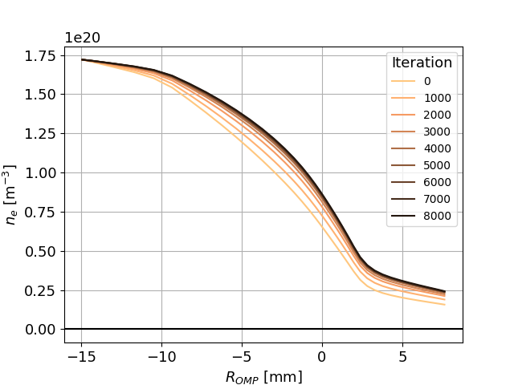
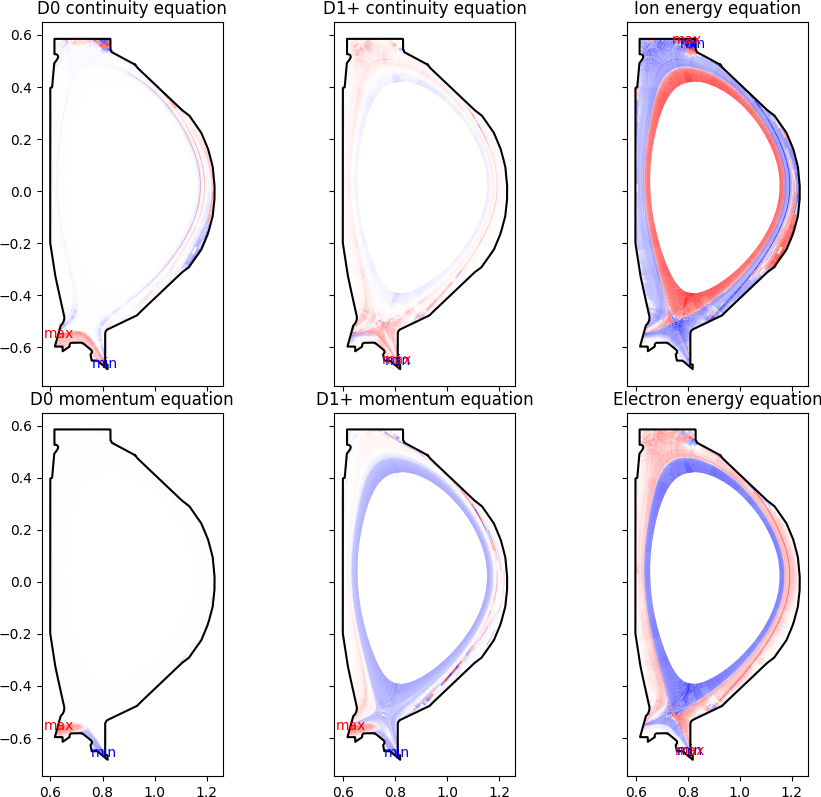
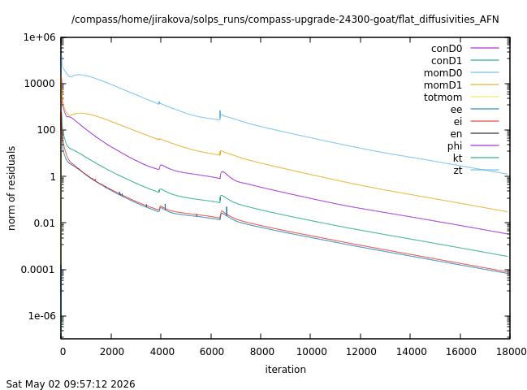
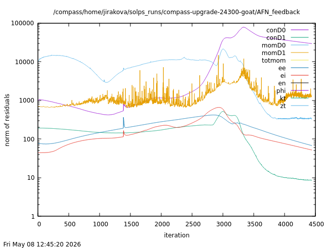

# Running SOLPS-ITER

This tutorial will guide you through a successful run of SOLPS-ITER. It is assumed that you have [created a new SOLPS-ITER simulation](Creating_a_new_SOLPS-ITER_simulation.md) or you're building upon an already run simulation. It is also assumed that you have [initiated the SOLPS-ITER environment](../installing/solps-iter-codebase.md#how-to-initiate-the-solps-iter-work-environment).

Topics covered in this tutorial:

- Running SOLPS-ITER using [`b2run`](#running-solps-iter-using-b2run) and using [submission scripts](#running-solps-iter-using-submission-scripts)
- [Keeping your `run` directory clean](#keeping-your-run-directory-clean)
- [Restarting](#restarting-a-solps-iter-run), [interrupting](#interrupting-a-solps-iter-run) and [branching out](#branching-out-a-solps-iter-run) a SOLPS-ITER run
- Defining [how long SOLPS-ITER should run](#defining-how-long-solps-iter-should-run)
- [Monitoring](#monitoring-a-solps-iter-run) a SOLPS-ITER run
- [Checking if a run has converged](#checking-if-a-run-has-converged)
- [`b2run` troubleshooting](#b2run-troubleshooting)


///note | More resources
See also Q&A: [Running SOLPS-ITER](../supplementary/Questions_and_answers.md#running-solps-iter).
///

## Running SOLPS-ITER using `b2run`

The simplest way to run SOLPS-ITER is using the `b2run` command in the `run` folder:
```bash
b2run b2mn >& run.log &
```

- The `b2run b2mn` part is essential; this is what runs SOLPS-ITER.
- The `>& run.log` part redirects both STDOUT and STDERR to a log file named `run.log`; the extra `&` suppresses EIRENE pre-processing printout.
- The final `&` lets the simulation run in the background so that you can use the command line for other things in the meantime.

In this form, this command will persist in running your simulation even after you have closed the command line, lost your internet connection or shut down your computer. This applies, however, only when you're running SOLPS-ITER on an external server!

You can submit several simulations at once using `b2run` in this bare form. Beware, however, that submitting two runs at once is not twice as efficient. Each `b2run` will hog all the computational power it can to itself. Consequently, simultaneous runs will compete for resources and your local system administrator might get angry at you. Use `b2run` when making short runs in quick succession (e.g. while catching the exact moment the solution goes supra-luminal and the run crashes). When making production runs, use [submission scripts](#running-solps-iter-using-submission-scripts) to reserve computational power only for yourself.

You will find all information about your run (whether it ended successfully, how many iterations were performed, type of errors etc.) in the `run.log` file. After longer runs (hundreds of iterations), the file gets too long to be read comfortably in text editors. To extract only the last 1000 lines into a new text file:
```
tail -1000 run.log > short-run.log
```


<a name="submission-scripts"></a>

## Running SOLPS-ITER using submission scripts

Submission scripts are wrappers around `b2run` which use the local computational job queueing system (SLURM, QSUB etc.) to reserve certain computational power and time for your simulation. You may encounter official SOLPS submission scripts (`itmsubmit` for EUROfusion Gateway, `itersubmit` for ITER clusters...) and in-house submission scripts. Generally, you will launch a submission script in the `run` folder. Many simulations can be run simultaneously from different folders.

You can find official SOLPS-ITER submission scripts in `$SOLPSTOP/runs`. The `_coupled` scripts are used for coupled B2.5+EIRENE simulations and they are launched automatically if [EIRENE is turned on](../supplementary/Questions_and_answers.md#switch-coupled-standalone). The `_loop` scripts launch one shorter simulation after another in a chain, as a safeguard against losing all progress should a long simulation crash. It also helps use the server's computational power more efficiently (bite-sized runs that can fit beside larger jobs) and delivers partial results faster (the resource management system doesn't have to wait until it has 24 cores free for three weeks).

/// hint | Where are the live simulation files?
When you run `b2run` in the `run` folder, you can see the files being updated as the simulation happens (mostly in the `b2mn.exe.dir` folder). You can monitor the simulation progress by reading these files. However, using submission scripts may leave the `run` folder inert until the simulation is finished, after which everything is updated at once. This is typically because the submission script has copied over the simulation folder to its own disk for faster access. The [container installation of SOLPS](../installing/installing-in-container.md#simulation-progress), for example, does this. If you find that live folder, you can to monitor the simulation progress there.
///


### Official submission scripts

/// warning | Official SOLPS-ITER submission scripts only
The instructions in this section pertain only to official SOLPS-ITER submission scripts, shipped in the `$SOLPSTOP/runs` folder. Other submission scripts (e.g. launching SOLPS with a [container](../installing/installing-in-container.md#submit-simulations-from-a-solps-container-with-qsub)) may be used differently.
///

To submit a simulation, [initiate the SOLPS-ITER work environment](../installing/solps-iter-codebase.md#how-to-initiate-the-solps-iter-work-environment), go to the `run` folder of the simulation you'd like to run and use an equivalent of the following command:

```
itmsubmit -m "-np 8" -j "my_job_with_no_blank_spaces" -T "1"
```

To break this down:

- `itmsubmit` is the name of the submission script on the EUROfusion Gateway. Each [properly configured site](../installing/solps-iter-codebase.md#properly-configured-site) should have its own submission script (`ippsubmit` for IPP Garching, `itersubmit` on ITER etc.).
- `-m` specifies the MPI (Message Passing Interface) execution options (= EIRENE parallelisation). `"-np 8"` will instruct the script to use 8 processors in parallel. If `-m` is not set, the code will run on 1 thread.
- `-j` is followed by the job name. **This parameter is mandatory.** If it isn't set, a default name will be used and the queue will be a mess. The name should contain alphanumeric characters only, meaning the underscore character is fine but a blank space will result in the error `set: Variable name must begin with a letter.`.
- `-T` specifies the approximate number of hours the simulation will take, so that the resource management system knows what priority to assign it. Always leave extra time compared to the planned simulation run time, so that the computation doesn't stop before `b2fstate` is written.

All the official submission scripts use similar flags. To learn more, look at their source code in `$SOLPSTOP/runs` or try:
```
itmsubmit -h
```

<a name="sorobansubmit"></a>
/// danger | IPP Prague - TODO <span class="material-symbols-outlined">construction</span>
As of February 2026, the Soroban server of IPP Prague is a [properly configured site](../installing/solps-iter-codebase.md#properly-configured-site) but its submission script `sorobansubmit` is not part of the official SOLPS distribution yet. You can copy it into `$SOLPSTOP/scripts` as part of the SOLPS configuration files as detailed in the legacy guide [Installing SOLPS-ITER at COMPASS (Soroban)](../installing/legacy-installing-at-compass-soroban.md#soroban_configuration_files).

Additional information on `sorobansubmit`:

- `-H` specifies the Soroban node which should carry out the job. If nothing is selected, the resource management system will choose on its own. For example, `sorobansubmit -j "my_job" -H "soroban-node-06"`.
- By default, `sorobansubmit` submits the jobs into the queue `long`, which has the lowest priority. To change this behaviour, open the submission script source code, find the line `#PBS -q long` and change the queue (e.g. to `medium`, where jobs can take 2 days at most).
///


### Managing queues

Once a job is submitted to a resource management system, it will enter a queue with all the other jobs. Depending on the server, there may be more than one queue (long, short, priority...). Once the system decides it has enough free computational time to launch your simulation, it will do so. Managing the queue is necessary so that you know which of your simulations are running, how long they've been at it and which ones have finished.

/// tip | Email notifications that a simulation has ended
In the submission script source code, you may find a line which specifies an email. Define the `EMAIL` variable (or whatever it is called) in your command line prior to launching the submission script, or write your email address directly into the script. Then, when the job is finished, you will receive an email. This is useful as a notification that you should check the simulation, or as a reminder on the following morning what you were doing the day before.
///

[**SLURM**](https://slurm.schedmd.com/documentation.html)<span class="material-symbols-outlined">open_in_new</span>: The resource management system of the [EUROfusion Gateway](../installing/solps-iter-codebase.md#properly-configured-site) and other clusters. Example commands:

```
# Check the queue
squeue

# List only your jobs in the queue
squeue -u $USER
```

[**QSUB**](https://linuxcommandlibrary.com/man/qsub)<span class="material-symbols-outlined">open_in_new</span>: The resource management system of the Soroban server at IPP Prague and other clusters. Example commands:

```
# Check the queue
qstat

# List only your jobs in the queue
qstat -u $USER

# Delete a job from the queue
qdel NNNNN
# where `NNNNN` are the first 5 numbers printed by qstat in the column Job id
```

/// danger | IPP Prague
Utilisation of the Soroban server can also be checked in a web browser, addresses [soroban:44444](http://soroban:44444/)<span class="material-symbols-outlined">open_in_new</span> (doesn't work through VPN) or [Soroban cluster utilisation](https://prometheus.tok.ipp.cas.cz/grafana/d/525hCXDMz/soroban-cluster-utilization?orgId=1)<span class="material-symbols-outlined">open_in_new</span>, or with the command `pbsnodes -a`. Don't expect immediate updates, it takes a minute or two to see your submitted/deleted job.
///


## Keeping your `run` directory "clean"

SOLPS-ITER keeps dozens of files in the `run` directory, hundreds if you use the [`2d_profiles`](Processing_SOLPS-ITER_output.md#2d_profiles) command. As a user, however, you only need to access a few of them. To avoid scrolling through an endless list of files every time, you can use this handy trick.

1. Create a blank text file in your `run` folder and name it `.hidden`. The dot at the beginning will cause, in Linux systems, for the file to be hidden from view in file browsers. You can display hidden files with `Ctrl+H` (or another appropriate command).

2. Let the command line write out all the `run` folder contents:

        cd run
        ls

3. Copy all the file names from the command line into `.hidden` and distribute them one file name per line. To speed things up, use the `Find and replace` function. First, replace all blank spaces and/or tabs `\t` with newlines `\n`. (If you have blank spaces in file names, what kind of Linux user are you?) Then, replace `\n\n` with `\n` repeatedly, until there's one file name per line.

    > **TODO** <span class="material-symbols-outlined">construction</span>: I'm sure this can be done with a single line from the terminal...

4. Find and delete the names of the files you don't want to hide. For example, I usually keep the following files displayed:

        # Input files
        b2mn.dat
        b2.boundary.parameters
        b2.transport.parameters
        b2.neutrals.parameters
        input.dat                 # or eirene.input.json
        b2.transport.inputfile    # and other input files
        
        # For spotting unwanted reversal to flat profiles
        b2ai.dat
        b2ar.dat
        b2ah.dat

        # For monitoring and restarting runs
        b2fstati
        b2fstate
        b2mn.prt
        run.log

        # Other
        b2fplasmf
        b2plot.ps
        

5. Save the text file and, in your file browser, hit `Ctrl+H` a few times. Refresh if needed.

Hiding most of the SOLPS-ITER files not only saves time when you're looking for a file to open, but it also gives early warning when there are files you don't want in the `run` folder. For example, seeing the `b2ai.prt` file should sound warning bells, because it means SOLPS has [ignored `b2fstati`](../supplementary/Common_pitfalls.md#the-danger-of-timestamps) and produced the "flat profiles" solution using `b2ai`.

When your list of unwanted files gets larger (e.g. you've run the [`2d_profiles`](Processing_SOLPS-ITER_output.md#2d_profiles) command), repeat the procedure to add new files to `.hidden`.

When you create a new run, just copy over a `.hidden` file that you already have.


## Restarting a SOLPS-ITER run

SOLPS-ITER simulations are not typically made all in one go. Usually you'll run them for some time, check the results, tweak something and continue the simulation. Restarting the simulations is useful when:

- You're still searching for the ideal input parameters (e.g. diffusion coefficients).
- The simulation is unstable.
- You want the simulation to produce additional output.
- You're starting from another converged solution.

...and on many other occasions.

/// warning | Use the `cp` command
When manipulating simulation files, **always use the `cp` command**! Using the file browser to copy the files, renaming the files etc. may cause the initial plasma state file `b2fstati` to be ignored and let the simulation begin again from the flat profiles state. More in Common pitfalls: [The danger of timestamps](../supplementary/Common_pitfalls.md#the-danger-of-timestamps).
///

To restart a simulation:

1. Go into the `run` folder.
2. [Check if your run has concluded successfully](../supplementary/Common_pitfalls.md#how-to-recognise-a-crash).
3. Delete `b2mn.prt`. Failing to do so will prevent your simulation from running.

        rm b2mn.prt

    /// warning | Remove `b2mn.prt`, not `b2mn.dat`
    Everyone raise your hand if you once didn't pay attention and by mistake removed the B2.5 master control file `b2mn.dat` instead of `b2mn.prt`... OTL
    ///    

4. Rewrite  `b2fstati` (`i` for "initial" plasma state) with `b2fstate` (`e` for "end" plasma state).

        cp b2fstate b2fstati

5. Run `b2run b2mn >& run.log &` or a submission script again.

/// tip | `b2fstati` and `b2fstate` magic
The simulation will start from whichever plasma state is present in `b2fstati`. If no `b2fstati` is present (or the simulation [ignores it](../supplementary/Common_pitfalls.md#the-danger-of-timestamps)), SOLPS-ITER will run `b2ai` to create a `b2fstati` containing the "flat profiles" solution and start from there.

- **Create a checkpoint** of the simulation state so you can come back to it later: `cp b2fstate b2fstate_before_gas_puff` (You can archive EIRENE results as well (files `fort.13`, `14`, `15`, `44` and `46`), but only `b2fstate` is essential.)
- **Return to a checkpoint**: `cp b2fstate_before_gas_puff b2fstati`
- **Adopt a completely different solution** (with the same geometry/number of cells): `cp ../another_run/b2fstate b2fstati` 
///


## Branching out a SOLPS-ITER run

Sometimes, you'll want to see what happens when you tweak a simulation a little (e.g. trying this weird switch you've just found in [B2.5 documentation](/solps-doc/extras/b2input)), but you don't want to lose the original simulation in case something goes wrong. Other times, you'll want to conduct a parameter scan. That is when you need to branch out an existing run.

**Simple and dirty**:
```
# Go to the simulation folder
cd $SOLPSTOP/runs/my_simulation

# Make a copy of an existing run
cp -r run_existing run_new
```

**Clean start**:
```
# Go to the simulation folder
cd $SOLPSTOP/runs/my_simulation

# Make an empty folder for the new run
mkdir run_new

# Copy over master control files
cp run_existing/b2mn.dat run_new/b2mn.dat
cp run_existing/input.dat run_new/input.dat

# Copy over boundary conditions
cp run_existing/b2.boundary.parameters run_new/b2.boundary.parameters
cp run_existing/b2.neutrals.parameters run_new/b2.neutrals.parameters
cp run_existing/b2.transport.parameters run_new/b2.transport.parameters

# Copy over the plasma state
cp run_existing/b2fstate run_new/b2fstati

# Create EIRENE symlinks to the baserun folder
setup_baserun_eirene_links
```

Both ways will produce a fully independent copy of the original run. The second way just gets rid of all unnecessary baggage (leftover figures etc.).

/// tip | Choose descriptive names for `run` folders
When naming your new runs, imagine you're going on maternity leave tomorrow and coming back in three years. Will you have any idea what `run_17_new` means? You won't. Name it `PSOL_170kW_nesep_1.5e19`.
///


## Interrupting a SOLPS-ITER run

If you want the simulation to end, or you want to check its intermediate results with something that needs the end state `b2fstate` (like `b2plot`), you can soft-land the simulation. In the `run` folder:
```bash
touch b2mn.exe.dir/.quit
```
This will end the simulation after the current iteration is finished, write the output files and quit SOLPS-ITER. When using submission scripts, take care to run this in the live folder (where files are continually updated), not the inert source folder.


## Defining how long SOLPS-ITER should run

SOLPS-ITER keeps running until one of its stops is pulled. All of them are defined in `b2mn.dat`. Browse them in [B2.5 switches](/solps-doc/extras/b2input).

Set the number of iterations (iteration = 1 EIRENE call + several B2.5 calls):
```
'b2mndr_ntim' '100'
```

Set the target value of residuals (mostly useful only for standalone B2.5 runs):
```
'b2mndr_min_areshe' ' 1.00E-03'
```

Set the target CPU time (in seconds):
```
'b2mndr_cpu' '3600'
```

Set the target real elapsed time (in seconds):
```
'b2mndr_elapsed' '3600'
```

I usually alternate between elapsed time for long runs and number of iterations for very short runs. At least one complete iteration will always be performed.


## Monitoring a SOLPS-ITER run

While a SOLPS-ITER simulation is underway, you can check how it's doing with several built-in tools. Mind that not *all* built-in tools will work. For example, `b2plot` uses the `b2fstate` file, which is only produced at the end of the run and is missing in the meantime. So you can only use `b2plot` to view a simulation that has successfully concluded.


### Time traces in `b2time.nc`
<a name="2dt"></a>

You may be familiar with the **`2dt` command**, which plots the time trace (= evolution during subsequent SOLPS iterations) of several chosen plasma parameters. For example, to plot the evolution of $n_e$ on the outer midplane separatrix:
```tcsh
2dt nesepm
```
This is one of the fastest ways to tell if a run is starting to converge to the desired state.

However, there is much more where that came from. The source of the values plotted by `2dt` is the `b2time.nc` file in the `run` directory. By default, it's created by every SOLPS-ITER simulation. You can control its write-out using these switches:

```{.fortran title="b2mn.dat"}
# Save current values to b2time.nc every 20 iterations
'b2mndr_b2time'     '20'

# Append this run's values to last run's values
# If positive, last run's values are overwritten and lost
# If zero, b2time.nc is not created
'b2mndr_stim'       '-1.0'
```

/// tip | Control the size of `b2time.nc`
If you keep appending new values to previous runs in `b2time.nc`, you can end up with large, unwieldy files. If the simulation is fast (standalone) or stable, decrease the write-out frequency using the `b2mndr_b2time` switch (say, every 50 iterations). If the simulation is unstable, make a write-out in every iteration so you can see what's going on.
///

The real fun with `b2time.nc` begins, however, when you learn to load it with your own in-house scripts. For example, in Python:

```python
import xarray as xr
b2time = xr.open_dataset('run_path/b2time.nc')
ne_OMP = b2time['ne3da'].data
```

This gives you access to the *time evolution of the $n_e$ profile on the outer midplane*, for as long as the `b2time.nc` file has been constructed in your simulation.



*Time evolution of the outer midplane $n_e$ profile.*

This can be super useful when you're tuning diffusion coefficients or are investigating simulation crash. There are tons of quantities tracked in `b2time.nc`, described in the [SOLPS manual](../supplementary/Library.md#solps-manual), Appendix E *Quantities stored in b2time.nc*. The file is updated regularly as the simulation runs, so you can use it (like the `2dt` command) to monitor an ongoing simulation.

/// tip | Long histories in `b2time.nc` can get messy
Refer to Questions and answers: [`2dt nesepm` produces a messy line](../supplementary/Questions_and_answers.md#2dt-messy-line).
///


### Computation history `cpu`

To display the number of iterations already performed and how long they took, use:
```
cpu
```
Use it twice in a row to see if a simulation is running.


### Residuals

Residuals indicate how close the current plasma solution is to ideal. They originate in the [Braginskii equations](../supplementary/Library.md#braginskii) solved by B2.5. Generally, these equations have the form

*(time derivative) + (divergence) = (sources)*

or, after rearranging,

*(time derivative) + (divergence) - (sources) = 0.*

When you compute the left-hand side for each cell of the B2.5 grid, you get something small, but generally non-zero. You can draw 2D maps of such residuals [using B2plot](../supplementary/Common_pitfalls.md#2D_residuals) or, as here, by loading the `res*` entries from the `b2fplasmf` file (continuity - `resco`, momentum - `resmo`, electron energy - `reshe`, ion energy - `reshi`) and plotting them with Python.



<center><i>2D maps of residuals of individual B2.5 equations. Standalone run, Wide Grids, COMPASS Upgrade. Red = positive residuals, blue = negative residuals.</i></center>

You can reduce these 2D maps to a single number if you take the absolute value in each cell and sum them all (see section C.10 of the manual). Such residual sums are periodically saved to the `b2fstrace` file by SOLPS-ITER. The *absolute value* of residuals is usually inconsequential. (There are `b2mn.dat` [switches](/solps-doc/extras/b2input) which stop the calculation once a certain residuals value is reached, such as `b2mndr_min_areshe`. Their usefulness is, however, limited.) Generally, you are interested in *relative values* of residual sums, and whether they are going down with subsequent iterations. To plot the time evolution of residuals (can be done while the simulation is running):

```
resall_D  # all residuals of fluid D0 and D1
```
Other residuals commands are listed in the [SOLPS manual](../supplementary/SOLPS-ITER_user_wisdom.md#rtfm), section 2.5 *scripts*.

Good residuals | Bad residuals
--- | ---
<br> Coupled simulation, `resco` | <br>Coupled simulation, `resall_D`
<br>Standalone simulation, `resall_D` | <br>Standalone simulation, `resall_D`

As you can see, the absolute value of residuals varies, but you're looking for trends rather than the Y axis. If residuals are stable with time and don't fluctuate, that's one criterion for [convergence](#checking-if-a-run-has-converged). Plotting residuals is probably the most common monitoring diagnostic of SOLPS-ITER runs.

/// note | Why do residuals in coupled simulations constantly go up and down?
In steady-state, coupled simulations, you'll typically run B2.5 many times per an EIRENE call. This is controlled by a `b2mn.dat` switch:
```
'b2mndt_nstg2'    '15'
```
Try running your simulation only for a couple of iterations, so that `resco` has the space to denote individual datapoints. You'll be able to count the B2.5 calls between the spikes of EIRENE calls (here 15). The reason EIRENE drives residuals up is that it completely recalculates the source term in the Braginskii equations. Even if the SOLPS simulation is converged and its plasma state isn't macroscopically evolving, subsequent EIRENE runs be slightly different due to Monte Carlo noise. B2.5 then iterates upon this neutral background, gradually readjusting to it, so residuals go down again.
///

/// tip | Efficient amount of internal iterations
When setting the number of "internal iterations" (B2.5 runs per EIRENE call), look at the time evolution of residuals. They fall quickly at first, but eventually even out. Cut the internal iterations before that happens. The plasma solution has overfitted the neutrals solution by then, and subsequent B2.5 calls don't add any value.
///


## Checking if a run has converged
<a name="convergence"></a>

/// note | See also
- [SOLPS manual](../supplementary/SOLPS-ITER_user_wisdom.md#rtfm), section 3.5.11 *While the code is running*
- Common pitfalls: [Divergence](../supplementary/Common_pitfalls.md#divergence)
///

SOLPS can run in two modes: steady-state and time-dependent. The former comprises the majority of SOLPS simulations, and it is here we speak of simulation convergence.

In steady-state simulations, the B2.5 equations feature "time derivatives" and you can set the "time step" in `b2mn.dat`, but this "time" doesn't have physical meaning. Instead, the "time evolution" is the simulation finding its way toward a solution with the smallest residuals. The lowest accessible residuals value can follow from EIRENE Monte Carlo noise (coupled simulations) or from machine precision (standalone simulations). We say a simulation has converged when its plasma state no longer changes as SOLPS is run. In practice, this is supplanted by "and the solution is physical", as SOLPS can "converge" to some pretty weird plasma states.

**Poor man's convergence criteria** (built-in, first glance):

- [Check the residuals](#residuals) of all B2.5 equations and verify they don't change.
- [Check the separatrix parameters with `2dt`](#time-traces-in-b2timenc) and verify they don't change.
- Check the particle balance. This is done by setting the following switches in `b2mn.dat`:

        'tallies_netcdf' '10'       #save the tallies for every 10 steps
        'balance_netcdf'  '1'

    Then, in the `run` directory, call:

        particle_balance.py

    This will plot the difference between the puffed and pumped particle flux. It should be very small compared to the whole flux. The graph is pretty messy, though.

- Check the energy fluxes with

        energy_analysis

    The graph is pretty messy, though.

**Rich man's convergence criteria** (thorough, but you have to implement them yourself or adapt the scripts from someone):

- Check if the plasma parameters make sense. Look at profiles of the main plasma parameters (densities, velocities, temperatures) at the main locations (outer midplane, inner + outer target). Refer to Commmon pitfalls: [How to recognise divergence](../supplementary/Common_pitfalls.md#how-to-recognise-divergence).
- Perform particle balance in depth using the `blnn_SPb.trc` tracing file, created using the `ank_tracing` switch in `b2mn.dat`. The goal is to verify that the particle imbalance (number of particles created or lost in the simulation region per second) is less than 1 % of the fuelling particle fluxes (gas puff and particles coming from the core). See Kateřina's [PhD thesis](../files/Hromasova_PhD_thesis.pdf)<span class="material-symbols-outlined">download</span>, section 6.3 *Particle balance*.
- Assess the global plasma energy balance by breaking down the total plasma energy flux `fht`. See the make-up of what reaches the targets, the walls, passes through the divertor entrance etc.
- Compare the breakdown of `fht` on the walls with the output of the `wlld` script.
- Calculate power and pressure losses and see if they're consistent with parallel $T_e$ gradient, 2D map of plasma radiation and the total radiated power.
- See other convergence criteria in section 4 of [[Wiesen 2015]](https://www.sciencedirect.com/science/article/pii/S0022311514006965?via%3Dihub)<span class="material-symbols-outlined">open_in_new</span>.

/// note | What is the average time for a simulation to converge?
It takes from minutes to years, depending on the simulation and how much ground it has to cover. In the best case, you have a small, sheath-limited tokamak with a 86*36 structured grid, simple boundary conditions, pure deuterium, no drifts, standalone B2.5, and you're tuning the diffusion coefficients in L-mode. In such a case, the simulation may converge within five minutes. In the worst case, you have a large, detached tokamak with a detailed Wide Grid, feedback boundary conditions, three different impurity species, drifts, EIRENE coupling, and you're converging from flat profiles. (Okay, you wouldn't use flat profiles as the initial solution in that case, but you get my point.) In such a case, the simulation may converge after you retire. Techniques to speed SOLPS-ITER up are covered in [Make SOLPS-ITER run faster](../supplementary/Common_pitfalls.md#make-solps-iter-run-faster).
///


## `b2run` troubleshooting

It is good to know that `b2run` is actually an alias for `gmake`, thus many error messages are the same.

**Target does not exist**

You may have omitted a step in the B2.5 hierarchy. For example, you may be trying to run `b2plot` but the `b2fstate` file is absent, or you're trying to run `b2yt` but `b2yt.dat` is absent. The error message says what the target is; it needs to be run beforehand. However, do not run the target by yourself. Find out why it was not created. Easy solution: you forgot. Hard solution: something failed.

**Faulty internal parameter `jxa`**

In `b2mn.dat`, switches `b2mwti_jxa` and `b2tqna_ixa` can be used to set the indices of the outer midplane and other important locations. If they aren't set here, default values will be used. This error message may mean that the switches in your `b2mn.dat` are inconsistent with your grid. This may happen when you create a different grid (different number of grid points or surfaces) but keep `b2mn.dat` from the original simulation. Look the keywords up in the SOLPS manual for more information.


