# Common pitfalls

While running SOLPS-ITER, some complex problems are encountered repeatedly in varying forms. For example, `faulty aresco`, `supra-luminal velocities` and `bad value during integer read` are all error messages signifying a simulation crash. But what do they mean and where do they come from? One needs in-depth understanding, not just a bag of tricks. (Though, honestly, a bag of tricks would be useful in many situations.)

Pitfalls covered here:

- [The danger of timestamps](#the-danger-of-timestamps), or "Why did my simulation jump to the flat profiles state?"
- [Divergence](#divergence), or "Why is the separatrix temperature 5 keV?"
- [Make SOLPS-ITER run faster](#make-solps-iter-run-faster), or "I only have four years for my PhD, how am I supposed to model DEMO with impurities and drifts?" 

/// warning | Your expertise is needed!
Ever since the IPP Prague team switched from modelling the COMPASS tokamak to COMPASS Upgrade, divergence and infinite runtime has been our bane. Your expertise is especially welcome in *Common pitfalls*!
///


## The danger of timestamps

> "I ran `b2run b2uf` on my converged simulation. It deleted the results and started a whole new simulation!"
>
> "My initial state `b2fstati` is being ignored and overwritten with flat profiles!"
>
> "`b2run b2something` is not doing what the manual says it should!"

The issue is that `b2run` tries to be smart. Using Makefile under the hood, it analyses dependency chains between the input/output files and tries to propagate changes to input files by triggering additional programs you did not intend to run. In general, the main cause are any changes to file timestamps. Examples include:

- Something was copied into the `run`/`baserun` directory.
- The `run`/`baserun` directories themselves were copied (for instance while branching out or transferring a case)
- Input files were edited after a simulation run.


### Perform dry runs as prevention

A good general prevention of `b2run` mayhem is to perform a dry run using the `-n` flag first. Its output lists programs which are going to be executed, giving you a chance to see if you're fine with that. To parse the dry run output, use:

```bash
# Print a list of programs ending with "b2*.exe"
b2run -n <your_program> | grep -oE 'b2[a-z]+.exe' | uniq
```

If you see only the program you intended to run (like `b2mn.exe` or `b2uf.exe`), all is fine. If you see anything else, you have a problem. For example:
```bash
> b2run -n b2uf | grep -oE 'b2[a-z]+.exe' | uniq
b2mn.exe
b2uf.exe
```
Seeing `b2mn.exe` in the list is a red flag since that would **start the whole simulation** and overwrite the results in `b2fstate`. Another common example:
```bash
> b2run -n b2mn | grep -oE 'b2[a-z]+.exe' | uniq
b2ah.exe
b2ai.exe
b2ar.exe
b2mn.exe
```
This output means B2.5 is about to **ignore your `b2fstati`** and start from the flat profiles solution (created by `b2ai` for "initial").


### Fix timestamps using `correct_b2yt_timestamps`

To update timestamps of existing files, run:
```bash
# Updates b2mn input files' timestamps
correct_b2yt_timestamps

# Switch from tcsh to bash and update b2mn output files' timestamps
bash
for f in b2mn.prt b2fparam b2fstate b2fmovie b2ftrace b2ftrack b2fplasma; do [ -s $f ] && touch $f && stat $f; done
exit
```

Note that running `correct_b2yt_timestamps` effectively cloaks changes made in each of the more obscure (and rarely modified) input files listed in the table below. If you need some changes to take effect before starting a simulation, either `touch` the input file in question or delete the generated file according to this table:
> | I've modified...  | Before `b2run b2mn`, I should delete... | Comment |
> |----------|---|---|
> | `b2ag.dat` | `b2fgmtry`, `fort.30` | (rarely modified) |
> | `b2ah.dat` | `b2fpardf` | just use `b2.*.parameters` files to avoid this issue |
> | `b2ai.dat` | `b2fstati` | (rarely modified) |
> | `b2ar.dat` | `b2frates` | (rarely modified) |


### Fix timestamps by rerunning the simulation

Another option how to "revive" a completed simulation before you post-process the results is to re-run it from its final state while specifying few/zero iterations in the `b2mn.dat` file.

```
# Either set the number of iterations to zero in b2mn.dat...
'b2mndr_ntim'    '0'

# ...Or set the elapsed time to a small amount
'b2mndr_elapsed'   '30' #s
```

**Take care to change this back after you're done.** Nothing bad will happen, you just might waste time not performing a long SOLPS simulation.

Prepare the simulation for a restart:
```
rm b2mn.prt
cp b2fstate b2fstati
```

Perform a dry run to check what's going to be called, correct the time stamps if needed, and check again.
```bash
b2run -n b2mn | grep -oE 'b2[a-z]+.exe' | uniq
correct_b2yt_timestamps
b2run -n b2mn | grep -oE 'b2[a-z]+.exe' | uniq
```

Finally, submit the short simulation:
```
b2run b2mn >& run.log &
```

After this, you are good to perform `b2run b2uf` or any other post-processing you wish. These short simulation restarts are also good when printing out individual equation terms with the `'b2wdat_out' '4'` switch in `b2mn.dat`. Again, don't forget to reset the switches after you're done.


## Divergence

Divergence is the opposite of convergence. A steady-state simulation *converges* when it makes physical sense and doesn't change with subsequent iterations. A simulation is *diverging* when the solution is unphysical or changes greatly over time. SOLPS-ITER has built-in sanity checks of the physical soundness of the solution, such as that fluid velocities don't exceed the speed of light. If one of these sanity checks is violated, SOLPS may refuse to continue computation. This results in premature end of iterations, error messages and output files not being produced - what we call a *crash*.

This section will tell you how to [recognise](#how-to-recognise-divergence), [diagnose](#how-to-diagnose-divergence) and [fix](#how-to-fix-divergence) divergence, how to [recognise a crash](#how-to-recognise-a-crash), and tell the stories of two divergence hunts: [carbon sputtering](#divergence-hunt-1-carbon-sputtering) and [EIRENE strata](#divergence-hunt-2-eirene-strata).


/// hint | Some reading on divergence remedies
- E. Kaveeva, [Modification of pressure perturbation correction](https://iterorganization.sharepoint.com/:b:/r/sites/SOLPS-ITER/Shared%20Documents/General/Manuals%20and%20Documentation/Pressure_correction_speed-up.pdf)<span class="material-symbols-outlined">open_in_new</span>
- W. Dekeyser 2016, [SOLPS-ITER modeling of C-Mod](https://iterorganization.sharepoint.com/:b:/r/sites/SOLPS-ITER/Shared%20Documents/General/Various%20other%20presentations/Dekeyser%20-%20SOLPS-ITER%20modeling%20of%20C-Mod%20v1.pdf)<span class="material-symbols-outlined">open_in_new</span>
- W. Dekeyser 2024, [Extended grids in SOLPS-ITER: workflow for case build-up](https://iterorganization.sharepoint.com/:b:/r/sites/SOLPS-ITER/Shared%20Documents/General/Tutorials/2024_Dekeyser_-_Extended_grids_in_SOLPS-ITER_workflow_for_case_build-up.pdf)<span class="material-symbols-outlined">open_in_new</span>
- M. Carpita 2024, [Updates on the SPC SOLPS-ITER modellers' workflow](https://iterorganization.sharepoint.com/:b:/r/sites/SOLPS-ITER/Shared%20Documents/General/SOLPS-ITER%20meetings/SOLPS-ITER%202024%20Prague%20Code%20Camp/Wednesday%20-%20Drifts/Carpita_DriftWorkflow_30Oct2024.pdf)<span class="material-symbols-outlined">open_in_new</span>
///


### How to recognise divergence

**Inspect [residuals](../my_first_simulation/Running_SOLPS-ITER.md#residuals).** Residuals (plotted with commands such as `resco`) should fall with time or remain constant. (If you're running a coupled simulation, B2.5+EIRENE, ignore the regular peaks in residuals, they are EIRENE calls.) If the residuals are going up or fluctuating wildly, something is wrong. You can check the residuals while the simulation is running.

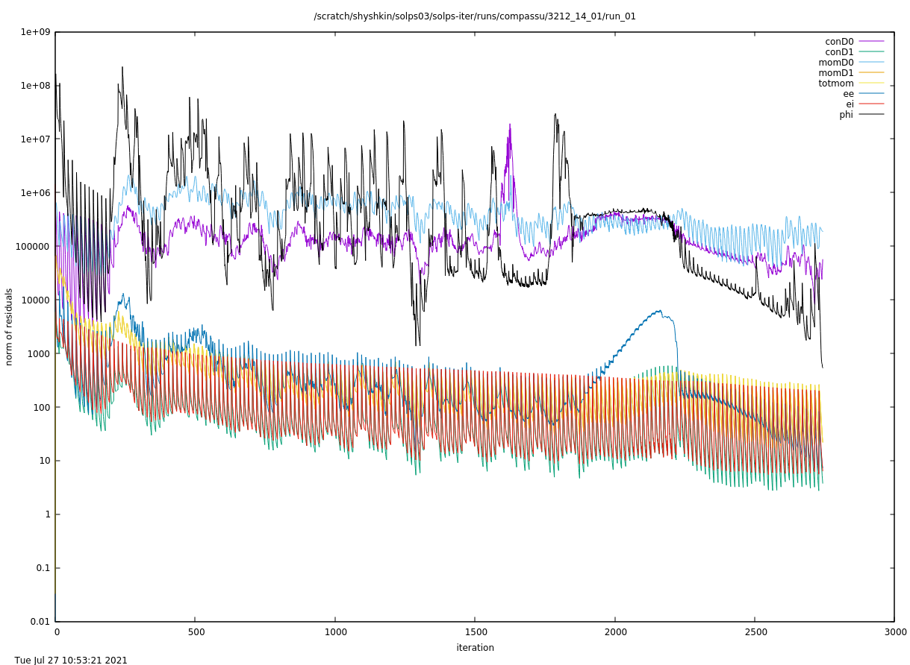

*Fluctuating residuals (`resall_D`) indicate an unstable simulation.*

**Inspect the time evolution using [`b2time.nc` time traces](../my_first_simulation/Running_SOLPS-ITER.md#time-traces-in-b2timenc).** For example, if the outer midplane separatrix electron temperature (`2dt tesepm`) is 5 keV and rising, your simulation is probably diverging. If it's fluctuating wildly, ditto. Again, this can be done while the simulation is running.

**Perform a sanity check of the results.** This is more complicated, because you need to have certain experience, SOL physics insight, and plotting routines at hand. For example, you may plot a picture like this:

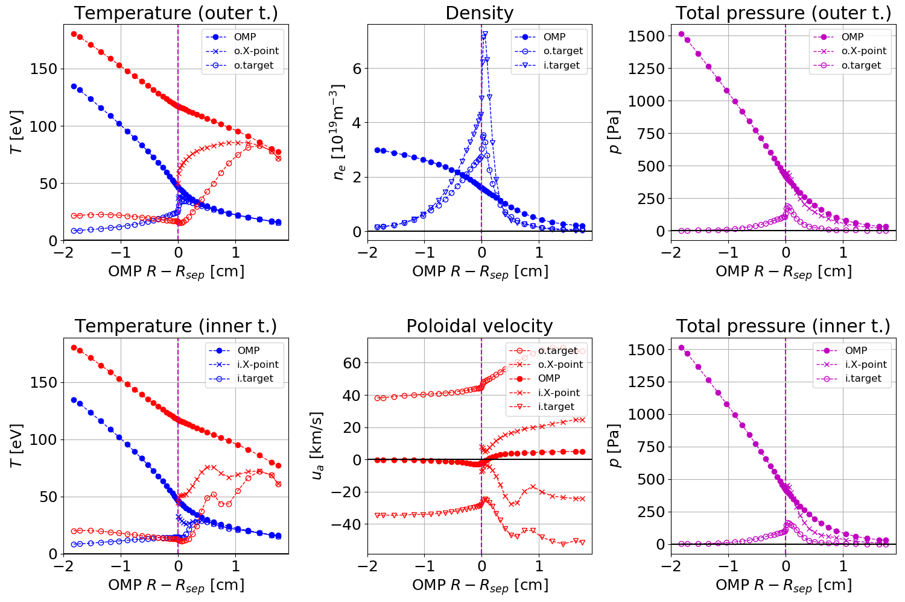

*Key SOLPS-ITER quantities: density $n$, temperatures $T$, parallel/poloidal velocities $u_a$ and plasma pressure $p$. Red stands for ions, blue for electrons and purple for combined. Profile locations: outer midplane (OMP), both sides of the X-point (AKA divertor entrance), both targets.*

Looking at a figure like this, you can ask yourself:

- Are profiles monotonic? (On the inner target, $T_i$ and $u_a$ are non-monotonic. Maybe something weird is happening in the sheath?)
- Do quantities have the expected values? ($T_e$ = 50 eV at the separatrix sounds okay for COMPASS.)
- Are values of different quantities consistent? ($T_i>T_e$ at upstream, that is to be expected when the input power is split equally.)
- What is the transport regime? (On the outer target, $T_e$ doesn't change much from upstream to downstream, which indicates small power and pressure losses. But the total pressure falls to half - that's detachment. Outer target detachment, at COMPASS, with strike point $T_e$ = 40 eV? Something isn't right here.)

Use your brain and follow any clue you have, for instance from inspecting `run.log`.

<a name="soft-landing"></a>**Soft-land the simulation.** If you let the simulation crash, it will not produce output (either `b2fstate` will be missing entirely, or it will contain only a few lines). As a result, you won't be able to inspect the plasma state using `b2plot` and many other post-processing routines. So if you suspect something is going wrong, soft-land the simulation using

```bash
touch b2mn.exe.dir/.quit
```

...and inspect its state.


### How to recognise a crash
<a name="recognise-crash"></a>


**First make sure that the simulation is not running anymore.** This can be done in several ways:

- Check the last modification date of the `b2mn.exe.dir` directory or the `run.log` file. If it's very recent and is updated every few seconds, the simulation is still running. A mounted remote folder may take longer to refresh. Make sure to inspect the [live directory](../installing/installing-in-container.md#simulation-progress) where the simulation is being performed.
- Check if the `b2fstate` file is present. If it is, the simulation has definitely ended. If it's absent, the simulation might still be running or might have crashed. (Usually it's still running, though.)
- If you ran the simulation using a submission script, check if the job has ended (possibly prematurely).
- In the [live directory](../installing/installing-in-container.md#simulation-progress), use the `cpu` command twice, a minute apart. A new line is added to the output with every iteration.
- When launching the simulation with the `b2run` command, this message is printed upon completion:

        [2]    Done                    b2run b2mn >& run.log

**Symptoms of a crash**, if you're sure that the simulation has ended:

- The `b2fstate` file is present, but it contains only a few lines of text.
- The `b2fstate` file is missing altogether.
- `b2plot` commands, such as `echo "phys te surf" | b2plot`, fail, complaining that `"No rule to make target 'b2fplasma'`.
- The simulation did not run as long as you wanted it to.
- The `run.log` file ends in an error message (Ctrl+F "error"). If your simulation was long, its `run.log` may be too large to open quickly. To save the last 100 lines from the `run.log` file into a `short_run.log` file, use the command:

        tail -100 run.log > short-run.log

- Plasma parameters plotted by `2dt tesepm` and similar commands suddenly diverge to strange values.

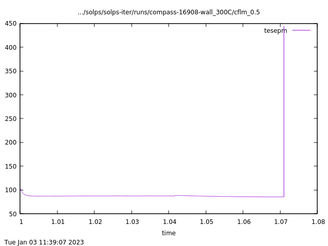

<center><i>I think something went wrong here.</i></center>

If more than two symptoms are present, in all likelikood your simulation has crashed. That's unfortunate, because you have lost runtime and now must figure out why the crash happened, if it's reproducible and how to avoid it in the next run.


### How to diagnose divergence

If you have a diverging run on your hands, you must answer two big questions:

1. What's going wrong, where, and why?
2. How do I fix it?

**Breadth-first approach:** <a name="2D_residuals"></a> Look at profiles of plasma parameters and their 2D maps. This generally requires a `b2fstate` file, so it can't be used after a crash. Relaunch the simulation and [soft-land](#soft-landing) it shortly before the crash. For example, a 2D map of residuals can be plotted with
```bash
echo "phys rco surf" | b2plot
```
...for all species at once or

```bash
echo "phys rco 2 zsel surf" | b2plot
```
...for a particular species number.


/// hint | `b2yn`
The `b2yn` command should do the same trick, but Kateřina hasn't managed to make it work. (Might be something about the source data file `b2ftrack` being mostly empty.) Refer to the [manual](SOLPS-ITER_user_wisdom.md#rtfm).
///

**Depth-first approach**: Grab on to a particular detail (such as the error message in `run.log`) and pursue it. Read up on the physics in textbooks. Search it on [Google Scholar](https://scholar.google.com)<span class="material-symbols-outlined">open_in_new</span>. [Enlist your colleagues](SOLPS-ITER_user_wisdom.md#ask-for-help). Write about it at length on the [SOLPS Slack](http://solps.slack.com)<span class="material-symbols-outlined">open_in_new</span>.

The process of diagnosing and fixing divergence may take months and require multiple meetings, asking several experts, reading the manual back and forth, inspecting the source code, having dreams about black slaves in Uncle Tom's cabin solving SOLPS-ITER equations (true story) and other painful experiences. Don't be discouraged. Take a nap, make coffee, get help, and you'll figure it out. Chances are, someone, somewhere, has already had this problem and *solved it*. They just didn't write about it.


### How to fix divergence

This is a bag of tricks rather than a comprehensive guide. Contributions are welcome.

**Update to the recent `develop` branch.** It is possible that the bug you're encountering was recently created by accident, reported, and promptly fixed.

**Tailor convergence path.** SOLPS-ITER works best in baby steps. Lead it by the hand from the simple to the complex and it will have an easier time converging.

- Do not start from the flat profiles solution. Even a converged `b2fstate` of a completely different simulation of a completely different tokamak (in the same topology) will work better than flat profiles. Ideally, start the simulation from a similar plasma state. This will prevent divergence and save you time waiting for the run to converge.
- Start the simulation with low input power and density. When the initial run converges, raise one or both a little and wait for convergence again. You can do in steps what you can't do in one fell swoop.
- When introducing a new element into your simulation, e.g. gas puff, don't add it all at once. Introduce it step-wise, allowing the simulation to converge and relax after each increment.
- When adding impurities, start from a converged `b2fstate` with the same parameters without the impurities. SOLPS-ITER will automatically add the new ion species.
- Keep copies of `b2fstate` along the path. These will enable you to resume the simulation from an earlier state.

**EIRENE averaging schemes**. One might think: If EIRENE produces statistical noice, perhaps it has an effect on the convergence. Then wouldn't using the already implemented averaging schemes help? Sadly, as stated in the manual, section *5.4 Averaging scheme*:

> This averaging scheme does NOT affect the physical run behaviour as such and therefore does not have any stabilizing effect on the run.

Averaging schemes serve speeding up the code convergence and assessing the statistical error introduced by EIRENE; it does not improve convergence.

**Reduce the time step.** The manual section *5.3 Changing dt* delves into the effect of changing the time step (switch `b2mndr_dtim` in the `b2mn.dat` file), but it seems to conclude that the time step does not really affect convergence quality, as nearly all the solutions follow a similar time evolution of plasma parameters plotted by the `2dt` command.

My own limited experiments have shown that if a simulation is going to diverge, it is going to diverge with any time step from $10^{-4}$ to $10^{-6}$. Examples from a D+C run, all `resco` residual plots:

Simulation examples | Deuterium+carbon, COMPASS
--- | ---
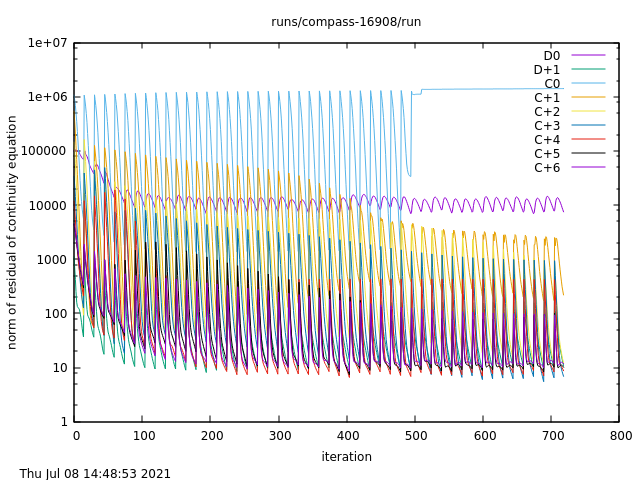 | 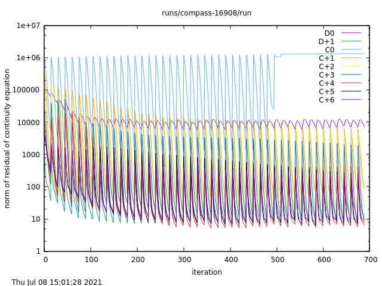
$dt = 100$ $\mu$s, run for 10 minutes | $dt = 50$ $\mu$s, run for 10 minutes
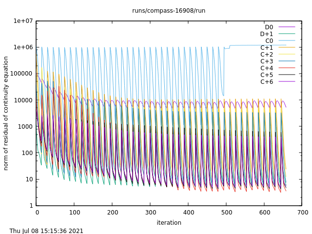 | 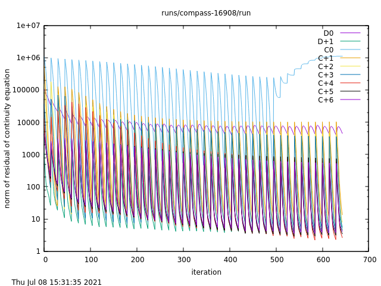
$dt = 20$ $\mu$s, run for 10 minutes | $dt = 10$ $\mu$s, run for 10 minutes
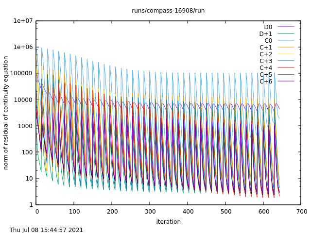 | 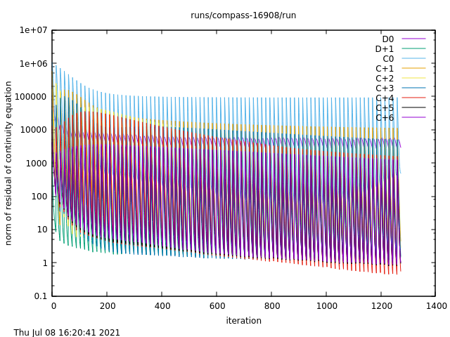
$dt = 5$ $\mu$s, run for 10 minutes | $dt = 2$ $\mu$s, run for 20 minutes
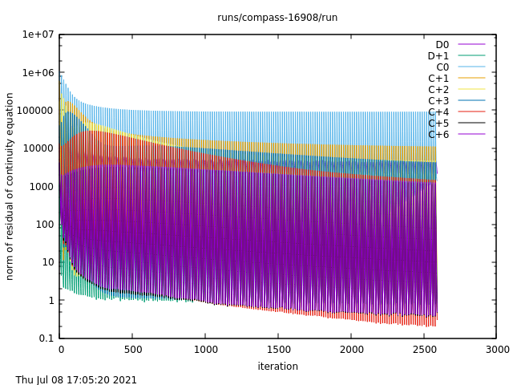 |
$dt = 1$ $\mu$s, run for 40 minutes |

Note that in all cases, the residuals of the neutral carbon C<sup>0</sup> continuity equation eventually start rising. This will be described in [Divergence hunt 1: Carbon sputtering](#divergence-hunt-1-carbon-sputtering). It is caused by the neutral carbon density falling to the minimum ion species density, set by the `b2mn.dat` switch `b2mndr_na_min`. This happens because of carbon sputtering settings in the simulation, *regardless of the time step*. With a smaller time step, it just gets there slower.

**Switch to standalone B2.5 (fluid neutrals)**. While switching to the standalone mode might not make your desired plasma easier to model, it will typically speed up the convergence (divergence) and might bypass EIRENE errors. The relevant switches are described in the manual section *5.1.5 b2mn.dat*, as well as in Q&A: [How do I switch between EIRENE and standalone B2.5?](Questions_and_answers.md#switch-coupled-standalone).

**Begin run with a small time step.** When converging from flat profiles in an EIRENE simulation, first run with time step dt = 10<sup>-6</sup> s to "allow the sources of neutrals calculated by EIRENE to be calibrated with the neutrals sources by B2.5". [[Reksoatmodjo PhD thesis](https://drive.google.com/file/d/1Pvn_P680cKr8y-AVjITFkch4MJfZ3bK4/view)<span class="material-symbols-outlined">open_in_new</span>, page 92]

**Increase diffusion coefficients in the divertor volume**. This can help with numerical instabilities. [[Meier 2017]](https://www.sciencedirect.com/science/article/pii/S2352179116301545)<span class="material-symbols-outlined">open_in_new</span>


### Divergence hunt 1: Carbon sputtering

> This is a story from 2021, when Kateřina was first adding impurities to her COMPASS simulations. The COMPASS tokamak had graphite divertor plates, which acted as a source of carbon impurities via physical and chemical sputtering. However, adding carbon resulted in the simulation crashing in a few minutes...


*Residuals of C<sup>0</sup> stop evolving in an coupled run (`resco`).*

The first ominous sign was that, after a certain amount of iterations, the neutral carbon density residuals stopped evolving with time. A while longer, and the simulation crashed. I decreased the time step, thinking my usual $dt = 10^{-4}$ s was too much for simulations with impurities. It increased the amount of iterations until the flattening occurred, but the crash happened all the same.

Since the weird residuals belonged to the continuity equation, I stopped the simulation before it crashed and looked at the carbon species densities using the following `b2plot` script (refer to the [B2plot tutorial](../my_first_simulation/Processing_SOLPS-ITER_output.md#b2plot)):

    # Set the figure orientation and configure common subfigure elements
    phys a4l 4 2 page logf aspc vesl 1.5 lbsz
    0.3 rmin 0.8 rmax -0.4 zmin 0.4 zmax

    # Plot density of each carbon ionisation state in turn
    na 2 zsel 9e3 fmin 1.1e4 fmax surf
    na 3 zsel 1e3 fmin 1e17 fmax surf
    na 4 zsel 1e3 fmin 1e17 fmax surf
    na 5 zsel 1e3 fmin 1e17 fmax surf
    na 6 zsel 1e3 fmin 1e17 fmax surf
    na 7 zsel 1e3 fmin 1e17 fmax surf
    na 8 zsel 1e3 fmin 1e17 fmax surf

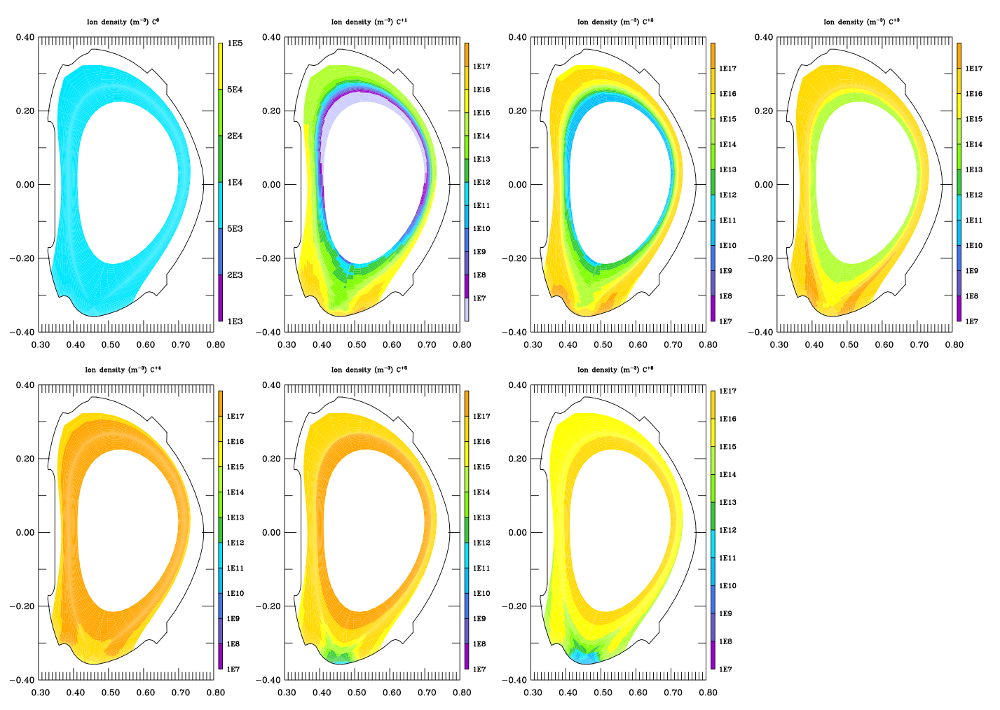

For some reason, the C<sup>0</sup> density was 10<sup>4</sup> m<sup>-3</sup> across the entire computation domain. Well, maybe the SOL temperature was so high that any neutral carbon was quickly ionised? I checked the $T_e$, setting the colour bar extent to focus on low temperatures:

```bash
echo "phys te 0.0 fmin 40.0 fmax surf" | b2plot
```

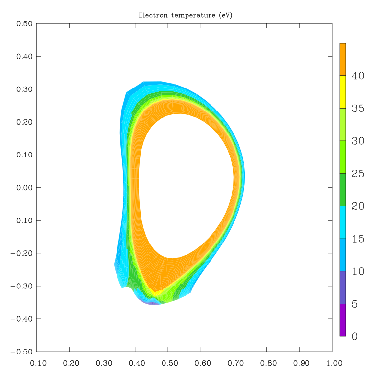

Carbon ionisation energy is 11.16 eV (as stated in the `b2plot` output), so there should have been some neutral carbon surviving in the PFR at least. Why was there none?

I tried breaking the simulation up into smaller parts and drawing the results in individual time snaps. It turned out that C<sup>0</sup> density fell with every iteration, from 10<sup>15</sup> m<sup>-3</sup> (flat profiles solution) to what you see above. The moment it hit 10<sup>4</sup> m<sup>-3</sup>, the C<sup>0</sup> continuity equation residuals stopped evolving. It seemed like there was a floor limit to how low a density can get? Eventually, I discovered the B2.5 switch `b2mndr_na_min` (see its description in our [B2.5 switch documentation viewer](/solps-doc/extras/b2input)), which sets the minimum ion species density. Its default value is 10<sup>4</sup> m<sup>-3</sup>.

So! It appeared that neutral carbon was depleted from the simulation domain, globally hit the minimum density, and its solution stopped evolving with time. Where did it go? And why was there still plenty of ionised carbon remaining? The question how the crash happened receded into the background, because I *wanted* neutral carbon in my simulation. Fixing that took priority before finding the physical nature of the crash.

Since neutral carbon should have been produced by sputtering, I searched how sputtering was controlled. The manual confused me initially. In reality, there are two sets of sputtering switches:

- A group of "sputtering model switches" in `b2mn.dat`, all beginning with `b2stbr`. These control sputtering in B2.5 calculations, that is, in standalone simulations. See them in the [B2.5 switch documentation viewer](/solps-doc/extras/b2input).
- Paragraph *\*\*\* 6B. Data for local reflection and sputtering models* in `input.dat`, most importantly switches `ILSPT`, `ISRS` and `ISRC`. These control sputtering in EIRENE calculations, that is, in coupled simulations. See the [EIRENE manual](https://eirene.de/Documentation/eirene.pdf)<span class="material-symbols-outlined">open_in_new</span>, section *Input data for surface interaction models*.

The SOLPS manual doesn't say that these are independent groups of inputs which come into effect depending on who's handling the neutrals. Eventually, I gathered as much from the SOLPS Slack and experience. I zeroed in on the EIRENE input file, `input.dat`.

Reading `input.dat` is painful, but it can be done by deciphering the EIRENE manual. I discovered sputtering controls in the lines describing surface properties. (Refer to [Impurities: Carbon sputtering](../feature_blog/Impurities.md#control-carbon-sputtering) for details.) The relevant lines looked like this:
```
SURFMOD_1_CARBON_SPT_580K
 1    12    -1     0     1
```
Going number by number and looking up their meaning in the EIRENE manual, I found that this line *turned chemical sputtering off*, despite my explicit instructions to DivGeo to turn it on. If that line in `input.dat` had been generated correctly, it would have read:
```
SURFMOD_1_CARBON_SPT_580K
 1    12    -1    -1     1
```
Chemical sputtering is the main source of carbon in tokamak plasmas. So that was why neutral carbon was disappearing from the simulation! What was provided with the flat profiles solution was quickly ionised. Carbon which struck the wall was absorbed without recycling. And there was no source of neutral carbon via sputtering. Ionised carbon, presumably, enjoyed prolonged pump-down time due to magnetic confinement and significant reserves in the confined plasma. But if the simulation hadn't crashed from the C<sup>0</sup>-related issues, the carbon ions would have presumably disappeared in time as well. The core boundary conditions were set to zero flux of carbon ions, so **there was no net carbon source, only a sink at the fully absorbing walls**.

I'm not sure what eventually *killed* the simulations. It might have been that ionised carbon densities fell too low as well, the charged fluid was greatly accelerated by friction with deuterium and the thermoelectric force, viscous heating produced unphysical temperatures and other plasma parameters, and SOLPS eventually decided it wasn't worth continuing the run. It didn't particularly matter to me at the time.

This was a reproducible crash, caused by an error in producing default EIRENE input files. It would have been perfect for a bug report. But I never made one, because I was a noob and I was afraid. But at least I found what was wrong and was able to correct it! After replacing ` 0` with `-1` (complete with the blank space before 0) in `input.dat`, the simulations ran fine and I never encountered this problem again.

This divergence story had a happy ending.

/// warning | It took months
Written like this, the divergence hunt seems like a logical progression of steps which could have been accomplished in one afternoon. In reality, though... You know how they say you were the fastest sperm? You zipped to the egg, penetrated its cellular wall and merged your genetic load with its. Well. [It's not like that](https://www.sapiens.org/biology/spermatogenesis-badass-sperm-myth/)<span class="material-symbols-outlined">open_in_new</span>. The same goes for this story.

Browsing my notes from 2021, I see mentions of diverging carbon simulations from May to August. There is a detailed study of B2.5 boundary conditions (but no sputtering switches), repeated calls to contact Fabio Subba (which I never did), and a list of thirteen measures to fix the simulation (of which I tried nine, to no effect). 95 % of the notes concern other things. Then there's a one-month break... and the issue of diverging carbon simulation vanishes.

My point is: **Take heart**. You will find a solution to your divergence eventually, even if it's "I don't need carbon *that* badly". And if you uncover the root of the problem and are able to address it, [write about it here](../Contribute.md)! The leads I should have followed are more apparent in hindsight. Hopefully, by accumulating stories of mending divergence, we can distill rules of thumb to shorten the Brownian fumbling.
///


### Divergence hunt 2: EIRENE strata

> This is a story from 2023, when Kateřina was making her heat flux limiter scan. The simulation was of the COMPASS tokamak H-mode in pure deuterium. While babysitting a 5x5 grid of coupled simulations, she wrestled with two problems: simulations randomly [restarting from flat profiles](#the-danger-of-timestamps) and mysterious, sudden crashes...


*Time evolution of electron temperature on the outer midplane (`2dt tesepm`). There is convergence at the beginning, followed by a sudden jump and a crash.*

I looked to the end of `run.log` and saw this:

```
XTIM(ISTRA)=    29.9603174603175
ERROR IN VELOEI
NPANU            5
IREI            1  0.000000000000000E+000
EIRENE EXIT_OWN ENTERED FROM PROCESSOR            0
Run apparently failed: Optional files not moved
```

I had no idea what most of the words meant, but I gathered there was a problem with EIRENE. The EIRENE manual said that `VELOEI` was a routine which calculated electron-impact collisions. Not very helpful. I scrolled through `run.log` unhappily until my eyes fell upon the tally printout. In every B2.5-EIRENE iteration, intermediate results are printed out just for desperados such as I. The following line piqued my interest:
```
tflux:   1.0387084E+56  3.6568542E+41  4.0123014E+43  6.0231569E+41  0.0000000E+00  2.9567243E+15  1.5507629E+19  3.9618810E+15  1.9964270E+54  9.9604863E+17  6.2415091E+18  6.2415091E+18  6.2415091E+18
```
According to the SOLPS-ITER manual, `tflux` gives the flux strength for the first #1 strata from `b2.neutrals.parameters`. I had no idea what a *stratum* was, but it did seem suspicious that in the previous iterations, `tflux` had values only about:
```
tflux:   3.6566185E+21  8.6639188E+19  3.1764206E+21  8.9073048E+19  2.0026835E+17  1.2713032E+16  1.9079832E+17  1.3954952E+16  5.2018662E+18  1.5476509E+18  6.2415091E+18  6.2415091E+18  6.2415091E+18
```
The order-of-30 increase only happened in the last iteration. Everything seemed fine until then. Was this a numerical error?

I transferred one of the crashed simulations from Soroban to Marconi Gateway, where I had installed the SOLPS-ITER version `3.0.8-29-gf89a6a23`, which Oleg Shyshkin had deemed "safe". I ran it from the same `b2fstati` as previously, trying to reproduce the error - but it did not crash. It ran just fine. I transferred the result back to Soroban. It ran just fine.

Relaunching the parameter scan again and again, I discovered that this error happened at *random*. When resubmitted from the same `b2fstati`, the simulation usually ran through the danger point without a glance back.

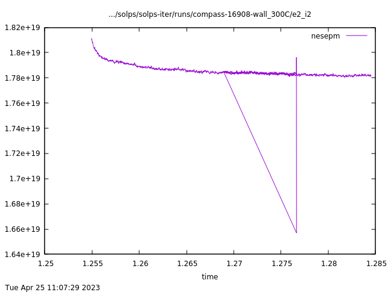

*Time evolution of outer midplane electron density (`2dt nesepm`). The simulation starts in the upper left corner, runs for about a day and is restarted at $t$ = 1.269 s. At $t$ = 1.278 s, it crashes (vertical line) and is relaunched from the previous `b2fstati` (diagonal line). It continues running for another day without a problem, roughly reproducing the previous convergence path.*

I settled into a daily routine where I ran the 25 simulations for 20 hours at a time and checked on them in the morning. If they had converged, great. If they weren't converged yet, I restarted them from their `b2fstate`. If they had crashed, I either restarted from `b2fstati` or, believing the solution to be corrupted in some way, seeded them from a nearby converged `b2fstate`.

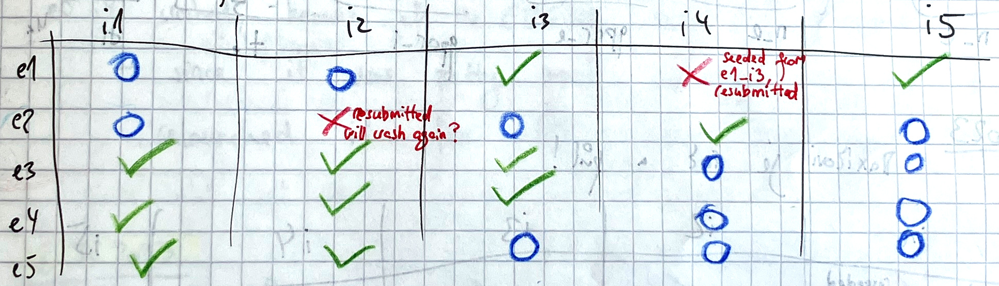

<center><i>Morning check-up on the parameter scan. Green tick = converged. Blue circle = pending, to be resubmitted. Red cross = crashed.</i></center>

In the meantime, I scoured the SOLPS documentation, looking for what the numbers in `tflux` meant. They were fluxes for some strata, but what were strata? The research eventually yielded a [dictionary entry](SOLPS-ITER_user_wisdom.md#stratum) and the Q&A [What is a "stratum"?](Questions_and_answers.md#stratum). The `flux` values which most commonly went haywire represented the neutral fluxes from the `W` and `E` boundary. That is, there was a huge influx of neutrals from the divertor targets, especially the inner one. The rest of `run.log` was the code complaining there were NaNs everywhere. Just prior to the `tflux` printout, the log said:
```
b2stbc: wrong_flow returned from b2stbc_phys
```
I searched the SOLPS-ITER source code using Visual Studio Code, and found `b2stbc.F` was a B2.5 routine responsible for calculating the boundary conditions. This, again, indicated that something weird had happened on the divertor targets. Another line which came up consistently in my notes was:
```
ERROR IN COLLION  UNKNOWN TYPE OF COLLISION
EIRENE EXIT_OWN ENTERED FROM PROCESSOR
```
Sadly, I never managed to discover what it meant.

Since the crash seemed to happen at random and was not reproducible, I concluded that nothing was wrong with my simulation and that this divergence was accidental. I still didn't know why it happened, but it wasn't a huge problem... until I added carbon.

Having sputtered carbon impurities in the simulation worsened the divergence exponentially. No longer was it accidental and sudden; now every run launched had about a 50:50 chance of crashing. (Also, I was still struggling with [reverting to flat profiles](#the-danger-of-timestamps), despite careful usage of the `cp` and `correct_b2yt_timestamps`.) It came to a point when production runs were impossible. I took a radical step. Full of apprehension that I was missing something completely basic, I wrote on the SOLPS-ITER Slack.

Xavier Bonnin wrote back with several pieces of advice. Among others, he said to try increasing the minimum ion density. This was controlled by the `b2mn.dat` switch `b2mndr_na_min`; its default value was 10<sup>4</sup> m<sup>-3</sup>. Xavier told me to increase it to something like 10<sup>8</sup> m<sup>-3</sup>. I did so... and the simulations stopped diverging.

In hindsight, I still don't know what cause the sudden crashes or what the error messages meant. The steep radial gradients in density may have been at fault. To reproduce H-mode $T_e$ and $n_e$ profiles, I used profiles of transport coefficients for deuterium $D_n$ and $\chi_{e,i}$. It may be that in some areas of the SOL, densities fell extremely low. The ion fluid, not held back by inertia, was accelerated to high velocities and consequently produced large heating via viscosity. I do have a note from April saying "boy, Joule heating 10<sup>171</sup> W, that's bad". Elevating the floor for ion density mitigated this unphysical heating. Who cares what happens in areas with $n_a < 10^8$ m<sup>-3</sup> anyway? I've been using `'b2mndr_na_min'   '1e8'` ever since.


## Make SOLPS-ITER run faster

Here tips and tricks for accelerating SOLPS-ITER runs are given. Some have been tried, others are (sadly) still theoretical.

/// hint | References on SOLPS-ITER speed-up
- D. Coster 2019, [SOLPS speed-up](https://iterorganization.sharepoint.com/:b:/r/sites/SOLPS-ITER/Shared%20Documents/General/SOLPS-ITER%20meetings/EU_Training_session/SOLPS-ITER_speed-up.pdf)<span class="material-symbols-outlined">open_in_new</span>
- E. Kaveeva 2018, [Speed-up of SOLPS-ITER code for tokamak edge modeling](https://iterorganization.sharepoint.com/:p:/r/sites/SOLPS-ITER/Shared%20Documents/General/SOLPS-ITER/EU_Training_session/Speed_UP_SOLPS-ITER_14-11-2018.pptx?d=wbf9bbdb6447244f1afb17a68449dbb3b&csf=1&web=1&e=MGldng)<span class="material-symbols-outlined">open_in_new</span> - speed-up chemes
- M. Baelmans 2019, [Error assessment and code speed-up for SOLPS-ITER](https://iterorganization.sharepoint.com/:b:/r/sites/SOLPS-ITER/Shared%20Documents/General/Manuals%20and%20Documentation/SOLPS-ITER_Eirene_averaging.pdf)<span class="material-symbols-outlined">open_in_new</span> - EIRENE averaging schemes
///

**Tailor the convergence path**. Cases with fewer ion species and without drifts are more stable, can endure higher time step and solve fewer equations. Cases with low density are better behaved than cases with high density, presumably because atomic physics is less complicated at high temperatures. Cases which are already converged for some input parameters are better behaved than the flat profile solution. Introducing changes step-wise carries less chance of divergence than jumping straight from start to finish. Another version of this trick can be used while branching out runs, for instance while making parameter scans. First, procure a converged case in the centre of the parameter space, and branch it out to seed the other runs.

**Increase the time step**. The manual, section *5.3 Changing dt*, shows that if the simulation is inherently stable (no inconsistent inputs, no metastable states), changing the time step essentially takes it along the same convergence path, just faster. That said, you have no way of knowing in advance whether you're exploring parameter space with a single, well-defined optimum where the simulation will happily converge. Increasing the time step may make your simulation unstable, so always keep around copies of `b2fstate`.

**Use parallelisation**. This applies if you're running a coupled (B2.5+EIRENE) case. It is usually accomplished by using [submission scripts](../my_first_simulation/Running_SOLPS-ITER.md#official-submission-scripts). EIRENE, as a Monte Carlo code which calculates the fates of many independent particles, naturally takes to parallelisation. In an unparallelised run, it will take up 85 % of SOLPS-ITER runtime; this fraction can be easily reduced to 50 % by parallelising EIRENE on 8 CPUs.

**Run multiple simulations at once**. Provided you have enough computational power, launch several independent SOLPS-ITER runs. Looking after them feels like teaching at a kindergarten, with individual runs randomly crashing or ignoring `b2fstati`, but it's still faster than launching them in succession. In the same vein, if you have access to several servers with the same SOLPS-ITER installation, run independent runs on all of them.

**Run simulations over the weekend**. Computational clusters tend to be less busy on the weekend, so not only can you hog more processors, but also the individual runs might go faster. Plus, there's less of a chance of crashes due to busy file system.

**Don't start from the flat profiles solution**. Even if it's a different plasma in a different machine, as long as the number of cells is the same simply copying `b2fstate/i` into the new run will aid its convergence. If the number of cells doesn't match, use the `b2yt` command (refer to the manual for exact instructions). In the words of Fabio Subba, 2021:

> Convergence of the run and even the result might depend on the starting profiles. Flat profile case is not the best choice. Fastest convergence is reached when restarting from the similar run. Important to have the same grids structure and can be even different machine. The main reasons of this dependence is the following: the transport equations are strongly nonlinear and unphysical, or far from real (like flat profiles) can drive to wrong metastable solutions.

**Switch to fluid neutrals**. As [[Carli, 2021]](https://onlinelibrary.wiley.com/doi/10.1002/ctpp.202100184)<span class="material-symbols-outlined">open_in_new</span> argues, the latest version of fluid neutrals (or standalone B2.5) is accurate enough to replace EIRENE if you really gotta go fast.