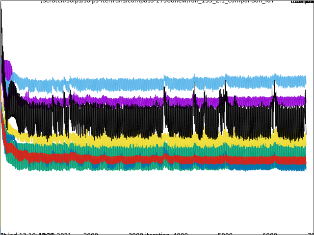
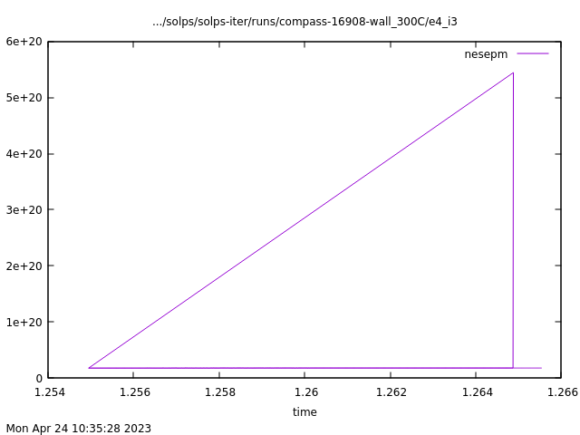
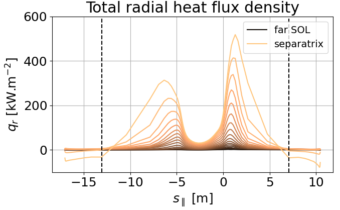
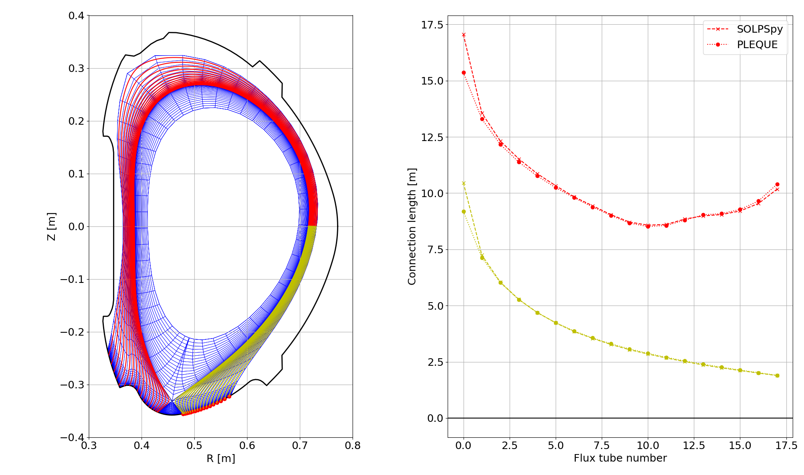

# Questions and answers

This document records the questions we've had about SOLPS-ITER and their answers. It covers the following topics:

- [B2plot](#b2plot)
- [Input files and boundary conditions](#input-files-and-boundary-conditions)
- [Post-processing SOLPS-ITER results](#post-processing-solps-iter-results)
- [Running SOLPS-ITER](#running-solps-iter)
- [Physics of SOLPS-ITER](#physics-of-solps-iter)
- [Miscellaneous](#miscellaneous)

/// tip | Avoid duplication
You are welcome to submit new questions and answers, but first peruse the search bar on the upper right. The answers of many questions are already covered in standalone tutorials, and we wish to avoid duplication.
///

## Unanswered questions

What is the correct value of the ion sheath heat transmission coefficient $\gamma_i$, 5/2 or 3/2?

Why is the kinetic energy flux to the target multiplied by zero in non-drift runs?

Formulas for some boundary conditions (like `BCENE=12`) are in the manual. Where can I find the others?

What is the difference between sheaths in boundary conditions `3` and `12`?


## B2plot

/// hint | SOLPS Tutorials cover this
See [Processing SOLPS-ITER output: B2plot](../my_first_simulation/Processing_SOLPS-ITER_output.md#b2plot).
///

**Should I take the time to learn B2plot?**<br>
Yes, unless you have a powerful in-house post-processing tool (such as [Quixote](https://ipar.gitlab.io/quixote/)<span class="material-symbols-outlined">open_in_new</span>) complete with a programmer ready to accommodate your needs. B2plot is useful for visualising results [while the simulation is a work in progress](../my_first_simulation/Running_SOLPS-ITER.md#monitoring-a-solps-iter-run), its utility [`wlld`](../my_first_simulation/Processing_SOLPS-ITER_output.md#wlld) handily calculates target heat loads (though you can do that yourself if you [understand energy fluxes](../feature_blog/Energy_fluxes_deep_dive.md)), and it can perform [line-of-sight integration](../feature_blog/Interpretative_simulations_of_COMPASS.md#bolometry) (though you can do that with [Cherab](https://www.cherab.info/)<span class="material-symbols-outlined">open_in_new</span>). Just don't draw figures for articles with it. Seriously. Don't use DivGeo screenshots and B2plot pictures outside of internal presentations.

**The `b2plot` axes don't display properly. What do I do?**<br>


To fix this without closing the figure, change the size of the figure by dragging its frame. Gnuplot will start behaving again.

**When I run `b2plot`, it says `gnuplot: unable to parse 'BACKGROUND'. Using black` and the image background is black.**<br>
Try a combination of these:
```
module load gnuplot
module unload gnuplot
```

**`2dt nesepm` produces a messy line.** <a name="2dt-messy-line"></a> <br>


Check the switch `b2mndr_stim` in your `b2mn.dat` file. If it's set to a negative value, the simulation results are appended to the previous runs. The `time` on the X axis here is simulation time, recorded in `b2fstate`. What happened here is that the simulation ran from t = 1.255 s until 1.265 s, when it suddenly diverged (surge upward in `nesepm`). It was restarted (diagonal line back to 1.255 s) and run again. The divergence didn't occur this time and the run continued almost until 1.266 s (short horizontal line at bottom right). To remove these artifacts of history, set `b2mndr_stim` to 0 for one iteration, and then change it back to a negative value.

**How do I set colorbar extent individually for all plots?**<br>
When plotting several similar quantities together, B2plot automatically gives them the same colorbar extent, rendering them unreadable. To set its extent individually for every plot, use:
```bash
echo "phys na 0.0 fmin 0.0 fmax surf" | b2plot
```
By setting the colorbar extent to `0.0`-`0.0`, B2plot stops to think and uses a different extent for each plot.

/// note | Did you know British spelling makes you racist?
"Colorbar" is the legend of a colour-coded figure. [[Matplotlib documentation]](https://matplotlib.org/stable/api/_as_gen/matplotlib.pyplot.colorbar.html)<span class="material-symbols-outlined">open_in_new</span> "Colour bar" is *"a social and legal system in which people of different races are separated and not given the same rights and opportunities"*. [[Cambridge dictionary]](https://dictionary.cambridge.org/dictionary/english/colour-bar)<span class="material-symbols-outlined">open_in_new</span>
///


**Can I access `b2plot` data as numbers?**<br>
Yes! Simple 1D plots can be converted to values using the `write` command, for example:
```
echo "phys sx xpar write 19 f.x" | b2plot
```
The numbers can be found in `b2pl.exe.dir/b2plot.write`.


## Input files and boundary conditions

/// hint | SOLPS Tutorials cover this
See [Creating a new SOLPS-ITER simulation: Procure input files](../my_first_simulation/Creating_a_new_SOLPS-ITER_simulation.md#procure-input-files) and [Adjusting SOLPS-ITER input](../my_first_simulation/Adjusting_SOLPS-ITER_input.md).
///

**What is the default for boundary conditions? `b2ah.dat` ("standard" BCs) or `b2.xxx.parameters` ("physics" BCs)?**<br>
`b2ah` is the default because if the switches `b2stbc_boundary_namelist`, `b2stbr_neutrals_namelist` and `b2tqna_transport_namelist` are not specified in `b2mn.dat`, their value is assumed to be 0, meaning that `b2ah.dat` is used. However, this doesn't mean that you *should* use `b2ah.dat` for specifying boundary conditions.


**How should I choose the time step?**<br>
Generally, SOLPS-ITER time step will be between 10<sup>-4</sup> s and 10<sup>-7</sup> s. (That's the difference between modelling the same time period for one day and for three years.) In simple simulations (pure deuterium, no drifts, simple boundary conditions), start with 10<sup>-4</sup> s and, if the simulation diverges or the particle balance isn't accurate, move down.


**<a name="switch-coupled-standalone"></a>How do I switch between EIRENE and standalone B2.5?**<br>
In `b2mn.dat`, find these lines:
```
'b2mndr_eirene'                   '1'
'b2mndr_rescale_neutrals_sources' '1.0e-10'
```
The first one switches EIRENE on, the second one scales down fluid neutral sources (see chapter A.4 of the manual). To turn EIRENE off and enable fluid neutrals:
```
'b2mndr_eirene'                   '0'
'b2mndr_rescale_neutrals_sources' '1.0'
```
Leave the `b2mndr_rescale_neutrals` switch as it is (at `1.0`). Additionally, in the [SOLPS work environment](../installing/solps-iter-codebase.md#how-to-initiate-the-solps-iter-work-environment), set the following environment variable:
```
setenv STAND_ALONE yes
```

**<a name="transport-parameters-12s"></a>I copied the `b2.transport.parameters` file from the manual. What do all the 12's stand for?**<br>
The example file reads:
```
&transport
flag_dna=1, parm_dna=12*0.4,
flag_dpa=0, parm_dpa=12*0,
flag_vla=0, parm_vla=12*0,
flag_vsa=0, parm_vsa=12*0,
flag_hci=1, parm_hci=12*1.6,
flag_hce=1, parm_hce=1.6,
flag_sig=0, parm_sig=0,
flag_alf=0, parm_alf=0,
/
```
Here, `12*` means "12 times the following value". It's handy when you have a lot of plasma species (you model a lot of impurities) and you don't want to clutter the file too much. This notation can be used in nearly all input files. As a note, in this particular simulation (D+C+He) there are 12 species including neutrals. When you use this file, make sure to adjust it according to the number of species in your simulation.


**Can I make comments in the SOLPS-ITER input files?**<br>
In some, yes. For example, `b2mn.dat` file readers ignore any line which doesn't follow the normal switch structure
```
'name_of_switch' 'its_value'
```
So you can write comments there in any way you wish (starting the line with \#, %, <\!-- …), the code will just ignore the extra text. However, do not write comments into `input.dat`. Don't breathe too hard on `input.dat`.


## Post-processing SOLPS-ITER results

/// hint | SOLPS Tutorials cover this
See [Processing SOLPS-ITER output](../my_first_simulation/Processing_SOLPS-ITER_output.md).
///

**How can I access SOLPS-ITER output?**<br>
There are some built-in routines, such as [B2plot](../my_first_simulation/Processing_SOLPS-ITER_output.md#b2plot) or the [SOLPS GUI](https://static.iter.org/imas/assets/solps-iter/html/index.html)<span class="material-symbols-outlined">open_in_new</span>. Most users, however, end up writing their own packages, such as [Quixote](https://ipar.gitlab.io/quixote/)<span class="material-symbols-outlined">open_in_new</span>. Refer to [Processing SOLPS-ITER output](../my_first_simulation/Processing_SOLPS-ITER_output.md) and, if at all possible, don't reinvent the wheel.

**To get quantities at the target, should I use guard cell data (like 2PMF does) or last plasma cell data (like `wlld` does)?**<br>
It depends on the quantity. For fluxes, take the flux into the guard cell, for temperature and density take the last plasma cell. Plasma parameters inside guard cells are only useful for [two-point model formatting](https://iopscience.iop.org/article/10.1088/1361-6587/aaacf6)<span class="material-symbols-outlined">open_in_new</span>, but not while calculating e.g. momentum loss factors.

**I added plot zones to an existing run, but they don't show up in the output of `echo "1111 wlld" | b2plot`.**<br>
(Asked by Eric Emdee at the SOLPS Slack, and answered by Xavier Bonnin.)

> After declaring the plot zone in DivGeo, you have to `Output` the DivGeo file and re-run `Uinp`. But before you do re-run `Uinp`, you need to delete the existing files it had already created in your previous attempt. The `Uinp` screen output tells you that there are some files already found that it does not try to write again. The plot zones are, I believe, written out in `b2.neutrals.parameters` or `b2.user.parameters` (can't remember right now).

**In `wlld` output, why is `Whtpl` some 30 % higher than (`fhe`+`fhi`)/`sx`?**<br>
Because `fhe` and `fhi` aren't the only components of `Whtpl`. See the [Energy fluxes deep dive](../feature_blog/Energy_fluxes_deep_dive.md).


## Running SOLPS-ITER

/// hint | SOLPS Tutorials cover this
See [Running SOLPS-ITER](../my_first_simulation/Running_SOLPS-ITER.md).
///

**The simulation ended sooner than I wanted it to.**<br>
First, find if it [crashed](Common_pitfalls.md#how-to-recognise-a-crash). If not, it may be because SOLPS-ITER has several switches which specify when the simulation should stop. If just one of the conditions is violated, the simulation will end. Typically, you'd use `b2mndr_ntim` to set the number of iterations and `b2mndr_elapsed` to set the real time of running the simulation. If you want to control the simulation length in hours, pick a ridiculously large number of iterations. Occasionally, you'll set the number of iterations to `1` (like when producing extra output with `'b2wdat_iout'   '1'`). Check that.

**When I run `b2run` directly, I can see the files in the `run` folder updated as the simulation proceeds and I can track the progress using the `cpu` command. But when I use a submission script, the files remain unchanged and the `cpu` command thinks nothing is currently running.**<br>
Submission scripts typically copy the simulation folder over into their work memory so that they can access it faster. (Example with the container installation is described [here](../installing/installing-in-container.md#simulation-progress).) The live directory is simply somewhere else. Find the submission script source code, track the live directory and run `cpu` there.

**What are all the files which define a finished run?**<br> <a name="key_files"></a>
It depends on how you want to use it. The main results of a simulation are stored in `b2fstate`. This holds the basic quantities (densities, velocities, temperatures), from which SOLPS-ITER can calculate everything else. However, `b2fstate` alone doesn't make an entire simulation. Post-processing can't be done without the plasma geometry, so for example the [Cherab](https://www.cherab.info/)<span class="material-symbols-outlined">open_in_new</span> package requires these files:
```
b2fstate
b2fplasmf  #up-to-date version!
b2fgmtry  # copied from baserun
input.dat
b2mn.dat
```
If you're loading EIRENE results, you will also need some `fort` files. If you're loading time traces, you'll need `b2time.nc`. Et cetera. Finally, if your goal is to archive a run so that it can be relaunched in the future, use the process described in [Remote access: Transferring SOLPS-ITER runs](Remote_access.md#transferring-solps-iter-runs). You need both `run` and `baserun`, complete with the files any links may have been pointing to. Archiving runs is extremely useful with published simulations. You never know when a colleague might write: "I want to compare my run to yours, do you still have it?"


**Every EIRENE call drives the residuals up. In what part of this cycle should one take the "final solution"?**<br>
Usually, one takes the plasma state just before the next EIRENE call, as saved in `b2fstate`. Ideally, one uses EIRENE averaging schemes. See the [SOLPS manual](SOLPS-ITER_user_wisdom.md#rtfm).

**Does restarting the code affect the solution? For instance, is there a difference between running the code for 8 hours and running it for 4 hours and restarting it for another 4 hours?**<br>
There might be. In the words of Fabio Subba, paraphrased by David Tskhakaya, 2021:

> Yes, the restarting of SOLPS-ITER is not perfect: there can be possible “problems” when restarting the run, or there can be some disagreement with nonstop runs; this is related to the fact that code do not (can not) save all the information on the physical and numerical state of the system (I assume). They show up rare, usually are explained and corresponding bugs are fixed, but there is no guarantee that there will be no new ones; so we have to leave with this.


**Running `b2run b2yn` returns "no rule to make target". What do I do?**<br>
This is a common error message, usually displayed when you try to run a `b2*` script and one of its input files (`b2*.dat`, `b2fstate`...) is missing. Create the file `b2yn.dat` in your run directory. This file contains instructions what `b2yn` should do, so of course it won't start without it. An example is given in the manual, section 3.12  *`b2yn`, display the progress of inner B2.5 iterations*:
```
*idout    (int, char*80, free format)
0, 'cpte'
```


## Physics of SOLPS-ITER


**Why does changing the ion heat flux limiter change the electron heat flux?**<br>
It changes $T_i$, which propagates to $T_e$, which propagates to the electron heat flux. Read [Kateřina's PhD thesis](../files/Hromasova_PhD_thesis.pdf)<span class="material-symbols-outlined">download</span>, chapter 5 *Heat flux limiting*.


**How important is exact separatrix position in SOLPS modelling?**<br>
Quite important. Separatrix *density* is often used for feedback control in modelling, so knowing where the separatrix is important. In contrast, separatrix *temperature* does not vary much (at least in the conduction-limited regime), so its value isn't of that much importance. Finally, because there are larger density gradients in H-mode (due to pedestal), the exact separatrix position is more crucial in H-mode than in L-mode. See also [Kateřina's PhD thesis](../files/Hromasova_PhD_thesis.pdf)<span class="material-symbols-outlined">download</span>, chapter 4 *Magnetic equilibrium reconstruction errors*, and [Magnetic equilibrium reconstructions](../feature_blog/Magnetic_equilibrium_reconstructions.md).


**How much should one trust the predictive capabilities of SOLPS-ITER?**<br>
You have basically three options. One, you can make educated guesses for the input parameters based on interpretative simulations of similar discharges on existing tokamaks. Two, you can use scaling studies, for example for the SOL power width. Three, you can estimate uncertainties in the input parameters and perform parameter scans. In the end, you'll be happy if you're certain about the order of magnitude, especially in neutral-related parameters.


**Can you model 3D limiter geometry with SOLPS-ITER?**<br>
No, because SOLPS-ITER is inherently 2D. That means 3D effects (a single lithium divertor tile, toroidally asymmetric limiters) cannot be modelled based on first principles. Depending on whether you suspect the 3D effects will play a large role or not, the solutions diverge. If the effect is strongly 3D (such as edge radiation modelling during RMPs), then switching to [EMC3-EIRENE](https://iopscience.iop.org/article/10.1088/1741-4326/aad42f/meta)<span class="material-symbols-outlined">open_in_new</span> may be more feasible. However, if the effect is only weak (such as toroidal gaps between limiters), then SOLPS-ITER may still be an adequate tool.


**How is $P_{SOL}$ distributed along the separatrix in SOLPS-ITER simulations?**



*Radial energy flux density distribution along SOL flux tubes. Two peaks are present near the separatrix: at the outer midplane ($s_\parallel$ = 1 m) and at the inner midplane ($s_\parallel$ = -6 m). COMPASS tokamak, SOLPS-ITER 3.0.8.*

In SOLPS-ITER, the radial energy flux is governed (for the most part) by anomalous diffusion:

$q_r = - \chi_e \dfrac{dT_e}{dr} - \chi_i \dfrac{dT_i}{dr}$

Since diffusion coefficients $\chi_{e,i}$ are usually poloidally constant, most heat escapes into the SOL where temperature gradients are highest. Assuming $T_e$ and $T_i$ are constant along flux surfaces in the confined plasma, this implicates the places where magnetic surfaces are most packed together - the midplanes. Due to the Shafranov shift (magnetic axis is shifted outward in the tokamak magnetic equilibrium), magnetic surfaces are more closely packed at the LFS, so more power crosses the separatrix at the outer midplane. The inner midplane transport, however, is quite comparable in magnitude, which is a problem, because there should be nearly no heat escaping on the HFS. [[LaBombard 2004]](https://iopscience.iop.org/article/10.1088/0029-5515/44/10/001/meta)<span class="material-symbols-outlined">open_in_new</span> In SOLPS-ITER, you can set the diffusion coefficients to vary poloidally, increasing on the LFS to mimic ballooning transport, but the impact on plasma state isn't great. [[Coster 2004]](https://iopscience.iop.org/article/10.1238/Physica.Topical.108a00007)<span class="material-symbols-outlined">open_in_new</span>


**In power balance studies, where should one take upstream, OMP or X-point?**<br>
Wherever you have data. If you're interpretting experiment with measurements on the plasma top, take the plasma top as upstream. If you have a simulation, take the X-point (divertor entrance) as upstream. This is where maximum energy flux down the field line has gathered, allowing the calculation of power losses.


**How accurate is the parallel coordinate in SOLPS compared to PLEQUE?**<br>
Internally, SOLPS-ITER doesn't use the parallel coordinate at all. All calculations are made in the poloidal $x$ direction and projected using $b_x = B_x/B$. The only place where the parallel coordinate is used is in `b2plot`, variable `xpar`, which plots the parallel coordinate instead of the poloidal coordinate as the x axis. The parallel coordinate is computed in `$SOLPSTOP/modules/B2.5/src/b2plot/fx.F`, code block mentioning the keyword `xparallel`. This calculation is mirrored in [Quixote](../my_first_simulation/Processing_SOLPS-ITER_output.md#quixote) and [SOLPS-postproc](../my_first_simulation/Processing_SOLPS-ITER_output.md#solps-postproc). The question is: since this calculation starts from the discretised B2.5 mesh, how accurate is it?



The figures show a B2.5 grid based on a COMPASS equilibrium, field lines traced using PLEQUE from the outer target cell centres (red dots) and the connection length from the OMP to the inner and outer target. Two observations can be made:

1. The poloidal cell rows follow PLEQUE field lines, but the field lines do not necessarily pass through the cell centres. This is most readily seen in the top left part of the equilibrium, but it is also true at the outer midplane (OMP). The takeaways are:

    1. Poloidal cell rows in B2.5 truly constitute **flux tubes**, and the transport through them is purely parallel transport.

    2. If, nevertheless, you want to trace field lines from the cell centres with PLEQUE, don't start from the OMP. You will follow a field line which does not pass through the poloidal cell row.

2. The discretised calculation of `b2plot`, SOLPSpy and SOLPS-postproc is, to a large degree, **accurate**. The only sizable deviation is seen near the separatrix, where the connection length goes to infinity near the X-point. This is a pretty good result for such coarse discretisation.

**Where does the ion grad-B drift point?**<br>
Listing the ion grad-B drift direction is common courtesy while describing a SOLPS-ITER simulation. This is, in part, because the ion grad-B drift pointing toward the X-point facilitates access into H-mode. You can use [PLEQUE](https://pleque.readthedocs.io/en/latest/)<span class="material-symbols-outlined">open_in_new</span> to find its direction.

```python
# Import the equilibrium-reading function from PLEQUE
from pleque.io.readers import read_geqdsk

# Load the equilibrium (must be in the EQDSK format, produced e.g. by EFIT)
eq = read_geqdsk('/path/to/equilibirum/eqdsk/file')

# Print the toroidal magnetic field at the magnetic axis
eq.B_tor(R=eq.magnetic_axis.R, Z=eq.magnetic_axis.Z)
```

Since the $\nabla B$ vector always points toward the main tokamak axis (passing through the donut hole), the direction of the ion grad-B drift $\textbf{B}\times \nabla B/B^2$ is determined purely by the direction of the magnetic field **B**. This is, in turn, the same as the direction of the toroidal magnetic field at the magnetic axis, calculated above. Since PLEQUE uses the COCOS field direction convention, **negative $B_t$ means that the ion grad-B drift is pointing downward**. To verify this, plot the field directions with `eq.plot_geometry()` and use the right-hand rule to calculate the direction of the vector multiplication.


**If realistic plasma potential is only reached in runs with drifts, does it have any meaning without them?**<br>
It has *some*. SOLPS-ITER equations are largely linear, that is, individual terms like drift forces and velocities are added together. Turning on drifts means adding a few more terms to the equations. But even without them, there are some meaningful terms in the potential/current equation. For example, the target sheaths have their potential drop imposed by potential equation boundary conditions, and this influence projects far along the field lines in the sheath-limited regime. That's why even in runs without drifts, the SOL potential will roughly follow $\Phi \approx 3T_e$. Plasma potential profiles in the confined plasma are, however, meaningless without drifts.

**According to the manual, `ns` is "the number of atomic species in the calculation". Does this mean B2.5 neutrals don't include molecules?**<br>
Yes. B2.5 only works with atomic neutrals. After the adoption of the 9-point stencil, expanding the B2.5 grid up to the wall and other components of the Advanced Fluid Neutral (AFN) model, the inclusion of molecular physics is one of the last edges EIRENE holds over standalone B2.5. [[Van Uytven 2022]](https://www.sciencedirect.com/science/article/pii/S2352179122001363?via%3Dihub)<span class="material-symbols-outlined">open_in_new</span>


**What happens to B2.5 ions which reach the North or PFR South boundary?**<br>
(Many thanks to Xavier Bonnin, who answered this question on the SOLPS Slack, June 2024, channel `#beginner-advice`.) Short answer: they are neutralised and reflected back into the B2.5 computation domain, where their journey is followed by EIRENE. Long answer:

- How EIRENE treats the N/S boundaries: In SOLPS-ITER (and SOLPS5.1), all particles (atoms, molecules, and molecular ions) followed by Eirene see the N/S boundaries from the B2.5 grid as transparent "switching" surfaces, but nothing else. They pass through them, in either direction, undisturbed and with their velocity vectors unchanged. They continue to travel until they reach the actual walls that are defined in block 3B the Eirene input file.

- How B2.5 treats the N/S boundaries: The plasma ions followed by B2.5 are passed to Eirene and made to neutralize and reflect (and even possibly cause sputtering) on that virtual boundary as if it were a solid wall. The details follow the specifications from the surface block given for that boundary in block 3A of the Eirene input file for the corresponding non-standard surface. These ions are assumed to hit the virtual wall with an energy of $2 T_i$, with no sheath acceleration. Depending on the surface specification, a fraction `RECYCF` will be fast-reflected from the wall at this $2 T_i$ energy, times the energy reflection coefficient of that surface from the TRIM model. The fraction `RECYCT` will be thermally recycled at the temperature of the wall, as molecules in case of hydrogen isotopes.

- Conclusion: The only particles that are allowed to cross the N/S boundary are the ones followed by Eirene. So a typical history will be: some ion flow is determined by B2.5 to cross the N/S boundary. This ion flow is reflected at the location of the boundary as if a wall was there. That reflection is handled by Eirene, which sends back a mixture of fast and slow neutrals into the domain covered by both the B2.5 and Eirene grids. The neutrals are then followed by Eirene. Some will be ionized back into the plasma, but others will endure collisions that will send them back roughly in the direction they came from, or have trajectories that make them cross the N/S boundary at another location. These neutrals will cross the N/S boundary unimpeded and continued to be followed by Eirene in the "void" regions between the B2.5 plasma grid and the actual vessel wall contour. That region is part of the domain covered by the Eirene triangular grid, so the trajectories can be followed accurately. Eventually these neutrals in the "void" regions will re-enter the plasma and get ionized, or find the pump get absorbed, or stick to the wall in places where the recycling coefficient is less than one.


## Miscellaneous

**How do I change the keyboard layout on AUG workstations?**<br>
Short answer, you don't change it, you get used to it. If you're accessing the IPP Garching Linux clusters remotely, consider using the ThinLinc Client instead of the Oracle Virtual Desktop Client, as this will not force the retarded keyboard layout on you.


**The diagnostics are bollocks!**<br>
Well, yes. You work with what you've got.

1. Check how you calculate the values. For instance, at the divertor targets correlations between $T_e$ and $n_e$ are significant, and so $q = \langle q \rangle = \langle T_e I_{sat} \rangle$ (raw data are multiplied, **then** averaged) gives different results than $\langle q \rangle = \langle T_e \rangle \langle I_{sat} \rangle$.
2. Look into the definitions of your quantities. For instance, a common assumption in calculating the sound speed is $T_e = T_i$. However, in most SOL conditions the ion temperature is higher, which can lead to an error. Make sure that your "total" quantities take all their components into account (electron + ion, static + dynamic, conductive + convective, parallel / poloidal etc.).
3. Look into your equilibrium. How did you produce the equilibrium file (standard EFIT reconstruction / Ondra Kovanda's better EFIT)? What input did you use (IPR coils / divertor Mirnov coils / flux loops)? If needed, build a new mesh and start over.


**How do I install a particular version of SOLPS-ITER?**<br>
Refer to the tutorial [installing SOLPS-ITER on a properly configured site](../installing/solps-iter-codebase.md#properly-configured-site). In step 3, checkout the branch you want to use and continue normally.


**What is a "stratum"?** <a name='stratum'></a><br>
A stratum (plural strata) is a neutral particle source of (in some regard) homogeneous properties. When sampling Monte Carlo neutrals whose trajectories it will follow, EIRENE splits its total neutral particle source into strata according to their origin - mostly "originating on a plasma boundary" or "volumetric neutral particle source". If it samples, say, 7000 neutral particles for each stratum, it achieves lower statistical variance than if it sampled from the total neutral particle source at random. This is because stratified sampling provides more representative samples of neutral particles in each EIRENE run.

More information can be found via Google (general understanding of stratified sampling in Monte Carlo techniques), in the EIRENE manual, sections *1.3.3.2 Stratified Source Sampling* (particular implementation of stratified sampling in EIRENE) and *2.7 Input data for Initial Distribution of Test Particles* (description of block 7 in `input.dat`, where strata description is given), and `b2.neutrals.parameters` along with the [description of its switches](/extras/b2input/develop/b2.parameters.html#b2.neutrals.parameters).

For instance, the beginning of the `b2.neutrals.parameters` file in a D+C simulation reads:

```
 &NEUTRALS
 nstrai= 13,
 crcstra= 'W', 'W', 'E', 'E', 'S', 'S', 'S', 'S', 'N', 'N', 'V', 'V', 'T',
 rcpos= -1, -1, 84, 84, -1, -1, -1, -1, 36, 36,  0,  0,  0,
 rcstart=  0,  0,  0,  0,  0,  0, 66, 66,  0,  0,  0,  0,  0,
 rcend= 35, 35, 35, 35, 17, 17, 83, 83, 83, 83,  0,  0,  0,
 species_start=  0,  2,  0,  2,  0,  2,  0,  2,  0,  2,  0,  2,  0,
 species_end=  1,  8,  1,  8,  1,  8,  1,  8,  1,  8,  1,  8,  8,
 ...
```

It says there are 13 strata (`nstrai`): 10 associated with B2.5 grid boundaries (`W`, `E`, `S` and `N`), two volumetric sources (`V`) and one time-dependent source (`T`). The 10 boundary strata are, alternatively, deuterium (ion species 0-1) and carbon (ion species 2-8) neutral sources. The two volumetric particle sources also produce, respectively, neutral deuterium and carbon.

