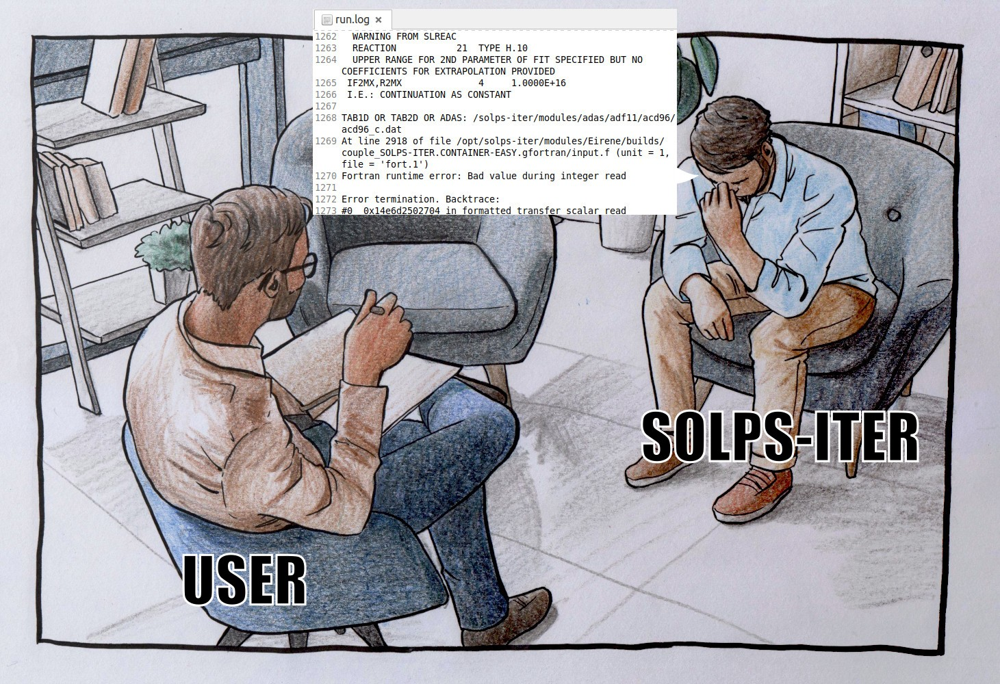
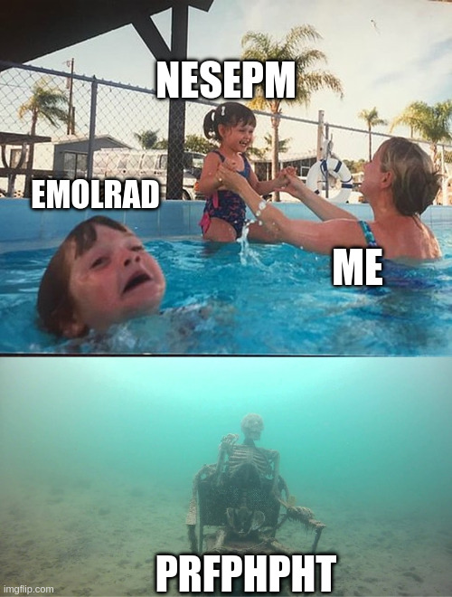
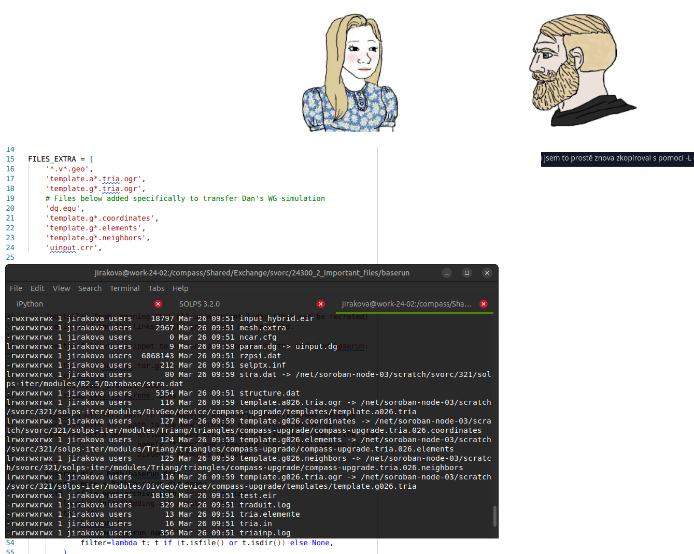
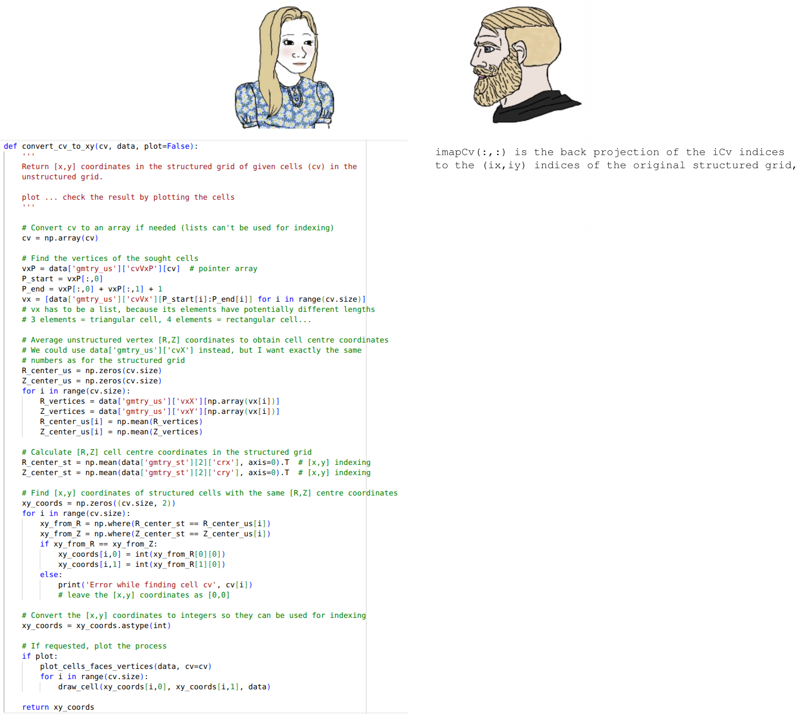
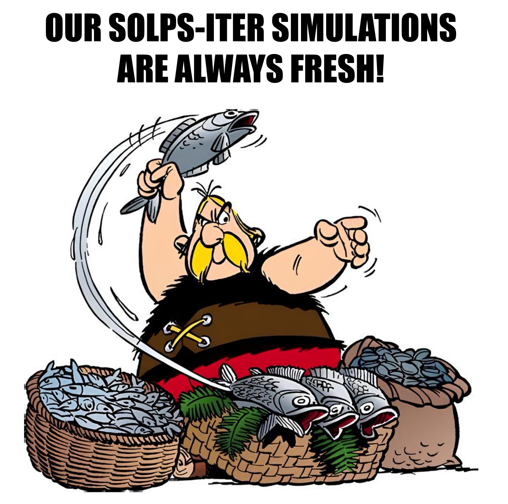
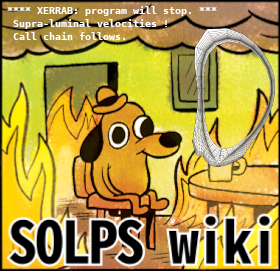
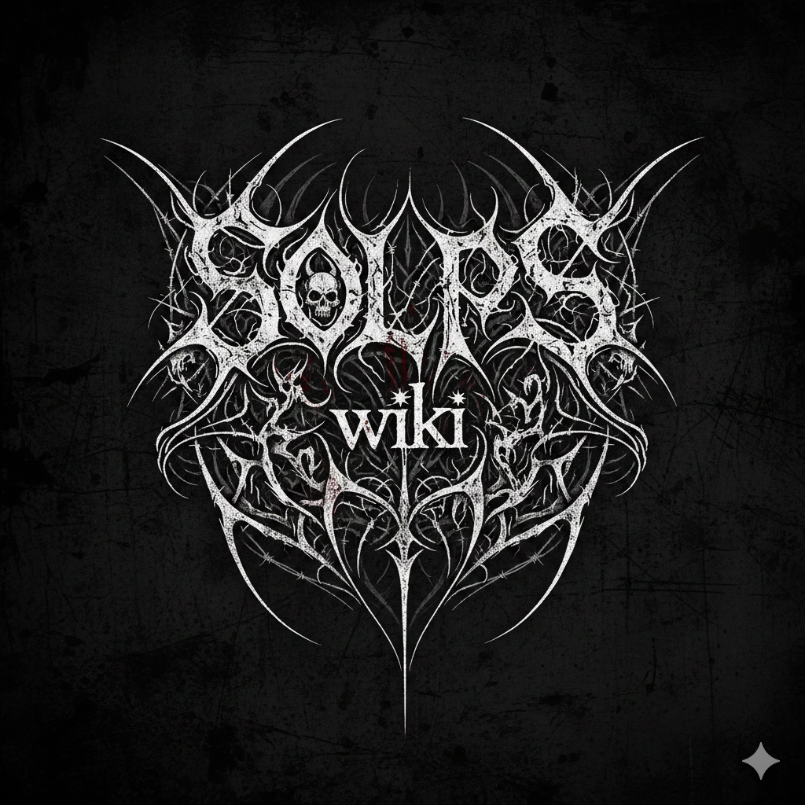

# SOLPS-ITER user wisdom

This document contains "meta" information on installing, using and understanding SOLPS-ITER. It's the kind of stuff experienced users carry in the back of their minds.

Categories of SOLPS-ITER user wisdom:

- [Where to find information](#where-to-find-information) - or "I have a problem, please help"
- [Read the friendly manual](#rtfm) - advice on the SOLPS manual
- [Dictionary](#dictionary) - glossary of SOLPS-ITER jargon
- [Useful links](#useful-links) - compilation of SOLPS and SOLPS-related documentation
- [Jokes](#jokes) - jokes to lighten the heart


## Where to find information

In Kateřina's experience, about half of SOLPS work is being stuck on a problem (simulation diverges, server won't launch simulations, updating SOLPS ends in error message...). Occasionally she bounces between problems, wondering which one will give first and finally allow her to do some physics. Seeking solutions is, therefore, a priority. As SOLPS documentation is fragmented, this section provides tips where to find information.


### Common bugfixes

- Update to the current `develop` SOLPS-ITER branch, if you don't care what particular code version you're using.
- Particularly when you're switching around different versions of SOLPS, make sure to start up the SOLPS environment from scratch. The `source setup.csh` command can set up different versions of the same library, causing problems with compilation.


### Decode the technical language

- If you don't know what the words mean, try the [Dictionary](#dictionary).

- If you receive an error message (in the terminal or in `run.log`), **read the log carefully**. Chances are, it says what the problem is and might even suggest a way to fix it. To search for a string of characters in a long file (such as `run.log`):

        # Print out 5 lines above and below "chemical sputtering"
        grep -C 5 'chemical sputtering' run.log

        # Search for "error", ignoring upper/lower case
        grep -i 'error' run.log

- In a long simulation, `run.log` is typically too long to open in a text editor. **To copy the last 100 lines of `run.log`** (presumably containing information of what went wrong with the simulation) into a smaller file:

        tail -100 run.log > short-run.log


### I wish I could just Google this

SOLPS-ITER is developed by brilliant people with excellent memory who don't take career breaks to have kids. In consequence, writing a publicly available knowledge base cannot compete with other SOLPS priorities. As of June 2026, when you google "SOLPS-ITER", the first result is *SOLPS Tutorials* (or SOLPS-doc, their earlier permutation hosted by IPP Prague). The second is the source code of SOLPS-ITER. (We are proud and horrified.) SOLPS lore is so well hidden, not even [AI with direct access to its source code](https://deepwiki.com/iterorganization/SOLPS-ITER/1-overview)<span class="material-symbols-outlined">open_in_new</span> can tell you what heat flux limiters are. The only semi-usable SOLPS-ITER search engines are [Google Scholar](https://scholar.google.com/)<span class="material-symbols-outlined">open_in_new</span> for articles, conference proceedings and theses, and SOLPS Tutorials search toolbar (upper right corner).

If you compiled all of these sources and made them fully searchable, you'd get a half-decent knowledge base:

- The [SOLPS-ITER manual](#rtfm). There is advice on how to read it [below](#rtfm).
- The [EIRENE manual](http://eirene.de/Documentation/eirene.pdf)<span class="material-symbols-outlined">open_in_new</span>.
- The [`$SOLPSTOP/doc`](https://github.com/iterorganization/SOLPS-ITER/tree/master/doc)<span class="material-symbols-outlined">open_in_new</span> directory.
- The [`$SOLPSTOP/modules/B2.5/src/documentation`](https://github.com/iterorganization/B2.5/tree/cb7d15b2878074bb450666bebee4b1df02ef79e6/src/documentation)<span class="material-symbols-outlined">open_in_new</span> directory.
- Our [Library](Library.md), especially if you're looking for physics understanding.
- History of the [SOLPS Slack](http://solps.slack.com)<span class="material-symbols-outlined">open_in_new</span>. Lamentably, you need a paid Slack account to see the entire history. However, searching for keywords in the `solps-iter`, `q_and_a`, `beginner-advice` and `general` channels should be a gold mine for solutions.
- The [SOLPS User Forum minutes](https://confluence.iter.org/spaces/IMP/pages/178135134/SOLPS-ITER#SOLPSITER-UserForumdebriefings)<span class="material-symbols-outlined">open_in_new</span>. Often you'll find mentions of recent updates and bugfixes relevant to your problems.
- The [SOLPS-ITER source code](https://github.com/iterorganization/SOLPS-ITER/tree/master/modules)<span class="material-symbols-outlined">open_in_new</span>. To view and search its content, use a high-level code editor such as [Visual Studio Code](https://code.visualstudio.com/)<span class="material-symbols-outlined">open_in_new</span>. This allows, for instance, searching for keywords across multiple files using `Ctrl+Shift+F`.

    - SOLPS routine description (e.g. `b2stbc`): Search for the keyword. In the best case, you'll find docstrings. In a worse case, you can inspect the Fortran code line by line to figure out what the simulation actually does.
    - Some DivGeo documentation: `$SOLPSTOP/modules/DivGeo/equtrn/doxygen/refman.pdf`

- [Useful links](#useful-links) below.
- To find out what B2.5 switches do:
    - Search them in our [B2.5 switch documentation](/extras/b2input). Be sure to use the correct SOLPS version, as some switches may be recently added.
    - The [SOLPS GUI](https://static.iter.org/imas/assets/solps-iter/html/index.html)<span class="material-symbols-outlined">open_in_new</span> includes an `Input` tab which not only collapses `input.dat` into individual sections but also automatically displays switch descriptions upon clicking/hovering. Charming!


### Ask for help

While asking for help, I'd advise to follow this hierarchy. Do not skip to the next step before you have tried the previous step. It saves time and face.

1. Ask the nearest coworker, ideally but not necessarily a SOLPS-ITER user. Chances are, your problem is not strictly SOLPS-related.
2. Ask your local SOLPS team (at the nearest meeting or via group mail).
3. Ask an external experienced modeller. Ideally this is someone you know already, such as your tutor from long ago.
4. Write to the [SOLPS Slack](http://solps.slack.com)<span class="material-symbols-outlined">open_in_new</span> group. There's a good chance Xavier will answer. The `beginner-advice` channel is specifically meant for askers who lack experience and confidence.
5. Ask Xavier Bonnin (<span class="material-symbols-outlined">mail</span> [Xavier.Bonnin@iter.org](mailto:Xavier.Bonnin@iter.org)) directly.


<a name="rtfm"></a>

## RTFM (Read the friendly manual)

/// tip | Where do I find the SOLPS manual?
The SOLPS source code includes source files for building the manual PDF using LaTEX in the folder `$SOLPSTOP/doc/solps`, but not the actual PDF. The PDF is usually built during code compilation as `$SOLPSTOP/doc/solps/solps.pdf`. If you can't find it or don't want to compile the entire code just for the manual, try
```
make manual
```
in the [SOLPS-ITER work environment](../installing/solps-iter-codebase.md#how-to-initiate-the-solps-iter-work-environment). The [pre-built container installations](../installing/installing-in-container.md#use-a-pre-installed-read-only-container) of SOLPS don't build the manual PDF because the container is light-weight and LaTEX is a lot of additional software.

You can always find the latest version of the manual on the [ITER SharePoint](https://iterorganization.sharepoint.com/:f:/r/sites/SOLPS-ITER/Shared%20Documents/General?csf=1&web=1&e=wG7NCS)<span class="material-symbols-outlined">open_in_new</span>: [structured grids manual](https://iterorganization.sharepoint.com/:b:/r/sites/SOLPS-ITER/Shared%20Documents/General/SOLPS-ITER_User_Manual.pdf)<span class="material-symbols-outlined">open_in_new</span> and [wide grids manual](https://iterorganization.sharepoint.com/:b:/r/sites/SOLPS-ITER/Shared%20Documents/General/SOLPS-ITER_User_Manual_for_WG.pdf)<span class="material-symbols-outlined">open_in_new</span>.
///

The SOLPS-ITER manual is a beast of 600+ pages, containing more information than you could ever want, but not the one you actually want. **Each SOLPS version has its own version of the manual**, so try using the one found in your installation. Most of their contents are the same (like the section on heat flux limiting, which is twenty years old) but relevant new information may be missing from older manuals.

Even if the manual is hard to read and hard to find answers in, do not underestimate it. Try not to ask people for help before you have scoured the manual. And I do mean scoured. "I have skimmed it" does not cut it. When you reach out for help at the [SOLPS-ITER Slack channel](http://solps.slack.com)<span class="material-symbols-outlined">open_in_new</span>, always detail to which degree the manual answered your question. Even people proficient with SOLPS-ITER always have the manual open while working.

/// note | Fortran notation in the manual
When you see something like `if quantity.eq.1`, it means "if quantity is equal to 1". Similarly for `quantity.ge.3` ("greater or equal to 3"), `quantity.ne.0` ("not equal to 0") etc. The notation is not unified, there are `if > 1` and similar alternative notations mixed in with this one, but those are largely intuitive.
///

### How to properly search the manual for information

Follow the instructions in this order and don't go straight to `Ctrl+F`. It's tempting but *very* unreliable.

1. **Read the table of contents.** The section titles are quite informative.
2. **Read entire sections**, not just the little bit of text where your keyword is located. This will give you context and you're very likely to find extra information as your topic is revisited.
3. **Read the cited works**. Funny story: Kateřina spent a few weeks desperately researching why there is a Pfirsch-Schlüter particle flux in the B2.5 continuity equation. Finally she wrote on the [SOLPS Slack](http://solps.slack.com)<span class="material-symbols-outlined">open_in_new</span> and she was directed to an article which explained it. *Then sje found out it was cited in the manual in the section which gives the B2.5 continuity equation.* Don't be her. OTL
4. **`Ctrl+F` your keywords**, for example "heat flux". However, beware that your term might be called several different things (like "energy flux"). If your keyword has more than two words ("sheath heat transmission coefficient"), chances are that you won't find it using `Ctrl+F`.
5. **`Ctrl+F` the manual source code** (`$SOLPSTOP/docs/solps/solps.tex`). This can be useful for quantity names (`q_{ax}`). Beware, this can be extra unreliable as different names and typing styles might be used each time. Try to find some part of the variable name which is hard to change (`axy` inside `D_{axy}`). Alternatively, search `axy` in the rendered PDF.


## Dictionary

**SOLPS-ITER**: Scrape-Off Layer Plasma Solver, version "ITER". It's called a "tokamak edge transport code", but it's actually a veritable mountain of coupled codes (B2.5, EIRENE, DivGeo, Carre, Triang, B2plot...). Its core code, the actual transport solver B2, has [been around since the 1980s](Library.md#evolution-of-solps). [SOLPS-ITER](https://confluence.iter.org/spaces/IMP/pages/178135134/SOLPS-ITER#SOLPSITER-Whichbranchforwhichcodeversion%3F)<span class="material-symbols-outlined">open_in_new</span>, the current apex of the SOLPS line of codes, stands on the shoulders of giants such as B2-EIRENE, SOLPS4.3, and SOLPS5.0.

**B2.5**: A multi-fluid transport solver for the tokamak edge plasma. Built upon the [Braginskii equations](https://static.ias.edu/pitp/2016/sites/pitp/files/braginskii_1965-1.pdf)<span class="material-symbols-outlined">open_in_new</span>, it can simulate both ions and fluid neutrals. Its name stands for "Braams" (its original author), "2"-dimensional, and "advanced compared to the original B2".

**EIRENE**: A Monte Carlo kinetic solver for neutrals. It's developed separately from the rest of SOLPS by [Forschungszentrum Jülich](https://eirene.de/Contact/contact.html)<span class="material-symbols-outlined">open_in_new</span> in Germany, and it can be run standalone to solve only neutrals transport.

**DivGeo (DG)**: Programme for creating and viewing geometry of SOLPS-ITER runs. Full GUI (Graphical User Interface), a little counter-intuitive but pretty friendly once you create a mesh or two.

**WG**: Wide grids, also known as SOLPS-ITER 3.2.x, a version of the code which allows modelling plasma up to the wall.

**5-point stencil, 9-point stencil**: Discretisation schemes of the B2.5 plasma solver. 9-point stencil scheme greatly improves accuracy of fluid neutral modelling. It is implemented in SOLPS-ITER branches 3.1.x (structured grids, 9-point stencil) and 3.2.x (wide grids).

**The manual:** The [SOLPS-ITER manual](#rtfm). The ultimate manual, the go-to for all your questions, the 600-page beast. If a manual is referred to as "the manual", it is this manual. The manual is automatically created when you compile SOLPS-ITER; its source files are located in `$SOLPSTOP/docs/solps/` and the manual itself is called `solps.pdf`. Each version of SOLPS-ITER has its own manual. Thus you will always find information relevant to your version in this folder.

**EUROfusion Gateway** (sometimes referred to as ITM, Marconi, Marconi Gateway or a combination of the above): An Italian [computing cluster](../installing/solps-iter-codebase.md#eurofusion_gateway) where you can install and use SOLPS-ITER, a of the Marconi cluster. Most SOLPS-ITER users run their simulations on their local clusters, but some continue using Gateway.

**Xavier Bonnin:** The Responsible Officer (RO) of SOLPS-ITER in the ITER Organisation. Diligent and meticulous.

**`$SOLPSTOP` (SOLPS top)**: Name of the `tcsh` variable in the [SOLPS work environment](../installing/solps-iter-codebase.md#how-to-initiate-the-solps-iter-work-environment) which contains the path to the SOLPS-ITER installation folder. The `stop` command is a shortcut to change directories `cd $SOLPSTOP$`.

**SN, DN, DDN**: Single null, double null, disconnected double null. Used to refer to separatrix configurations in DivGeo.

**Stratum <a name="stratum"></a>(plural strata)**: A source of neutral particles in EIRENE, usually a B2.5 grid boundary ("outer target", "far SOL") or a volumetric source ("recombined D atoms"). More information is given in Q&A: [What is a "stratum"](Questions_and_answers.md#stratum).

**Flat profiles**: Default initial state of SOLPS-ITER simulations if no `b2fstati` file is supplied. As the name implies, the "solution" is just constant everything across the B2.5 grid. Using the flat profiles usually happens when you're making your very first simulation or by accident when `b2fstati` is ignored by the code. Refer to [Common pitfalls: The danger of timestamps](Common_pitfalls.md#the-danger-of-timestamps).

**Coupled simulation**: A SOLPS-ITER simulation which uses EIRENE to model neutrals (also called kinetic or Monte Carlo neutrals).

**Standalone simulation**: A SOLPS-ITER simulation which uses B2.5 to model neutrals (also called fluid neutrals or AFN, Advanced Fluid Neutrals.)

**AFN**: Advanced Fluid Neutrals, a new and better model for (deuterium) fluid neutrals in B2.5.

**BC**: Boundary conditions.

**OMP**: Outer midplane, a region in the tokamak plasma at the height of the magnetic axis (or the equatorial plane of the machine), around the separatrix, at the outboard side of the torus. This is where most radial transport happens in a tokamak, supplying the SOL with power.

**PFR**: Private flux region, a region in the tokamak plasma below the X-point, separated from the main plasma. Usually has high neutral densities, so it's a good pump location.

**SOLPS-ITER User Forum**: A semi-monthly video conference where Xavier introduces the newest changes to SOLPS, topical presentations are given and discussions occur. As a beginner, it's likely you won't understand much of it. The [minutes](https://confluence.iter.org/spaces/IMP/pages/178135134/SOLPS-ITER#SOLPSITER-UserForumdebriefings)<span class="material-symbols-outlined">open_in_new</span> are detailed, however, so read them carefully instead. You will know you are no longer a SOLPS beginner when you start understanding the User Forums.

**SOLPS Slack**: A [Slack group](http://solps.slack.com)<span class="material-symbols-outlined">open_in_new</span> where SOLPS users gather, exchange information and get chewed out by Xavier for not consulting every piece of documentation prior to asking for help.

**SOLPS-ITER work environment**: Command line where SOLPS, `b2plot` and other SOLPS-related stuff can be run. See [How to initiate the SOLPS-ITER environment](../installing/solps-iter-codebase.md#how-to-initiate-the-solps-iter-work-environment).

**B2plot**: A primarily plotting programme shipped directly with SOLPS-ITER. It has it own section in the manual (appendix I), can plot 2D visualisations of plasma temperature, integrate along given lines of sight, or produce text files with processed code output. It has its weaknesses (like awkward axis boundaries setting), but it remains a very powerful tool. See our [B2plot tutorial](../my_first_simulation/Processing_SOLPS-ITER_output.md#b2plot).

**David Coster**: A senior researcher working at IPP Garching. One of the most experienced SOLPS-ITER users.

**Katka** (Kateřina) and **Honza**: Postdocs working at IPP Prague, the main authors of SOLPS Tutorials. They share the conviction that if they don't write it down, they will forget it.

**IO**: ITER Organisation.


## Useful links

**[Source code of SOLPS-ITER](https://github.com/iterorganization/SOLPS-ITER/)**<span class="material-symbols-outlined">open_in_new</span>

- The source code of SOLPS-ITER, kept at GitHub. Just downloading it is not enough to make simulations with SOLPS-ITER; first you must compile the source code (see the [installation guides](../installing/solps-iter-codebase.md)).
- This is the quickest way to get to the manual LaTEX source (`$SOLPSTOP/docs/solps/solps.tex`).
- Includes the [SOLPS wiki](https://github.com/iterorganization/SOLPS-ITER/wiki)<span class="material-symbols-outlined">open_in_new</span>. So far, it lists a few frequently encountered issues, such as "what are SOLPS branches called again", "why can't I name my `$SOLPSTOP`  directory `solps-iter_debug`" or "my SOLPS runs are huge and the IT guy's screaming at me, help".
    - If you wish to contribute to the SOLPS wiki, write to <span class="material-symbols-outlined">mail</span>[Xavier Bonnin](mailto:xavier.bonnin@iter.org). Give him your GitHub handle (so he can identify your account), and he'll grant you the necessary permissions.
    - This wiki is the reason SOLPS Tutorials are not called the SOLPS wiki.


**[ITER SharePoint](https://iterorganization.sharepoint.com/:f:/r/sites/SOLPS-ITER/Shared%20Documents/General?csf=1&web=1&e=nSbYg0)**<span class="material-symbols-outlined">open_in_new</span>

- Currently (August 2026) an ITER account is necessary for access. Xavier is working on making it fully open-source.

- A big old pile of documentation. Highlights:
    - The [Manuals and Documentation](https://iterorganization.sharepoint.com/:f:/r/sites/SOLPS-ITER/Shared%20Documents/General/Manuals%20and%20Documentation?d=w7fe8c45b86bd4cc7937dbdda7ee838a2&csf=1&web=1&e=3X1UNE)<span class="material-symbols-outlined">open_in_new</span> folder (has some overlap with `$SOLPSTOP/doc`)
    - The [SOLPS-ITER Papers](https://iterorganization.sharepoint.com/:f:/r/sites/SOLPS-ITER/Shared%20Documents/General/SOLPS-ITER%20Papers?d=wfb1fd28e9588428eb1fcca00d79ce189&csf=1&web=1&e=yxRbAy)<span class="material-symbols-outlined">open_in_new</span> folder (has some overlap with our [Library](Library.md), contains some of the newest papers on SOLPS-ITER)


**[SOLPS-ITER Materials](https://user.iter.org/default.aspx?uid=Q92BAQ)**<span class="material-symbols-outlined">open_in_new</span>

- Collection of SOLPS documents similar to the ITER SharePoint.
- Requires a valid ITER IDM account.

**[SOLPS-ITER Confluence page](https://confluence.iter.org/display/IMP/SOLPS-ITER)**<span class="material-symbols-outlined">open_in_new</span>

- The best and most active disambiguation of SOLPS documentation. Highlights:
    - [Release notes](https://confluence.iter.org/spaces/IMP/pages/178135134/SOLPS-ITER#SOLPSITER-Releasenotesanddescriptionsofimportantcodeupdates)<span class="material-symbols-outlined">open_in_new</span> of various SOLPS versions (useful for tracking new features)
    - List of [currently active SOLPS branches](https://confluence.iter.org/spaces/IMP/pages/178135134/SOLPS-ITER#SOLPSITER-Whichbranchforwhichcodeversion%3F)<span class="material-symbols-outlined">open_in_new</span>
    - [SOLPS User Forum minutes](https://confluence.iter.org/spaces/IMP/pages/178135134/SOLPS-ITER#SOLPSITER-UserForumdebriefings)<span class="material-symbols-outlined">open_in_new</span> (occasionally priceless in bug hunts)
    - [SOLPS-ITER features wish list](https://confluence.iter.org/display/IMP/SOLPS-ITER+features+wish+list)<span class="material-symbols-outlined">open_in_new</span>

- Also contains a list of problems and bugs SOLPS-ITER users have encountered and documented.

**[EUROfusion wiki - training section](https://users.euro-fusion.org/tfwiki/index.php/Training)**<span class="material-symbols-outlined">open_in_new</span>

- Contains the list of SOLPS-ITER trainings that have taken place until today. Useful for writing down training output and finding e-mails for fellow trainees.
- Requires EUROfusion login credentials.

**[SOLPS Slack](http://solps.slack.com)**<span class="material-symbols-outlined">open_in_new</span>

-  A forum created in March 2020, when the coronavirus quarantine started. Has a Q&A section where you may pose your questions and get answers within hours or days. (But make sure to do thorough research before asking here! Especially consult the manual in great detail, according to the [recipe above](#rtfm).)

**SOLPS GUI [documentation](https://static.iter.org/imas/assets/solps-iter/html/index.html)<span class="material-symbols-outlined">open_in_new</span> and [video tutorials](https://www.youtube.com/playlist?list=PLYdrXWbVnKXG6tCQQTH6Vf_TERCgzvRAv)**<span class="material-symbols-outlined">open_in_new</span>

- Created by Leon Kos, the SOLPS-ITER GUI (Graphical User Interface) aims to make SOLPS-ITER more user-friendly.
- Even if you do not plan to use the tool itself, the documentation provides nicely written (but often brief) guides and overviews such as [SOLPS Structure](https://static.iter.org/imas/assets/solps-iter/html/introduction.html#solps-structure)<span class="material-symbols-outlined">open_in_new</span> and [SOLPS-ITER installation with `easybuild-local.sh`](https://static.iter.org/imas/assets/solps-iter/html/howto/install.html#solps-iter-installation)<span class="material-symbols-outlined">open_in_new</span>.

**[B2.5 switches documentation](/extras/b2input)**

- Created by Jan Hečko, this semi-detached part of SOLPS Tutorials lists the switches of B2, their meaning and default values, in a human-readable way.
- Switch descriptions are taken from the official SOLPS/B2.5 documentation (`$SOLPSTOP/B2.5/src/documentation/b2input.xml`).
- Webpage is generated for several SOLPS-ITER versions and regularly updated. In case you want to use the webpage generator tool directly (e.g. to generate it from your version of SOLPS-ITER), clone the `SOLPS-Tutorials` repo and refer to instructions in `SOLPS-Tutorials/extras/b2input/README.md`.

**[ADAS manual](https://www.adas.ac.uk/manual.php)**<span class="material-symbols-outlined">open_in_new</span>

- ADAS (Atomic Data and Analysis Structure) is the library which SOLPS-ITER uses for plasma-neutral interactions.

**[SOLPS-ITER DeepWiki](https://deepwiki.com/iterorganization/SOLPS-ITER/1-overview)**<span class="material-symbols-outlined">open_in_new</span>

- Another rival project, generated by AI. It isn't known if it contains any useful information, but it exists.


## Jokes

An English proverb says: "If you can't beat them, join them."

The Czechs, a small Slavic nation in Central Europe, have a different national wisdom: "If you can't beat them, make fun of them."

In the Czech spirit, this section of SOLPS-ITER user wisdom is devoted to collecting jokes.

/// note | No useful physics ahead
This is the only part of SOLPS Tutorials which does not take itself seriously in the slightest. Everyone taps into the pit of existential despair on occasion. It's no use pretending it isn't there.
///

***



<center><i>How it feels to diagnose divergence in SOLPS-ITER.<br>
Author: Kateřina Hromasová, based on a photo.</i></center>

***


<center><i>2B or not 2B?<br>
Author: Jan Hečko, generated with AI.</i></center>

***



<center><i>I found some beautifully named variables in the EIRENE manual.<br>
Author: Kateřina Hromasová, made with meme templates.</i></center>

***


<center><i>When you let women into fusion, part 1. I spent half an hour tweaking [Honza's script for archiving `baserun`](Remote_access.md#transfer-an-entire-case-from-one-solps-installation-to-another), only to be told it could simply be done with the `-L` flag.<br>
Author: Kateřina Hromasová, made with meme templates.</i></center>

***



<center><i>When you let women into fusion, part 2. While writing a Python library for post-processing Wide Grids results, I spent an hour writing a script which converts cell numbers `cv` into structured grid indices [`ix`, `iy`]. When it was done, I skimmed the manual. And I found that the conversion array was already in `b2fgmtry`.<br>
Author: Kateřina Hromasová, made with meme templates.</i></center>

***



<center><i>Just because the IPP Prague SOLPS group has never delivered trustworthy predictive simulations of COMPASS Upgrade, doesn't mean we never will!<br>
Author: Kateřina Hromasová, drawing found online and upscaled with AI.</i></center>

***



<center><i>Alternative logo of SOLPS Tutorials, back when they were supposed to be called the SOLPS wiki.<br>
Author: Kateřina Hromasová and Jan Hečko, made with meme templates.</i></center>

***



<center><i>Alternative logo of SOLPS Tutorials, back when they were supposed to be called the SOLPS wiki.<br>
Author: Daniel Švorc, generated with AI.</i></center>

***


<center><i>SOLPS Tutorials logo.<br>
Author: Kateřina Hromasová, based on a photo.</i></center>

**<a name="unicorn"></a>Why is the SOLPS Tutorials logo a supra-luminal unicorn?**

1. Comprehensive SOLPS-ITER documentation is as rare as unicorns.

2. SOLPS-ITER is the *workhorse* of tokamak edge modelling.
[[1]](http://dx.doi.org/10.1016/j.jnucmat.2014.10.012) <!-- Wiesen 2015 -->
[[2]](https://iopscience.iop.org/article/10.1088/1361-6587/ab1bba) <!-- Kukushkin 2019 -->
[[3]](https://doi.org/10.1016/j.nme.2019.100696)  <!-- Pitts 2019 -->
[[4]](https://infoscience.epfl.ch/entities/publication/6b5c5149-8aad-4857-87aa-e4514506f44c) <!-- Mirko Wensing PhD thesis -->
[[5]](https://doi.org/10.1088/1741-4326/ada048)  <!-- Moscheni 2025 -->
[[6]](https://iopscience.iop.org/article/10.1088/1741-4326/ac72b4/meta) <!-- Van Uytven 2022-->
[[7]](https://iopscience.iop.org/article/10.1088/1741-4326/adb3bb/meta) <!-- Bryant 2025 -->
[[8]](https://onlinelibrary.wiley.com/doi/epdf/10.1002/ctpp.202100190) <!-- Dekeyser 2022 -->
[[9]](https://www.sciencedirect.com/science/article/pii/S2352179118302011) <!-- Dekeyser 2019 -->
[[10]](https://iopscience.iop.org/article/10.1088/1741-4326/ae53f9/meta) <!-- Shtyrkhunov 2026 -->
[[11]](https://pure.tue.nl/ws/portalfiles/portal/340297879/1341596_-_Kobussen_S.P._-_MSc_thesis_Thesis_-_NF.pdf) <!-- Kobussen MSc thesis -->
[[12]](https://pure.tue.nl/ws/portalfiles/portal/389678988/1474820_-_Reinhoudt_S.P._-_MSc_thesis_report_-_MAP.pdf) <!-- Reinhoudt MSc thesis -->

3. Rainbows are cool.

4. And finally, everyone's favourite error message since [SOLPS-ITER 3.0.9](https://iterorganization.sharepoint.com/:b:/r/sites/SOLPS-ITER/Shared%20Documents/General/SOLPS-ITER_3.0.9_and_3.1.1_Release_Notes.pdf?csf=1&web=1&e=b7caKq)<span class="material-symbols-outlined">open_in_new</span>...

        *** XERRAB: program will stop. ***
        Supra-luminal velocities !
        Call chain follows.


***

/// tip | Hot tip
SOLPS-ITER has an international user community, so you can use foreign curses to relieve frustration.

Finnish: "Perkele!" (Evil spirit!)

Hungarian: "Bassz meg!" (Fuck me!)

Czech: "Do prdele!" (In the ass!)

**TODO** <span class="material-symbols-outlined">construction</span>: Add your own favourite curse!
///


***

> What do you say when someone announces they've started working with SOLPS? "Deepest condolences!"

***

> What do you say to an ITER researcher who doesn't know when to stop talking? "Shut up or I'll re-baseline you!"

***

> What does Katka say when you point out grave mistakes in SOLPS Tutorials? "There ain't no rest for the wiki..."

***

> To have a laugh, we suggest browsing the `gateway` channel of the [SOLPS Slack](http://solps.slack.com)<span class="material-symbols-outlined">open_in_new</span>.
